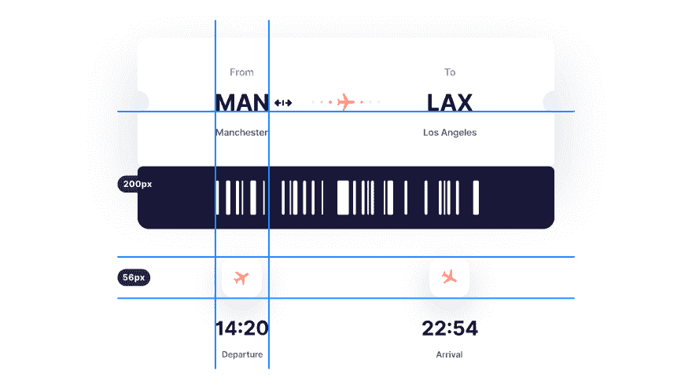

# PixelSnap 和 CleanShot 的 20 岁联合创始人是如何学习编码的

> 原文：<https://dev.to/petecodes/how-the-20-year-old-co-creator-of-pixelsnap-and-cleanshot-learned-to-code-2bbc>

<figure>

本周，我有幸与卢克·奥斯里兹罗(Luke Oslizlo)进行了交谈，他通过与人合作开发 Mac OS 设计应用程序，比如让你可以即时测量电脑屏幕上的物体的 [PixelSnap](https://gumroad.com/a/91599987) ，吸引了很多人的注意力(和金钱)。和他的朋友 Pawel 一起，他们也制作了 [CleanShot](https://gumroad.com/a/1031124083) ，可以让你清晰地抓取你的 Mac 屏幕。我通过 Telegram 和他聊天，讨论他如何自学编码，给新手的建议，以及他如何和他的朋友一起开发应用程序。

<figcaption>c</figcaption>

</figure>

## 能给我们简单介绍一下吗？

嘿！我是一名 20 岁的开发者，住在波兰。去年我完成了高中学业，这也是我正式教育的结束。我和一个朋友一起经营一家公司，制作苹果操作系统的应用程序，如 [PixelSnap](https://gumroad.com/a/91599987) 或 [CleanShot](https://gumroad.com/a/1031124083) 。

## 既然你已经 20 岁了，你是如何这么快就进入编码领域的？

我很早就开始了！如果我没记错的话，我的编码之旅始于我 11 岁的时候。我总是着迷于计算机和它是如何工作的，我想对我来说，从一些简单的 HTML 编码开始是很自然的一步。所以我开始阅读一些关于它的在线教程，我只是在做我的第一个网站时玩得开心(老实说，超级丑😂).

## 你发布了很多产品，像 [iLend](https://ilendapp.com/?ref=producthunt) 来记录借给朋友的东西，还有 [PixelSnap](https://gumroad.com/a/91599987) 和 [CleanShot](https://gumroad.com/a/1031124083) 。你是如何完成这么多工作的？

从外面看，我可能看起来非常有效率，但事实并非总是如此。然而，我和 Pawel 一起工作了这么长时间，我们一起工作是很自然的，我相信这有助于我们更快地推进项目。设定最后期限(即使是你自己的项目)和工作时间表肯定有助于完成工作。

## 与制作网络应用相比，制作手机应用的感觉如何？

虽然 [iLend](https://ilendapp.com/?ref=producthunt) 可能看起来像一个原生应用，但它实际上是在 Vue.js 中制作的，然后使用 PhoneGap 变成了一个应用。我们决定这样做是因为我们也想在 Android 上推出它，这样会更容易。不幸的是，我们现在放弃了这个项目，因为 Mac 应用程序优先。如果有人读到这篇文章，愿意讨论接管这个应用程序，请随时[联系我](https://twitter.com/lukaszmtw)。

## **想要一份开发人员的工作却没有学位？通过 [Triple Byte 的测验](https://triplebyte.com/a/Ww4mbM6/d)，直接进入顶级科技公司的最终现场面试**

## [pixel snap](https://gumroad.com/a/91599987)给我留下了深刻的印象，发布视频和销售都非常成功。你是如何着手制作它的？你能透露它的收入吗？

PixelSnap 的诞生是因为我们注意到对这样一款应用的巨大需求。许多开发人员和设计人员使用 Mac 的屏幕截图工具来测量屏幕上的东西，这并不是最快的方法。😆

所以我们制作了一个简单的 MVP，在推特上发布了一个视频，并在 T2 WIP 上分享，收到了大量的反馈！几个月后，我们有了一个完全可用的应用程序准备发布。宣传片也是我们自己做的。说到收入，我想众所周知，我们即将突破 10 万美元大关。

## 我知道你和另一个程序员一起工作在 MakeTheWeb 项目上。有什么原因让你决定组队而不是独自创业吗？

我从 9 岁起就认识 Pawel 了，所以在我的整个编码生涯中，我几乎都认识他！在我们创办自己的公司之前，我们做了很多有趣的项目，我们学会了一起工作。这家公司只是下一步，我真的很感谢有这样的联合创始人。它有很多优点，比如不断地激励对方或一起讨论决定，这使他们更加深思熟虑。

## 你会给一个刚开始做编码的新手什么建议？

不要一开始就试图学习所有的东西，等到你“准备好了”才开始构建实际的产品。剧透:你永远不会完全准备好。我认为最好的学习方法是开始创造和启动事物。即使它们看起来并不完美，随着每个项目的进行，你的技能水平将会提高，最终你将成为一名优秀的开发人员。

## [没有 CS OK——没有学位的开发者的工作板](https://nocsok.com)

## 你参加过训练营或在线课程吗？还是你只是通过制作产品来学习？

不，我没有参加过任何特别的训练营或课程。我主要是通过制作产品和谷歌搜索来学习。尽管如此，在学习新技术的同时观看快速教程还是不错的。

## 你对未来有什么打算？有什么很酷的新产品吗？

我们已经决定完全专注于 macOS 应用程序，所以在更遥远的将来可能会有另一个应用程序。现在，因为我们有一个假期，我想做一些有趣的游戏。我们已经对苹果的 ARKit 进行了一些试验，所以可能会朝着这个方向发展。就我个人而言，我也喜欢做 DIY 项目，最近开始制作 DIY 鸡尾酒机。如果有人感兴趣，我会在我的推特上发布进展。