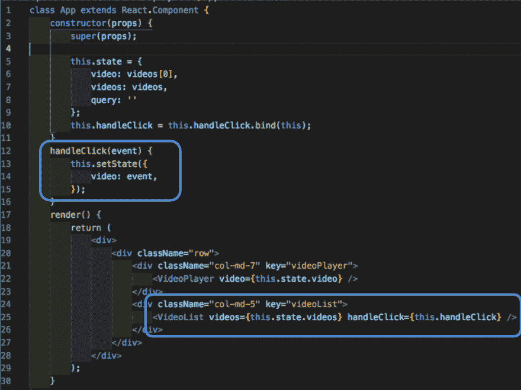
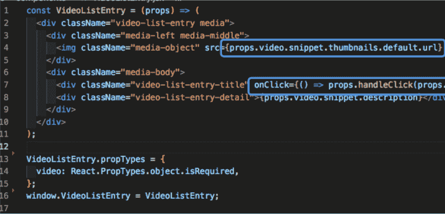

# React:有状态组件与无状态组件

> 原文：<https://dev.to/wtschmidt/react-stateful-vs-stateless-components-1gc3>

React 是一个强大的工具，如果使用得当，它可以创建一些令人惊叹的单页面应用程序。这种能力很大程度上来自于有状态和无状态组件的使用。什么是组件？它们是使用 React 框架创建的任何应用程序的“构建块”,就像创建一个 javascript 类或函数一样，可以选择接受属性(props)作为输入。它使用 ES6 继承来创建无状态和有状态组件，就像超类及其子类一样。

有状态组件通常是你的应用程序的核心，也是你想从中分支的地方。通常被称为“智能组件”，这是您为应用程序存储大部分信息的地方。这被称为状态
,这种情况的一个例子是可能在视频应用中播放的当前视频，或者与用户当前查看的歌曲列表进行交互。它们与创建类的方式类似，是创建 React 应用程序的最佳起点。

正如你所看到的，一个有状态的组件扩展了 React.Component。通常它还会有一个事件处理方法来设置控制当前视频的状态，在本例中就是我们的 handleClick 方法。

无状态组件通常被称为“哑”组件，充当有状态组件的子组件。它动态地获取通过 props 传递给它的信息，props 充当一个“超级对象”,存储所有从组件传递到组件的信息。创建时，它们被编写成一个旨在尽可能简单的函数。

如果您仔细观察，您会发现 VideoListEntry 正在动态地从 props 中提取缩略图、标题和描述，并使用 html 将它们传递回正确模板中的有状态组件。它通过引用 App 中的 handleClick 函数来实现这一点，并侦听 onClick 事件来初始化 handleClick 方法。然后，它提供与被单击的条目相关的视频对象，并传入适当的参数。

总之，创建网站时，最好先用有状态组件创建一个“主要思想”。有状态组件充当网站的中枢，决定通过存储向用户显示什么，存储将由适当的无状态组件格式化的信息填充。将所有状态存储在一个有状态的组件中，可以更容易地调试代码，因为这样更容易根除问题。
例如，如果你在点击相应的标题时无法改变当前的视频，那么你的问题可能出在无状态组件上，该组件跟踪这些标题并将信息转发回去。这种易用性和简单性真的是上帝在处理多个文件时送来的，这些文件必须一起工作才能显示你的惊人的应用程序！