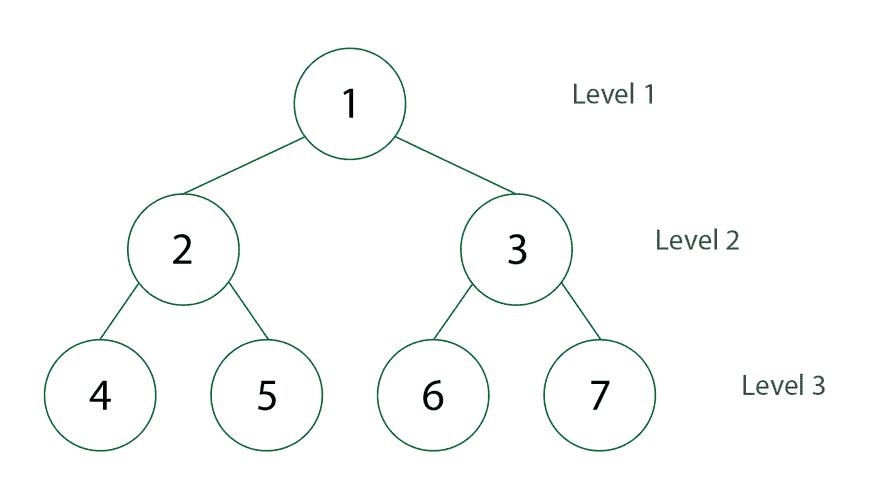

# JS 中二叉树的广度优先遍历

> 原文：<https://dev.to/snird/breadth-first-traversal-for-binary-trees-in-js-h9m>

先呼吸遍历二叉树是一个基本的事情。那么，我为什么要写这篇文章呢？
因为如果你试图在谷歌中快速寻找实现，就会有差距。

大多数文章都涉及一般的树，而不是二叉树。因此没有“左”和“右”节点的概念，而只是无序的子节点。
[https://medium . com/@ Kenny . hom 27/width-first-vs-depth-first-tree-traversal-in-JavaScript-48d F2 ebfc 6d 1](https://medium.com/@kenny.hom27/breadth-first-vs-depth-first-tree-traversal-in-javascript-48df2ebfc6d1)
[https://medium . com/@ Stephanie wo/understanding-width-first-tree-traversal-with-JavaScript-9b8fe 670176d](https://medium.com/@stephaniewo/understanding-breadth-first-tree-traversal-with-javascript-9b8fe670176d)
[https://gist.github.com/thinkphp/1440007](https://gist.github.com/thinkphp/1440007)

这可能会让初学者感到困惑。
其他人，比如[这篇在 hackernoon](https://hackernoon.com/breadth-first-search-in-javascript-e655cd824fa4) 发表的伟大文章很好地解释了这个概念，但没有给出它的代码。

[](https://res.cloudinary.com/practicaldev/image/fetch/s--1Aaplbiq--/c_limit%2Cf_auto%2Cfl_progressive%2Cq_66%2Cw_880/https://miro.medium.com/max/1400/1%2A3NKvODZparRFVKEwtVmrkw.gif) 
*gif by 王从希*

所以，假设你在 hackernoon 的这篇伟大的文章[中读过我们如何使用队列进行广度优先遍历的概念，这里有一个现代的实现，专门针对具有`left`和`right`节点的二叉树。
(和上面的 gif 一样，它总是从左到右)](https://hackernoon.com/breadth-first-search-in-javascript-e655cd824fa4) 

```
class Tree {
  constructor(value, left, right) {
    this.value = value
    this.left = left
    this.right = right
  }
}

const breadthFirstTraversal = (tree, callback) => {
  if (tree == null) {
    return;
  }

  let queue = [tree]

  while (queue.length > 0) {
    let item = queue.shift()
    let value = item.value
    callback(value)

    if (item.left == null && item.right == null) {
      continue
    }
    if (item.left != null) {
      queue.push(item.left)
    }
    if (item.right != null) {
      queue.push(item.right)
    }
  }
}

t = new Tree(1,
      new Tree(2, null, null), new Tree(3,
        new Tree(4, null, null), null))

breadthFirstTraversal(t, console.log)
// Will print "1,2,3,4" 
```