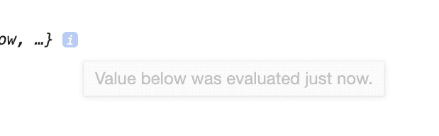

# Chrome 开发工具中的对象扩展是异步进行的🤦‍♂️

> 原文：<https://dev.to/buddyreno/expanding-objects-in-chrome-dev-tools-happens-asynchronously-3p3j>

有一天，当我试图理解另一个团队的一个特性是如何工作的时候，我有了一点时间。我在控制台记录了一个被发送到函数的对象，以查看这些属性。当我在 Chrome 的 devtools 中扩展这个对象时，我知道其中一些值是不正确的。

兜兜转转大概一个小时后，我*终于*看到了对象展开时旁边的一个小图标。我盘旋在它上面，事情终于有了意义。

...哦。

当您在控制台记录一个对象时，比如一个字符串、数字或一些可以在小预览行中显示的值，这将是日志发生时的值。如果它是一个对象，我们可以展开它来查看它的各种属性，控制台会保存对该值的引用。当你扩展时，Chrome 会进入该对象并在特定时刻构建日志，因此如果在控制台日志和用户扩展该对象之间发生了任何修改，这些修改都会显示出来。

如果这是您需要避开并查看一些底层属性的值的事情，请单独记录各种属性，而不是父对象。

这是一件小事，但是当你试图弄清楚一些事情是如何工作的时候，你必须意识到这一点。很容易漏掉。