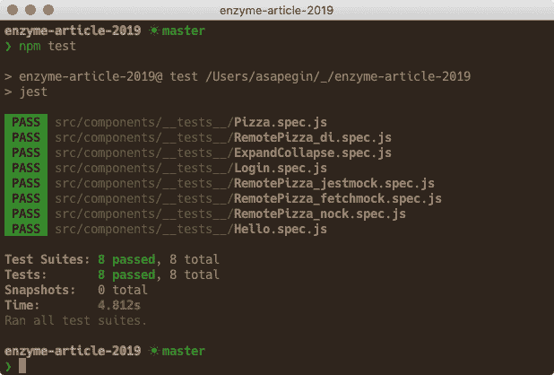

# 现代反应测试，第 2 部分:Jest 和酶

> 原文：<https://dev.to/sapegin/modern-react-testing-part-2-jest-and-enzyme-46kk>

酶可能是测试 React 组件最常用的工具。虽然它现在有很好的竞争(见下一篇文章！)，现在还是很多团队在用。

**这是**系列的第二篇文章，我们将学习如何用 Jest 和 Enzyme 测试 React 组件，以及如何应用我们在第一篇文章中学到的最佳实践。

*   [现代反应测试:最佳实践](https://dev.to/sapegin/modern-react-testing-part-1-best-practices-1o93)
*   **现代反应测试:笑话和酶(*本帖* )**
*   [现代反应测试:Jest 和反应测试库](https://dev.to/sapegin/modern-react-testing-part-3-jest-and-react-testing-library-3n0i)

[订阅](https://tinyletter.com/sapegin)了解第三篇。

## Jest 和酵素入门

我们将设置和使用这些工具:

*   [Jest](https://jestjs.io/) ，试跑者；
*   [酶](https://airbnb.io/enzyme/)，用于反应的测试工具；

### 为什么说笑话和酶

Jest 比其他测试跑步者有很多好处:

*   非常快。
*   交互式观察模式，仅运行与您的更改相关的测试。
*   有用的失败消息。
*   简单配置，甚至零配置。
*   嘲笑和间谍。
*   覆盖率报告。
*   [丰富匹配器 API](https://github.com/sapegin/jest-cheat-sheet#matchers) 。

**Enzyme** 为您提供了类似 jQuery 的 API 来查找元素、触发事件处理程序等等。它曾经是测试 React 组件的事实上的工具，并且仍然非常流行。在这里，我不是试图说服你使用酶，只是分享我的经验。在本系列的下一篇文章中，我们将探索一种流行的替代方法， [React 测试库](https://testing-library.com/react)。

一些酶的缺点是:

*   API 面太大，你要知道哪些方法好，哪些不好。
*   太容易接近组件内部。
*   该 API 没有针对现代测试最佳实践进行优化。

### 设置笑话和酶

首先，安装所有的依赖项，包括对等依赖项:

```
npm install --save-dev jest react-test-renderer enzyme enzyme-adapter-react-16 node-fetch 
```

<svg width="20px" height="20px" viewBox="0 0 24 24" class="highlight-action crayons-icon highlight-action--fullscreen-on"><title>Enter fullscreen mode</title></svg> <svg width="20px" height="20px" viewBox="0 0 24 24" class="highlight-action crayons-icon highlight-action--fullscreen-off"><title>Exit fullscreen mode</title></svg>

你还需要 [babel-jest](https://github.com/facebook/jest/tree/master/packages/babel-jest) 用于 babel 和 [ts-jest](https://github.com/kulshekhar/ts-jest) 用于 TypeScript。如果您使用 webpack，请确保为`test`环境启用 ECMAScript 模块转换。

创建一个`src/setupTests.js`文件来定制 Jest 环境:

```
import Enzyme from 'enzyme';
import Adapter from 'enzyme-adapter-react-16';

// Configure Enzyme with React 16 adapter
Enzyme.configure({ adapter: new Adapter() });

// If you're using the fetch API
import fetch from 'node-fetch';
global.fetch = fetch; 
```

<svg width="20px" height="20px" viewBox="0 0 24 24" class="highlight-action crayons-icon highlight-action--fullscreen-on"><title>Enter fullscreen mode</title></svg> <svg width="20px" height="20px" viewBox="0 0 24 24" class="highlight-action crayons-icon highlight-action--fullscreen-off"><title>Exit fullscreen mode</title></svg>

然后把你的`package.json`更新成这样:

```
{  "name":  "pizza",  "version":  "1.0.0",  "dependencies":  {  "react":  "16.8.3",  "react-dom":  "16.8.3"  },  "devDependencies":  {  "enzyme":  "3.9.0",  "enzyme-adapter-react-16":  "1.11.2",  "jest":  "24.6.0",  "node-fetch":  "2.6.0",  "react-test-renderer":  "16.8.6"  },  "scripts":  {  "test":  "jest",  "test:watch":  "jest --watch",  "test:coverage":  "jest --coverage"  },  "jest":  {  "setupFilesAfterEnv":  ["<rootDir>/src/setupTests.js"]  }  } 
```

<svg width="20px" height="20px" viewBox="0 0 24 24" class="highlight-action crayons-icon highlight-action--fullscreen-on"><title>Enter fullscreen mode</title></svg> <svg width="20px" height="20px" viewBox="0 0 24 24" class="highlight-action crayons-icon highlight-action--fullscreen-off"><title>Exit fullscreen mode</title></svg>

`setupFilesAfterEnv`选项告诉 Jest 我们的设置文件，它是我们在上一步创建的。

### 创建我们的第一个测试

测试的最佳位置靠近源代码。例如，如果在`src/components/Button.js`有一个组件，那么这个组件的测试可以在`src/components/__tests__/Button.spec.js`进行。Jest 会自动找到并运行这个测试。

因此，让我们创建我们的第一个测试:

```
import React from 'react';
import { mount } from 'enzyme';

test('hello world', () => {
  const wrapper = mount(<p>Hello Jest!</p>);
  expect(wrapper.text()).toMatch('Hello Jest!');
}); 
```

<svg width="20px" height="20px" viewBox="0 0 24 24" class="highlight-action crayons-icon highlight-action--fullscreen-on"><title>Enter fullscreen mode</title></svg> <svg width="20px" height="20px" viewBox="0 0 24 24" class="highlight-action crayons-icon highlight-action--fullscreen-off"><title>Exit fullscreen mode</title></svg>

在这里，我们使用酶的 [mount()](https://airbnb.io/enzyme/docs/api/ReactWrapper/mount.html) 方法渲染一段文本，然后测试渲染树是否包含“Hello Jest！”使用酶的`text()`方法和 Jest 的`toMatch()`断言的文本。

### 运行测试

运行`npm test`(或`npm t`)运行所有测试。您会看到类似这样的内容:

[](https://res.cloudinary.com/practicaldev/image/fetch/s--sxfHTHrj--/c_limit%2Cf_auto%2Cfl_progressive%2Cq_auto%2Cw_880/https://thepracticaldev.s3.amazonaws.com/i/nokm4ygln9scwcgpx5z7.png)

运行`npm run test:watch`在观察模式下运行 Jest:Jest 将只运行与自上次提交以来更改的文件相关的测试，Jest 将在您更改代码的任何时候重新运行这些测试。这是我通常如何运行 Jest。即使在大型项目中，观察模式也足够快了，因为在大型项目中，运行所有测试都要花费很多分钟。

运行`npm run test:coverage`来运行所有的测试并生成覆盖率报告。你可以在`coverage`文件夹里找到。

### 挂载()vs 浅层()vs 渲染()

酶有三种渲染方法:

*   呈现整个 DOM 树，并提供类似 jQuery 的 API 来访问树中的 DOM 元素，模拟事件并读取文本内容。*大部分时间我比较喜欢这种方法。*

*   `render()`返回一个带有 HTML 代码的字符串，类似于`react-dom`的`renderToString()`方法。*当你需要测试 HTML 输出的时候*很有用。例如，呈现 Markdown 的组件。

*   仅渲染组件本身，不渲染其子组件。*我从来不用。*想象一下，你想在你的特性中点击一个按钮，然后看到某处的文本发生了变化，但是很可能按钮和文本都在子组件中，所以你最终会测试像 props 或 state 这样的内部组件，这是应该避免的。更多细节请见肯特·c·多兹的文章[为什么我从不使用浅层渲染](https://kentcdodds.com/blog/why-i-never-use-shallow-rendering)。

### 快照测试

Jest 快照是这样工作的:你告诉 Jest 你想确保这个组件的输出永远不会意外地改变，Jest 将你的组件输出保存到一个文件中:

```
exports[`test should render a label 1`] = `
<label
  className="isBlock">
  Hello Jest!
</label>
`; 
```

<svg width="20px" height="20px" viewBox="0 0 24 24" class="highlight-action crayons-icon highlight-action--fullscreen-on"><title>Enter fullscreen mode</title></svg> <svg width="20px" height="20px" viewBox="0 0 24 24" class="highlight-action crayons-icon highlight-action--fullscreen-off"><title>Exit fullscreen mode</title></svg>

每次你或者你团队中的某个人改变你的标记 Jest 都会显示一个 diff，并要求更新一个快照。

您可以使用快照来存储任何值:反应树、字符串、数字、对象等。

快照测试听起来是个好主意，但是有几个问题:

*   容易提交有 bug 的快照；
*   失败是难以理解的；
*   一个小的更改可能会导致数百个失败的快照；
*   我们倾向于不假思索地更新快照；
*   与低级模块耦合；
*   测试意图难以理解；
*   他们给人一种虚假的安全感。

避免快照测试，除非你测试非常短的有明确意图的输出，比如类名或错误消息，或者当你真的想验证输出是相同的。

如果您使用快照，请保持简短，并且优先选择`toMatchInlineSnapshot()`而不是`toMatchSnapshot()`。

例如，不是对整个组件输出进行快照:

```
test('shows out of cheese error message', () => {
  const wrapper = mount(<Pizza />);
  expect(wrapper.debug()).toMatchSnapshot();
}); 
```

<svg width="20px" height="20px" viewBox="0 0 24 24" class="highlight-action crayons-icon highlight-action--fullscreen-on"><title>Enter fullscreen mode</title></svg> <svg width="20px" height="20px" viewBox="0 0 24 24" class="highlight-action crayons-icon highlight-action--fullscreen-off"><title>Exit fullscreen mode</title></svg>

仅拍摄您正在测试的零件:

```
test('shows out of cheese error message', () => {
  const wrapper = mount(<Pizza />);
  const error = wrapper.find('[data-testid="errorMessage"]').text();
  expect(error).toMatchInlineSnapshot(`Error: Out of cheese!`);
}); 
```

<svg width="20px" height="20px" viewBox="0 0 24 24" class="highlight-action crayons-icon highlight-action--fullscreen-on"><title>Enter fullscreen mode</title></svg> <svg width="20px" height="20px" viewBox="0 0 24 24" class="highlight-action crayons-icon highlight-action--fullscreen-off"><title>Exit fullscreen mode</title></svg>

### 选择 DOM 元素进行测试

一般来说，你的测试应该类似于你的用户如何与你的应用程序交互。这意味着您应该避免依赖于实现细节，因为它们可能会改变，并且您需要更新您的测试。

让我们比较选择 DOM 元素的不同方法:

| 选择器 | 被推荐的 | 笔记 |
| --- | --- | --- |
| `button`，`Button` | 从不 | 最差:太普通 |
| `.btn.btn-large` | 从不 | 不好:与风格有关 |
| `#main` | 从不 | 不好:通常避免使用 id |
| `[data-testid="cookButton"]` | 有时 | 好的:对用户不可见，但不是实现细节，当没有更好的选项时使用 |
| `[alt="Chuck Norris"]`，`[role="banner"]` | 时常 | 好:仍然对用户不可见，但已经是应用程序 UI 的一部分 |
| `[children="Cook pizza!"]` | 总是 | 最佳:对应用程序 UI 的用户部分可见 |

总结一下:

*   更喜欢依赖于用户可见信息的查询，比如按钮标签，或者依赖于辅助技术，比如图像属性或 ARIA。
*   以上都不行的时候用`data-testid`。
*   避免 HTML 元素或 React 组件名、CSS 类名或 id 等实现细节。

例如，在测试中选择此按钮:

```
<button data-testid="cookButton">Cook pizza!</button> 
```

<svg width="20px" height="20px" viewBox="0 0 24 24" class="highlight-action crayons-icon highlight-action--fullscreen-on"><title>Enter fullscreen mode</title></svg> <svg width="20px" height="20px" viewBox="0 0 24 24" class="highlight-action crayons-icon highlight-action--fullscreen-off"><title>Exit fullscreen mode</title></svg>

我们可以通过文本内容查询:

```
const wrapper = mount(<Pizza />);
wrapper.find({children: "Cook pizza!"]}) 
```

<svg width="20px" height="20px" viewBox="0 0 24 24" class="highlight-action crayons-icon highlight-action--fullscreen-on"><title>Enter fullscreen mode</title></svg> <svg width="20px" height="20px" viewBox="0 0 24 24" class="highlight-action crayons-icon highlight-action--fullscreen-off"><title>Exit fullscreen mode</title></svg>

或者通过测试 ID:
查询

```
const wrapper = mount(<Pizza />);
wrapper.find({'data-testid': "cookButton"]}) 
```

<svg width="20px" height="20px" viewBox="0 0 24 24" class="highlight-action crayons-icon highlight-action--fullscreen-on"><title>Enter fullscreen mode</title></svg> <svg width="20px" height="20px" viewBox="0 0 24 24" class="highlight-action crayons-icon highlight-action--fullscreen-off"><title>Exit fullscreen mode</title></svg>

这两种观点都是正确的，但都有其不足之处:

*   文本内容可能会改变，您需要更新您的测试。如果您的翻译库只在测试中呈现字符串 id，或者如果您希望您的测试与用户在应用程序中看到的实际文本一起工作，这可能不是问题。
*   测试 id 用你只在测试中需要的道具把你的标记弄乱了。测试 ID 也是你的应用程序的用户看不到的:如果你从一个按钮上去掉一个标签，一个带有测试 ID 的测试仍然会通过。您可能希望设置一些内容，以便将它们从发送给用户的标记中删除。

在测试中选择元素没有单一的完美方法，但是一些方法比另一些更好。

### 去`simulate()`还是不去

在 Enzyme 中有两种激发事件的方式:

*   使用`simulate()`方法，如`wrapper.simulate('click')`；
*   直接调用一个事件处理程序 prop，像`wrapper.props().onClick()`。

使用哪种方法是酶界的一大争论。

[名字`simulate()`误导了](https://github.com/airbnb/enzyme/issues/1606):它并没有真正模拟一个事件，而是像我们手动操作一样调用道具。这两行做的几乎一样:

```
wrapper.simulate('click');
wrapper.props().onClick(); 
```

<svg width="20px" height="20px" viewBox="0 0 24 24" class="highlight-action crayons-icon highlight-action--fullscreen-on"><title>Enter fullscreen mode</title></svg> <svg width="20px" height="20px" viewBox="0 0 24 24" class="highlight-action crayons-icon highlight-action--fullscreen-off"><title>Exit fullscreen mode</title></svg>

[当你在组件中使用钩子时，有一个不同点](https://github.com/airbnb/enzyme#reacttestutilsact-wrap):[simulate()](https://airbnb.io/enzyme/docs/api/ReactWrapper/simulate.html)将从测试工具中调用 [act()](https://reactjs.org/docs/test-utils.html#act) 方法来“使你的测试运行更接近 React 在浏览器中的工作方式”。当您使用钩子直接在组件上调用事件处理程序时，您将会看到 React 发出的警告。

直接调用事件处理程序(通过调用 prop 或者使用`simulate()`方法)和真正的浏览器行为之间的时间差并不重要，但是在某些情况下，这种差异可能会导致您对测试行为的误解。例如，如果你点击了一个表单中的提交按钮，它不会像真正的提交按钮那样提交表单。

## 测试 React 组件

查看 CodeSandbox 上的所有示例[。不幸的是，CodeSandbox 并不完全支持 Jest，有些测试在那里会失败，除非你克隆](https://codesandbox.io/s/github/sapegin/enzyme-article-2019)[GitHub 库](https://github.com/sapegin/enzyme-article-2019)并在本地运行测试。

### 测试渲染

当您的组件有多种变化，并且您想要测试某个属性是否呈现正确的变化时，这种测试会很有用。

```
import React from 'react';
import { mount } from 'enzyme';
import Pizza from '../Pizza';

test('contains all ingredients', () => {
  const ingredients = ['bacon', 'tomato', 'mozzarella', 'pineapples'];
  const wrapper = mount(<Pizza ingredients={ingredients} />);

  ingredients.forEach(ingredient => {
    expect(wrapper.text()).toMatch(ingredient);
  });
}); 
```

<svg width="20px" height="20px" viewBox="0 0 24 24" class="highlight-action crayons-icon highlight-action--fullscreen-on"><title>Enter fullscreen mode</title></svg> <svg width="20px" height="20px" viewBox="0 0 24 24" class="highlight-action crayons-icon highlight-action--fullscreen-off"><title>Exit fullscreen mode</title></svg>

在这里，我们测试我们的`Pizza`组件呈现了作为道具传递给组件的所有成分。

### 测试用户交互

要“模拟”(参见上面的“到`simulate()`或不到】)类似`click`或`change`的事件，直接调用该事件的道具，然后测试输出:

```
import React from 'react';
import { mount } from 'enzyme';
import ExpandCollapse from '../ExpandCollapse';

test('button expands and collapses the content', () => {
  const children = 'Hello world';
  const wrapper = mount(
    <ExpandCollapse excerpt="Information about dogs">
      {children}
    </ExpandCollapse>
  );

  expect(wrapper.text()).not.toMatch(children);

  wrapper.find({ children: 'Expand' }).simulate('click');

  expect(wrapper.text()).toMatch(children);

  wrapper.update();
  wrapper.find({ children: 'Collapse' }).simulate('click');

  expect(wrapper.text()).not.toMatch(children);
}); 
```

<svg width="20px" height="20px" viewBox="0 0 24 24" class="highlight-action crayons-icon highlight-action--fullscreen-on"><title>Enter fullscreen mode</title></svg> <svg width="20px" height="20px" viewBox="0 0 24 24" class="highlight-action crayons-icon highlight-action--fullscreen-off"><title>Exit fullscreen mode</title></svg>

这里我们有一个组件，当你点击“展开”按钮时显示一些文本，当你点击“折叠”按钮时隐藏它。我们的测试验证了这一行为。

*有关`wrapper.update()`方法的更多信息，请参见下面的“酶警告”一节。*

测试事件的更复杂的例子见下一节。

### 测试事件处理程序

当您对单个组件进行单元测试时，事件处理程序通常是在父组件中定义的，对这些事件的反应看不到任何变化。它们还定义了您想要测试的组件的 API。

`jest.fn()`创建一个*模拟函数*，或者一个*间谍*，它允许你检查它被调用了多少次，使用了哪些参数。

```
import React from 'react';
import { mount } from 'enzyme';
import Login from '../Login';

test('submits username and password', () => {
  const username = 'me';
  const password = 'please';
  const onSubmit = jest.fn();
  const wrapper = mount(<Login onSubmit={onSubmit} />);

  wrapper
    .find({ 'data-testid': 'loginForm-username' })
    .simulate('change', { target: { value: username } });

  wrapper
    .find({ 'data-testid': 'loginForm-password' })
    .simulate('change', { target: { value: password } });

  wrapper.update();
  wrapper.find({ 'data-testid': 'loginForm' }).simulate('submit', {
    preventDefault: () => {}
  });

  expect(onSubmit).toHaveBeenCalledTimes(1);
  expect(onSubmit).toHaveBeenCalledWith({
    username,
    password
  });
}); 
```

<svg width="20px" height="20px" viewBox="0 0 24 24" class="highlight-action crayons-icon highlight-action--fullscreen-on"><title>Enter fullscreen mode</title></svg> <svg width="20px" height="20px" viewBox="0 0 24 24" class="highlight-action crayons-icon highlight-action--fullscreen-off"><title>Exit fullscreen mode</title></svg>

在这里，我们使用`jest.fn()`为我们的`Login`组件的`onSubmit`属性定义一个间谍，然后我们使用上一节描述的技术填充表单，然后我们在`<form>`元素上调用`onSubmit`属性，并检查`onSubmit`函数是否只被调用过一次，并且它已经收到了登录和密码。

直接启动表单提交处理程序并不理想，因为这可能会导致测试中的误报，但这是我们可以用 Enzyme 提交表单的唯一方法。例如，我们不能测试 submit 按钮是否真的提交了表单。有些人认为这样的测试是在测试浏览器，而不是我们的代码，应该避免。但事实并非如此:有很多方法可以搞乱提交按钮，比如把它放在表单之外或者用`type="button"`来处理。

### 异步测试

异步操作是最难测试的。通常开发人员会放弃并在他们的测试中添加随机延迟:

```
const wait = (time = 0) =>
  new Promise(resolve => {
    setTimeout(resolve, time);
  });

test('something async', async () => {
  // Run an async operation...
  await wait(100).then(() => {
    expect(wrapper.text()).toMatch('Done!');
  });
}); 
```

<svg width="20px" height="20px" viewBox="0 0 24 24" class="highlight-action crayons-icon highlight-action--fullscreen-on"><title>Enter fullscreen mode</title></svg> <svg width="20px" height="20px" viewBox="0 0 24 24" class="highlight-action crayons-icon highlight-action--fullscreen-off"><title>Exit fullscreen mode</title></svg>

这种方法是有问题的。延迟总是一个随机数。在编写代码时，这个数字在开发人员的机器上已经足够好了。但是在任何其他时间和任何其他机器上，它可能太长或太短。当它太长时，我们的测试会运行得比需要的时间长。当它太短时，我们的测试将会失败。

更好的方法是轮询:等待期望的结果，就像页面上的新文本一样，以很短的时间间隔多次检查，直到期望的结果为真。[等待期待](https://github.com/TheBrainFamily/wait-for-expect)库正是这样做的:

```
import waitForExpect from 'wait-for-expect';

test('something async', async () => {
  expect.assertions(1);
  // Run an async operation...
  await waitForExpect(() => {
    expect(wrapper.text()).toMatch('Done!');
  });
}); 
```

<svg width="20px" height="20px" viewBox="0 0 24 24" class="highlight-action crayons-icon highlight-action--fullscreen-on"><title>Enter fullscreen mode</title></svg> <svg width="20px" height="20px" viewBox="0 0 24 24" class="highlight-action crayons-icon highlight-action--fullscreen-off"><title>Exit fullscreen mode</title></svg>

现在，我们的测试将等待必要的时间，但不会更多。

方法对于编写异步测试很有用:你告诉 Jest 你在测试中有多少断言，如果你搞砸了什么，比如忘记返回来自`test()`的承诺，这个测试将会失败。

更多真实的例子见下一节。

### 测试网络请求和模拟

有许多方法可以测试发送网络请求的组件:

*   依赖注入；
*   模拟服务模块；
*   嘲讽一个高级别的网络 API，像`fetch`；
*   模仿一个低级网络 API，它捕捉所有发出网络请求的方式。

我在这里并没有提到发送一个真正的网络请求到一个真正的 API 作为一个选项，因为它很慢而且很脆弱。API 返回的每个网络问题或数据变化都可能会破坏我们的测试。此外，您需要拥有所有测试用例的正确数据——使用真正的 API 或数据库很难做到这一点。

**依赖注入**是当你把一个依赖作为一个函数参数或者一个组件属性传递，而不是硬编码在一个模块里面。这允许您在测试中通过另一个实现。使用默认函数参数或默认组件属性来定义默认实现，它应该在非测试代码中使用。这样你就不必在每次使用函数或组件时都传递依赖关系:

```
import React from 'react';

const defaultFetchIngredients = () => fetch(URL).then(r => r.json());

export default function RemotePizza({ fetchIngredients }) {
  const [ingredients, setIngredients] = React.useState([]);

  const handleCook = () => {
    fetchIngredients().then(response => {
      setIngredients(response.args.ingredients);
    });
  };

  return (
    <>
      <button onClick={handleCook}>Cook</button>
      {ingredients.length > 0 && (
        <ul>
          {ingredients.map(ingredient => (
            <li key={ingredient}>{ingredient}</li>
          ))}
        </ul>
      )}
    </>
  );
}

RemotePizza.defaultProps = {
  fetchIngredients: defaultFetchIngredients
}; 
```

<svg width="20px" height="20px" viewBox="0 0 24 24" class="highlight-action crayons-icon highlight-action--fullscreen-on"><title>Enter fullscreen mode</title></svg> <svg width="20px" height="20px" viewBox="0 0 24 24" class="highlight-action crayons-icon highlight-action--fullscreen-off"><title>Exit fullscreen mode</title></svg>

当我们在没有传递`fetchIngredients`属性的情况下使用我们的组件时，它将使用默认实现:

```
<RemotePizza /> 
```

<svg width="20px" height="20px" viewBox="0 0 24 24" class="highlight-action crayons-icon highlight-action--fullscreen-on"><title>Enter fullscreen mode</title></svg> <svg width="20px" height="20px" viewBox="0 0 24 24" class="highlight-action crayons-icon highlight-action--fullscreen-off"><title>Exit fullscreen mode</title></svg>

但是在测试中，我们将通过一个定制的实现，它返回模拟数据，而不是发出实际的网络请求:

```
import React from 'react';
import { mount } from 'enzyme';
import { act } from 'react-dom/test-utils';
import waitForExpect from 'wait-for-expect';
import RemotePizza from '../RemotePizza';

const ingredients = ['bacon', 'tomato', 'mozzarella', 'pineapples'];

test('download ingredients from internets', async () => {
  expect.assertions(4);

  const fetchIngredients = () =>
    Promise.resolve({
      args: { ingredients }
    });
  const wrapper = mount(
    <RemotePizza fetchIngredients={fetchIngredients} />
  );

  await act(async () => {
    wrapper.find({ children: 'Cook' }).simulate('click');
  });

  await waitForExpect(() => {
    wrapper.update();
    ingredients.forEach(ingredient => {
      expect(wrapper.text()).toMatch(ingredient);
    });
  });
}); 
```

<svg width="20px" height="20px" viewBox="0 0 24 24" class="highlight-action crayons-icon highlight-action--fullscreen-on"><title>Enter fullscreen mode</title></svg> <svg width="20px" height="20px" viewBox="0 0 24 24" class="highlight-action crayons-icon highlight-action--fullscreen-off"><title>Exit fullscreen mode</title></svg>

注意，我们在这里将异步操作包装在`act()`方法中。

当您呈现直接接受注入的组件时，依赖注入对于单元测试非常有用，但是对于集成测试，需要太多的样板文件来将依赖传递给深度嵌套的组件。

这就是模仿请求的原因。

**模仿**类似于依赖注入，在某种程度上，你也可以在测试中用自己的依赖实现替换依赖实现，但它在更深的层次上工作:通过修改模块加载或浏览器 API(如`fetch`)的工作方式。

使用`jest.mock()` 你可以模仿任何 JavaScript 模块。为了让它在我们的例子中工作，我们需要将我们的获取函数提取到一个单独的模块中，通常称为*服务模块* :

```
export const fetchIngredients = () =>
  fetch(
    'https://httpbin.org/anything?ingredients=bacon&ingredients=mozzarella&ingredients=pineapples'
  ).then(r => r.json()); 
```

<svg width="20px" height="20px" viewBox="0 0 24 24" class="highlight-action crayons-icon highlight-action--fullscreen-on"><title>Enter fullscreen mode</title></svg> <svg width="20px" height="20px" viewBox="0 0 24 24" class="highlight-action crayons-icon highlight-action--fullscreen-off"><title>Exit fullscreen mode</title></svg>

然后导入到一个组件:

```
import React from 'react';
import { fetchIngredients } from '../services';

export default function RemotePizza() {
  /* Same as above */
} 
```

<svg width="20px" height="20px" viewBox="0 0 24 24" class="highlight-action crayons-icon highlight-action--fullscreen-on"><title>Enter fullscreen mode</title></svg> <svg width="20px" height="20px" viewBox="0 0 24 24" class="highlight-action crayons-icon highlight-action--fullscreen-off"><title>Exit fullscreen mode</title></svg>

现在我们可以在测试中模拟它:

```
import React from 'react';
import { mount } from 'enzyme';
import { act } from 'react-dom/test-utils';
import waitForExpect from 'wait-for-expect';
import RemotePizza from '../RemotePizza';
import { fetchIngredients } from '../../services';

jest.mock('../../services');

afterEach(() => {
  fetchIngredients.mockReset();
});

const ingredients = ['bacon', 'tomato', 'mozzarella', 'pineapples'];

test('download ingredients from internets', async () => {
  expect.assertions(4);

  fetchIngredients.mockResolvedValue({ args: { ingredients } });

  const wrapper = mount(<RemotePizza />);

  await act(async () => {
    wrapper.find({ children: 'Cook' }).simulate('click');
  });

  await waitForExpect(() => {
    wrapper.update();
    ingredients.forEach(ingredient => {
      expect(wrapper.text()).toMatch(ingredient);
    });
  });
}); 
```

<svg width="20px" height="20px" viewBox="0 0 24 24" class="highlight-action crayons-icon highlight-action--fullscreen-on"><title>Enter fullscreen mode</title></svg> <svg width="20px" height="20px" viewBox="0 0 24 24" class="highlight-action crayons-icon highlight-action--fullscreen-off"><title>Exit fullscreen mode</title></svg>

我们使用 Jest 的 [mockResolvedValue](https://jestjs.io/docs/en/mock-function-api.html#mockfnmockresolvedvaluevalue) 方法来解析带有模拟数据的承诺。

**模仿`fetch` API** 类似于模仿一个方法，但是不是导入一个方法并用`jest.mock()`模仿它，而是匹配一个 URL 并给出一个模仿响应。

我们将使用 [fetch-mock](http://www.wheresrhys.co.uk/fetch-mock/) 来模拟 API 请求:

```
import React from 'react';
import { mount } from 'enzyme';
import fetchMock from 'fetch-mock';
import { act } from 'react-dom/test-utils';
import waitForExpect from 'wait-for-expect';
import RemotePizza from '../RemotePizza';

const ingredients = ['bacon', 'tomato', 'mozzarella', 'pineapples'];

afterAll(() => {
  fetchMock.restore();
});

test('download ingredients from internets', async () => {
  expect.assertions(4);

  fetchMock.restore().mock(/https:\/\/httpbin.org\/anything\?.*/, {
    body: { args: { ingredients } }
  });

  const wrapper = mount(<RemotePizza />);

  await act(async () => {
    wrapper.find({ children: 'Cook' }).simulate('click');
  });

  await waitForExpect(() => {
    wrapper.update();
    ingredients.forEach(ingredient => {
      expect(wrapper.text()).toMatch(ingredient);
    });
  });
}); 
```

<svg width="20px" height="20px" viewBox="0 0 24 24" class="highlight-action crayons-icon highlight-action--fullscreen-on"><title>Enter fullscreen mode</title></svg> <svg width="20px" height="20px" viewBox="0 0 24 24" class="highlight-action crayons-icon highlight-action--fullscreen-off"><title>Exit fullscreen mode</title></svg>

这里我们使用 fetch-mock 中的`mock()`方法来返回一个模拟响应给任何匹配给定 URL 模式的网络请求。测试的其余部分与依赖注入相同。

**嘲弄网络**类似于嘲弄`fetch` API，但它在较低的层次上工作，所以使用其他 API，如`XMLHttpRequest`发送的网络请求也将被嘲弄。

我们将使用 [Nock](https://github.com/nock/nock) 来模拟网络请求:

```
import React from 'react';
import { mount } from 'enzyme';
import nock from 'nock';
import { act } from 'react-dom/test-utils';
import waitForExpect from 'wait-for-expect';
import RemotePizza from '../RemotePizza';

const ingredients = ['bacon', 'tomato', 'mozzarella', 'pineapples'];

afterEach(() => {
  nock.restore();
});

test('download ingredients from internets', async () => {
  expect.assertions(5);

  const scope = nock('https://httpbin.org')
    .get('/anything')
    .query(true)
    .reply(200, { args: { ingredients } });

  const wrapper = mount(<RemotePizza />);

  await act(async () => {
    wrapper.find({ children: 'Cook' }).simulate('click');
  });

  await waitForExpect(() => {
    wrapper.update();
    expect(scope.isDone()).toBe(true);
    ingredients.forEach(ingredient => {
      expect(wrapper.text()).toMatch(ingredient);
    });
  });
}); 
```

<svg width="20px" height="20px" viewBox="0 0 24 24" class="highlight-action crayons-icon highlight-action--fullscreen-on"><title>Enter fullscreen mode</title></svg> <svg width="20px" height="20px" viewBox="0 0 24 24" class="highlight-action crayons-icon highlight-action--fullscreen-off"><title>Exit fullscreen mode</title></svg>

代码几乎与 fetch-mock 相同，但是这里我们定义了*一个作用域*:请求 URL 和 mock 响应的映射。

`query(true)`意味着我们将一个请求与任何查询参数相匹配，否则你可以定义一个特定的参数，比如`query({quantity: 42})`。

`scope.isDone()`是在范围中定义的所有请求被发出时的`true`。

我会在`jest.mock()`和诺克之间选择:

*   Jest 已经提供了这个功能，你不需要设置和学习任何新的东西——它的工作方式和模仿其他模块一样。
*   Nock 有比 fetch-mock 更方便的 API 和调试工具。它还可以记录真实网络请求，因此您不必手工制作模拟响应。

## 酵素注意事项

### `update()`法

酵素的[更新()](https://airbnb.io/enzyme/docs/api/ReactWrapper/update.html)是个神奇的东西。医生是这么描述的:

> 强制重新渲染。如果外部的某些东西可能正在某处更新组件的状态，则在检查渲染输出之前运行该命令非常有用。

某人在某地做某事。当你需要使用它时，我找不到任何逻辑。所以我的经验是:在没有它的情况下编写测试，直到看到陈旧的呈现输出。然后在你的`expect()`前加上`update()`。

注意，您只能在包装器实例
上调用`update()`

```
const wrapper = mount(<Pizza />);
// Someone doing something somewhere...
wrapper.update();
expect(wrapper.text()).toMatch('wow much updates'); 
```

<svg width="20px" height="20px" viewBox="0 0 24 24" class="highlight-action crayons-icon highlight-action--fullscreen-on"><title>Enter fullscreen mode</title></svg> <svg width="20px" height="20px" viewBox="0 0 24 24" class="highlight-action crayons-icon highlight-action--fullscreen-off"><title>Exit fullscreen mode</title></svg>

### `hostNodes()`法

假设您有一个按钮组件:

```
const Button = props => <button className="Button" {...props} />; 
```

<svg width="20px" height="20px" viewBox="0 0 24 24" class="highlight-action crayons-icon highlight-action--fullscreen-on"><title>Enter fullscreen mode</title></svg> <svg width="20px" height="20px" viewBox="0 0 24 24" class="highlight-action crayons-icon highlight-action--fullscreen-off"><title>Exit fullscreen mode</title></svg>

你有一个表单:

```
<form>
  <Button data-testid="pizzaForm-submit">Cook pizza!</Button>
</form> 
```

<svg width="20px" height="20px" viewBox="0 0 24 24" class="highlight-action crayons-icon highlight-action--fullscreen-on"><title>Enter fullscreen mode</title></svg> <svg width="20px" height="20px" viewBox="0 0 24 24" class="highlight-action crayons-icon highlight-action--fullscreen-off"><title>Exit fullscreen mode</title></svg>

你试着在测试中模拟点击这个按钮:

```
wrapper.find('[data-testid="pizzaForm-submit"]').simulate('click'); 
```

<svg width="20px" height="20px" viewBox="0 0 24 24" class="highlight-action crayons-icon highlight-action--fullscreen-on"><title>Enter fullscreen mode</title></svg> <svg width="20px" height="20px" viewBox="0 0 24 24" class="highlight-action crayons-icon highlight-action--fullscreen-off"><title>Exit fullscreen mode</title></svg>

这不会起作用，因为`find()`返回两个节点:一个用于`Button` React 组件，一个用于`button` HTML 元素，因为组件树看起来像这样:

```
<Button data-testid="pizzaForm-submit">
  <button className="Button" data-testid="pizzaForm-submit">Cook pizza!</button>
</Button> 
```

<svg width="20px" height="20px" viewBox="0 0 24 24" class="highlight-action crayons-icon highlight-action--fullscreen-on"><title>Enter fullscreen mode</title></svg> <svg width="20px" height="20px" viewBox="0 0 24 24" class="highlight-action crayons-icon highlight-action--fullscreen-off"><title>Exit fullscreen mode</title></svg>

为了避免这种情况，你需要使用酶的 [hostNodes()](https://airbnb.io/enzyme/docs/api/ReactWrapper/hostNodes.html) 方法:

```
wrapper
  .find('[data-testid="pizzaForm-submit"]')
  .hostNodes()
  .simulate('click'); 
```

<svg width="20px" height="20px" viewBox="0 0 24 24" class="highlight-action crayons-icon highlight-action--fullscreen-on"><title>Enter fullscreen mode</title></svg> <svg width="20px" height="20px" viewBox="0 0 24 24" class="highlight-action crayons-icon highlight-action--fullscreen-off"><title>Exit fullscreen mode</title></svg>

`hostNodes()`方法只返回*主机节点*:在 React DOM 中主机节点是 HTML 元素。

### 重用`find()`查询

小心在测试中缓存和重用`find()`查询，比如:

```
const input = wrapper.find('[data-testid="quantity"]');
expect(input.prop('value')).toBe('0'); // -> Pass 
```

<svg width="20px" height="20px" viewBox="0 0 24 24" class="highlight-action crayons-icon highlight-action--fullscreen-on"><title>Enter fullscreen mode</title></svg> <svg width="20px" height="20px" viewBox="0 0 24 24" class="highlight-action crayons-icon highlight-action--fullscreen-off"><title>Exit fullscreen mode</title></svg>

如果您更改输入的值并尝试重用`input`变量来测试它:
，它将会失败

```
input.simulate('change', { target: { value: '42' } });
expect(input.prop('value')).toBe('42'); // -> Fail!
expect(input.prop('value')).toBe('0'); // -> Pass 
```

<svg width="20px" height="20px" viewBox="0 0 24 24" class="highlight-action crayons-icon highlight-action--fullscreen-on"><title>Enter fullscreen mode</title></svg> <svg width="20px" height="20px" viewBox="0 0 24 24" class="highlight-action crayons-icon highlight-action--fullscreen-off"><title>Exit fullscreen mode</title></svg>

这是因为`input`变量仍然保持对初始组件树的引用。

要解决这个问题，我们需要在更改输入的值:
后再次运行`find()`查询

```
const findInput = wrapper => wrapper.find('[data-testid="quantity"]');

expect(findInput(wrapper).prop('value')).toBe('0'); // -> Pass

findInput(wrapper).simulate('change', { target: { value: '42' } });
expect(findInput(wrapper).prop('value')).toBe('42'); // -> Pass 
```

<svg width="20px" height="20px" viewBox="0 0 24 24" class="highlight-action crayons-icon highlight-action--fullscreen-on"><title>Enter fullscreen mode</title></svg> <svg width="20px" height="20px" viewBox="0 0 24 24" class="highlight-action crayons-icon highlight-action--fullscreen-off"><title>Exit fullscreen mode</title></svg>

我通常不会在测试中重用任何查询，而是编写一些小的帮助函数，比如上面的`findInput`。这为我节省了很多调试时间。

### `act()`帮手

使用 React 测试实用程序的 [act()](https://reactjs.org/docs/test-utils.html#act) 方法包装交互的“单元”,如渲染、用户事件或数据获取，以使您的测试更好地模拟用户与应用程序的交互方式。

Enzyme 在它的一些方法中为您调用了`act()`方法，比如`simulate()`，但是在某些情况下，您需要在测试中手动使用它。

[测试配方页面](https://reactjs.org/docs/testing-recipes.html)对`act()`方法有更好的解释，并有更多关于其用法的例子。

### 调试

有时你想检查渲染后的 React 树，使用 [debug()](https://airbnb.io/enzyme/docs/api/ReactWrapper/debug.html) 方法:

```
const wrapper = mount(<p>Hello Jest!</p>);
console.log('LOL', wrapper.debug());
// -> <p>Hello Jest!</p> 
```

<svg width="20px" height="20px" viewBox="0 0 24 24" class="highlight-action crayons-icon highlight-action--fullscreen-on"><title>Enter fullscreen mode</title></svg> <svg width="20px" height="20px" viewBox="0 0 24 24" class="highlight-action crayons-icon highlight-action--fullscreen-off"><title>Exit fullscreen mode</title></svg>

您也可以打印一个元素:

```
console.log('LOL', wrapper.find({ children: 'Expand' }).debug()); 
```

<svg width="20px" height="20px" viewBox="0 0 24 24" class="highlight-action crayons-icon highlight-action--fullscreen-on"><title>Enter fullscreen mode</title></svg> <svg width="20px" height="20px" viewBox="0 0 24 24" class="highlight-action crayons-icon highlight-action--fullscreen-off"><title>Exit fullscreen mode</title></svg>

## 结论

我们已经学会了如何设置酶以及如何测试不同的反应成分。

在下一篇文章中，我们将看看 React 测试库，以及它与酶的比较。

* * *

感谢 Joe Boyle、Kent C. Dodds、Anna Gerus、Patrick Hund、Monica Lent、Morgan Packard、Alexander Plavinski、Giorgio Polvara、Juho vepslinen。