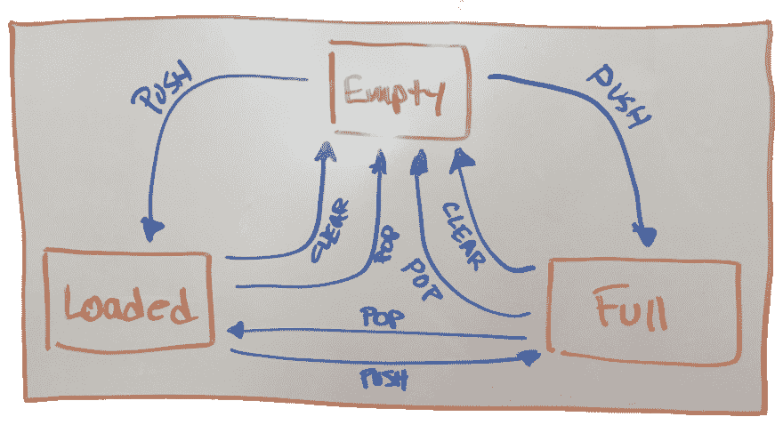

# 使用状态机进行更好的测试

> 原文：<https://dev.to/rfornal/better-tests-with-state-machines-3op0>

是不是可以说**大部分开发者都不知道如何测试**？

每个开发人员都知道单元测试的存在是为了防止缺陷进入生产环境。单元测试是保证某些代码质量的一种方式。

大多数开发人员不知道的是每个单元测试的*。对于一个失败的单元测试，开发人员试图测试什么特性，哪里出错了，为什么这很重要？*

 *## 本博客的代码

[https://github.com/bob-fornal/machining-better-tests](https://github.com/bob-fornal/machining-better-tests)

## 状态机

传统的单元测试框架本身并没有为系统地测试面向对象的单元提供适当的支持。状态机模型提供了一个更加结构化的系统，这是一个建议的改进。

在大多数情况下，彻底测试任何重要的代码单元都需要很长时间，这是不现实的。因此，测试者需要选择许多重要的状态和许多重要的输入序列。

传统上，自动化单元测试是通过编写脚本来进行的，其中被测代码(CUT)是在特定的状态下开始的，其中 CUT 的功能是根据规范来测试的。

不幸的是，传统的测试脚本经常是以一种特别的方式编写的，没有分析切割的真实性质。因此，很容易遗漏或测试失败功能的某些方面。

## 臭虫的代价

到达客户手中的 bug 会在许多方面造成损失:

*   它们会打断用户体验，影响销售和使用，甚至赶走客户。
*   报告必须由 QA 或开发人员验证。
*   修复是导致上下文切换的工作中断。上下文切换不计算修复 bug 的时间。
*   诊断发生在正常的特性开发之外，有时由不同的开发人员进行。
*   开发团队必须等待错误修复，然后才能继续进行计划的开发路线图。

一个 bug 进入生产环境的成本比一个自动化测试套件捕获的 bug 的成本高很多倍。

## 隔离

这里对集成测试的讨论假设这些是开发人员级别的测试，而不是由 QA 运行的系统级别的测试。

单元测试和集成测试需要相互隔离，以便它们可以在开发的不同阶段轻松运行。在持续集成过程中，测试经常以两种方式使用:

*   **开发:**用于开发者反馈。单元测试在这个阶段特别有用。
*   **暂存环境:**检测问题，并在出现问题时停止部署过程。全套测试类型通常在这个阶段运行。

## 测试纪律

测试是抵御软件缺陷的第一道也是最好的防线。它们比林挺或静态分析更重要(后者只能发现一层错误，而不是逻辑问题)。

单元测试结合了许多有助于成功的特性:

*   设计帮助:编写测试首先为理想的设计提供一个清晰的视角。
*   **特性文档:**测试描述覆盖了实现的特性需求。
*   **开发人员理解:**用代码表达所有关键需求。
*   **质量保证:**人工 QA 容易出错。当重构、添加或删除特性时，开发人员不可能记住所有需要测试的特性。

## 漏洞报告

一份好的错误报告包含什么？

*   测试了什么？
*   该功能应该做什么？
*   输出是什么(实际行为)？
*   预期输出是什么(预期行为)？
*   可以复制吗？

## 实现状态机

基于状态机模型的单元测试方法要求测试人员开发单元的状态机模型。模型应该包含对测试有意义的状态，以及状态转换。转换应该有效地测试从一个状态到另一个状态的所有方法。

## 被测代码(CUT)

```
var testableCode = {
  items: [],
  push: function(item) {
    if (testableCode.items.length >= 10) {
      return testableCode.items;
    }
    testableCode.items.push(item);
    return testableCode.items;
  },
  pop: function() {
    if (testableCode.items.length === 0) {
      return testableCode.items;
    }
    return testableCode.items.pop();
  },
  clear: function() {
    testableCode.items = [];
    return testableCode.items;
  }
}; 
```

从一个最大容量有限(10 个对象)的数组和三种方法开始:push、pop 和 clear。应该有三种状态:

1.  **空**:数组中没有对象。
2.  **Full** :数组中最大(10)个对象。
3.  **已装**:非空非满。

这个例子的三个方法应该如下运行:

*   **push** :应该在数组末尾添加一个元素。
*   **pop** :应该从数组中移除最后一个元素。
*   **clear** :应该从数组中删除所有元素。

给定所提供的信息，我们可以检查实现每个状态(空、满、已装载)的所有方式。

[](https://res.cloudinary.com/practicaldev/image/fetch/s--wsxdhOuf--/c_limit%2Cf_auto%2Cfl_progressive%2Cq_auto%2Cw_880/https://thepracticaldev.s3.amazonaws.com/i/lig6v13t28g2qb1maz4s.png)

| 模式(自/至) | 实现的方法 |
| --- | --- |
| 空/满 | 推 10 次** |
| 空载/负载 | 按 4 次* |
| 满/空 | 弹出 10 次** |
| 满/空 | 清除 1 次 |
| 满载/满载 | 弹出 6 次(10 - 4) |
| 装载/空载 | 弹出 4 次** |
| 装载/空载 | 清除 1 次 |
| 满载/满载 | 按压 6 次(10 - 4 次)** |

* 4 被简单地选择为非空或满。可以使用 1 到 9 个项目中的任何一个。
**以下是应确定测试异常的地方；代码 ***可能*** 做一些不寻常的事情的地方。

这给出了八种可能的转换:

1.  从空到满:使用 push 10 次(10 个对象)。
2.  从空到有:按 4 次(4 个对象)。
3.  从满到空:使用 pop 10 次(0 个对象)。
4.  从满到空:使用清除 1 次(0 个对象)。
5.  从满到满:使用 pop 6 次(4 个对象)。
6.  Loaded to Empty:使用 pop 4 次(0 个对象)。
7.  加载到空:使用清除 1 次(0 个对象)。
8.  满载:使用 push 6 次(10 个对象)。

```
describe('Machining Better Tests', function() {

  beforeEach(function() {
    testableCode.items = [];
  });

  describe('Standard State Transitions', function() {
    it('expects "Empty to Full: using push 10 times (10 objects)"', function() {
      var push = 10;
      for (var i = 0, len = push; i < len; i++) {
        testableCode.push(i);
      }
      expect(testableCode.items.length).toEqual(10);
    });

    it('expects "Empty to Loaded: using push 4 times (4 objects)"', function() {
      var push = 4;
      for (var i = 0, len = push; i < len; i++) {
        testableCode.push(i);
      }
      expect(testableCode.items.length).toEqual(4);
    });

    it('expects "Full to Empty: using pop 10 times (0 objects)"', function() {
      testableCode.items = [1,2,3,4,5,6,7,8,9,10];
      var pop = 10;
      for (var i = 0, len = pop; i < len; i++) {
        testableCode.pop();
      }
      expect(testableCode.items.length).toEqual(0);
    });

    it('expects "Full to Empty: using clear 1 time (0 objects)"', function() {
      testableCode.items = [1,2,3,4,5,6,7,8,9,10];
      testableCode.clear();
      expect(testableCode.items.length).toEqual(0);
    });

    it('expects "Full to Loaded: using pop 6 times (4 objects)"', function() {
      testableCode.items = [1,2,3,4,5,6,7,8,9,10];
      var pop = 6;
      for (var i = 0, len = pop; i < len; i++) {
        testableCode.pop();
      }
      expect(testableCode.items.length).toEqual(4);
    });

    it('expects "Loaded to Empty: using pop 4 times (0 objects)"', function() {
      testableCode.items = [1,2,3,4];
      var pop = 4;
      for (var i = 0, len = pop; i < len; i++) {
        testableCode.pop();
      }
      expect(testableCode.items.length).toEqual(0);
    });

    it('expects "Loaded to Empty: using clear 1 time (0 objects)"', function() {
      testableCode.items = [1,2,3,4];
      testableCode.clear();
      expect(testableCode.items.length).toEqual(0);
    });

    it('expects "Loaded to Full: using push 6 times (10 objects)"', function() {
      testableCode.items = [1,2,3,4];
      var push = 6;
      for (var i = 0, len = push; i < len; i++) {
        testableCode.push(i);
      }
      expect(testableCode.items.length).toEqual(10);
    });  
  });
}); 
```

检查八种可能的转换，应该指出一些异常(它们是否得到正确处理):

1.  (见 1):空变满:使用 push 11 次【例外】(10 个对象)。
2.  (见 3):满到空:使用 pop 11 次【例外】(0 个对象)。
3.  (见 6): Loaded to Empty:使用 pop 5 次【异常】(0 个对象)。
4.  (见 8):加载到满:使用 push 7 次【例外】(10 个对象)。

```
describe('Machining Better Tests', function() {

  beforeEach(function() {
    testableCode.items = [];
  });

  describe('EXCEPTIONS ...', function() {
    it('expects "Empty to Full: using push 11 times (10 objects)"', function() {
      var push = 11;
      for (var i = 0, len = push; i < len; i++) {
        testableCode.push(i);
      }
      expect(testableCode.items.length).toEqual(10);  
    });

    it('expects "Full to Empty: using pop 11 times (0 objects)"', function() {
      testableCode.items = [1,2,3,4,5,6,7,8,9,10];
      var pop = 11;
      for (var i = 0, len = pop; i < len; i++) {
        testableCode.pop();
      }
      expect(testableCode.items.length).toEqual(0);
    });

    it('expects "Loaded to Empty: using pop 5 times (0 objects)"', function() {
      testableCode.items = [1,2,3,4];
      var pop = 5;
      for (var i = 0, len = pop; i < len; i++) {
        testableCode.pop();
      }
      expect(testableCode.items.length).toEqual(0);
    });

    it('expects "Loaded to Full: using push 7 times (10 objects)"', function() {
      testableCode.items = [1,2,3,4];
      var push = 7;
      for (var i = 0, len = push; i < len; i++) {
        testableCode.push(i);
      }
      expect(testableCode.items.length).toEqual(10);
    });  
  });
}); 
```

## 等价

每当两个独立的切割实例进入同一状态时，它们在逻辑上应该是相等的，即使通过不同的转换路径达到该状态。我们可以从上面的各种期望中看到这一点...

```
expect(testableCode.items.length).toEqual(10);
expect(testableCode.items.length).toEqual(4);
expect(testableCode.items.length).toEqual(0); 
```

## 结论

每个开发人员都知道单元测试的存在是为了防止缺陷进入生产环境。单元测试是保证某些代码质量的一种方式。

这里通过几个代码示例展示了确保正确测试覆盖的*要素。这是一种确保覆盖所有状态变化的方法。**