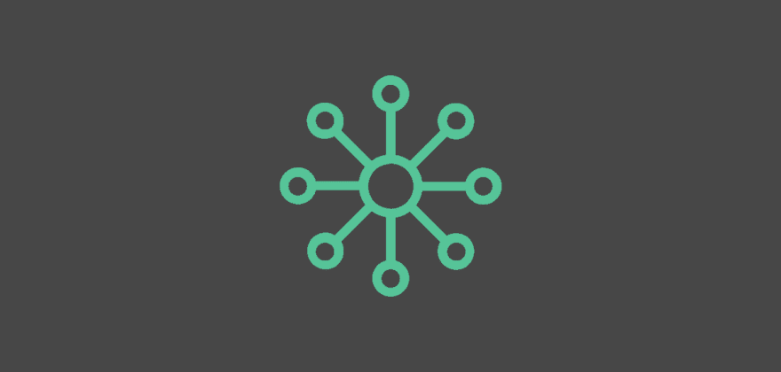
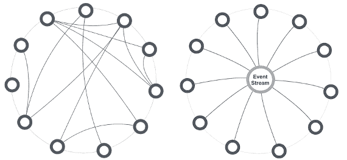
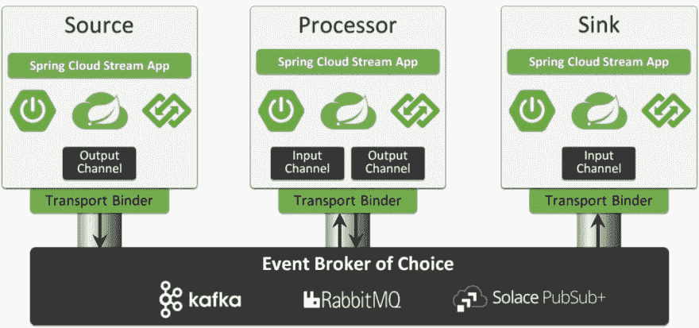

# 开发人员构建事件驱动的微服务的注意事项

> 原文：<https://dev.to/solacedevs/considerations-for-developers-building-event-driven-microservices-47d8>

不久前，我的同事 Jonathan Schabowsky 写了一篇名为 *[事件驱动微服务](https://solace.com/blog/event-driven-microservices/)* 的架构师指南的论文，结果非常受欢迎，这是有道理的。在这篇文章中，他解释了将事件驱动架构和微服务相结合的好处，并坦率地描述了分解应用程序如何不可否认地让生活变得更加有趣，正如他所说的那样在这篇文章中，我将总结架构视图的元素，这些元素对于开发人员在构建事件驱动的应用和微服务时最为重要。

## 你准备好为 EDA 开发了吗？

许多组织迁移到微服务的原因只有一个:敏捷性。在一个竞争对手唾手可得、上市时间就是一切的世界里，以提供底线商业价值的方式快速创建和修改组件的能力是至关重要的。那么，你是一名开发人员，你的任务是交付这一迁移…你需要知道什么才能成功？

首先要理解的是[分布式计算的谬误](https://en.wikipedia.org/wiki/Fallacies_of_distributed_computing):

*   **网络可靠**
*   **延迟为零**
*   带宽是无限的
*   **网络安全**
*   拓扑不会改变
*   有一个管理员
*   **运输成本为零**
*   网络是同构的

它们都是相关的，但我将微服务领域中特别重要的部分加粗，因为每个微服务越小，服务数量就越大，分布式计算的谬误对稳定性和用户体验/系统性能的影响就越大。

挑战在于，微服务需要连接性/数据来执行它们的角色并提供商业价值，而数据获取/通信在很大程度上被忽略了，以至于工具已经严重落后。例如，API 管理/网关产品只支持同步的请求/回复交换模式，这与上面提到的谬误结合在一起，加剧了分布式计算的挑战。通过适当地实现事件驱动的体系结构，可以最大限度地减少这些挑战。

## 认为事件驱动

与同步和阻塞的面向服务的设计不同，事件驱动的设计是非阻塞的，并且使用大量的[回调](https://en.wikipedia.org/wiki/Callback_(computer_programming))。事件驱动设计并不是一个新概念，你甚至可能因为使用编程模式而熟悉它，例如“[反应器模式](https://en.wikipedia.org/wiki/Reactor_pattern)或“[观察者模式](https://en.wikipedia.org/wiki/Observer_pattern)”,这是“四人帮”设计模式之一。这些编程模式所使用的概念可以应用于使用架构模式(如发布-订阅)的事件驱动的微服务架构，以实现服务解耦、独立可伸缩性和一对多双向通信。

采用事件驱动思维的第一步是改变设计和架构解决方案的方式。最初的趋势是将服务之间的所有交互视为一系列请求/回复服务调用。事实上，如果你或你的团队使用“调用”、“请求”或“调用”这样的术语，那么这是一个明确的信号，表明你仍然在用请求/回复的范式思考。

相反，尝试这些:“我的服务应该处理哪些事件？”以及“我的服务将发出什么事件？”

### 停止编排，开始编排

一旦你采用了事件驱动的思想，你就需要从编排转换到编排。开发人员通常认为“服务 A 将调用服务 B，服务 B 将调用服务 C ”,然后通过一系列调用(a->b> c)或通过创建一个 orchestrator 服务来实现该模型，如 x->a，然后 x->b，然后 x->c。当分布式计算的现实开始时，这两种方法都会导致混乱，特别是当您开始扩展时。

[编排与编排，来源:Thoughtworks](https://www.thoughtworks.com/insights/blog/scaling-microservices-event-stream)

另一种选择是遵循编舞的哲学。服务应该对其环境的变化做出反应，好处是巨大的:

*   更好的敏捷性:敏捷开发团队更加独立，受其他服务变更的影响更小。
*   服务更小/更简单:每个服务不需要对下游服务或网络故障进行复杂的错误处理。谁喜欢写错误处理？？？不是我！
*   较少的服务耦合:服务不知道其他服务的存在。
*   支持细粒度扩展:每项服务都可以根据需求独立扩展或缩减。这确保了良好的用户体验，并减少了计算资源的浪费。
*   易于添加新服务:由于耦合性较低，新服务可以上线、使用事件和实现新功能，而无需更改任何其他服务。

这些好处不是免费的；没有灵丹妙药…

然后，状态的一致性就成了关注的焦点，因为服务暂时关闭意味着事件状态的改变可能不会立即得到处理。从根本上说，我们如何处理这种负面的副作用？

### 拥抱最终的一致性

最终一致性是指一致性将在未来发生的想法，它意味着接受事物可能会在一段时间内不同步。这是一种让开发人员避免使用讨厌的 XA 事务的模式和概念。事件/消息平台的工作是确保这些域更改事件在被服务适当处理和确认之前不会丢失。

有些人认为最终一致性的唯一好处是性能，但真正的好处是微服务的解耦，因为单个服务只是对他们感兴趣的事件进行操作。

### 挑选一个事件驱动的微服务开发框架

作为开发人员，我们希望能够轻松地编写干净的代码，使我们能够快速交付功能。因此，开发语言和相关的工具变得很重要。虽然事件驱动架构允许我们分离我们的微服务，并选择不同的技术来实现每一项服务，但建议选择最适合您团队技能的标准语言/框架，仅在必要时偏离。

对于许多组织来说，这种技能包括使用 Spring 框架和 Java(以及其他 Spring 支持的、基于 JVM 的语言)的经验。这一经验使得 Spring Boot 成为构建微服务最流行的框架。它的采用持续增长，最重要的是，它通过 [Spring Cloud Streams](https://spring.io/projects/spring-cloud-stream) 内置了对事件驱动的微服务的支持。Spring Cloud Streams 是一个框架，用于构建使用共享事件代理连接的高度可伸缩的、事件驱动的微服务。除了提供一个实现框架，Spring Cloud Streams 还为事件驱动的社区定义了与供应商无关的术语，包括定义通过通道发送或接收事件的*source _ and _ sink _ applications*。

## 结论

虽然事件驱动的微服务最初可能看起来很困难，但它们是大多数微服务和 IT 战略的未来。遵循这些步骤，成为他们发展的忍者，让你的生活变得更容易和简单！

开发者构建事件驱动的微服务的后[考虑首先出现在](https://solace.com/blog/considerations-developers-building-event-driven-microservices/) [Solace](https://solace.com) 上。