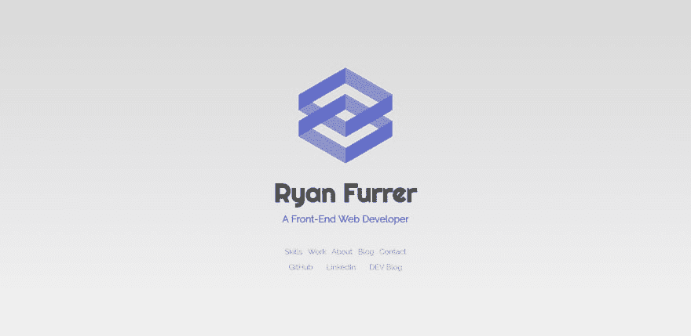

# 周目标:2019 年 8 月 18 日开始的一周

> 原文：<https://dev.to/theryanfurrer/weekly-goals-week-of-8-18-19-ac4>

周一快乐，欢迎来到另一个每周综述！这是我上周做了什么或没做什么，发生了什么，以及我新一周的目标是什么的每周帖子。我们开始吧！

## 上周目标

*   完成投资组合网站的重新设计
*   写博客关于投资组合网站重新设计☑
*   与导师☑视频通话
*   继续在☑工作
*   开始新项目
*   继续学习 JAVASCRIPT ☑

## 发生了什么？

这个周末，我完成投资组合重新设计的时间比我预期的要少。我还必须完成以下项目:

*   给网站添加黑色主题开关

*   我已经设计了黑暗主题，添加了 CSS 变量，并创建了必要的类。我只需要实现 JS。

*   增加页面上项目之间的空白。

*   确保所有填充/边距一致

首先，因为我没有完成我的网站，我无法开始我的新项目。从长远来看，我认为这不会影响我，但在周末结束一个项目会很好。

第二个，我对我的网站的设计做了一点小小的改动——只是颜色和个人资料图片。我曾争论过一段时间，坚持或不坚持个人资料图片，但最终我决定创造和使用我的标志。在使用标志时，我不得不改变标题的颜色。

<figure>

<figcaption>Just wait until you see the dark mode 👀</figcaption>

</figure>

## 向前移动

*   将 JS 添加到黑暗主题的组合网站
*   通过增加边距和填充来增加元素之间的空白

*   确保整个站点的填充/边距一致。

*   在简历上多下功夫
*   新项目的设计草图将看起来像

*   我还没有决定先做什么，但我有几个选择:doMore(待办事项)，一个关于我最喜欢的当地啤酒厂的网站，DUBCO，或者一个关于我父亲在 T2 的生意的网站。

*   继续学习 JS 并做出反应

这里还有整整一周的时间，不过没关系！我*确实*觉得我需要休息一天，但是，我可能会坚持到下周[经典 WoW](https://worldofwarcraft.com/en-us/wowclassic) 上映——有人打算玩吗？我会在斯塔拉格服务器上！

像往常一样，欢迎在下面发表评论，或者你也可以随时通过 [Twitter](https://twitter.com/ryanfurrer_dev) 联系我。