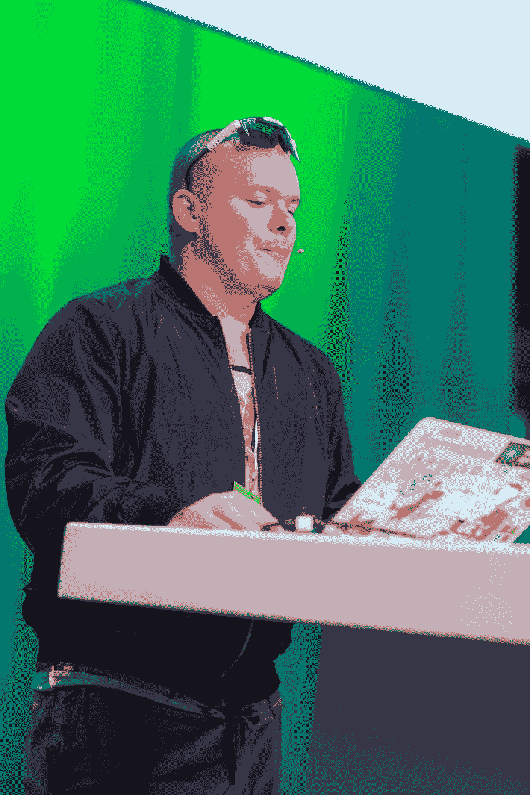

# 肯·惠勒:脱离开源是一个受欢迎的改变

> 原文：<https://dev.to/gitnation/ken-wheeler-taking-a-break-from-open-source-is-a-welcome-change-4ool>

### 我们采访了 Ken Wheeler，他是[REDACTED]的用户界面开发人员，Slick Carousel 和 Webpack Dashboard 的创建者，也是最搞笑的网络开发播客 Undefined 的主持人之一

Ken Wheeler 是一位充满热情的 web 开发人员，在开发人员社区中享有盛誉:他从事 web 开发业务已经超过十年，撰写并参与了多个 OSS 项目，最著名的是 Slick Carousel 和 Webpack Dashboard。尽管这些天他没有那么多时间在 OSS 上，但他仍然在探索下一个网络会是什么样子方面做着惊人的工作。在空闲时间，他和他最好的朋友之一贾里德·帕尔默一起在这个未定义的播客上开玩笑，照顾他的孩子，写一些很棒的音乐。10 月 25 日，肯在伦敦的[高级反应](https://reactadvanced.com/?utm_source=blogpost&utm_medium=devto&utm_campaign=interview)发表演讲。

#### 你好 Ken，欢迎来到 React Advanced 的访谈！请介绍一下你自己。

嗨，我是肯。我在一家不知名的对冲基金工作，主要从事前端开发。我小时候就开始了，到处玩制作自己的网站。我的第一个专业工作是使用 Adobe Flash，后来在 Flash 失宠后，又回到了 HTML/CSS/JS。

#### 能否请你简要描述一下你在目前职位上的工作经历？

嗯，我开始在一个小店为当地企业制作 flash 网站。从那里我去了一家代理公司，在那里我们为时尚空间做电子商务解决方案。从那里，我来到了强大，并在一些大客户，做应用程序开发。我在强大的旗帜下做自由时间开源，后来成为那里的开源主管。大约 4 年后，我决定做一些不同的事情，并最终加入了这家对冲基金。这很有趣，因为我从未从事过产品开发，这是一系列不同于平常的问题。比如性能和大型数据集。

#### 你对 JavaScript 的热情背后是什么？

我非常喜欢这项工作的工具。Javascript 几乎无处不在，web 是一个开放的平台，几乎可以在任何地方运行。也就是说，我真的很喜欢 ReasonML，它有一些语言人机工程学，使它成为一种乐趣。

#### 关于 JavaScript，你最讨厌也最喜欢什么？

我喜欢 Javascript，因为它无处不在。我用它做不到的事情很少。如果我不得不挑选我讨厌 Javascript 的东西，它甚至不会是语言本身，尽管缺乏键入会导致有趣的错误，但比它经常与 HTML/CSS 配对更重要，我不认为它非常适合每个应用程序。

#### 你认为你目前的专业领域是什么？

我目前的专业领域可能是前端性能。我花了很多时间来开发快速高效的应用程序，在这个过程中我学到了一些技巧。

#### 为什么说你最引人注目的项目是[滑溜溜的旋转木马](https://github.com/kenwheeler/slick/)和 [Webpack 仪表盘](https://github.com/FormidableLabs/webpack-dashboard)？还有哪些项目是你最引以为豪的？

我是说，如果算上 GitHub 明星的话，这些是我最受欢迎的项目。这些天我不怎么做开源。有一段时间我是这样做的，但是从技术上来说，我不能适应我的新工作，而且这是一个非常受欢迎的休息，不用做一堆免费的工作。也就是说，知道我写的东西帮助了别人，并且网络上有很多网站使用我的代码，这总是很酷的。至于骄傲计划，我会说任何与音频有关的东西。我真的很喜欢写这些。

[https://www.youtube.com/embed/p8v9X2TNQKA](https://www.youtube.com/embed/p8v9X2TNQKA)

#### 告诉我们你其他爱好背后的故事，比如 Rust 的探索，OCaml/ReasonML，机器/深度学习的应用，以及 WebAudio/WebGL？

这种探索大多是由推动网络发展或预测下一步会发生什么的愿望推动的。应用程序变得越来越复杂，需求也越来越多，我不认为今天的 web 已经做好了迎接挑战的准备。我研究了其他语言和技术来获取灵感，并把它带回网络。

#### 跟我们说说你和贾里德·帕尔默的播客，也就是[的未定义](https://undefined.fm)。你为什么决定制作这样一个完全怪异却又搞笑的东西？伙计们，你们真的在播客中喝酒吗？

我不确定是谁提议的，可能是他，但我记得我当时就想，去他妈的。为什么不对？是的，我们几乎总是在广播中喝醉。

#### Undefined 你最喜欢的嘉宾是谁？为什么？

老实说，他们都很不同，很有趣。但如果让我选一个最喜欢的，那就是彼得·皮耶扎奇克。他甚至不是那天的客人，但一直挂着贾里德和随机加入，我们都喝醉了。这是一段如此美好的时光，如此失控，以至于我们不得不放弃这一集，它将永远不会重见天日。

#### 近年来你做过哪些讲座？

我已经给出了很多，它们主要围绕几个不同的主题。让网络变得更好，有趣的网络新功能和反应，以及制作有趣的东西。我认为谈话应该是有趣的，否则人们会去睡觉。我们可以整天严肃地工作。

[https://www.youtube.com/embed/PBpugV5l90c](https://www.youtube.com/embed/PBpugV5l90c)

#### 你会如何完成这句话:成功的开发人员应该…？

要坚持。我做了一些超出我工资级别的技术上的事情，我把它归因于坚持不懈和希望解决方案的存在。

#### 在我们解雇你之前，你认为你人生中最重要的三项成就是什么？

嗯。

有一次我在纽约赢了一场拳击比赛，Kanye 也在那里
我振作起来，找到了稳定的工作，在
买了一栋房子来抚养这些孩子

#### 音乐。分享你最自豪或最爱的三首歌曲？

我喜欢创作音乐。这里有一对夫妇:

[https://w.soundcloud.com/player/?url=https://soundcloud.com/thekenwheeler/la-la-la-la&auto_play=false&color=%23000000&hide_related=false&show_comments=true&show_user=true&show_reposts=false&show_teaser=true](https://w.soundcloud.com/player/?url=https://soundcloud.com/thekenwheeler/la-la-la-la&auto_play=false&color=%23000000&hide_related=false&show_comments=true&show_user=true&show_reposts=false&show_teaser=true)
[https://w.soundcloud.com/player/?url=https://soundcloud.com/thekenwheeler/syrup&auto_play=false&color=%23000000&hide_related=false&show_comments=true&show_user=true&show_reposts=false&show_teaser=true](https://w.soundcloud.com/player/?url=https://soundcloud.com/thekenwheeler/syrup&auto_play=false&color=%23000000&hide_related=false&show_comments=true&show_user=true&show_reposts=false&show_teaser=true)
[https://w.soundcloud.com/player/?url=https://soundcloud.com/thekenwheeler/sets/love-songs-for-your-mother&auto_play=false&color=%23000000&hide_related=false&show_comments=true&show_user=true&show_reposts=false&show_teaser=true](https://w.soundcloud.com/player/?url=https://soundcloud.com/thekenwheeler/sets/love-songs-for-your-mother&auto_play=false&color=%23000000&hide_related=false&show_comments=true&show_user=true&show_reposts=false&show_teaser=true)

#### 你对即将在伦敦召开的会议感到兴奋吗？你将谈论什么，你对这次活动有什么期望？

我很兴奋。我爱伦敦。我不是 100%确定，但它要么是一场演出，要么是音乐，或者两者都是。

* * *

### [预订 React 高级会议席位](https://reactadvanced.com/?utm_source=blogpost&utm_medium=devto&utm_campaign=interview)

* * *

来自[Soshace.com](https://soshace.com/)的文案玛丽娜·沃龙索娃协助准备了这次采访。Soshace 是一个招聘网站开发者的平台:[招聘一个开发者](https://soshace.com/jobs)或者[申请一个远程工作](https://soshace.com/developers)。

* * *

## 关于 GitNation

GitNation 是一个通过组织关注开源软件的活动来促进技术发展的基金会。我们组织有意义且有趣的 JavaScript 会议，将有才华的工程师、研究人员和重要库和技术的核心团队联系起来。

除了提供[单个会议门票](https://gitnation.org/#events)，该组织还出售 GitNation Multipass，提供对多个[远程 JavaScript 会议和研讨会](https://portal.gitnation.org/multipass)的折扣访问。