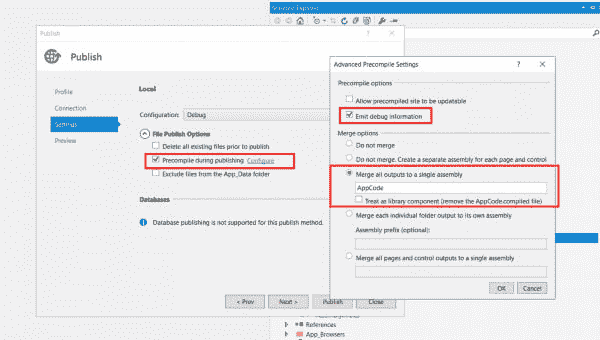

# 基于 Umbraco CMS 的预编译 web 应用之路

> 原文：<https://dev.to/akuryan/road-to-precompiled-web-application-based-on-umbraco-cms-2fp8>

这是从[我的博客文章](https://dobryak.org/road-to-precompiled-web-application-based-on-umbraco-cms/)交叉发布的。

## 开始旅程

前段时间，我的同事耶鲁安让我优化我们的一个 web 应用程序的本地开发过程，该应用程序有超过 450 个 C# MVC 视图，这导致了一个问题——本地启动时间非常长(在体面的开发人员工作站上可能超过 5 分钟)。此外，我们在生产中也遇到了同样的问题，这是通过 MsDeploy 交付的(虽然它们没有那么大，因为交付到生产中比本地编译要少得多)。所以，我开始调查并优化它

## 初试:MvcBuildViews

在每个 C# MVC 项目中，都有一个编译 MVC 视图的选项，方法是将参数 MvcBuildViews 设置为 True。我认为这将通过将视图编译成 IL(中间语言)来解决我们的问题，但事实并非如此。据我所知，这个参数的主要目标是检查视图中的错误，这样我们可以在将来的运行时编译中避免它们——它启动 aspnet_compiler.exe 将所有视图编译成 IL(这似乎是目标所在)，但是，它保持视图本身不被修改，并编译到一个临时文件夹中。因此，在 web 应用程序的下一次启动时，当请求一个视图时，它将从 Views 文件夹中被不加修改地加载，并再次经历整个运行时编译，将 IL 输出到另一个临时文件夹。额外的问题是:MvcBuildViews 与 MsDeploy 不兼容，因此，如果您在一次运行中编译和部署(例如，参数 DeployOnBuild 设置为 True)，则构建将失败，因为 ASPCONFIG 在解析应用程序 web.config 时失败，这会导致构建失败。但是，如果您确实希望在部署构建期间检查您的视图的编译健全性，这可以通过修改构建过程(例如，在您的 MVC 应用程序的 csproj 文件中)来解决，方法是在末尾(结束标记之前)添加以下内容:

```
<PropertyGroup>
<!-- MvcBuildViews is not compatible with DeployOnBuild - so we need to change order of build events -->
<MvcBuildViews Condition="$(MvcBuildViews) == ''">False</MvcBuildViews>
<MSDeployPublishDependsOn Condition="$(DeployOnBuild) And '$(MSDeployPublishDependsOn)'!=''">MvcBuildViews;$(MSDeployPublishDependsOn);</MSDeployPublishDependsOn>
</PropertyGroup>
<Target Name="MvcBuildViews" Condition="$(MvcBuildViews)">
<AspNetCompiler VirtualPath="temp" PhysicalPath="$(WebProjectOutputDir)" />
</Target> 
```

这将修改生成过程，以确保在发布之前执行 MvcBuildViews(默认情况下，它在发布步骤之后执行)，并允许从编译器中删除有关 web.config 的错误，但是，它仍然不会为视图生成预编译的 IL，应用程序必须在运行时生成它。

## 第二次尝试:内置视图预编译

原来，Visual Studio 团队已经考虑到了那些希望使用预编译视图和嵌入式参数集来实现这一目标的人，这是在发布 web 应用程序时调用的。因此，它推动我们使用 webroot 之外的开发，这对所有人都有好处(允许处理发布到生产过程中遇到的边缘情况；使您的解决方案更小，并在普通安装的基础上隔离您的定制工作的增量)，因为视图预编译会改变*。cshtml 文件(它们作为占位符留在那里，带有占位符文本)。

因此，我使用了发布向导，并将其配置如下:

[](https://res.cloudinary.com/practicaldev/image/fetch/s--haueyxuZ--/c_limit%2Cf_auto%2Cfl_progressive%2Cq_auto%2Cw_880/https://dobryak.org/wp-content/uploads/2017/03/Schermafbeelding-2017-03-24-om-11.38.29-600x340.png)

如果设置“允许预编译站点可更新”，预编译将不会触发视图(至少，它不会在发布的应用程序的 bin 文件夹中产生 AppCode.dll)。这导致了下面的发布概要文件(所有的参数都可以直接复制到你的 MVC web 应用程序的 csproj 文件中):

```
<Project ToolsVersion="4.0" xmlns="http://schemas.microsoft.com/developer/msbuild/2003">
<PropertyGroup>
<WebPublishMethod>FileSystem</WebPublishMethod>
<LastUsedBuildConfiguration>Debug</LastUsedBuildConfiguration>
<LastUsedPlatform>Any CPU</LastUsedPlatform>
<SiteUrlToLaunchAfterPublish />
<LaunchSiteAfterPublish>False</LaunchSiteAfterPublish>
<ExcludeApp_Data>False</ExcludeApp_Data>
<publishUrl>../../Published</publishUrl>
<DeleteExistingFiles>False</DeleteExistingFiles>
<PrecompileBeforePublish>True</PrecompileBeforePublish>
<EnableUpdateable>False</EnableUpdateable>
<DebugSymbols>True</DebugSymbols>
<WDPMergeOption>MergeAllOutputsToASingleAssembly</WDPMergeOption>
<UseMerge>True</UseMerge>
<SingleAssemblyName>AppCode</SingleAssemblyName>
<DeleteAppCodeCompiledFiles>False</DeleteAppCodeCompiledFiles>
</PropertyGroup>
</Project> 
```

然后，我试图发布我的网络应用程序，但……失败了。

### Catch 1: Umbraco 和 Umbraco_client 文件夹

由于一些历史原因，我们在解决方案中同时包含了 umbraco 和 umbraco_client，这导致了预编译失败。有几个 ascx 文件引用了不再存在的后端代码。但是，如果 Umbraco 是通过 nuget 包安装的，则不需要在解决方案中包含 umbraco 和 umbraco_client 文件夹，因为 NuGet 将导入一组任务，这些任务负责在构建期间将 umbraco 和 umbraco_client 内容复制到 web deploy 包和解决方案根目录。于是，我又排除了那些文件夹，又……又失败了。这一次失败了，因为我们已经安装了一些插件，并包含在我们的解决方案中，这是使用主从 umbraco 文件夹。我包括了那些主文件——这一次，预编译是可以的。

### Catch 2: App_Code 文件夹

我期望在发布后，我的应用程序将快速启动，并且不会在运行时预编译上花费任何时间，但是–我收到了 YSOD，声明在预编译的应用程序中不允许 App_Code 文件夹。我检查了文件系统，发现其中存在带有一些 cs 文件的 App_code。原来我们有过一些 cs 文件，在这个文件夹里标记为内容，被 nuPicker 使用。我将它们的属性更改为“Compile ”,并再次发布(手动清除目标文件夹，因为我的发布配置文件要求通过将 DeleteExistingFiles 设置为 False 来保留现有文件——这是必需的，因为我们有一个单独的前端构建，它使用 Gulp 来生成它)。此后，应用程序出现了，启动时间也大大缩短了(尽管最初的索引构建需要一些时间，但是后续的发布会导致应用程序快速启动)。

### 第三条:发布时间长

视图预编译是好的，但是有一个立即观察到的折衷——构建时间大大增加(在 HDD 上可能长达 5 分钟——与我们在预编译前启动花费的时间相同)。因此，为了从快速启动中获益，我的同事耶鲁安(他最初提出了这个特性的想法)在我们的 MVC 应用程序 csproj 文件中添加了一个简单的 postbuild 事件:

```
<PropertyGroup>
<PostBuildEvent>XCOPY "$(ProjectDir)bin\*.dll" "$(ProjectDir)..\..\Published\bin\" /S /Y /i</PostBuildEvent>
</PropertyGroup> 
```

正如你所看到的——构建完成后，它会将所有 dll 从项目 bin 复制到预编译应用程序所在的已发布文件夹中。因此，如果一个人没有改变视图中的任何东西——他不需要启动完全发布，而只需要构建解决方案。

### 第四步:无法登录到 Umbraco

在玩够了 frontend 之后，我们发现尝试登录 Umbraco 会导致 YSOD。快速检查揭示了它的来源——因为我们的应用程序是预编译的，不可更新的(参见发布配置文件示例),它期望我们的应用程序的所有部分都以相同的方式预编译。但是，如前所述，我们不能预编译 Umbraco 和 umbraco_client 文件夹，因为这会导致预编译阶段失败。看起来这是一个真正的问题，但我们已经找到了两种可能的解决方案:

1)我们可以欺骗运行时:当预编译应用程序时，编译器将在 webroot 中删除 PrecompiledApp.config 并在那里添加一个定义，如果应用程序可更新或不可更新:因此，要允许将非预编译的 Umbraco 视图与预编译的 web 应用程序视图一起使用，只需将 updateable 设置为 true，这可以通过将以下内容添加到 MVC 应用程序 csproj 文件
来完成

```
<Target Name="__localPublishAllowUpdateable" AfterTargets="CopyAllFilesToSingleFolderForPackage" Condition="$(PrecompileBeforePublish) And !$(EnableUpdateable)">
<!-- This target is used with local publish -->
<MSBuild Projects="$(MSBuildProjectFile)" Targets="__AllowUpdateable" />
</Target>
<Target Name="__MsDeployPublishAllowUpdateable" AfterTargets="CopyAllFilesToSingleFolderForMsdeploy" Condition="$(PrecompileBeforePublish) And !$(EnableUpdateable)">
<!-- This target is used with msdeploy publish -->
<MSBuild Projects="$(MSBuildProjectFile)" Targets="__AllowUpdateable" />
</Target>
<Target Name="__AllowUpdateable" Condition="$(PrecompileBeforePublish) And !$(EnableUpdateable)">
<!-- This target is required to mark precompiled app, based on Umbraco CMS as updateable -->
<PropertyGroup>
<___IntermediateOutputPath Condition="'$([System.IO.Path]::IsPathRooted($(IntermediateOutputPath)))' == 'False'">$(MSBuildProjectDirectory)\$(IntermediateOutputPath)</___IntermediateOutputPath>
<___IntermediateOutputPath Condition="'$([System.IO.Path]::IsPathRooted($(IntermediateOutputPath)))' == 'True'">$(IntermediateOutputPath)</___IntermediateOutputPath>
</PropertyGroup>
<Exec Command='copy "$(ProjectDir)Properties\BuildTargets\PrecompiledApp.source" "$(___IntermediateOutputPath)Package\PackageTmp\PrecompiledApp.config" /y' />
<RemoveDir Directories="$(___IntermediateOutputPath)Package\PackageTmp\App_Code" />
</Target> 
```

这些目标会将预编译的 App.source 文件从 MVC web app 项目的 Properties\BuildTargets 复制到已发布应用的输出文件夹中。预编译 App.source 的内容为:

```
<precompiledApp version="2" updatable="true"/> 
```

其实这可以通过导入这个 nuget-[http://www.nuget.org/packages/Colours.Ci.Umbraco/](http://www.nuget.org/packages/Colours.Ci.Umbraco/)来实现

2)另一个可能的解决方案也解决了第 5 个问题，可用于测试负载平衡解决方案，即添加 2 个 IIS 站点:一个指向已发布的文件夹，我们将使用它来检查 web 应用程序性能，检查代码和视图的更改以正确显示，第二个指向包含 MVC 项目的文件夹，我们将使用它来访问 Umbraco。在这种方法中，除了所有其他好处之外，我们还可以轻松测试负载平衡方法(在 Umbraco 中更改的内容将反映在我们发布的预编译 web 应用程序中，事件将在 web 应用程序等上调用)。

### 第 5 条:无法调试视图

尽管事实上我们是在调试模式下发布，并且正在添加调试符号(请参见发布配置文件)-当调试器附加到已发布的 web app 进程时，无法调试视图。因此，耶鲁安提出了一个解决方案，被描述为第四条军规中的第二点。此时，我不知道如何在预编译的应用程序中调试视图——也许有人能提出建议？

### 第六条:VPP 不行了

我们基于 Umbraco 的 web 应用程序具有以下设置:它通过 UmbracoFileSystemProviders 将图像存储在 Azure blob 存储中。Azure 通过 ImageProcessor 处理它们，并在 Our.Umbraco.AzureCDNToolkit 的帮助下通过 Azure CDN 为它们提供服务。我们面临的最后一个问题是——我们的 web 应用程序无法直接从我们的虚拟路径提供商(VPP)提供媒体，而不通过 ImageProcessor 进行处理。所以，所有像[http://mydevhost/media/1000/1 . jpg](http://mydevhost/media/1000/1.jpg)这样的请求都是为 ASP.NET 404 服务的，而像[http://mydevhost/media/1000/1 . jpg 这样的请求呢？1=1](http://mydevhost/media/1000/1.jpg?1=1) 将被图像处理器愉快地拾取并进一步处理。这不是一个很大的缺陷，在某些情况下，它甚至可以被视为原始图像的额外保护来源(想象一下，您在任何情况下都不想为您的最终用户提供原始媒体项目)。其实这是故意的:[http://msdn 2 . Microsoft . com/en-us/library/system . web . hosting . virtualpathprovider . aspx](http://msdn2.microsoft.com/en-us/library/system.web.hosting.virtualpathprovider.aspx)注意，VPP 在预编译的 web 应用中不起作用。
然而，在[这个论坛帖子](https://our.umbraco.org/forum/using-umbraco-and-getting-started/84018-umbraco-views-precompilation-and-virtual-path-providers)中，我想出了一个答案，我们可以如何破解它，并允许在预编译应用程序中使用特定的 VPP。

## 团队城市配置

因为我们使用的是 Teamcity (system)的直接发布。DeployOnBuild 设置为 True ),我们有两个选项来设置它:

1.  在附加发布配置文件中定义所有参数，并将其名称传递给 Teamcity build
2.  将以下参数作为系统添加到构建配置本身:

```
system.EnableUpdateable = False
system.PrecompileBeforePublish = True
system.SingleAssemblyName = nameOfTheAssembly
system.UseMerge = True 
```

然而，在我的情况下，尽管我有 Visual Studio 2015 和 SDK。NET 版本已安装–构建失败，因为 Teamcity 找不到 aspnet_merge.exe，它是 SDK 的一部分。因此，我定义了两个额外的参数:

```
system.AspnetMergePath = “C:\Program Files (x86)\Microsoft SDKs\Windows\v8.1A\bin\NETFX 4.5.1 Tools\”
system.GetAspNetMergePath = False 
```

在这之后，我的构建又变绿了，我还在我们的生产环境中获得了一个预编译的应用程序，在 IIS 回收或虚拟机重启以安装更新后，它的启动速度更快了。