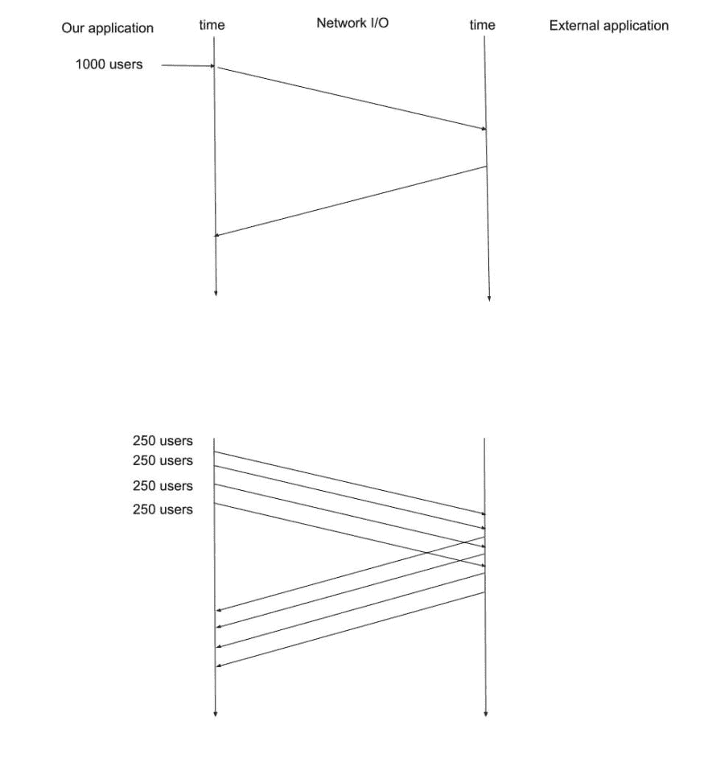
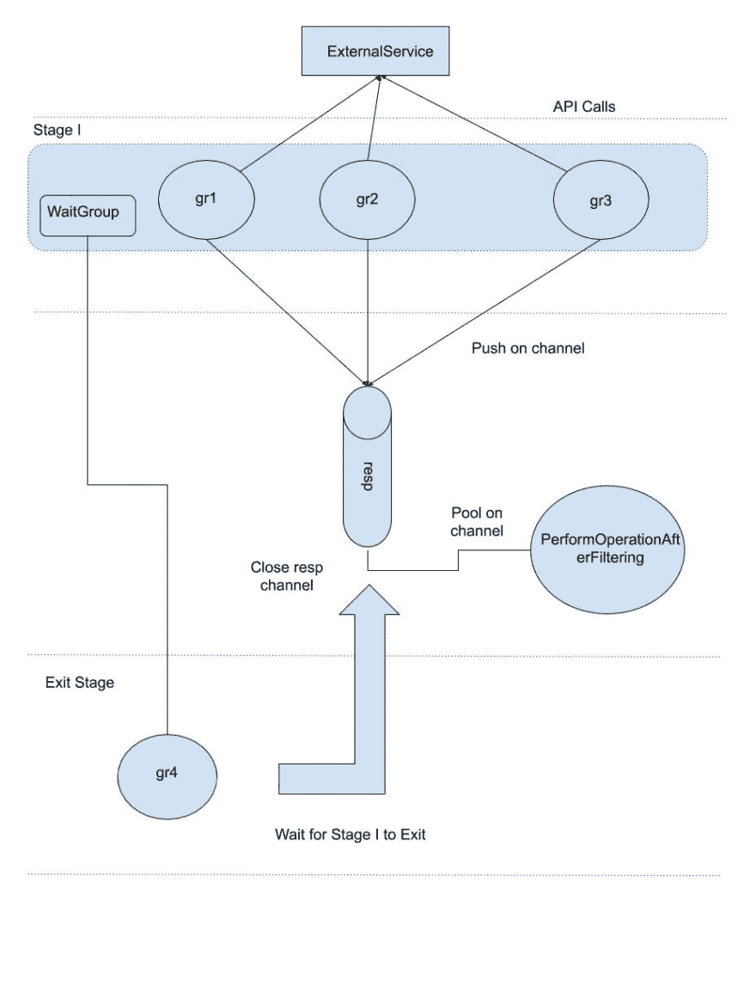
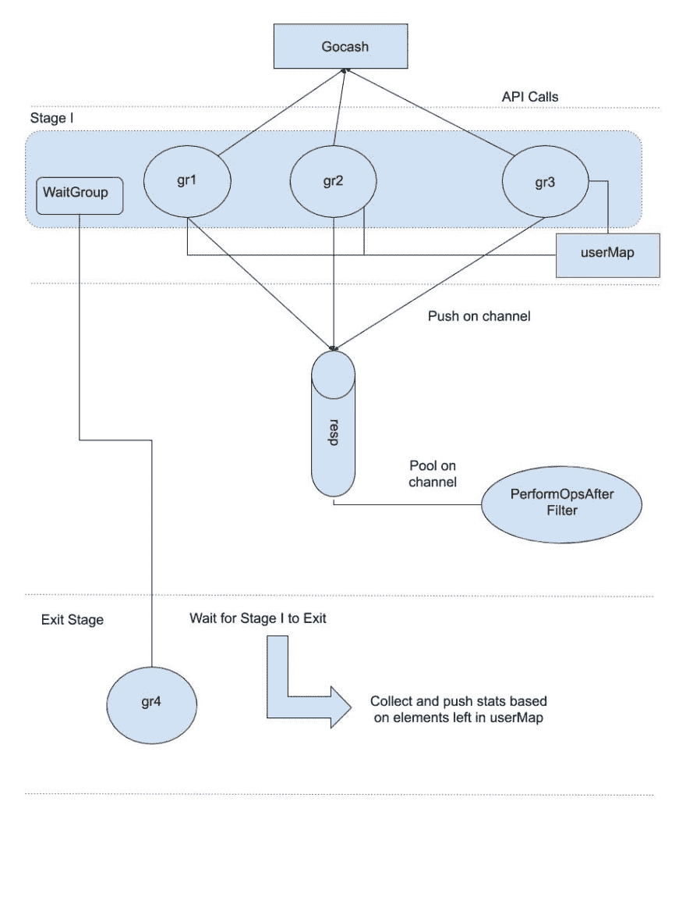

# Go 并发管道

> 原文：<https://dev.to/ishankhare07/go-concurrency-pipelines-gmc>

在这篇博客中，我们将探索一些与 Go 中并发管道相关的设计模式

*   我们将以一个真实世界的用例为例，首先尝试用 goroutines 优化它。
*   接下来，我们将看到出现的挑战以及如何调试它们。
*   最后，我们将介绍另一个重新设计，它将使我们能够收集关于我们在上述步骤中所做的所有处理的统计信息。

* * *

#### 问题陈述

假设我们有一组用户，我们希望对一个外部微服务进行几次调用，以根据一组参数筛选出这组用户。由于这个外部调用可以通过普通的 HTTP 或 gRPC 之类的现代替代方法，我们就不讨论它们的实现了。

相反，我们首先关注的是优化这一功能的强力方法。

* * *

#### 用 goroutines 实现

首先，假设我们有一个名为`handler.go`的文件，代码如下:
`handler.go`

```
package handler

func PerformOperationAfterFiltering(users []users) {
    // make external call and filter out users

    operationToBePerformed(users)
} 
```

Enter fullscreen mode Exit fullscreen mode

##### 高层设计

假设我们平均每次获得 1000 个用户的列表。在进行外部调用之前，最好将其分成几批。这将使我们能够将我们的网络通话分开。因此，如果任何批次由于某些网络因素而失败，其他批次不会受到影响。如果我们做

单个调用失败，我们将失去对全部 1000 个用户的响应。此外，将该流程分解成更小的块也将使我们能够在后续步骤中进一步优化
it——分而治之。

[](https://res.cloudinary.com/practicaldev/image/fetch/s--_u2yrvJP--/c_limit%2Cf_auto%2Cfl_progressive%2Cq_auto%2Cw_880/https://ishankhare.com/medimg/Simple_batching.jpg)

但是在我们这样做之前，我们需要了解我们计划如何将结果传递回调用函数，以及我们如何知道所有请求都已完成？

为此，我们将使用 2 个 golang 构造:

1.  频道
2.  等待组

高层架构应该是这样的:
[](https://res.cloudinary.com/practicaldev/image/fetch/s--Euk4CW96--/c_limit%2Cf_auto%2Cfl_progressive%2Cq_auto%2Cw_880/https://ishankhare.com/medimg/initial_arch.jpeg1.jpg)

让我们打开一个新文件来编写我们的请求函数
`request.go`

```
package request

import "sync"

func Request(users []Users) chan Users {
    resp := make(chan Users)
    batchSize := 250
    var batches [][]Users
    var wg sync.WaitGroup
    for batchSize < len(users) {
        users, batches := users[batchSize:], append(batches, users[0:batchSize])
    }
    batches = append(batches, batchSize)
} 
```

Enter fullscreen mode Exit fullscreen mode

既然我们已经创建了自己的批处理，那么我们可以在自己的 goroutine 中为每个批处理启动请求。但是每当我们开始一个新的 goroutine 时，我们会将它添加(或注册)到一个 WaitGroup 中，以跟踪每个单独 go routine 的完成情况。

```
func Request(users []Users) chan Users {
    resp := make(chan Users)
    batchSize := 250
    var batches [][]Users

    for batchSize < len(users) {
        users, batches := users[batchSize:], append(batches, users[0:batchSize])
    }
    batches = append(batches, batchSize)

    var wg sync.WaitGroup

    for batch, _ := range batches {
        wg.Add(1)
        go func(batch []Users) {
            defer wg.Done()
            response, err := MakeRequestToThirdParty(batch)
            if err != nil {
                // log error and probably
                // also the batch of users that failed
            }

            for r, _ := range response {
                if r.CurrentBalance > 500 {
                    // we've got our user
                    // push it back on our channel
                    resp <- r.u
                }
            }
        }(batch)
    }

    return resp
} 
```

Enter fullscreen mode Exit fullscreen mode

> 注意，该函数返回一个类型为`Users`的`channel`。

我们还为`wg.Done()`添加了一个延迟调用。这将减少我们的 waitgroup，以便我们的出口阶段知道我们所有的 goroutines 何时完成。

在我们进入退出阶段之前，让我们看看我们计划如何从渠道中消费用户。通道[正好适合](https://gobyexample.com/range-over-channels)中的 go lang for 循环——也就是说，我们可以通过 go 的`for-range`循环从通道中消费
对象。
在我们的`handler.go` :

```
package handler

import "request"

func PerformOperationAfterFiltering(users []users) {
    // make external call and filter out users
    var filteredUsers []Users

    for user := range Request(users) {
        filteredUsers = append(filteredUsers, user)
    }

    operationToBePerformed(users)
} 
```

Enter fullscreen mode Exit fullscreen mode

这正是我们在这里做的。越过明渠。你可能会问，循环将如何或何时退出？
–当我们`close()`频道。这就是`EXIT`阶段出现的地方。

所以我们继续到退出阶段。回到我们的`request.go`，我们添加了另一个闭包，它利用了我们的`WaitGroup` :

```
func Request(users []Users) chan Users {
    resp := make(chan Users)
    batchSize := 250
    var batches [][]Users

    for batchSize < len(users) {
        users, batches := users[batchSize:], append(batches, users[0:batchSize])
    }
    batches = append(batches, batchSize)

    var wg sync.WaitGroup

    for batch, _ := range batches {
        wg.Add(1)
        go func(batch []Users) {
            defer wg.Done()
            response, err := MakeRequestToThirdParty(batch)
            if err != nil {
                // log error and probably
                // also the batch of users that failed
            }

            for r, _ := range response {
                if r.CurrentBalance > 500 {
                    // we've got our user
                    // push it back on our channel
                    resp <- r.User
                }
            }
        }(batch)
    }

    // EXIT stage
    go func() {
        // wait for the wait group counter to drop down to 0
        // which will happen when all goroutines are done
        wg.Wait()

        // now we close the response channel
        // this will make our loop also exit
        close(resp)
    }()

    return resp
} 
```

Enter fullscreen mode Exit fullscreen mode

上面的代码是不言自明的，完全模仿了我们最初的 arch 设计，没有任何问题。

* * *

#### 哪里变得暗淡无光？

当前代码运行良好。但是当我们将这样的代码部署到产品中时，我们通常希望记录和收集与所发生的事情相关的指标。什么出了问题，什么有效，多少用户通过了，多少没有通过，等等。

当前的设计几乎没有为收集这样的指标留下空间，我们很快就会看到这一点。

* * *

#### 收集指标

收集指标的最简单方法是:

*   构建 2 个用户 id 到用户对象的映射——一个用于通过条件的用户，另一个用于未通过条件的用户。
*   响应时，将用户添加到相关地图

所以让我们把这个简单的解决方案添加到我们的代码
`handler.go`

```
func Request(users []Users) chan Users {
    resp := make(chan Users)
    batchSize := 250
    var batches [][]Users

    passedUsers := make(map[int64]Users)
    skippedUsers := make(map[int64]Users)

    for batchSize < len(users) {
        users, batches := users[batchSize:], append(batches, users[0:batchSize])
    }
    batches = append(batches, batchSize)

    var wg sync.WaitGroup

    for batch, _ := range batches {
        wg.Add(1)
        go func(batch []Users) {
            defer wg.Done()
            response, err := MakeRequestToThirdParty(batch)
            if err != nil {
                // log error and probably
                // also the batch of users that failed
            }

            for r, _ := range response {
                if r.CurrentBalance > 500 {
                    // we've got our user
                    // push it back on our channel
                    resp <- r.User

                    passedUsers[r.User.UserId] = r.User
                }

                skippedUsers[r.User.UserId] = r.User
            }
        }(batch)
    }

    // EXIT stage
    go func() {
        // wait for the wait group counter to drop down to 0
        // which will happen when all goroutines are done
        wg.Wait()

        defer LogMetrics(passedUsers, skippedUsers)

        // now we close the response channel
        // this will make our loop also exit
        close(resp)
    }()

    return resp
} 
```

Enter fullscreen mode Exit fullscreen mode

代码看起来很好——我们已经添加了两个地图，并正在向用户写入。在退出阶段，我们添加了一个`defer`语句，基本上可以确保指标被明确注册。这段代码编译时没有任何错误，运行时也没有任何错误，但是有一个严重的错误会以非常奇怪的方式使我们的代码崩溃。

#### 这个问题

每当我们在 go 中编写并发代码时，由于某种看起来很奇怪的原因，它会死机， [go race detector](https://blog.golang.org/race-detector) 是运行的工具。

当我们试图在我们的 goroutines 中写入我们的 hashmaps 时，问题就出现了。你可以看到这些散列表是 goroutine 之间共享的数据，并且会发生不止一个 go routine 试图写入这些映射的情况——这将导致数据竞争。和数据争用都是未定义的行为，基本上会导致整个程序崩溃，并显示不友好的错误消息。这显示在红色的图像中。

[](https://res.cloudinary.com/practicaldev/image/fetch/s--jP_Ya9x3--/c_limit%2Cf_auto%2Cfl_progressive%2Cq_auto%2Cw_880/https://ishankhare.com/medimg/old_arch.jpg)

在启用竞争检测器的情况下运行上面的代码，我们将得到如下输出:

```
==================
WARNING: DATA RACE
Read by goroutine 5:
  request.Request·001()
     request.go:36 +0x169

Previous write by goroutine 1:
  request.Request()
      request.go:36 +0x174

Goroutine 5 (running) created at:
  request.goFunc()
      request.go:19 +0x56
================== 
```

Enter fullscreen mode Exit fullscreen mode

这只是告诉我们发生数据竞争的行号，这是第一个数据竞争，另一个类似的就在它下面，我们在那里访问`skippedUsers`图。

为了解决这个问题，我们需要稍微重新设计我们的管道架构。我们将在这篇文章的下一篇文章中看到。