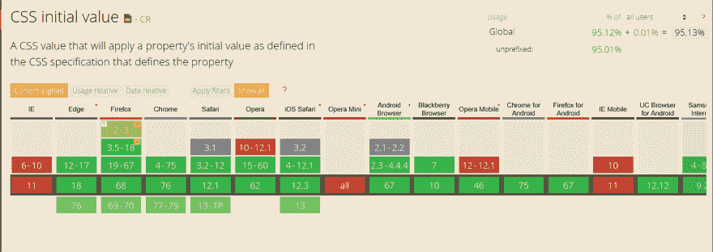
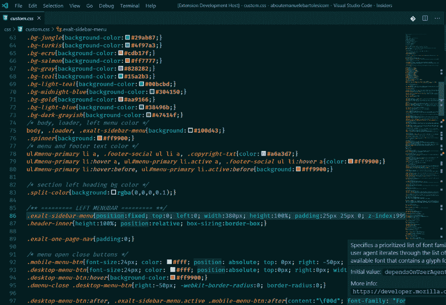

# 我发布了一个新的 CSS 文件的 Visual Studio 代码扩展！

> 原文：<https://dev.to/kasuken/i-released-a-new-visual-studio-code-extension-for-css-files-5n7>

今天我发布了一个新的 Visual Studio 代码扩展，可以处理 CSS、Less、Sass 和 SCSS 文件。

用它你可以看到每个 CSS 属性的初始值。这是一个易于使用的扩展:你只需将鼠标悬停在一个属性上，就可以看到该属性的初始值。
它有助于理解用户界面上的问题，或者只是了解一个属性的初始值。

为了记录属性，扩展使用了 GitHub 上发布的 Mozilla 开发网络的官方数据库:[https://github.com/mdn/data/blob/master/css/properties.json](https://github.com/mdn/data/blob/master/css/properties.json)

(几乎)每个浏览器都支持初始值属性。

请登录 caniuse.com 查看:[https://caniuse.com/#feat=css-initial-value](https://caniuse.com/#feat=css-initial-value)

下面你可以看到一个扩展的工作演示。

如果你想更深入地了解初始值属性是什么以及这个属性能做什么，请点击这个链接阅读一篇有趣的博文:[https://css-tricks.com/getting-acquainted-with-initial/](https://css-tricks.com/getting-acquainted-with-initial/)

## 反馈

请直接在这里或 GitHub 库中分享您的反馈。

## 下载

你可以点击以下链接进入 Visual Studio market place:[https://marketplace.visualstudio.com/items?itemName = emanuelebartolesi . css-Initial-Style-Value](https://marketplace.visualstudio.com/items?itemName=emanuelebartolesi.css-initial-style-value)或者您可以在 Visual Studio 代码的扩展面板中搜索:CSS 初始样式值。

## 源代码

你可以在 GitHub 上找到扩展的源代码。用你的贡献给这个扩展添加新的特性！！！

[https://github . com/kasu ken/vscodeextensions/tree/master/CSS-initial-style-value](https://github.com/kasuken/vscodeextensions/tree/master/css-initial-style-value)

谢谢大家，编码快乐！