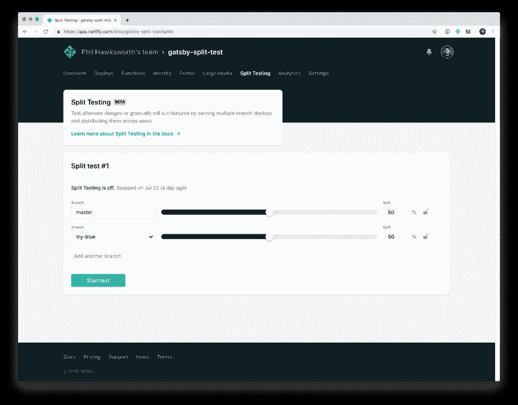
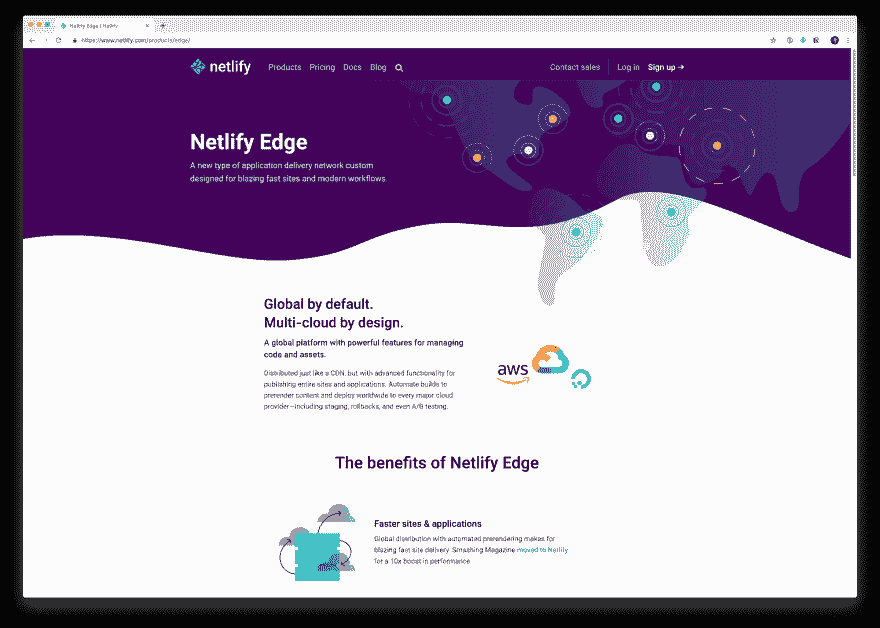

# 用 Netlify 上的 A/B 测试启动 Gatsby 站点

> 原文：<https://dev.to/philhawksworth/power-up-gatsby-sites-with-a-b-testing-on-netlify-fp4>

Netlify 专门为 JAMstack 网站提供构建工具和托管服务。JAMstack 站点的一个基本属性是它们是预先呈现的，可以直接从 CDN 提供服务，而不需要在原始 web 服务器上维护逻辑。

除了与性能、安全性、可伸缩性和开发人员体验相关的优势之外，这个属性还释放了一些有趣的功能。

其中一种能力是交付 A/B 或多变体测试，而不需要客户端 UI 操作或其他 JavaScript 干预。在没有客户端 JavaScript 的情况下这样做有助于避免影响网站的性能，从而影响用户体验，以及测试不同 UI 或内容的结果。

在这篇文章中，我将解释这是如何工作的，以及如何在 Netlify 上为一个 Gatsby 站点设置[分割测试](https://www.netlify.com/docs/split-testing/?utm_source=blog&utm_medium=devto&utm_campaign=devex)(我们这样称呼它)。

这种方法适用于所有部署在 Netlify 上的站点，不管它是由哪个静态站点生成器或构建工具创建的。在下面的示例视频中，我将使用 Gatsby，但也可以使用 Jekyll、Hugo、Eleventy 或任何用于生成站点的工具。

[https://www.youtube.com/embed/r0ZA0zhLjkE](https://www.youtube.com/embed/r0ZA0zhLjkE)

## 创建不同的变体

Netlify 上的两个底层功能为该功能提供了动力:Netlify 的 ADN 上的分支部署和边缘逻辑。

**分行部署**

[Netlify 的 CI/CD 渠道](https://www.netlify.com/products/build/?utm_source=blog&utm_medium=devto&utm_campaign=devex)建立在既定的 git 行动之上。git repo 中主分支(或其他指定的生产分支)的每次推送都将触发新的构建和部署。这确保了您的版本控制一直到达您的生产宿主环境。

非常酷。

但是，您也可以告诉 Netlify 构建和部署推送到 git 存储库中任何其他分支的更改。当发生这种情况时，Netlify 将自动创建另一个部署目标，其 URL 基于您的分支机构的名称。就基础设施和托管性能而言，这样的部署与部署到您的主分支是相同的，因此它们是测试和 QA 的绝佳候选。

如果你曾经在传统的堆栈上工作过，并且沉了几天(或者几周甚至几个月！)的努力，为测试、试运行、QA、生产等创建相同的、多种环境…这应该是一种受欢迎的解脱。使用 Netlify，您可以立即创建无限的环境，它们的行为与生产环境完全一样，因为它们都生活在同一个底层基础设施上。如果您喜欢使用功能分支，这种方法可以为您在自己的功能分支上创建的每个功能提供一个真正可测试的 URL。

有了这个特性，我们可以用它来增强分割测试功能。只要我们能够在 CDN 层面悄悄地将流量导向不同的分支。

进入 [Netlify 的应用交付网络](https://www.netlify.com/products/edge/?utm_source=blog&utm_medium=devto&utm_campaign=devex) (ADN)的边缘逻辑。

**边沿逻辑**

Netlify 直接从分布式 CDN 为所有站点提供服务。但是 Netlify 对 CDN 层进行了高度优化和丰富，赋予了它一些超能力，可以轻松控制。

这个丰富的 CDN 就是我们所说的 ADN 或[网络生命边缘]((https://www.netlify.com/products/edge/?utm_source=blog&utm_medium=devto&utm_campaign=devex))。

一个这样的超能力是无声地指引你的站点访问者到你站点的任何一个分支，而不需要他们知道潜在的分支 URL。这可以在网络管理中的[分割测试](https://www.netlify.com/docs/split-testing/?utm_source=blog&utm_medium=devto&utm_campaign=devex)选项下进行配置。

在这里，您可以指定尽可能多的分支机构，并确定有多少百分比的网站流量将被导向这些分支机构。一旦你选择了你想要的流量分配方式，只需点击一下开始测试按钮，Netlify 的 ADN 就会根据这些权重开始调整输入流量。将访问者与特定分支相关联发生在 ADN 上，并且包括 cookie 的静默分配，这确保每个用户与分支具有密切关系。这使得他们在测试运行时的体验保持一致。在视频中，你会看到我打破了隐姓埋名模式和另一个浏览器，直到我被路由到我的每个测试分支。

## 与众不同

已经有很多服务提供了分割测试功能，那么是什么让它与众不同呢？

性能。

正如我们经常听到的。性能很重要。

分割测试或多变量测试最常见的方法是使用客户端 JavaScript 为不同的用户修改 UI。这样做的性能开销可能很大，因为要实现这一点，必须满足以下条件:

*   请求的站点
*   从主机传送的站点
*   从第三方分割测试服务请求的 JavaScript
*   JavaScript 返回
*   javascript 解析
*   JavaScript 已执行
*   如果需要，请求附加资产(通过 JavaScript)
*   归还的额外资产
*   用更新的用户界面操作 DOM

这带来了大量的活动，都需要时间。如果一切顺利，我们仍然会在界面更新和准备使用之前引入延迟。

考虑到性能是用户体验和转换的关键因素，这种延迟会严重扭曲结果。我们想要的是能够在不添加任何其他可能影响结果的因素的情况下测试同类性能。

当 Netlify 的分割测试将用户定向到一个分支或另一个分支时，它不会添加任何额外的请求，也不会以任何方式改变基础架构的性能。在 Netlify 上，所有分支都是生产分支，因此我们的用户会看到用户界面的指定变体，这是以下流程的结果:

*   请求的站点
*   从主机传送的站点

这意味着我们的测试是在测试我们站点的实际差异，而不是测试工具的任何人工制品。

在上面的视频中，你会看到我是如何设置这个来为 Gatsby 站点启用 A/B 测试的。在这样做的时候，我还添加了分支部署，一个连续的交付管道，以及生成不可变部署的自动化构建。它只需要几分钟，但包含了 Netlify 平台上默认提供的数量惊人的强大功能。像这样的底层平台特性将开发和服务 JAMstack 站点的经验从优秀提升到卓越。不管你选择什么技术来建立你的网站。

## 自己试试吧

下面链接将这个相同的示例存储库克隆到您自己的 GitHub 帐户，并在 Netlify 中启动一个新的站点部署。我的视频在 10 分钟内展示了整个过程。我敢打赌你能在更短的时间内搞定一切。

准备好了吗？

走吧。([克隆盖茨比的网站作为 Netlify 的新网站](https://app.netlify.com/start/deploy?repository=https://github.com/gatsbyjs/gatsby-starter-blog-theme&utm_source=blog&utm_medium=devto&utm_campaign=devex))