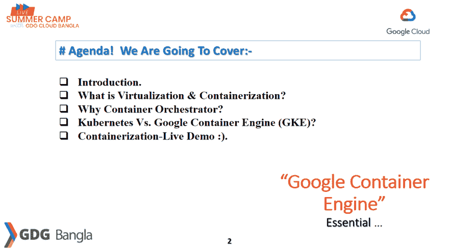
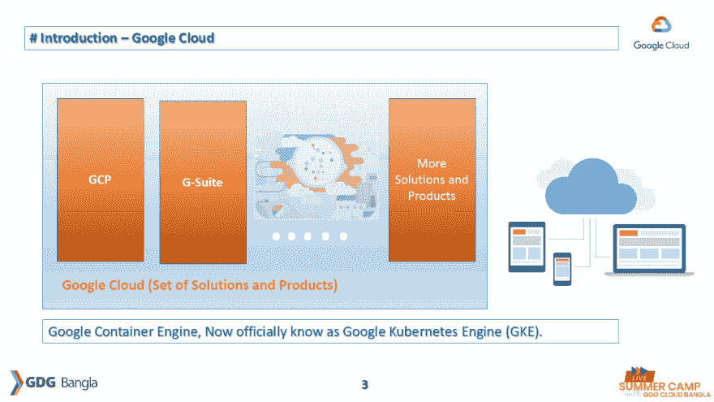
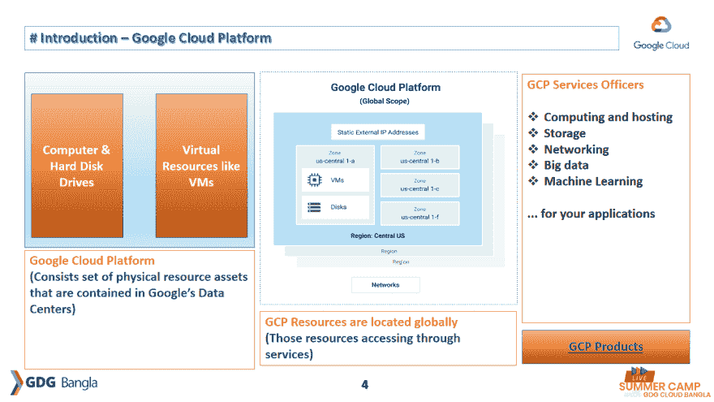
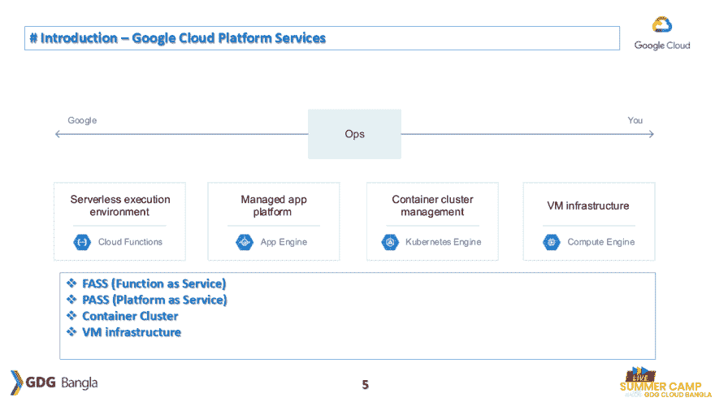
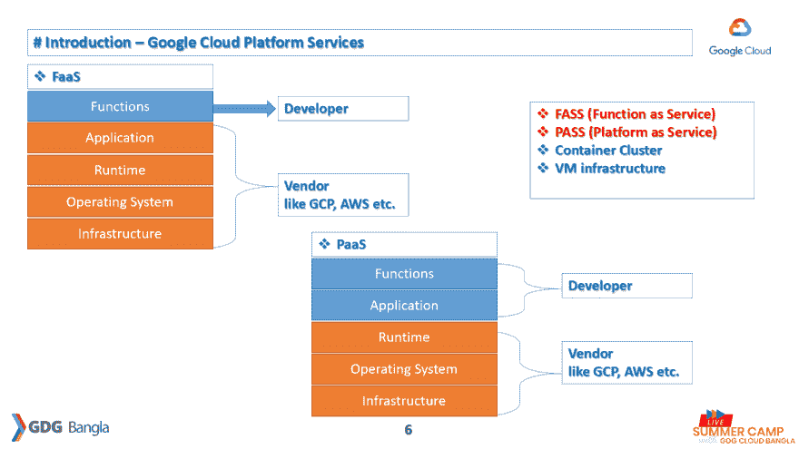
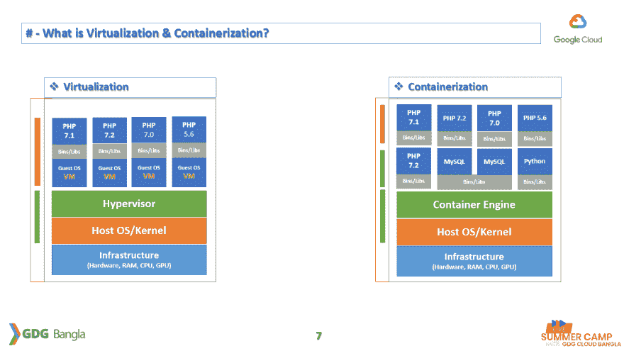
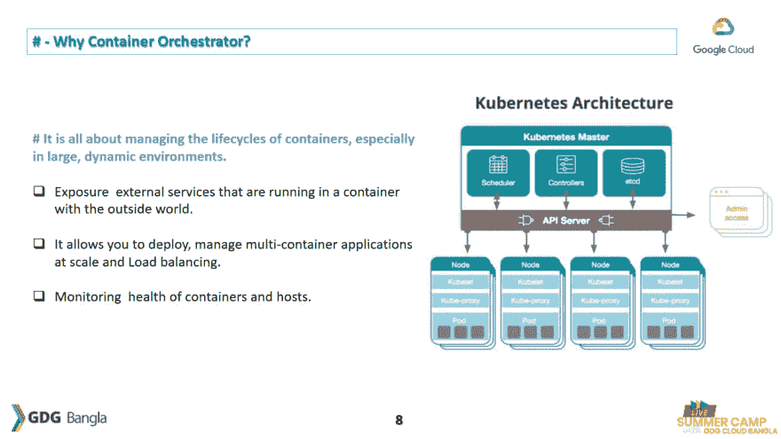
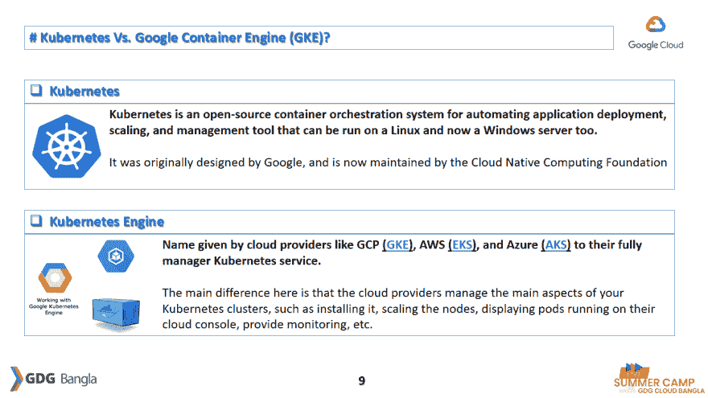
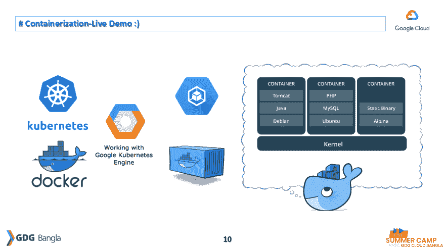

# Google 容器引擎“基本”——GDGBangla

> 原文：<https://dev.to/mesadhan/google-container-engine-essential-5j>

## [在线直播环节](https://www.youtube.com/watch?v=NoFVDnkHmLs)

[](https://res.cloudinary.com/practicaldev/image/fetch/s--e_LO1_L0--/c_limit%2Cf_auto%2Cfl_progressive%2Cq_auto%2Cw_880/https://github.com/mesadhan/gdg-bangla-workshop/raw/master/slide/Slide1.PNG)

[](https://res.cloudinary.com/practicaldev/image/fetch/s--51pX6KYf--/c_limit%2Cf_auto%2Cfl_progressive%2Cq_auto%2Cw_880/https://github.com/mesadhan/gdg-bangla-workshop/raw/master/slide/Slide2.PNG)

[](https://res.cloudinary.com/practicaldev/image/fetch/s--E_Nf2IGV--/c_limit%2Cf_auto%2Cfl_progressive%2Cq_auto%2Cw_880/https://github.com/mesadhan/gdg-bangla-workshop/raw/master/slide/Slide3.PNG)

[](https://res.cloudinary.com/practicaldev/image/fetch/s--BBESfFci--/c_limit%2Cf_auto%2Cfl_progressive%2Cq_auto%2Cw_880/https://github.com/mesadhan/gdg-bangla-workshop/raw/master/slide/Slide4.PNG)

[](https://res.cloudinary.com/practicaldev/image/fetch/s--DIJ6WHp7--/c_limit%2Cf_auto%2Cfl_progressive%2Cq_auto%2Cw_880/https://github.com/mesadhan/gdg-bangla-workshop/raw/master/slide/Slide5.PNG)

[](https://res.cloudinary.com/practicaldev/image/fetch/s--PrrJJO0t--/c_limit%2Cf_auto%2Cfl_progressive%2Cq_auto%2Cw_880/https://github.com/mesadhan/gdg-bangla-workshop/raw/master/slide/Slide6.PNG)

[](https://res.cloudinary.com/practicaldev/image/fetch/s--vSxJ7tKW--/c_limit%2Cf_auto%2Cfl_progressive%2Cq_auto%2Cw_880/https://github.com/mesadhan/gdg-bangla-workshop/raw/master/slide/Slide7.PNG)

[](https://res.cloudinary.com/practicaldev/image/fetch/s--IExExJKi--/c_limit%2Cf_auto%2Cfl_progressive%2Cq_auto%2Cw_880/https://github.com/mesadhan/gdg-bangla-workshop/raw/master/slide/Slide8.PNG)

[](https://res.cloudinary.com/practicaldev/image/fetch/s--03DwGG81--/c_limit%2Cf_auto%2Cfl_progressive%2Cq_auto%2Cw_880/https://github.com/mesadhan/gdg-bangla-workshop/raw/master/slide/Slide9.PNG)

[](https://res.cloudinary.com/practicaldev/image/fetch/s--FQ-ncJDQ--/c_limit%2Cf_auto%2Cfl_progressive%2Cq_auto%2Cw_880/https://github.com/mesadhan/gdg-bangla-workshop/raw/master/slide/Slide10.PNG)

[](https://res.cloudinary.com/practicaldev/image/fetch/s--KbWzt3V1--/c_limit%2Cf_auto%2Cfl_progressive%2Cq_auto%2Cw_880/https://github.com/mesadhan/gdg-bangla-workshop/raw/master/slide/Slide12.PNG)

## 参考文献:

*   [谷歌云概述](https://cloud.google.com/docs/overview)
*   [产品](https://cloud.google.com/products)
*   [云平台服务](https://cloud.google.com/docs/overview/cloud-platform-services)
*   [Kubernetes-基础知识](https://kubernetes.io/docs/tutorials/kubernetes-basics)
*   [Docker 下载](https://www.docker.com/products/docker-desktop)
*   坞站枢纽

# 运行并测试现场演示应用程序

*   [ ]首先安装 Docker 应用程序。
*   [ ]现在，遵循以下步骤，

> 下载应用程序

```
$ git clone https://github.com/mesadhan/blog-gdg-bangla.git 
```

Enter fullscreen mode Exit fullscreen mode

> 在后台运行单个命令中的多容器

```
$ docker-compose up -d 
```

Enter fullscreen mode Exit fullscreen mode

> 安装库、迁移应用程序表和种子数据

```
$ docker-compose run --rm blog-gdg-bangla composer install
$ docker-compose run --rm blog-gdg-bangla php artisan migrate:fresh --seed 
```

Enter fullscreen mode Exit fullscreen mode

> 打开你的浏览器，检查你的申请结果
> 
> *   本地主机:8000
> *   [localhost:8000/getName](http://localhost:8000/getName)
> 
> 停止运行多容器

```
$ docker-compose down 
```

Enter fullscreen mode Exit fullscreen mode

> 谢谢大家。！