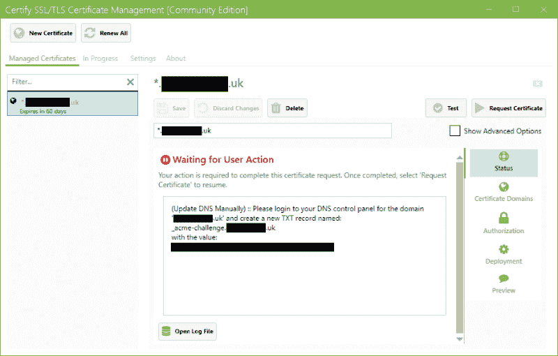
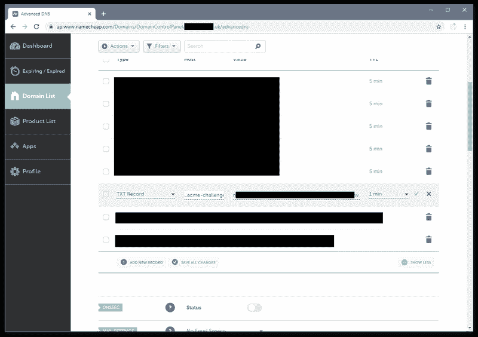

# 澄清“让我们加密”的 DNS 挑战的一点困惑

> 原文：<https://dev.to/jermdavis/clearing-up-a-little-confusion-with-let-s-encrypt-s-dns-challenges-216h>

我爱[让我们加密](https://letsencrypt.org/)。多年来，我一直在我所有的个人项目中使用 SSL。在他们出现之前，我一直使用自签名证书，并手动将我自己的根证书添加到我使用我的站点的所有机器上。而[带来了一些乐趣](https://jermdavis.wordpress.com/2016/10/31/banging-my-head-against-git-visual-studio-15-and-ssl/) …所以当工具相当好地支持 Windows 时，我急切地转向 Let's Encrypt，并为自己设置了一个证书，多个[San](https://en.wikipedia.org/wiki/Subject_Alternative_Name)通过它们的“HTTP proofs”机制进行认证，这一切都工作得很好，尽管我不得不为我只希望通过端口 443 访问的站点公开端口 80 有点痛苦。

但我最近意识到，他们现在提供通配符证书，这将使我的生活更简单，而且现在对基于 DNS 的所有权证明提供了体面的支持。所以最近我试着把我的服务器转移到这种模式上——出现了一点摩擦。不过完全是 [PEBCAK](https://en.wiktionary.org/wiki/PEBCAK) 所以我把它写下来，以便下次我忘记 DNS 是如何工作的 [](https://res.cloudinary.com/practicaldev/image/fetch/s--fumfYCPq--/c_limit%2Cf_auto%2Cfl_progressive%2Cq_auto%2Cw_880/https://s0.wp.com/wp-content/mu-plugins/wpcom-smileys/twemoji/2/72x72/1f609.png)

作为 Windows 服务器的用户， [Certify](https://certifytheweb.com/) 客户端是设置这类事情最简单的方法。所以我从下载最新的实例开始——这很容易。

在那里，您可以为“*.yourdomain.com”申请新证书。你还必须告诉它你正在使用 DNS 挑战。根据您的 DNS 提供商，您可能很幸运地支持使用质询数据自动更新 DNS。这在一个域中对我有效，这个域是通过 [CloudFlare](https://www.cloudflare.com/) 托管的。但是它在另一个领域对我不可用——这是我有点困惑的地方。

如果您的 DNS 提供商不支持自动化，您必须选择“手动”更新机制…然后，当您请求证书时，Certify 会告诉您需要创建的 TXT 记录。您会从 UI 和日志中得到类似这样的内容:

[](https://jermdavis.files.wordpress.com/2019/08/certify.png)T3】

```
2019-06-22 14:24:06.261 +01:00 [INF] DNS: (Update DNS Manually) :: Please login to your DNS control panel for the domain '\*.mydomain.co.uk' and create a new TXT record named: \_acme-challenge.mydomain.co.uk with the value:a-ELrRGO72uAYDPxb8YpyzDrHkC8n71Yc67sW7HX1bX 
```

Enter fullscreen mode Exit fullscreen mode

因此，您登录到您的 DNS 提供商，并将这些值复制/粘贴到一个 TXT 记录中…

## 除了没有…

不要犯我最初犯的愚蠢错误——记住 DNS 是如何工作的…

您没有登录到您的 DNS 门户并将“_acme-challenge.mydomain.co.uk”粘贴到新的 TXT 记录的名称字段中，而是在您的域“mydomain.co.uk”下创建了一个名为“_acme-challenge”的 TXT 记录:

[](https://jermdavis.files.wordpress.com/2019/08/dns.png)

回想起来似乎非常明显，但这让我措手不及，因为似乎有些 DNS 提供商会认识到这里的错误，并删除新 TXT 记录名称的 DNS 后缀。例如，Cloudflare 就明智地认识到了这个错误。但有些人不会，包括我的另一个供应商。

如果您确实犯了这个复制/粘贴错误，那么 Let's Encrypt 验证将不起作用，因为它将无法找到“正确的”TXT 记录。然后你会花半个小时仔细比较挑战值，想知道你是不是弄错了随机的一串废话…

下次一定记得不要犯这个错误 [](https://res.cloudinary.com/practicaldev/image/fetch/s--fumfYCPq--/c_limit%2Cf_auto%2Cfl_progressive%2Cq_auto%2Cw_880/https://s0.wp.com/wp-content/mu-plugins/wpcom-smileys/twemoji/2/72x72/1f609.png)