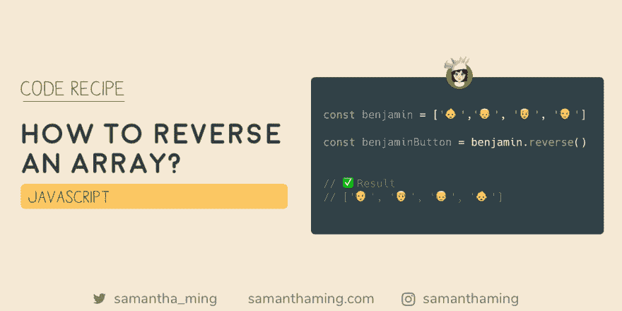

# CodeRecipe:如何在 JavaScript 中反转数组

> 原文：<https://dev.to/samanthaming/coderecipe-how-to-reverse-an-array-in-javascript-m58>

[](https://res.cloudinary.com/practicaldev/image/fetch/s--VG8syFEw--/c_limit%2Cf_auto%2Cfl_progressive%2Cq_auto%2Cw_880/https://thepracticaldev.s3.amazonaws.com/i/uz3sfvhdouqbctz7h0q4.png)

如果你需要颠倒数组元素的顺序，这里有一个代码配方。可以使用数组方法，“reverse()”⏪

尝试一个叫做#CodeRecipes 的新节目。我想涵盖我经常谷歌的问题。这些食谱你绝对应该放在手边，因为问题不在于“是否”使用，而在于“何时”使用😉

```
const benjamin = ['👶','👦', '👨', '👴'];

const benjaminButton = benjamin.reverse();

console.log(benjaminButton);
// ['👴', '👨', '👦', '👶'] 
```

## 修改原数组

需要注意的一点是，它改变了原始数组。

```
const originalArray = ['a', 'b', 'c'];
const newArray = originalArray.reverse();

console.log(originalArray); // [ 'c', 'b', 'a' ]
console.log(newArray); // [ 'c', 'b', 'a' ] 
```

## 如何在不改变原阵列的情况下反转阵列

这里有一些不会改变原始数组的方法。让我们来看看👀

### [T3 使用`slice`和`reverse`](#using-raw-slice-endraw-and-raw-reverse-endraw-)

```
const originalArray = ['a', 'b', 'c'];
const newArray = originalArray.slice().reverse();

console.log(originalArray); // ['a', 'b', 'c']
console.log(newArray); // [ 'c', 'b', 'a' ] 
```

### [T3 使用`spread`和`reverse`](#using-raw-spread-endraw-and-raw-reverse-endraw-)

```
const originalArray = ['a', 'b', 'c'];
const newArray = [...originalArray].reverse();

console.log(originalArray); // ['a', 'b', 'c']
console.log(newArray); // [ 'c', 'b', 'a' ] 
```

### [T3 使用`reduce`和`spread`](#using-raw-reduce-endraw-and-raw-spread-endraw-)

```
const originalArray = ['a', 'b', 'c'];
const newArray = originalArray.reduce((accumulator, value) => {
  return [value, ...accumulator]
}, []);

console.log(originalArray); // ['a', 'b', 'c']
console.log(newArray); // [ 'c', 'b', 'a' ] 
```

### [T3 使用`reduceRight`和`spread`](#using-raw-reduceright-endraw-and-raw-spread-endraw-)

```
const originalArray = ['a', 'b', 'c'];
const newArray = originalArray.reduceRight((accumulator, value) => {
  console.log(value);
  return [...accumulator, value]
}, []);

console.log(originalArray); // ['a', 'b', 'c']
console.log(newArray); // [ 'c', 'b', 'a' ] 
```

或者使用`push`

```
const originalArray = ['a', 'b', 'c'];
const newArray = originalArray.reduceRight((accumulator, value) => {
  accumulator.push(value);
  return accumulator;
}, []);

console.log(originalArray); // ['a', 'b', 'c']
console.log(newArray); // [ 'c', 'b', 'a' ] 
```

## 社区输入

*[@aminnair](https://dev.to/aminnairi/comment/e9o4) :* 我决定测试另一种思考方式。以下是结果:

```
with slice and reverse: 83.085ms
With one loop: 309.763ms 
```

源代码和测试可在[这里](https://repl.it/repls/AromaticAgitatedProfessionals)获得

## 资源

*   [MDN Web 文档:反向](https://developer.mozilla.org/en-US/docs/Web/JavaScript/Reference/Global_Objects/Array/reverse)
*   [w3schools:反向](https://www.w3schools.com/jsref/jsref_reverse.asp)
*   [堆栈溢出:在不改变原始数组的情况下在 Javascript 中反转数组](https://stackoverflow.com/questions/30610523/reverse-array-in-javascript-without-mutating-original-array)

* * *

**感谢阅读❤**
问好！[insta gram](https://www.instagram.com/samanthaming/)|[Twitter](https://twitter.com/samantha_ming)|[脸书](https://www.facebook.com/hisamanthaming) | [博客](https://www.samanthaming.com/blog)|[SamanthaMing.com](https://www.samanthaming.com/)