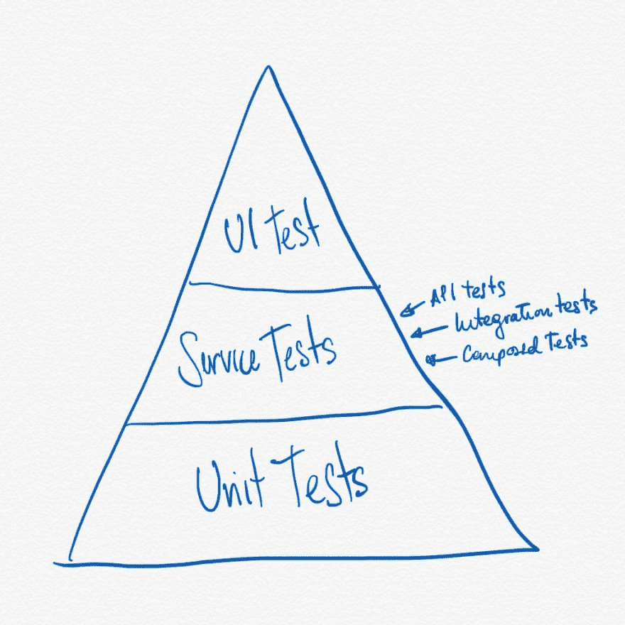

# Android-∞你在写什么测试？(1)

> [https://dev . to/devpicon/Android-por-por-no-these-writing-tests-1-4 CLL](https://dev.to/devpicon/android-por-que-no-estas-escribiendo-tests-1-4cll)

<figure> 

<figcaption>图片由 [@devpicon](https://dev.to/devpicon)</figcaption>

</figure>

### Android──你在写什么测试？(1)

#### 干净，可考

是一个年复一年的反复出现的话题:很多开发者不为他们的应用编写【T1 测试】【测试】，原因可能各不相同:从懂得怎么写【T2 测试】【T3 测试】到*总会有不写*测试*的理由。*

而且相反，总会有很好的理由写下考试。

1.  *测试*总会使你的代码更可靠，提高你对你所计划的东西确实达到目的的信心。
2.  使用*测试*将有助于您了解随后引入的任何更改是否会破坏您的应用程序的任何其他功能。
3.  避免在没有*测试*时通常存在的代码维护工作。时间就是金钱。

在本文的第一篇文章中，我将详细阐述一些在尝试将*test*引入代码为 *legacy* 的应用程序时要考虑的理论部分和一些准则。

#### 【我可以做我的代码】*？*

 *虽然在生活中你时常听到关于*测试*及其令人印象深刻的内容，但我认为很少有人真正指导你找到一个过程，使你的代码*可以测试*。

<figure> 

<figcaption>考试金字塔</figcaption>

</figure>

让我们从一些基本的东西开始，你们可能已经看过□□□□□□□□□□□□□□□□□□□□□测试金字塔□□□□□□□□□□□□□□□□□□□□□□

> *是一个比喻，它使我们把软件测试分组为不同粒度的块。它还为我们提供了我们在这些小组中应该掌握多少证据的想法。尽管 los _ tests _ pyramid 的概念已经存在了很长时间，但团队仍然在如何实施该概念上遇到困难。—_ 实际测试金字塔(自由翻译)*

 *为了不深入讨论金字塔，图可以解释如下:

_ unit tests-_ base 由单元测试组成；这些费用较低，如果我们必须优先编写证据，则应在这一组中进行，主要是因为对框架和代码库没有强有力的依赖。

*服务测试──介质块不仅指测试服务；这实际上意味着测试应用程序组件和不同层之间的集成。努力的优先级为中等，这意味着开发这些测试的优先级低于 los _unit tests* 。

_ user interface tests-_ 最后，UI 测试位于我们的金字塔顶端。UI 测试的开发会变得复杂，具体取决于我们测试的应用程序。从比例上讲，在许多情况下，测试的数量将少于其他层。

#### 我们从□

一个好的起点是开始写*单元测试*(单元测试)。这些测试旨在验证我们的编程单元(类)的功能行为和逻辑。

正如我们先前所讨论的那样，人们普遍认为，每个人都知道如何做到这一点，因此，通常没有为实现这些目标指明道路，但这一次，我们将制定一些方针，然后将其转化为今后的一系列任务。

1.  功能和类至少要符合一些坚实的原则: ***【单一责任】*** (简单责任)，其中提到一类应该对我们的应用中的一部分承担责任； ***【接口分离】*** (接口分离)，这意味着可以在多个抽象中而不是单个抽象中定义多个功能， ***【依赖反转】***【依赖反转】
2.  当一个类或函数不符合上述条件时，它将是开始重构的良好理由，一开始我们不会对应用程序设计作出重大更改，而是开始将具有多个责任的功能划分为单个责任。这样，我们将把我们的逻辑划分为较小的函数，甚至将它们移至其他类。
3.  我们的*单元测试*将遵循*给出-Then* 的结构，这是我们从 BDD 借用的结构，其表现如下:**(*给出*我们的状态当(*当*对具有一组参数的函数执行或调用动作时；于是(*那么*我们应该得到**的结果。
4.  如果我们做好了第 2 点所指的重构，我们可以*打卡*任何我们想测试的类依赖项。当我指的是*时，我指的是，任何依存关系都可以把它们充气或与自己的具体化结合使用抽象来创造它们。*

 *考虑到这一点，我将在下一篇文章中把这些准则翻译成更实际的练习。

#### 参考文献

*   实用测试金字塔—[https://Martin fowler . com/articles/Practical-Test-Pyramid . html](https://martinfowler.com/articles/practical-test-pyramid.html)
*   https://martinfowler.com/bliki/GivenWhenThen.html
*   固体原理:解释和例子—[https://it next . io/SOLID-Principles-解释和例子—715 b 975 dcad 4](https://itnext.io/solid-principles-explanation-and-examples-715b975dcad4)

* * ****