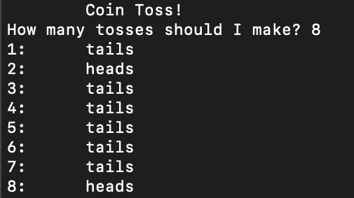
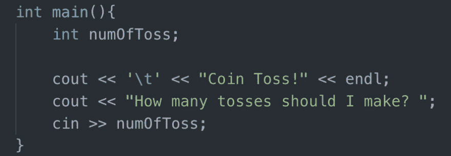
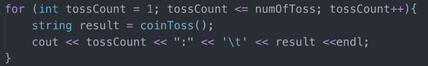
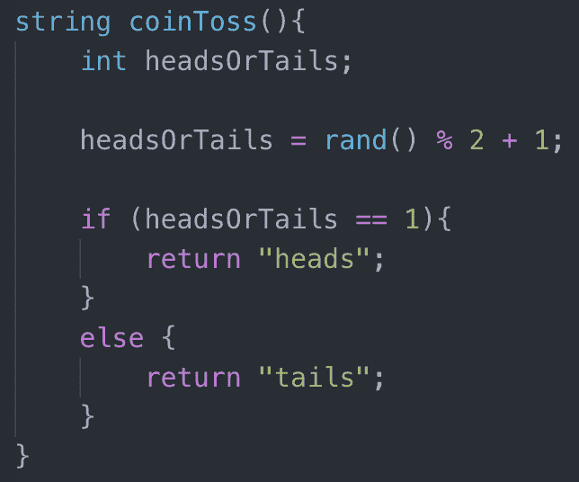
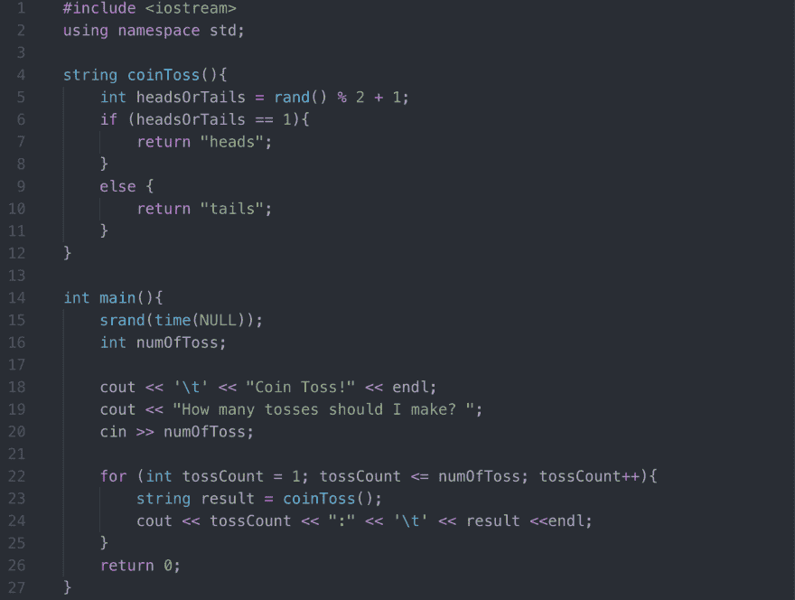

# 用 C++创建一个基本的控制台抛硬币游戏

> 原文：<https://dev.to/maytd/creating-a-basic-console-coin-toss-in-c-13p9>

这是一个小程序，可以模拟用户指定的掷硬币次数。它随机产生数字 1 和 2。当生成的数字是 1 时，它将显示“正面”,当生成的数字是 2 时，它将显示“反面”。很简单。预期的输出应该是这样的:

首先，让我们问用户，用户想要掷多少次硬币。
[T3】](https://res.cloudinary.com/practicaldev/image/fetch/s--YT_TJpNk--/c_limit%2Cf_auto%2Cfl_progressive%2Cq_auto%2Cw_880/https://thepracticaldev.s3.amazonaws.com/i/f2cxebozxv6465r24w7r.png)

现在我们有了一个数字，我们知道在哪里停止我们的循环！对于每一次迭代，我们将模拟一次掷硬币，并将结果记录到控制台中。让我们创建另一个名为 coinToss 的函数，该函数将“投掷硬币”以使我们的代码更整洁一些。
[T3】](https://res.cloudinary.com/practicaldev/image/fetch/s--nokhyB_G--/c_limit%2Cf_auto%2Cfl_progressive%2Cq_auto%2Cw_880/https://thepracticaldev.s3.amazonaws.com/i/7m5gqrmlicjwii4hkcxh.png)

这是所有真正的行动发生的地方。在 coinToss 函数中，我们需要一个 1 或 2 的数字，所以我们将使用 rand()，它将为我们随机生成一个数字。将随机数的范围设置为介于 1 和 2 之间。不要忘记，为了使用 rand()，您还需要使用 srand(time(NULL))。一旦我们有了一个随机数，我们需要确保 1 给我们“正面”，2 给我们“反面”。
[T3】](https://res.cloudinary.com/practicaldev/image/fetch/s--lwnNtLgR--/c_limit%2Cf_auto%2Cfl_progressive%2Cq_auto%2Cw_880/https://thepracticaldev.s3.amazonaws.com/i/mu27dhb56dukat7bf29m.png)

程序应该随机返回一串“正面”或“反面”，直到达到用户指定的投掷硬币数。仅此而已！您刚刚创建了一个抛硬币模拟器。整个程序是这样的:
