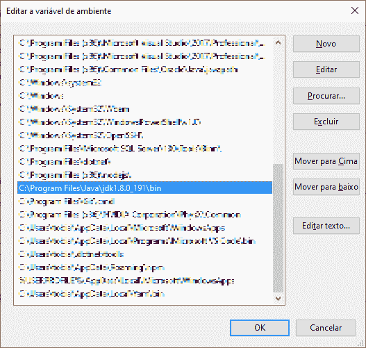
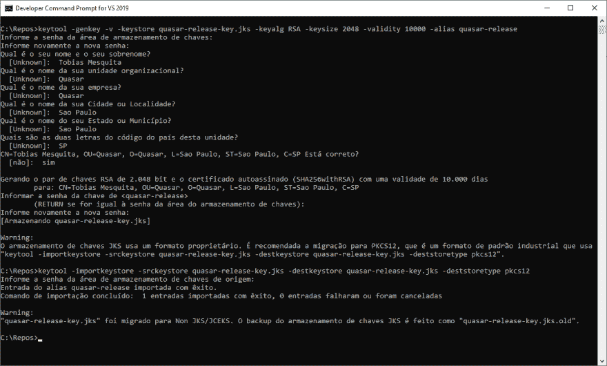
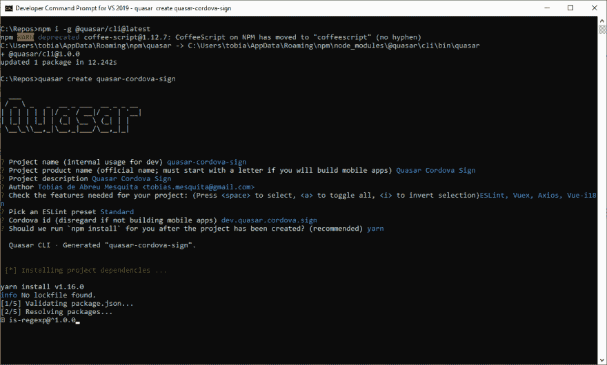
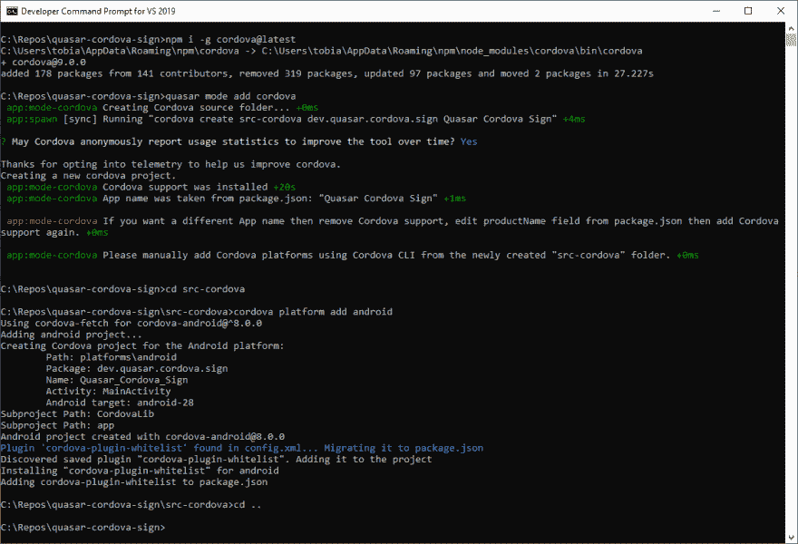
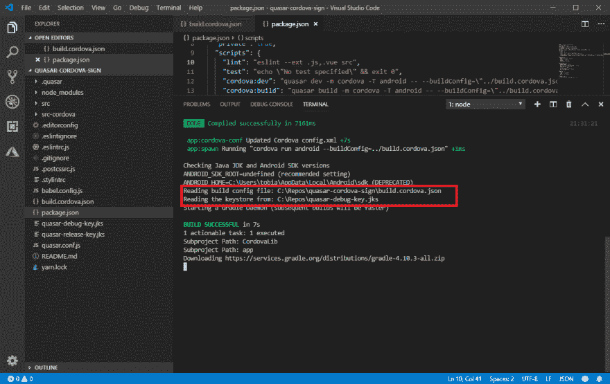
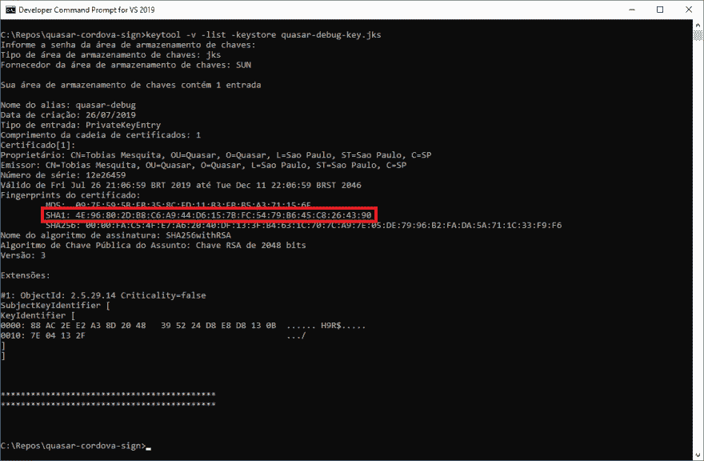

# 类星体——建造中的 APK

> 原文：<https://dev.to/tobymosque/quasar-sign-a-apk-while-building-2447>

# 0。观察-我是一名 Windows 开发人员

这篇文章是由一个对基于 Unix 的操作系统(Linux，Mac)了解不多的 Windows 开发人员写的。但是如果你是 Linux/Mac 开发者，我希望这不会阻止你阅读这篇文章。

# 1。介绍

在过去的几个月里，我注意到许多开发者对如何在`Quasar`的帮助下签署由`Cordova`生成的 APK 有疑问。当他们最终能够做到时，最大的抱怨是他们花在做所有必需的手工工作上的时间。

许多人没有注意到的是，在用`quasar dev/build`构建时，可以将额外的选项传递给`Cordova`，这打开了一个可能性的范围。

# 2。创建密钥库

我们的第一步是创建密钥库本身。将使用不止一个，而是两个密钥库。一个用于开发环境，另一个用于发布环境。但是要做到这一点，我们需要安装 JDK 并在您的`Path`中配置您的 bin 目录。

[](https://res.cloudinary.com/practicaldev/image/fetch/s--cssicuLs--/c_limit%2Cf_auto%2Cfl_progressive%2Cq_auto%2Cw_880/https://thepracticaldev.s3.amazonaws.com/i/0ls9o5qonrdgpnrh9abo.png)

运行以下命令:

```
keytool -genkey -v -keystore quasar-release-key.jks -keyalg RSA -keysize 2048 -validity 10000 -alias quasar-release
keytool -importkeystore -srckeystore quasar-release-key.jks -destkeystore quasar-release-key.jks -deststoretype pkcs12
keytool -genkey -v -keystore quasar-debug-key.jks -keyalg RSA -keysize 2048 -validity 10000 -alias quasar-debug
keytool -importkeystore -srckeystore quasar-debug-key.jks -destkeystore quasar-debug-key.jks -deststoretype pkcs12 
```

<svg width="20px" height="20px" viewBox="0 0 24 24" class="highlight-action crayons-icon highlight-action--fullscreen-on"><title>Enter fullscreen mode</title></svg> <svg width="20px" height="20px" viewBox="0 0 24 24" class="highlight-action crayons-icon highlight-action--fullscreen-off"><title>Exit fullscreen mode</title></svg>

[](https://res.cloudinary.com/practicaldev/image/fetch/s--6uIiEdoU--/c_limit%2Cf_auto%2Cfl_progressive%2Cq_auto%2Cw_880/https://thepracticaldev.s3.amazonaws.com/i/pjae0h626d59fn93iktg.png)

# 3。带有科尔多瓦模式的 Quasar 项目

> 如果您已经熟悉了`@quasar/cli`并且已经知道如何创建一个项目并添加`cordova mode`，您可以安全地跳过下面的部分。

确保您使用的是最新版本的`@quasar/cli` :

```
npm i -g @quasar/cli@latest 
```

<svg width="20px" height="20px" viewBox="0 0 24 24" class="highlight-action crayons-icon highlight-action--fullscreen-on"><title>Enter fullscreen mode</title></svg> <svg width="20px" height="20px" viewBox="0 0 24 24" class="highlight-action crayons-icon highlight-action--fullscreen-off"><title>Exit fullscreen mode</title></svg>

所以运行下面的命令来创建一个新项目:

```
quasar create quasar-cordova-sign
cd quasar-cordova-sign 
```

<svg width="20px" height="20px" viewBox="0 0 24 24" class="highlight-action crayons-icon highlight-action--fullscreen-on"><title>Enter fullscreen mode</title></svg> <svg width="20px" height="20px" viewBox="0 0 24 24" class="highlight-action crayons-icon highlight-action--fullscreen-off"><title>Exit fullscreen mode</title></svg>

[](https://res.cloudinary.com/practicaldev/image/fetch/s--yD2T-9iW--/c_limit%2Cf_auto%2Cfl_progressive%2Cq_auto%2Cw_880/https://thepracticaldev.s3.amazonaws.com/i/ounjk0py0vy3z1gdsn6p.png)

现在是时候安装或更新`cordova`到最新版本:

```
npm i -g cordova@latest 
```

<svg width="20px" height="20px" viewBox="0 0 24 24" class="highlight-action crayons-icon highlight-action--fullscreen-on"><title>Enter fullscreen mode</title></svg> <svg width="20px" height="20px" viewBox="0 0 24 24" class="highlight-action crayons-icon highlight-action--fullscreen-off"><title>Exit fullscreen mode</title></svg>

最后，将 Android 平台添加到您的项目:

```
quasar mode add cordova
cd src-cordova
cordova platform add android
cd .. 
```

<svg width="20px" height="20px" viewBox="0 0 24 24" class="highlight-action crayons-icon highlight-action--fullscreen-on"><title>Enter fullscreen mode</title></svg> <svg width="20px" height="20px" viewBox="0 0 24 24" class="highlight-action crayons-icon highlight-action--fullscreen-off"><title>Exit fullscreen mode</title></svg>

[](https://res.cloudinary.com/practicaldev/image/fetch/s--3hEYr4Rd--/c_limit%2Cf_auto%2Cfl_progressive%2Cq_auto%2Cw_880/https://thepracticaldev.s3.amazonaws.com/i/segxllu2tl6k4y8i34ms.png)

# 4。链接密钥库

现在我们需要创建一个`json configuration file`，我们称之为 **build.cordova.json** 。

```
{  "android":  {  "debug":  {  "keystore":  "../quasar-debug-key.jks",  "storePassword":  "*********",  "alias":  "quasar-debug",  "password"  :  "*********",  "keystoreType":  "jks"  },  "release":  {  "keystore":  "../quasar-release-key.jks",  "storePassword":  "*********",  "alias":  "quasar-release",  "password"  :  "*********",  "keystoreType":  "jks"  }  }  } 
```

<svg width="20px" height="20px" viewBox="0 0 24 24" class="highlight-action crayons-icon highlight-action--fullscreen-on"><title>Enter fullscreen mode</title></svg> <svg width="20px" height="20px" viewBox="0 0 24 24" class="highlight-action crayons-icon highlight-action--fullscreen-off"><title>Exit fullscreen mode</title></svg>

所以，我们需要将 **build.cordova.json** 、 **quasar-debug-key.jks** 和 **quasar-release-key.jks** 移动到项目的根目录下。不要忘记将它们包含在**中。gitignore**

[](https://res.cloudinary.com/practicaldev/image/fetch/s--4L59jLt_--/c_limit%2Cf_auto%2Cfl_progressive%2Cq_auto%2Cw_880/https://thepracticaldev.s3.amazonaws.com/i/25izqe2f98n653o9xz2w.png)

# 5。运转

我们需要修改 **package.json** 的**脚本**部分，以便添加两个脚本: **cordova:dev** 和 **cordova:build**

```
{  "scripts":  {  "lint":  "eslint --ext .js,.vue src",  "test":  "echo \"No test specified\" && exit 0",  "cordova:dev":  "quasar dev -m cordova -T android -- --buildConfig=\"../build.cordova.json\"",  "cordova:build":  "quasar build -m cordova -T android -- --buildConfig=\"../build.cordova.json\""  }  } 
```

<svg width="20px" height="20px" viewBox="0 0 24 24" class="highlight-action crayons-icon highlight-action--fullscreen-on"><title>Enter fullscreen mode</title></svg> <svg width="20px" height="20px" viewBox="0 0 24 24" class="highlight-action crayons-icon highlight-action--fullscreen-off"><title>Exit fullscreen mode</title></svg>

现在，不是运行`quasar dev`或`quasar build`，而是分别运行`yarn cordova:dev`或`yarn cordova:build`。

```
yarn cordova:dev 
```

<svg width="20px" height="20px" viewBox="0 0 24 24" class="highlight-action crayons-icon highlight-action--fullscreen-on"><title>Enter fullscreen mode</title></svg> <svg width="20px" height="20px" viewBox="0 0 24 24" class="highlight-action crayons-icon highlight-action--fullscreen-off"><title>Exit fullscreen mode</title></svg>

[](https://res.cloudinary.com/practicaldev/image/fetch/s--mXZvPd93--/c_limit%2Cf_auto%2Cfl_progressive%2Cq_auto%2Cw_880/https://thepracticaldev.s3.amazonaws.com/i/dmygjyymst77zr108nxz.png)

# 6。发现密钥库的指纹。

我们的项目已经运行和签署(甚至在调试期间)，但如果你打算将你的应用程序与其他应用程序集成(如谷歌或脸书)，他们将要求你的应用程序/证书的指纹。

为了发现我们的应用程序的指纹，我们将运行下面的命令:

```
keytool -v -list -keystore quasar-debug-key.jks
keytool -v -list -keystore quasar-release-key.jks 
```

<svg width="20px" height="20px" viewBox="0 0 24 24" class="highlight-action crayons-icon highlight-action--fullscreen-on"><title>Enter fullscreen mode</title></svg> <svg width="20px" height="20px" viewBox="0 0 24 24" class="highlight-action crayons-icon highlight-action--fullscreen-off"><title>Exit fullscreen mode</title></svg>

[](https://res.cloudinary.com/practicaldev/image/fetch/s--EOcBNrQx--/c_limit%2Cf_auto%2Cfl_progressive%2Cq_auto%2Cw_880/https://thepracticaldev.s3.amazonaws.com/i/tqfpt2jkglhietlo33nm.png)

你会看到这样的东西:

```
Debug:   4E:96:80:2D:B8:C6:A9:44:D6:15:7B:FC:54:79:B6:45:C8:26:43:90
Release: 60:64:04:26:71:71:B4:AA:BC:1F:68:EC:2D:0B:59:06:A3:E5:2F:81 
```

<svg width="20px" height="20px" viewBox="0 0 24 24" class="highlight-action crayons-icon highlight-action--fullscreen-on"><title>Enter fullscreen mode</title></svg> <svg width="20px" height="20px" viewBox="0 0 24 24" class="highlight-action crayons-icon highlight-action--fullscreen-off"><title>Exit fullscreen mode</title></svg>