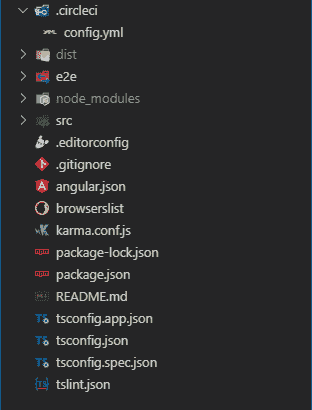

# 角度项目的 CircleCI 测试配置

> 原文：<https://dev.to/obinnaogbonnajoseph/circle-ci-test-configuration-for-angular-projects-1o2p>

保持项目无 bug 的最好方法之一是通过测试套件，但是很容易忘记一直运行测试。持续集成(CI)服务器允许您设置您的项目存储库，以便您的测试在每个提交和请求时运行。

[CircleCI](https://www.circleci.com) 是一个付费服务，但是对于开源项目是免费提供的。你可以在 Github 上创建一个公共项目，不需要付费就可以添加 CircleCI。

* * *

> ## is the CircleCI configuration item

*   在项目根目录 [](https://res.cloudinary.com/practicaldev/image/fetch/s--EMA3CoMO--/c_limit%2Cf_auto%2Cfl_progressive%2Cq_auto%2Cw_880/https://thepracticaldev.s3.amazonaws.com/i/25q2wjrw27un8mdujzph.png) 下创建一个名为`.circleci`的文件夹

*   在新文件夹中，创建一个名为`config.yml`的文件，内容如下

```
 version: 2

    jobs:
        # The test job
        test:
            working_directory: ~/project-name
            docker:
                - image: circleci/node:10-browsers
            steps:
                # Checkout the code from the branch into the working_directory
                - checkout
                # Log the current branch
                - run:
                    name: Show current branch
                    command: echo ${CIRCLE_BRANCH}
                # Restore local dependencies from cache
                - restore_cache:
                    keys:
                    - v1-dependencies-{{ checksum "package-lock.json" }}
                    - v1-dependencies-
                # Install project dependencies
                - run:
                    name: Install local dependencies
                    command: npm install
                # Cache local dependencies if they don't exist
                - save_cache:
                    key: v1-dependencies-{{ checksum "package-lock.json" }}
                    paths:
                        - node_modules
                # Lint the source code
                - run:
                    name: Linting
                    command: npm run lint
                # Test the source code
                - run:
                    name: Testing
                    command: npm run test -- --no-watch --no-progress --browsers=ChromeHeadlessCI
                # End to End test
                - run:
                    name: End to End Test
                    command: npm run e2e -- --protractor-config=e2e/protractor-ci.conf.js 
```

<svg width="20px" height="20px" viewBox="0 0 24 24" class="highlight-action crayons-icon highlight-action--fullscreen-on"><title>Enter fullscreen mode</title></svg> <svg width="20px" height="20px" viewBox="0 0 24 24" class="highlight-action crayons-icon highlight-action--fullscreen-off"><title>Exit fullscreen mode</title></svg>

*   [在 chrome 中配置 CLI 进行测试](#configure)

*   提交您的更改并将它们推送到您的存储库中

*   [报名 Circle CI](https://circleci.com/docs/2.0/first-steps/)[添加你的项目](https://circleci.com/docs/2.0/projects/)。您的项目应该开始构建。

* * *

> Circle
> 
> ## CI configuration file

Circle CI 配置文件有 3 个主要组成部分；版本、作业列表和工作流列表。

该版本就是我们将要使用的 Circle CI 版本。

作业可以比作运行一系列命令或步骤的独立环境。你在一份工作中可以实现的共同目标包括:

*   安装运行/构建/测试项目所需的工具。
*   执行 bash 命令。
*   从 Circle CI 缓存存储或恢复项目。

工作流是管理作业的一种方式。您可能需要一个作业只在特定的分支或特定的时间运行，或者您希望一些作业并行运行，一些作业按顺序运行。工作流是您进行这些配置的地方。

在我们的例子中，我们只有一份工作；**测试工作**。这些是测试作业的属性。

*   docker 属性:指定用于创建环境容器的 docker 图像。Circle CI 附带了一个预建图像列表，您可以在此处找到

```
 docker:
        - image: circleci/node:10-browsers 
```

<svg width="20px" height="20px" viewBox="0 0 24 24" class="highlight-action crayons-icon highlight-action--fullscreen-on"><title>Enter fullscreen mode</title></svg> <svg width="20px" height="20px" viewBox="0 0 24 24" class="highlight-action crayons-icon highlight-action--fullscreen-off"><title>Exit fullscreen mode</title></svg>

*   工作目录属性:当前目录，它将是所有步骤运行的地方。

```
 working_directory: ~/project-name 
```

<svg width="20px" height="20px" viewBox="0 0 24 24" class="highlight-action crayons-icon highlight-action--fullscreen-on"><title>Enter fullscreen mode</title></svg> <svg width="20px" height="20px" viewBox="0 0 24 24" class="highlight-action crayons-icon highlight-action--fullscreen-off"><title>Exit fullscreen mode</title></svg>

*   步骤属性:这是您希望在当前作业中运行的步骤(命令)的列表。

```
 steps
        # Checkout the code from the branch into the working_directory
        # Log the current branch
        # Restore local dependencies from cache 
```

<svg width="20px" height="20px" viewBox="0 0 24 24" class="highlight-action crayons-icon highlight-action--fullscreen-on"><title>Enter fullscreen mode</title></svg> <svg width="20px" height="20px" viewBox="0 0 24 24" class="highlight-action crayons-icon highlight-action--fullscreen-off"><title>Exit fullscreen mode</title></svg>

我们将在配置中使用几种类型的步骤。

*   **签出**步骤:用于将代码从当前分支签出到工作目录。

```
 - checkout 
```

<svg width="20px" height="20px" viewBox="0 0 24 24" class="highlight-action crayons-icon highlight-action--fullscreen-on"><title>Enter fullscreen mode</title></svg> <svg width="20px" height="20px" viewBox="0 0 24 24" class="highlight-action crayons-icon highlight-action--fullscreen-off"><title>Exit fullscreen mode</title></svg>

*   **运行**步骤:用于执行 bash 命令。您可以指定将在 Circle CI 界面中看到的描述性名称

```
 - run:
        name: Testing the project
        command: npm run test 
```

<svg width="20px" height="20px" viewBox="0 0 24 24" class="highlight-action crayons-icon highlight-action--fullscreen-on"><title>Enter fullscreen mode</title></svg> <svg width="20px" height="20px" viewBox="0 0 24 24" class="highlight-action crayons-icon highlight-action--fullscreen-off"><title>Exit fullscreen mode</title></svg>

*   **save_cache** 步骤:用于在 Circle 存储器中存储文件或目录的缓存。一个常见的用例是只安装一次 npm 依赖项，然后使用 package-lock.json(或 package.json)文件的哈希作为缓存键来缓存 node_modules 文件夹。

```
 -save_cache:
        key: v1-dependencies-{{ checksum "package-lock.json" }}
            paths:
                - node_modules 
```

<svg width="20px" height="20px" viewBox="0 0 24 24" class="highlight-action crayons-icon highlight-action--fullscreen-on"><title>Enter fullscreen mode</title></svg> <svg width="20px" height="20px" viewBox="0 0 24 24" class="highlight-action crayons-icon highlight-action--fullscreen-off"><title>Exit fullscreen mode</title></svg>

*   **restore_cache** 步骤；用于使用缓存键还原缓存项。

```
 - restore_cache:
        keys:
            - v1-dependencies-{{ checksum "package-lock.json" }}
            - v1-dependencies- 
```

<svg width="20px" height="20px" viewBox="0 0 24 24" class="highlight-action crayons-icon highlight-action--fullscreen-on"><title>Enter fullscreen mode</title></svg> <svg width="20px" height="20px" viewBox="0 0 24 24" class="highlight-action crayons-icon highlight-action--fullscreen-off"><title>Exit fullscreen mode</title></svg>

* * *

> ## Put CI job into workflow

在这种情况下，我们希望在提交开发、试运行或主分支时运行测试作业。默认情况下，推送到任何分支都会触发工作流。

测试工作流有一个`filter`属性，用来选择它将要运行的分支。代码片段如下所示

```
 workflows:
        version: 2
        # the test workflow
        test_workflow:
            jobs:
                - deploy:
                    filters:
                        branches:
                            only:
                                - develop
                                - staging
                                - master 
```

<svg width="20px" height="20px" viewBox="0 0 24 24" class="highlight-action crayons-icon highlight-action--fullscreen-on"><title>Enter fullscreen mode</title></svg> <svg width="20px" height="20px" viewBox="0 0 24 24" class="highlight-action crayons-icon highlight-action--fullscreen-off"><title>Exit fullscreen mode</title></svg>

将工作流代码片段添加到 config.yml 文件中，提交并推送您的更改。您的项目已经可以构建了。

* * *

> ## Configure CLI 【T1] for CI test in Chrome

当 CLI 命令`ng test`和`ng e2e`通常在您的环境中运行 CI 测试时，您可能仍然需要调整您的配置来运行 Chrome 浏览器测试。

按照以下步骤配置 CLI

*   在 Karma 配置文件`karma.conf.js`中，在浏览器下面添加一个名为 ChromeHeadlessCI 的自定义启动器:

```
 browsers: ['Chrome'],
    customLaunchers: {
        ChromeHeadlessCI: {
            base: 'ChromeHeadless',
            flags: ['--no-sandbox']
        }
    }, 
```

<svg width="20px" height="20px" viewBox="0 0 24 24" class="highlight-action crayons-icon highlight-action--fullscreen-on"><title>Enter fullscreen mode</title></svg> <svg width="20px" height="20px" viewBox="0 0 24 24" class="highlight-action crayons-icon highlight-action--fullscreen-off"><title>Exit fullscreen mode</title></svg>

*   在 e2e 测试项目的根文件夹中，创建一个名为`protractor-ci.conf.js`的新文件。这个新文件扩展了原来的`protractor.conf.js`

```
 const config = require('./protractor.conf').config;

    config.capabilities = {
        browserName: 'chrome',
        chromeOptions: {
            args: ['--headless', '--no-sandbox']
        }
    };

    exports.config = config; 
```

<svg width="20px" height="20px" viewBox="0 0 24 24" class="highlight-action crayons-icon highlight-action--fullscreen-on"><title>Enter fullscreen mode</title></svg> <svg width="20px" height="20px" viewBox="0 0 24 24" class="highlight-action crayons-icon highlight-action--fullscreen-off"><title>Exit fullscreen mode</title></svg>

现在，您可以运行以下命令来使用- no-sandbox 标志:

```
 ng test --no-watch --no-progress --browsers=ChromeHeadlessCI
    ng e2e --protractor -config=e2e/protractor-ci.conf.js 
```

<svg width="20px" height="20px" viewBox="0 0 24 24" class="highlight-action crayons-icon highlight-action--fullscreen-on"><title>Enter fullscreen mode</title></svg> <svg width="20px" height="20px" viewBox="0 0 24 24" class="highlight-action crayons-icon highlight-action--fullscreen-off"><title>Exit fullscreen mode</title></svg>

* * *

> ## [T2】参考文献](#references)
> 
> *   [Angle test document](https://angular.io/guide/testing#configure-project-for-circle-ci)
> *   [Free Code Camp Tutorial on CircleCI 2.0](https://www.freecodecamp.org/news/our-journey-for-using-circleci-2-0-to-build-and-deploy-an-angular-app-to-aws-s3-8e7ea3f51503/)