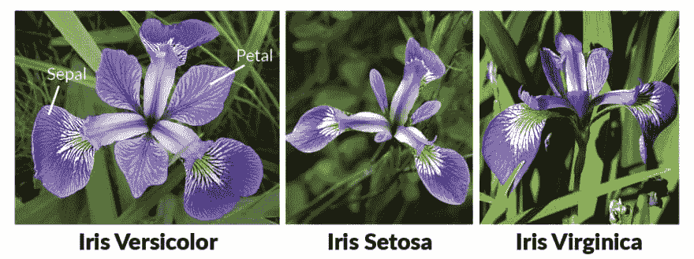
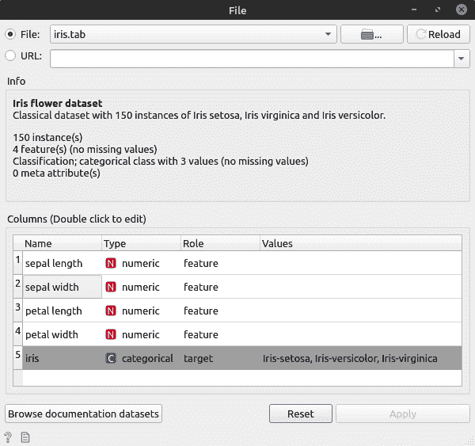
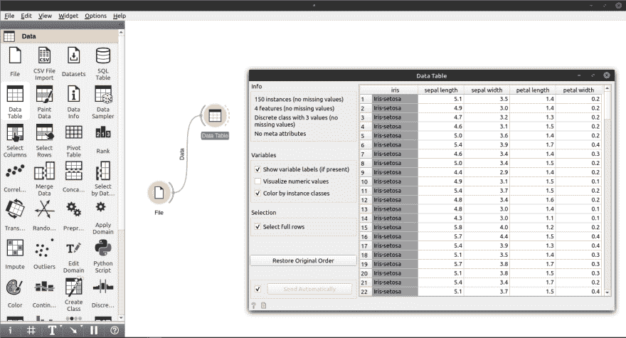
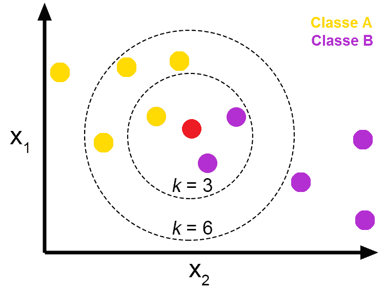
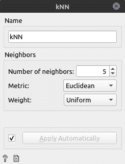
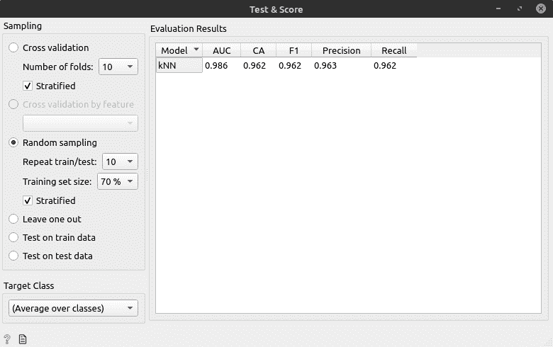
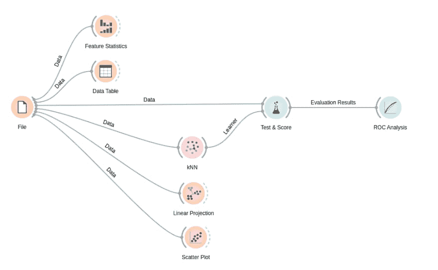

# geam-基本，Iris 分类

> 原文:# t0]https://dev . to/GUI Rodrigues/geam-basic-iris 分类-428m

# 问题

本周，我们将解决这种在数据科学和地域方面相当常见的问题，使之成为识别不同种类花(Iris)的那种。这个问题的特点是分类和监督。
 
我们将用[橙](https://orange.biolab.si/)来解决。我推荐阅读这篇优秀的文章，展示了该工具的最初步骤。

## 加载和查看数据

正如上一次会议所看到的那样，我们将加载该问题的数据集，并查看这些数据的含义。加载数据集(只需拖动小部件“*文件*”并选择该文件)时，我们可以访问有关该问题的一些相关信息:

该工具本身向我们显示，此数据集包含三种不同类型花朵的 150 个实例(行)。
此外，橙色自动识别出我们有四个*【数字】或【可变】特征，以及*【目标】*【明确】这是我们正在尝试预测的数值。Orange 向我们展示的另一个相关信息是数据集上没有缺少的数据，因此不需要鞑靼缺少的数据。*

## 浏览数据

利用表格数据可视化构件，我们对这些数据是什么有了更好的了解: 

我们可以在表达过程中使用一些图表来更好地了解这些数据之间的关系。
查看此数据的一个有趣方法是使用*散射图*小部件，该小部件位于*可视化*标签中，以便更好地了解此数据的分布情况。通过应用此构件，我们可以看到，在将*花瓣长度*特征与*花瓣宽度*以及*特征*的其他组合相关联时，我们发现了一定的分组:
T12

## 测试和评价模型

在查看数据稀疏性时，我们可以看到，鉴于功能的组合，我们需要相似的数据(相同的花类)，**往往集中在数据稀疏性的同一区域**。
这样，我们就可以使用**【kn】**(k-最近的邻居，或 k 最近的邻居)，这是**简单而相当常用的分类算法。kNN 是一种非参数化的技术，也就是说，它不会对数据的分布作出任何假设。**

 **一般来说，*kn*的操作比较简单，想象一下以下情景:
 
从本文中取出的图像[。](https://towardsdatascience.com/knn-k-nearest-neighbors-1-a4707b24bd1d)

假设黄色的球体代表一种花 a，紫色的代表一种花 b。红色球体表示一个新元素，您不确定它是 a 型还是 b 型。

为了识别这种新元素的类型，我们可以使用*kn*并检查它属于哪个组。
*kn*将要做的是计算新物体与散布在笛卡尔平面上的*最近的物体(邻居)之间的距离。该距离是通过计算欧几里得距离(或其他距离:汉明、曼哈顿)计算得出的-我...。)在对象之间。变量 *k* 表示新对象的邻居数量。定义了一定的 *k* (例如 3)后，该算法将检查新元素与最近的三个元素之间的距离，从而得到新对象最接近的类。
以图片为例，如果把 *k* 视为三，则红色球体离紫色球体更近，因此被归类为紫色类。但是，如果把“半径”扩大，把 *k* 定义为 6，那么实际上这个新对象就更像黄色类了。据我放在本文末尾的视频作者介绍，理想的做法是用 *k = Logn* 获得更高的精度。其中 *n* 是基座的尺寸。理想〔t20〕k〔t21〕应该是奇数。*

 *### 阿普利卡多

让我们从“*模型”(*model)标签中获取构件*kn*，并定义一些特征来解决我们的问题:

*   首先，我们定义了 *k* ，邻居的数量:
*   接下来，我们定义测量结果，即距离计算类型:
    *   **欧几里得**计算笛卡尔平面上两点之间的距离(我们将要使用的)。
    *   曼哈顿，马克西姆和马哈拉安诺比斯；(你在这里找到这些指标)
*   最后，要使用的重量:
    *   **【制服】**，对所有邻居应用同样的权重(我们将使用什么)；
    *   距离，离邻居越近，他的影响越大，他的体重；

接下来，我们将使用*功能**测试&评分*** 标签*对*进行评估，将*kn*的应用结果与文件数据连接起来。
我们将选择*随机抽样*选项。所以，让我们随机将数据分为*训练*和*测试*的样本，以确定比例为例:70:30。在这个选项之上，我们选择了这个过程要重复多少次。
在设置这些设置时，我们可以访问模型输出。

## 完成

*   尝试改变邻居的 *k* 号，以识别*测试&评分*中信息的变异；
*   在*测试&评分*中，您可以更改正在分析的类，默认情况下橙色分析所有类的平均值。如果改为*【iris-setosa】*，你会发现它由于出现在较为狭窄的地区而具有惊人的精度。
*   更改视图小部件(如线性投影和散布打印)的设置，以了解数据的分布方式。
*   最后我加入了 *ROC Analysis* 小部件，以图形方式展示了模型在不同类别中的加速度；

## 最终结果

## 参考文献

*   [关于 kNN 算法的非常有趣的文章](https://inferir.com.br/artigos/algoritimo-knn-para-classificacao/)
*   橙色小部件及其使用文档
*   [介绍 kn(较大)](https://www.youtube.com/watch?v=zvmbB3315Ko)的视频
*   [介绍 kn(摘要)T1 的视频]](https://www.youtube.com/watch?v=gJK4fmCvcWY)
*   [解释算法的另一篇相当有趣的文章](https://blog.usejournal.com/a-quick-introduction-to-k-nearest-neighbors-algorithm-62214cea29c7)***