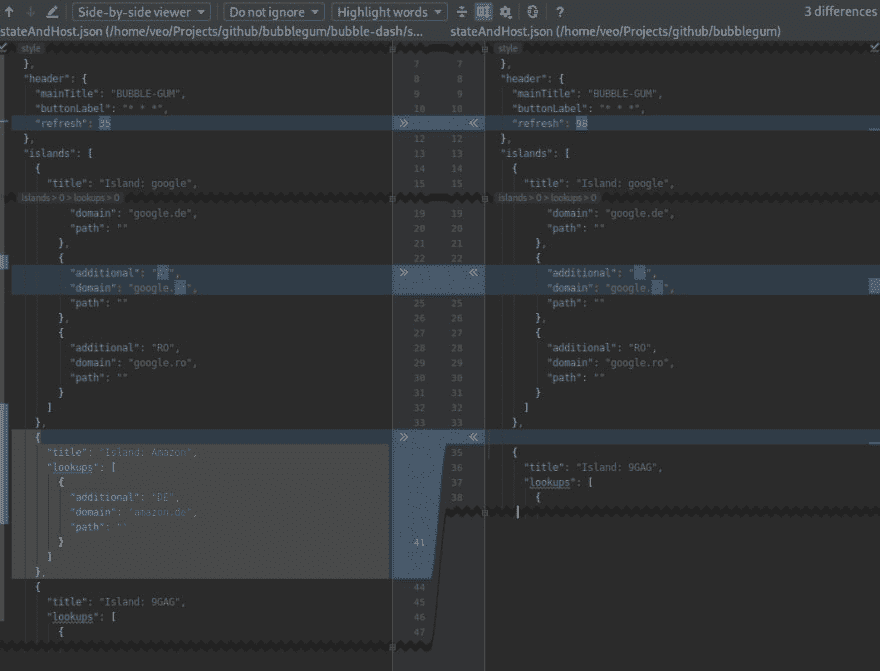

# MacOS 的 Meld 替代方案

> 原文：<https://dev.to/realvorl/meld-alternative-for-macos-2ohk>

## 但是为什么呢？

我最近*"不得不"*从 PC 转到 Mac，因为缺乏微软对他们协作软件的支持，我指的是 Office 365、Skype for Business，当然还有微软团队。

现在，虽然有一些*【hacky】*方法来解决这些*【限制】*当有一个日常驱动程序是运行 Linux 的 PC 时，公司政策不允许这样的事情。

这就是为什么我选择用 Mac 取代我心爱的 PC，我认为 Mac OS 的 Unix DNA 将确保我的 Linux 工作流能够在过渡中存活下来。

😥叹气😥

## 现在怎么办？

没那么糟糕，我能够达到我的主要目标:从 Microsoft native 运行所需的应用程序，并利用 Mac Book Pros 硬件，但我现在面临一个新问题:**我必须为我在 Linux 操作系统和环境中习惯的软件找到替代品**。

我认为，我找到的第一个好的解决方案是替代令人敬畏的工具**，因为在我写这篇文章的时候， *Mac OS 端口*还没有完成，并且从源代码构建不是我想作为 **noob** 来做的事情**

 **

所以我打算使用**的**社区版**，它提供了很多我日常使用的东西，我很高兴它提供了一个很棒的 diff 工具，可以处理**文件**和**文件夹**。**

 **## 我为什么喜欢。

Jet Brains 在其所有产品中内置的最酷的功能是 OMNI 搜索或全球搜索，这使得查找索引内容变得容易，然后选择我想要比较的候选内容:

`tap SHIFT twice`
`type the filename`
`select file 1`
`repeat and select file 2`
T4】

## 还有什么？

当然，它比仅仅用于*融合*的东西有用得多，下面是它带来的其他东西(也有它没有的):

| 特征 | 社区版 |
| --- | --- |
| 许可证 | 开源的 Apache 2.0 |
| Java，Kotlin，Groovy，Scala | ✔ |
| 机器人 | ✔ |
| 梅文，度数，SBT | ✔ |
| Git, SVN, Mercurial | ✔ |
| 不得已 | ✘ |
| JavaScript，类型脚本 | ✘ |
| Java EE，Spring，Play，Grails，其他... | ✘ |
| 数据库工具，SQL | ✘ |
| 检测重复项 | ✘ |

但这并不意味着它仅限于这些，驱动 IDE 的插件系统是一个有用的宝库，您可以探索，比如:

> 
> 
> 
> 
> `. . .`
> 
> 

## 结论

这是一个**解决方案**我将在某个时候构建 **MELD** 并将其添加到我的工具箱中。虽然我可以在终端上使用`diff`和`diff3`,但我确实喜欢在使用 GUI 进行合并时得到的帮助，IntelliJ 并不打算用作命令行工具。

小心比较，

维奥。****