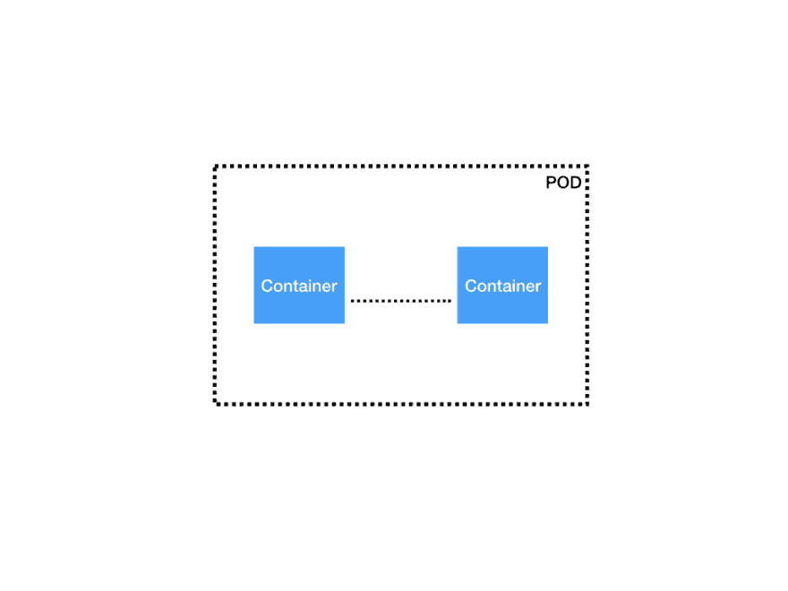
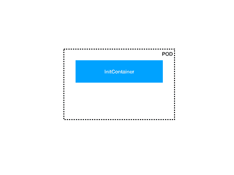
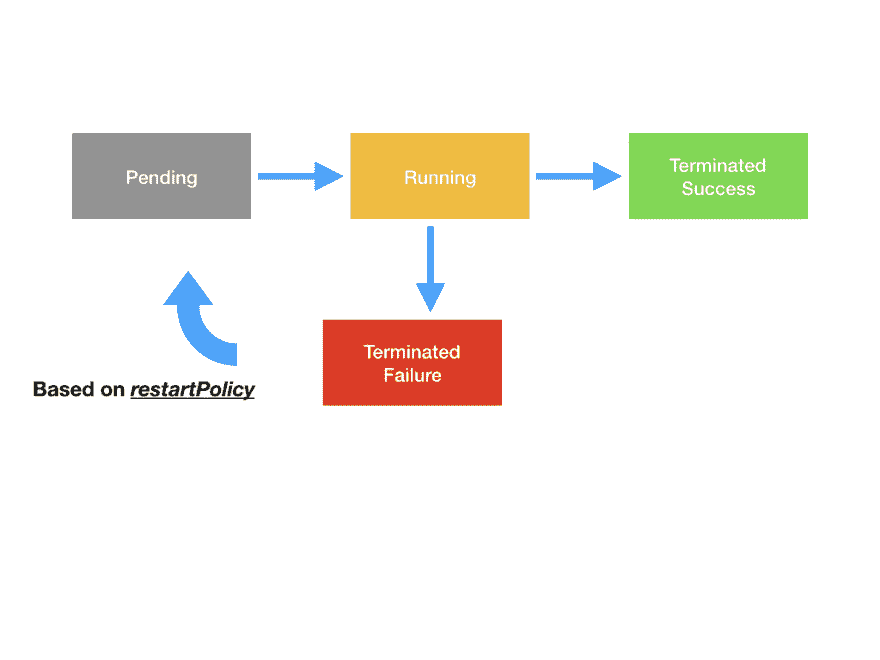
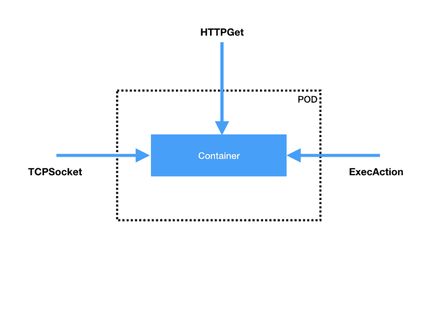

# 什么是魔方？☸️💡🎉

> 原文：<https://dev.to/sendilkumarn/what-is-a-pod-in-kubernetes-5e8b>

# 豆荚

> Pod 是 Kubernetes 应用程序的基本执行单元，是您创建或部署的 Kubernetes 对象模型中最小和最简单的单元。

我们将定义一个“Hello World”pod。我们将用一个`yaml`文件来定义它。我们将定义`apiVersion`并指示 Kubernetes 对象的`kind`(如 Pod、部署、服务等)。,).

```
apiVersion: v1
kind: Pod 
```

然后，我们必须为我们正在创建的 Pod 指定一些标识符。这些被称为`metadata`。`metadata`对象保存 pod 的名称和标识 pod 的任何标签。

```
metadata:
  name: hello-world
  labels:
    app: hello 
```

我们需要定义将在 Pod 中运行的容器。一个 pod 内部可以包含一个或多个容器。我们可以在`spec`对象中定义它们。

```
spec:
  containers:
  - name: hello-world-container
    image: busybox
    command: ['sh', '-c', 'echo  Hello  World!  &&  sleep  3600'] 
```

这与 Docker 定义更相似，只是关键字不同。但是它所做的只是从存储库中获取`busybox`图像并运行指定的命令。在运行映像时，它还将容器命名为`hello-world-container`。

[](https://res.cloudinary.com/practicaldev/image/fetch/s--8q6BeVt1--/c_limit%2Cf_auto%2Cfl_progressive%2Cq_auto%2Cw_880/https://thepracticaldev.s3.amazonaws.com/i/bpgn65e0fp83v1lxqhhy.jpeg)

## 但是为什么是豆荚而不是容器呢？

有时我们需要在两个不同的容器之间共享资源。它们需要在没有任何延迟的情况下相互连接。让它们在一个有凝聚力的环境中共存是可取的。我们将在一个容器中添加这些容器。Kubernetes 还试图在同一个网络名称空间中调度这些容器。这使得他们可以轻松地分享和交流。

pod 中的这些共享容器具有以下优势:

1.  它们使用`localhost`相互通信。
2.  它们共享存储卷
3.  他们形成了一个团结的服务单位。

点击查看更多关于豆荚[的信息](https://kubernetes.io/docs/concepts/workloads/pods/pod-overview/)

* * *

## Init 和 App 容器

Kubernetes 对 pod 进行调度，并在集群内部运行它们。有时我们需要在容器启动前运行一些东西。

例如，我们需要在数据库启动后才启动应用程序。我们将使用`initContainers`。

[](https://res.cloudinary.com/practicaldev/image/fetch/s--v6f8YQTY--/c_limit%2Cf_auto%2Cfl_progressive%2Cq_66%2Cw_880/https://thepracticaldev.s3.amazonaws.com/i/7sluvf9dajw7mhm5v72c.gif)T3】

```
apiVersion: v1
kind: Pod
metadata:
  name: hello-world
  labels:
    app: hello
spec:
  containers:
  - name: hello-world-container
    image: busybox
    command: ['sh', '-c', 'echo  Hello  World!  &&  sleep  3600']
  initContainers:
  - name: mysql-container
    image: busybox
    command:
      - '/bin/sh'
      - '-c'
      - |
          while true
          do
            rt=$(nc -z -w 1 hello-mysql 3306) 
            if [ $? -eq 0 ]; then
              echo "DB is UP"
              break
            fi
            echo "DB is not yet reachable;sleep for 10s before retry"
            sleep 10
          done 
```

`initContainers`类似于`containers`。在这里，我们使用另一个`busybox`容器，等待`hello-mysql` pod 启动并运行。这个`hello-mysql`舱看起来像这样。

```
apiVersion: v1
kind: Deployment
metadata:
  name: hello-mysql
spec:
  volumes:
    - name: data
      emptydir: {}
  containers:
  - name: mysql
    image: mysql
    env:
    - name: MYSQL_USER
      value: root
    - name: MYSQL_ALLOW_EMPTY_PASSWORD
      value: 'yes'
    - name: MYSQL_DATABASE
      value: 'some-app'
  ports:
  - containerPort: 3306
---
apiVersion: v1
kind: Service
metadata:
  name: hello-mysql
spec:
  selector:
    app: hello-mysql
  ports:
  - port: 3306 
```

以上定义由一个`deployment`和`service`组成。我们稍后将探讨它们。但是`Deployment`的模板更类似于`Pod`的模板。

`initContainers`启动一个 busybox 容器，等待它返回成功。一旦`DB is UP`、`appContainers`或`containers`启动。

更多关于`initContainers` [这里](https://kubernetes.io/docs/concepts/workloads/pods/init-containers/)。

* * *

## 豆荚生命周期

每个 pod 都有一个`status`对象。`status`对象持有`phase`字段。

> 该阶段并不旨在成为容器或 Pod 状态观察的综合汇总，也不旨在成为综合状态机。

[](https://res.cloudinary.com/practicaldev/image/fetch/s--4bW0qaGq--/c_limit%2Cf_auto%2Cfl_progressive%2Cq_auto%2Cw_880/https://thepracticaldev.s3.amazonaws.com/i/3kfhr014pwme691k7yqm.jpeg)

当 Kubernetes 控制器要求调度程序创建 pod 时。调度程序将为创建安排 pod。控制器决定是否需要创建 pod。调度程序将要求 kubelets 从存储库中下载容器映像。然后通过网络下载。在此阶段，豆荚处于`Pending`阶段。

下载完容器后，pod 将被分配到 Kubernetes 集群中的一个节点。并且集装箱开始运行。容器是否正确启动并运行所有需要的过程并不重要，Kubernetes 会将`Running`阶段分配给 pod。

在 Kubernetes 的世界里，所有的容器最终都会被终止。它们要么成功终止，要么失败。

处于阶段`Succeeded`的 pod 表示它被成功终止，并且永远不会重新启动。

以`failure`结束的 pod 将以`Failed`相位结束。

有时，Kubernetes 主节点将无法与正在运行的 pod 连接。这些豆荚标有`Unknown`阶段。

Kubernetes 的主要优势是它能够自动重启容器。我们可以将这种行为定义为带有`restartPolicy`字段的 pod。`restartPolicy`接受任一`Always | onFailure | Never`。默认值为`Always`。也就是说，只要 pod 以`failed`状态终止，Kubernetes 系统就会尝试重启 pod。

* * *

## 探查一下

运行容器时，容器可能正在运行，但 Kubernetes 无法确认应用程序是否正常工作。为此，我们需要定期检查容器中的端点或应用程序是否正确响应。Kubernetes 提供了三种类型的处理程序，它们将探测容器并确保它处于正确和预期的状态。

[](https://res.cloudinary.com/practicaldev/image/fetch/s--l7hmhzUc--/c_limit%2Cf_auto%2Cfl_progressive%2Cq_auto%2Cw_880/https://thepracticaldev.s3.amazonaws.com/i/0qnfowu4ri1vj1o0fq6j.jpeg)

处理程序是:

1.  执行
2.  TCPSocketAction
3.  http 操作

它们很容易理解。它们允许我们通过在容器内部执行命令来进行探测，分别检查 TCP 连接或 HTTP 请求。

探测可以导致`Success` | `Failure` | `Unknown`。

但是了解什么时候探测是很重要的。例如，在前面的数据库示例中。我们一直等到数据库启动。在此期间，任何检查应用的探针都是不可能的。所以 Kubernetes 探针必须用两种探针来检查运行中的容器。它们是:

1.  活性探针
2.  readinessProbe

**就绪探测**

就绪探测器探测容器，直到容器就绪。这是所有的初始任务，如`initContainers`运行。仅当`readinessProbe`成功时，pod 才可用。

假设您的应用程序有一个`health`端点。这表明了应用程序的健康状况。

```
readinessProbe:
   httpGet:
     path: hello-world/health
     port: http
   initialDelaySeconds: 20
   periodSeconds: 15
   failureThreshold: 6 
```

上述 readinessProbe 指定在指定的路径`hello-world/health`上执行`HTTPGetAction`。最初等待 20 秒钟，用`initialDelaySeconds`开始探测。然后每隔 15 秒(`periodSeconds`)探测集装箱是否准备就绪。

这里的`failureThreshold`指定只有在连续收到 6 条失败消息后，才发布状态为`failure`。

**livenessProbe**

livenessProbe 指示容器是否为`running`。当探针出现故障时，容器被关闭，然后容器根据`restartPolicy`重新启动。

```
livenessProbe:
 httpGet:
   path: hello-world/health
   port: http
 initialDelaySeconds: 120 
```

这里，活性探针检查与上述相同的端点，但是它仅在 120 秒的初始延迟之后才开始检查活性。

* * *

## 局限性

豆荚里有容器。限制它可以利用的`memory`和`cpus`的数量对我们来说非常重要。

> CPU 和内存统称为计算资源，或简称为资源。

```
resources:
  requests:
    memory: "512Mi"
    cpu: "500m"
  limits:
    memory: "1Gi"
    cpu: "1" 
```

这里我们指定 pod 被允许请求内存的`512Mi`和总可用 CPU 的 0.5%的`500m`。

`limits`指定 pod 允许的最大内存和 CPU。当内存溢出时，Kubernetes 简单地根据 restartPolicy 重启 pod。

在这里给出适当的值并有效地分配内存和 CPU 是非常重要的。

> 我们还可以在 pod 或容器级别定义资源。

* * *

希望这能让你对 Kubernetes 的`Pods`有一个简要的了解。点击 [kubernetes.io](https://kubernetes.io) 获取更多关于 kubernetes 的信息。

想要了解 Kubernetes 的全貌及其工作原理，请查看[这篇](https://sendilkumarn.com/blog/kubernetes-for-everyone)帖子。

现在，您想在 Kubernetes 上部署一个示例应用程序，并使用 Istio 来查看[这篇](https://dev.to/sendilkumarn/easy-microservices-with-kubernetes-and-istio-3nl3)文章。

你可以在推特上关注我。

如果你喜欢这篇文章，请留下赞或评论。❤️