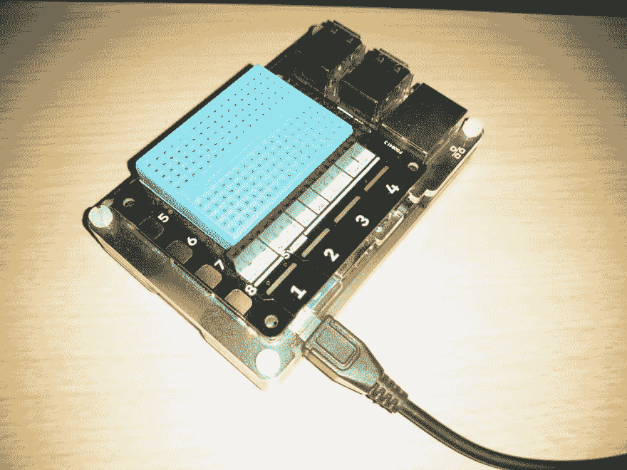
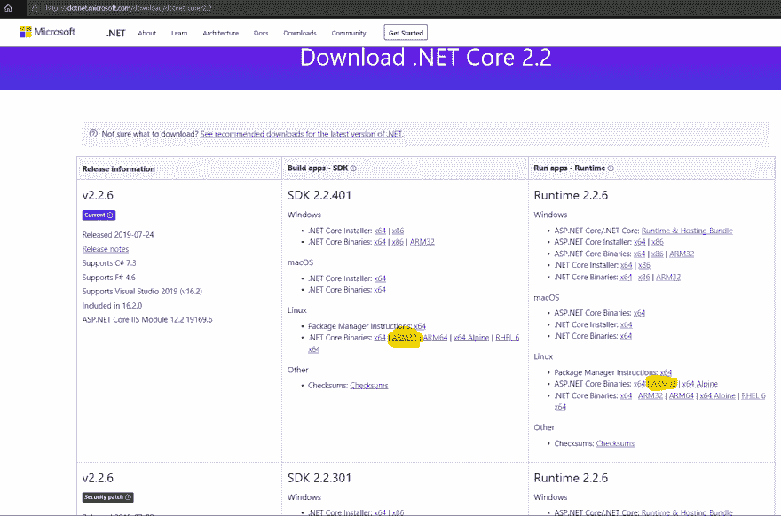
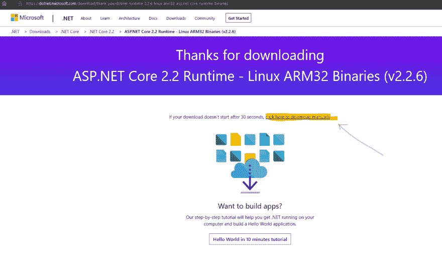

# 使用 Visual Studio 代码对使用. NET Core 的 Raspberry Pi (ARM)进行远程调试(第 1 部分)

> [https://dev . to/kash/remote debug-with-visual-studio-code-contra-una-raspberry-pi-arm-using-net-core-part-1-4kpe](https://dev.to/kash/depuracion-remota-con-visual-studio-code-contra-una-raspberry-pi-arm-usando-net-core-parte-1-4kpe)

## 导言

在各种情况下，我一直带着[【raspberry pi】](https://www.raspberrypi.org/)、[【esp-32】](https://www.espressif.com/en/products/hardware/esp32/overview)等各种各样的牛以及其中的一些补品，而我意识到，要么我写些东西，要么我在需要的时候几乎记不起任何东西

此帖子及其后续内容(大约 3 或 4 个帖子，尚不清楚该系列将持续多久)的目的是记录“[”visual studio 代码“](https://code.visualstudio.com/)”的配置，以便用“[net core“](https://dotnet.microsoft.com/)”针对 Raspberry Pi (3 model B+)进行开发，从而对自身进行远程调试

*   [系统。设备. Gpio](https://www.nuget.org/packages/System.Device.Gpio)
*   [Iot。设备绑定](https://www.nuget.org/packages/Iot.Device.Bindings)

具体来说，本文将介绍如何在 raspbian 操作系统上的微型 PC 上安装. NET Core，这并不是一件小事-我...。

## 硬件

对于整个邮件系列，将使用以下硬件:

*   您可以在其中舒适地使用 Visual Studio 程式码的电脑。我已经在 Windows 和 Linux 上测试过了，但我怀疑 Mac 也应该可以
*   [Raspberry Pi 3 Model B+](https://www.amazon.es/Raspberry-Pi-Modelo-Quad-Core-Cortex-A53/dp/B01CD5VC92/ref=sr_1_5?adgrpid=55370211799&gclid=Cj0KCQjwhdTqBRDNARIsABsOl9_XuV-11w1ou5v2E8CJSscBMwfcuj8J_InfQMlVR0yHqltFcVEcIS8aAvjhEALw_wcB&hvadid=275352942953&hvdev=c&hvlocphy=1005548&hvnetw=g&hvpos=1t1&hvqmt=b&hvrand=340737966009266941&hvtargid=aud-611252828140%3Akwd-297141455894&hydadcr=23141_1737717&keywords=raspberry+pi+3+official&qid=1565878317&s=gateway&sr=8-5) 用操作系统 [raspbian](https://www.raspbian.org/) (我通常用[noos](https://www.raspberrypi.org/downloads/noobs/)安装)
*   [pimporoni explorer hat pro](https://www.amazon.es/Pimoroni-PIM082-Explorer-HAT-Pro/dp/B00WWQ20MG/ref=sr_1_2?__mk_es_ES=%C3%85M%C3%85%C5%BD%C3%95%C3%91&keywords=Pimoroni+Explorer+Hat&qid=1565878434&refinements=p_85%3A831314031&rnid=831276031&rps=1&s=gateway&sr=8-2):这不是远程调试演示本身所需要的，但它已经在家了，并且在玩 led、引擎、传感器等游戏时简化了一些对电子一无所知的计算机小玩意，比如我-我...。

[](https://res.cloudinary.com/practicaldev/image/fetch/s--h3gOjXAH--/c_limit%2Cf_auto%2Cfl_progressive%2Cq_auto%2Cw_880/https://user-images.githubusercontent.com/10654401/63101233-e88c4b80-bf78-11e9-87ff-20e7a2809c40.png)

## 在 Raspberry Pi 上安装. NET 核心 SDK

我摘录了 Scott Hanselman 的这篇帖子中的步骤[，因此我将这些步骤整理如下:](https://www.hanselman.com/blog/InstallingTheNETCore2xSDKOnARaspberryPiAndBlinkingAnLEDWithSystemDeviceGpio.aspx)

1.  从命令行在 Raspberry Pi 上安装一些必需的软件包(前提条件，一次)

    ```
    sudo apt-get install curl libunwind8 gettext 
    ```

2.  现在，我们将获得在 raspbian 上安装. NET 所需的二进制文件。从任何 internet 浏览器中，导航至以下 URL:https://dot net . Microsoft . com/download/dot net-core/2.2

    *   请注意，您只能修改 URL (/2.1、/2.0)的结尾部分，才能使用旧版(或更高版本)的. NET Core-我...。）
3.  访问 SDK 的 arm 32 para linux 二进制文件下载链接，以及要安装的特定版本的 ASP.NET 核心运行时(如果不开发 WEB/WEB API 应用程序，则不需要后者)-我...。
    [](https://res.cloudinary.com/practicaldev/image/fetch/s--tXXEGW4J--/c_limit%2Cf_auto%2Cfl_progressive%2Cq_auto%2Cw_880/https://user-images.githubusercontent.com/10654401/63222589-45bb1380-c1aa-11e9-8e8f-d5336754777f.png)

4.  对于其中的每一个，你都会登陆这样的网页，在那里你必须复制到文本 ***【点击此处手动下载】***
    的链接

5.  将两个压缩文件下载到 raspberry pi

    ```
    wget https://download.visualstudio.microsoft.com/download/pr/3cb1d917-19cc-4399-9a53-03bb5de223f6/be3e011601610d9fe0a4f6b1962378ea/dotnet-sdk-2.2.401-linux-arm.tar.gz
    wget https://download.visualstudio.microsoft.com/download/pr/13798f38-c14e-4944-83c9-4f5b7c535f4d/1e1c3414f3ad791098d1f654640f9bcf/aspnetcore-runtime-2.2.6-linux-arm.tar.gz 
    ```

6.  将这两个文件解压缩到主目录的 dotnet 目录中。**如果你没有像我一样降下来**的话好好看看版本。它还设置操作系统查找. NET 二进制文件(DOTNET_ROOT 和 PATH)所需的变量。

    ```
    mkdir -p $HOME/dotnet
    tar zxf dotnet-sdk-2.2.401-linux-arm.tar.gz -C $HOME/dotnet
    tar zxf aspnetcore-runtime-2.2.6-linux-arm.tar.gz -C $HOME/dotnet
    export DOTNET_ROOT=$HOME/dotnet 
    export PATH=$PATH:$HOME/dotnet 
    ```

7.  . NET Core 应该已经安装并准备好在 Raspberry Pi 上。运行命令`dotnet --info`(请注意，SDK 和 ASP.NET 核心运行时均已安装版本 2.2 和 2.1):

    ```
    pi@harlequin:~ $ dotnet --info
    .NET Core SDK (reflecting any global.json):
    Version:   2.2.401
    Commit:    729b316c13

    Runtime Environment:
    OS Name:     raspbian
    OS Version:  9
    OS Platform: Linux
    RID:         linux-arm
    Base Path:   /home/pi/dotnet/sdk/2.2.401/

    Host (useful for support):
    Version: 2.2.6
    Commit:  7dac9b1b51

    .NET Core SDKs installed:
    2.1.801 [/home/pi/dotnet/sdk]
    2.2.401 [/home/pi/dotnet/sdk]

    .NET Core runtimes installed:
    Microsoft.AspNetCore.All 2.1.12 [/home/pi/dotnet/shared/Microsoft.AspNetCore.All]
    Microsoft.AspNetCore.All 2.2.6 [/home/pi/dotnet/shared/Microsoft.AspNetCore.All]
    Microsoft.AspNetCore.App 2.1.12 [/home/pi/dotnet/shared/Microsoft.AspNetCore.App]
    Microsoft.AspNetCore.App 2.2.6 [/home/pi/dotnet/shared/Microsoft.AspNetCore.App]
    Microsoft.NETCore.App 2.1.12 [/home/pi/dotnet/shared/Microsoft.NETCore.App]
    Microsoft.NETCore.App 2.2.6 [/home/pi/dotnet/shared/Microsoft.NETCore.App]

    To install additional .NET Core runtimes or SDKs:
    https://aka.ms/dotnet-download 
    ```

[在下一个帖子](https://dev.to/kash/depuracion-remota-con-visual-studio-code-contra-una-raspberry-pi-arm-usando-net-core-parte-2-4l4d)中，我们将看到如何在 PC 上方便地准备和编译. NET 核心控制台应用程序，并将其部署到 Raspberry Pi 中。