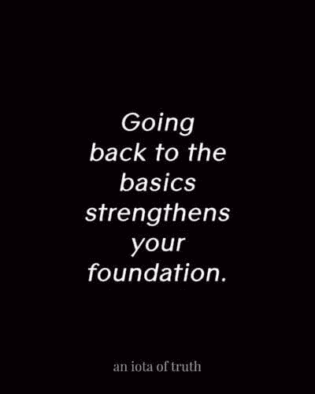

# 你“真的”了解 JavaScript 吗？

> 原文：<https://dev.to/nodeicode/do-you-really-know-javascript-1dl3>

# JavaScript？

JavaScript 是增长最快的网络编程语言之一。但是你真的了解 JavaScript 吗？

例如:

```
var a = "42";
var b = 42; 
a == b;         // true
a === b;        // false 
```

Enter fullscreen mode Exit fullscreen mode

[](https://i.giphy.com/media/aWPGuTlDqq2yc/giphy.gif)

想知道为什么吗？或者对于现在可能知道的人来说，您是否想知道您对 JavaScript 了解多少。

大多数人也会感到震惊，了解更多关于普通 JavaScript/ES6+的知识是多么有用。是的，即使你使用像 Node 或 React 这样的大型 JS 框架，如果没有良好的基础，这也是一种浪费。

[](https://res.cloudinary.com/practicaldev/image/fetch/s--b3bY3YFq--/c_limit%2Cf_auto%2Cfl_progressive%2Cq_auto%2Cw_880/https://thepracticaldev.s3.amazonaws.com/i/pzhugwpu705obrombr18.jpg)

> `Object Destructing, Generators, this object; async , parallel, and concurrent functions`

还有很多，这些只是最基本的。如果你想升级你的 JS 游戏，那么回到基础阶段，读一读 T2 的 YDKJS T3(这是一个免费的电子书回购)，有更多的资源可以了解，也可以深入了解 ES6，JS 的最新功能总是会更新，让你的生活更好，知道如何更新没有坏处。

# 结论

JavaScript 总是在发展，比你能想到的还要快，请继续关注这些新特性以及它们如何提高性能，不仅仅是为了获取信息，还要了解所有 JS 代码的含义以及如何改进！