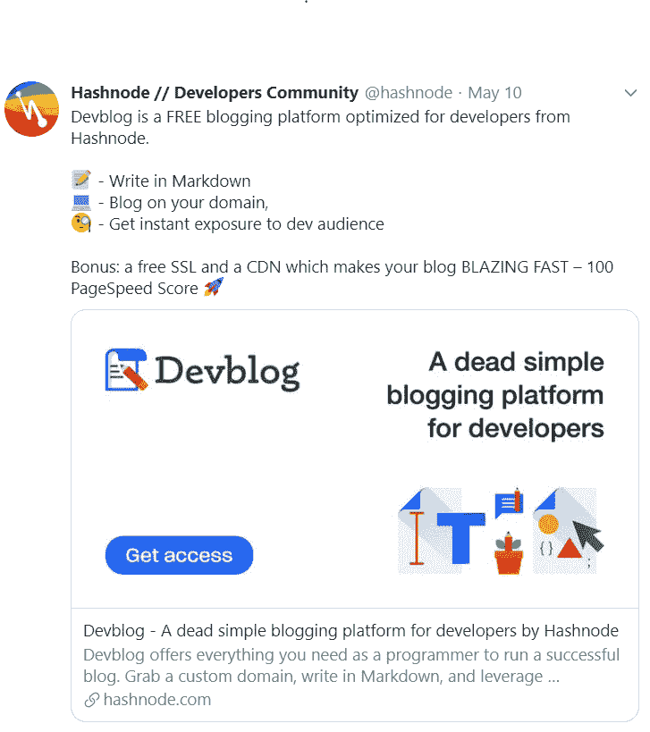

# 哈什诺德治愈我的 CMS 跳跃综合症的那一天

> 原文：<https://dev.to/kudapara/the-day-hashnode-cured-my-cms-hopping-syndrome-p0g>

你是否曾经花了一整天的时间来选择使用哪个博客平台？Medium，Ghost，WordPress，Dev，随便你说。假设你选择了 WordPress，你花了多少时间挖掘完美的主题？

很长一段时间我都是这样。从一个 CMS 跳到另一个 CMS 是我给自己的一个蹩脚的借口，因为在我的脑海中，我已经告诉自己，我还没有找到完美的平台。

后来有一天，推特上的一则广告引起了我的注意👀
T3T5】

由于我的 CMS 跳转习惯，我已经有了一个 HashNode 帐户，所以这很简单。我很快设置了我的账户，每当我遇到任何技术障碍时，我都会联系 HashNode @ [Sandeep Panda](https://hashnode.com/@sandeep) 的联合创始人，他反应非常迅速，我的博客也开始运行了。

现在我觉得我再也没有借口不写博客了。我从 HashNode 获得的好处非常少

*   我可以在自己的域名上发布内容[blog.kudapara.co.zw](https://blog.kudapara.co.zw)
*   我可以自动将这篇博客交叉发布到其他网站，如 [Dev.to](https://dev.to)
*   我不必手工制作我自己的博客平台(自带一套 challenges🥵)
*   如果我决定离开 HashNode，我可以导出我的数据，并且仍然保持在我自己的域上发布的 SEO 好处。

所以，如果你还没有决定使用哪个平台，我会说使用 HashNode，你可以随时改变主意。