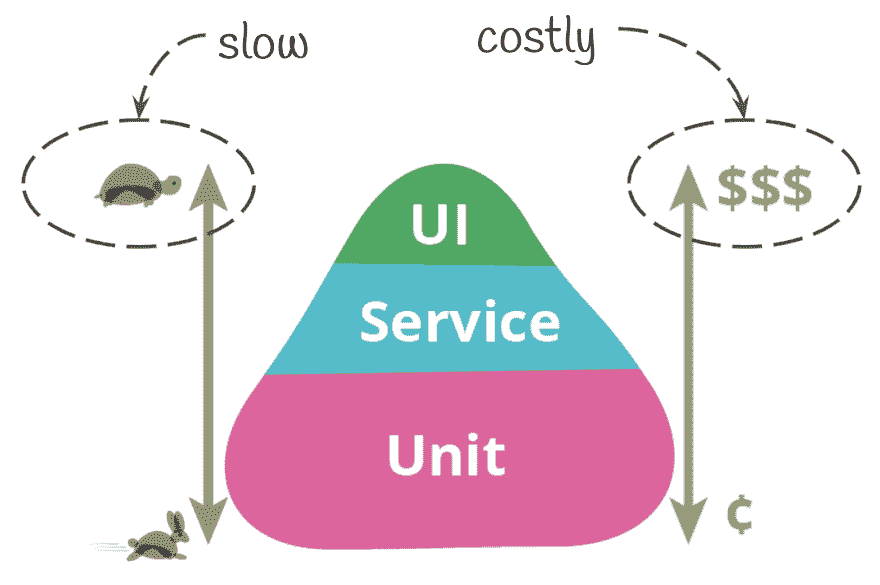
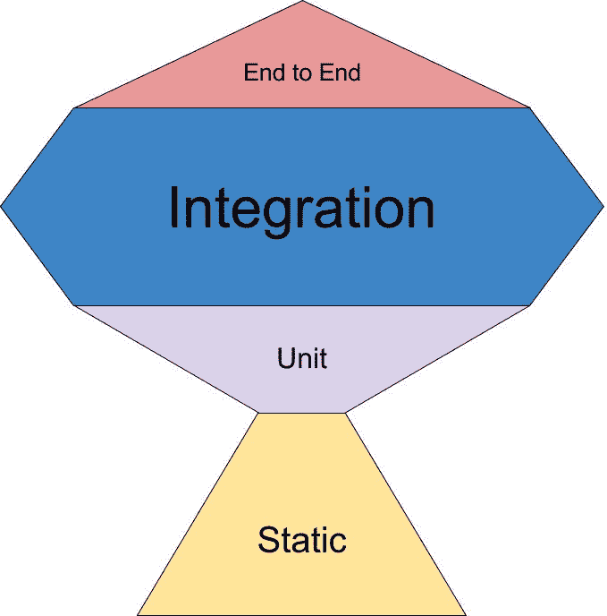
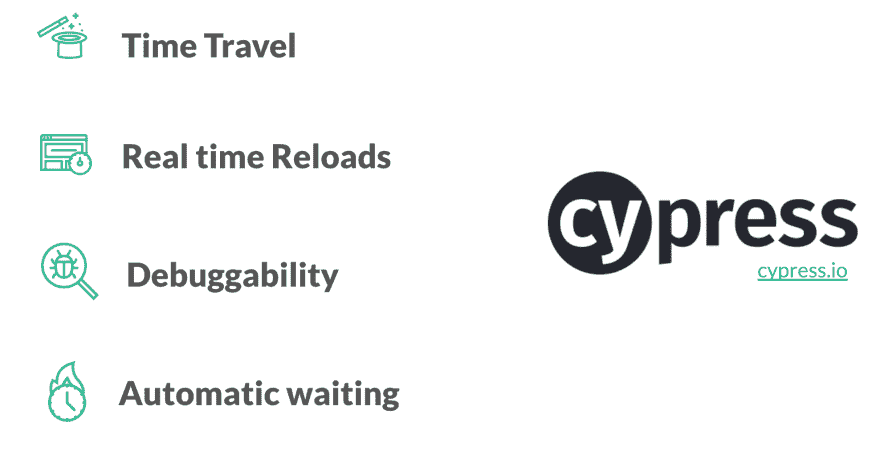

# 挑战测试金字塔

> 原文：<https://dev.to/juristr/challenging-the-testing-pyramid-4hnl>

*本文最初发表于[https://juristr.com/blog/2019/07/testing-cypress-intro](https://juristr.com/blog/2019/07/testing-cypress-intro)。前往[juristr.com/blog](https://juristr.com/blog)了解更多内容*

编写自动化测试已经成为软件开发中的标准实践，并且(应该)成为健康软件开发过程中不可或缺的一部分。测试(尤其是自动化测试)可以有不同的风格和不同的层次。在这篇文章中，我想提供一个使用 Cypress 的自动化 UI 或端到端测试的快速概述。

* * *

(来自我的时事通讯。去[订阅这里](https://juristr.com/newsletter) )

* * *

测试固然重要，但这也是一个**成本与收益**的问题。我们不想盲目地测试一切，而是最关键的部分，并创建给我们带来最大好处的测试(我们也可以称之为 **ROI -投资回报**)。首先，我们来谈谈手工测试和自动化测试。我经常这样想:

*   手动测试是要花钱的(而且你需要一遍又一遍地这样做)
*   自动化测试是投资金钱，随着时间的推移会带来投资回报(也就是说，希望一个不那么有问题的应用程序😉)

手动测试不是投资。就是花钱得到一次性反馈，就是这样。随着时间的推移，自动化测试给了我们持续的反馈。您的测试的投资回报(ROI)正是我们想要争取的。

但是即使是自动化测试，我们也有不同的测试。在高层次上，我喜欢将它们分为单元级和集成级测试。这也是你经常看到的神话般的测试金字塔:

测试金字塔告诉我们**根据执行速度和编写成本来编写哪些测试**。虽然集成水平测试被告知要慢&成本高，但它们给了我们最大的价值。如果你仔细想想，它们更接近于我们的最终用户会做的事情，而单元级测试更多的是一个开发工具，验证独立的部分是如何独立工作的。

web 开发领域可用工具的最近变化**开始挑战这种观点**。事实上，[肯特·c·多兹开始提供测试金字塔的另一种方式](https://twitter.com/kentcdodds/status/960723172591992832)，他称之为“测试奖杯”。

## 用柏树测试

如果我们更多地关注 UI(和 e2e)测试领域，这里有一些工具。大多数都是基于 Selenium 驱动程序的。我一直将它们与 Java 结合使用。Net，并且更成功地使用了像 [NightwatchJS](https://nightwatchjs.org) 和[量角器](https://www.protractortest.org/#/)这样的包装器。Selenium 很棒，它围绕浏览器 API 提供了一个抽象层，允许您用各种不同的编程语言编写 selenium 测试。然而，同样的抽象也使得**使用起来繁琐冗长，难以调试。**

Cypress 是市场上相对较新的工具，绝对值得一看。它不仅使用起来感觉非常清爽，有一个简单的 API，而且它还有几个很酷的[杀手功能](https://docs.cypress.io/guides/overview/why-cypress.html#Features)，如，改进的 **[调试](https://docs.cypress.io/guides/guides/debugging.html#Using-debugger)** ，**实时重装**和**自动等待**。

使用 Cypress，您可以通过浏览器自动化来编写集成级测试。坦率地说，它点击您让它点击的按钮，并验证结果状态是否符合我们的预期。在这一点上，它与硒非常相似。尽管如此，还是很不一样。当谈到自动化 UI 测试时，我通常会胃痛。我已经使用了很多这样的自动化工具，它们大多导致了不可靠的测试和大量的假阴性..以至于你可以把它们扔掉或者让它们失效。Cypress 似乎已经从中吸取了教训，并在处理 web 的异步特性方面做了出色的工作，提供了顶级的调试功能，并与您的 webapp 完美集成。其中一个核心区别是 **Cypress 在你的浏览器**内运行，就在你的网络应用旁边。

因此，它可以访问 DOM 以及所有正在进行的 XHR 请求，甚至给了我们排除它们的可能性。这为改善测试体验提供了很多可能性。但是在我详细讲述之前，先来看看我一年前的 15 分钟闪电演讲。

[https://player.vimeo.com/video/305089747](https://player.vimeo.com/video/305089747)

此外，不要忘记**看一看[在赛普拉斯的](https://docs.cypress.io/guides/overview/why-cypress.html)** 。这个团队投入了大量的时间让他们变得伟大和平易近人。