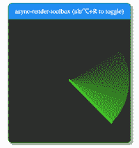
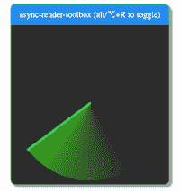

# Javascript 长时间运行的任务——使用 CPU 的空闲时间

> 原文：<https://dev.to/canastro/javascript-long-running-tasks-use-cpu-s-idle-periods-58g2>

为了提供流畅的用户体验，浏览器需要能够每秒渲染 60 帧，这意味着每 16 毫秒渲染一帧。如果您有长时间运行的 javascript 任务，那么您将开始丢帧，如果用户滚动或渲染动画，这将很明显。

有一些技术可以避免篡改 UI，最常见的一种是将这样的任务转移给 Web 工作者。在这篇文章中，我将研究一种不同的方法:如何将工作分成块，并利用 CPU 的空闲时间来处理它们。React 的团队在他们的 fiber 架构中使用了这种技术:树的协调可以被中断，以便为更优先的工作让路，从而提高用户的[感知性能](https://blog.teamtreehouse.com/perceived-performance)。

注意:这篇文章中的所有内容都受到 react 的纤程架构的极大启发(但是是以一种非常简化的方式)。如果您跳转到参考资料部分，您将获得一些可以帮助您弄清楚 react 如何工作的资源。

## 测试用例

包含 100 000 个节点的列表，其中一个节点的值是根据前一个节点的值计算的——当用户更改第一个节点时，必须重新计算该链中的每个节点，从而产生 99 999 个执行分块计算的节点。

有一个节点如下界面:

```
interface INode {
    id: string;
    value: number | null;
    previousId: string | null;
    nextId: string | null;
} 
```

创建节点图:

```
const nodes = new Map<INode>();
nodes.set('A1', {
  id: 'A1',
  nextId: 'A2',
  previousId: null,
  value: 99
});
nodes.set('A2', {
  id: 'A2',
  nextId: 'A3',
  previousId: 'A1',
  value: null
});

...

nodes.set('A100000', {
  id: 'A100000',
  nextId: null,
  previousId: 'A99999',
  value: null
}); 
```

## 要求

我们的解决方案应支持以下要求:

*   没有丢帧，网页应该随时响应
*   处理应该是可中断的(因为引入了新数据或者用户想要离开页面)
*   在给定前面的约束条件下，应该尽可能快(如果我们将执行分割成块，处理时间会稍长，但页面会有响应，因此感觉性能会更好)

## 如何衡量我们方法的质量？

*   创建一个简单的应用程序-我将使用一个应用程序与创建反应应用程序；
*   添加一个可滚动区，和一些能够测试用户交互的动画；
*   使用[async-render-toolbox](https://github.com/sw-yx/async-render-toolbox)chrome 扩展获得 CPU 延迟的可视化提示；
*   使用 devtools 进行一些额外的性能检查；

是的，这不太科学...但我们真正想改善的是可感知的性能，这更多的是一种感官体验。

## 使用 CPU 的空闲周期

> [window . requestidlecallback()](https://developer.mozilla.org/en-US/docs/Web/API/Window/requestIdleCallback)方法将在浏览器空闲期间调用的函数排队。这使开发人员能够在主事件循环上执行后台和低优先级工作，而不会影响延迟关键事件，如动画和输入响应。函数一般按照先进先出的顺序调用；但是，如果需要，可以无序调用指定了超时的回调，以便在超时之前运行它们。

通过调用 requestIdleCallback，我们为下一个 CPU 空闲周期安排一个回调。在那个回调中，我们可以通过调用`deadline.timeRemaining()`来检查在空闲期结束之前我们还剩多长时间。空闲时间的最大值是 50 毫秒，但是大多数时候我们得到的时间会比这少，这取决于 CPU 有多忙。

使用剩余时间和每次计算的恒定最大时间，我们可以检查我们是否有空闲时间来进行一次计算或重新安排到下一个空闲周期。我们将安排一个新的回调，直到不再有任务要执行。通过以这种方式处理我们的节点，我们确保不会中断延迟关键事件，并提供流畅的用户体验。

## 安排工作

因为我们使用了 CPU 的空闲时间，所以用户可以随时与页面交互并安排新的工作。这意味着我们应该保留一个未完成工作的队列。

如果正在处理一个给定的节点，并且为该节点安排了一个新的工作，我们应该中止当前的工作，并将该节点再次推到队列的末尾:

```
interface IUnitOfWork {
    triggerNodeId: string;
    node: INode;
}

let workQueue: INode[] = [];
let nextUnitOfWork: IUnitOfWork | null = null;

function scheduleWork(node: INode): void {
    /**
     * Verify if there is already a work being
     * process that was triggered by the same node
     */
    const isInProgress = nextUnitOfWork && nextUnitOfWork.triggerNodeId === node.id;

    if (isInProgress) {
        nextUnitOfWork = null;
    }
    workQueue.push(node);

    requestIdleCallback(performWork);
} 
```

我们的方法基于 CPU 的可用时间，但是我们如何知道可用时间足够完成一个单位的工作呢？好吧，那是一块思想饼干！目前解决这个问题的方法是假设我们通常处理每个工作单元所花费的中间时间，并将其存储在一个常量`ENOUGH_TIME`中。这将需要调整，这将是非常具体的工作，你必须在你的应用程序。

```
const ENOUGH_TIME = 2; // in ms 
```

正如我们在前面的代码片段中看到的，当我们安排工作时，我们调用了`requestIdleCallback`，这将最终调用我们的`performWork`函数。在这个功能中，我们启动`workLoop`。

`workLoop`获取下一个工作单元，如果没有，它从工作队列中选取一个新节点。并开始在 while 循环中调用我们的`performUnitOfWork`函数，直到我们到达一个我们认为没有剩余时间或者没有更多工作单元的点。`performUnitOfWork`是处理每个节点的函数(这里不详细介绍这个函数，因为在这种情况下主要是虚拟计算)。

一旦`workLoop`完成，我们就返回到`performLoop`函数，如果在工作队列中还有一个 nextUnitOfWork 或一个节点，那么我们就调度一个新的空闲回调并重新开始这个过程。

```
function resetNextUnitOfWork() {
    const node = workQueue.shift();
    if (!node) return;

    nextUnitOfWork = { triggerNodeId: node.id, node };
}

function workLoop(deadline: number): void {
    if (!nextUnitOfWork) {
        resetNextUnitOfWork();
    }

    while (nextUnitOfWork && deadline.timeRemaining() > ENOUGH_TIME) {
        nextUnitOfWork = performUnitOfWork(nextUnitOfWork);
    }
}

function performWork(deadline: number): void {
    workLoop(deadline);

    if (nextUnitOfWork || workQueue.length > 0) {
        requestIdleCallback(performWork);
    }
} 
```

## 结果

块迭代方法执行起来更快，但是，正如在下一张 gif 中看到的，它有很多丢帧。该页面将有一段时间没有响应:

[](https://res.cloudinary.com/practicaldev/image/fetch/s--iY6y7X5i--/c_limit%2Cf_auto%2Cfl_progressive%2Cq_66%2Cw_880/https://thepracticaldev.s3.amazonaws.com/i/jda9ldxexdfq8v39iccg.gif)

空闲回调方法需要更长的时间来执行，它的执行时间是不可预测的，因为它取决于 CPU 的繁忙程度，但是页面在任何时候都是响应性的，因此感觉到的性能可能会好得多:

[](https://res.cloudinary.com/practicaldev/image/fetch/s--Gxf97QaO--/c_limit%2Cf_auto%2Cfl_progressive%2Cq_66%2Cw_880/https://thepracticaldev.s3.amazonaws.com/i/po045th4z8ybj4adthyl.gif)

查看[这个视频](https://github.com/canastro/blog-offload-computation/raw/master/idle-vs-normal.mp4)以查看撰写本文时创建的示例的输出结果。

## 结论

在这个独立的测试中，带有 **requestIdleCallback** 的方法似乎检查了我们的需求。

如果我们处理 100 个 calcss，idle 的执行时间与常规的阻塞操作相差不大，但是如果我们处理 100 000 个 calc，idle 方法将花费更长的时间，但是更平滑。这是一个权衡，我个人认为这是值得的。

不过，有一点需要注意的是，[浏览器支持](https://caniuse.com/#search=requestIdle)还不够理想...IE Edge 和 safari 都不支持它...总是那两个，对吗？😞有很多方法可以填补它，比如这个简单的[要点](https://gist.github.com/paullewis/55efe5d6f05434a96c36)和[反应的方法](https://github.com/facebook/react/blob/master/packages/scheduler/src/Scheduler.js#L415)，这是一个更加复杂和健壮的方法。

但是，有几个主题需要进一步探讨:

*   这与 react 的调度程序集成得如何？
*   根据 [@sebmarkbage](https://twitter.com/sebmarkbage/status/822881464794497024) 的说法，大多数 requestIdleCallback 垫片并没有准确地表示 requestIdleCallback 应该做什么。我们能找到一个好的垫片或者甚至使用 react 使用的垫片吗？
*   这与使用 webworkers(或其他可能的方法)相比如何？-希望能在以后的文章中回答这个问题。

## 资源

*   [Github repo 与本文给出的代码](https://github.com/canastro/blog-offload-computation)
*   [Udacity 由 Google 提供的“浏览器渲染优化”课程](https://www.udacity.com/course/browser-rendering-optimization--ud860)
*   [感知绩效](https://blog.teamtreehouse.com/perceived-performance)
*   [纤维原理:有助于纤维](https://github.com/facebook/react/issues/7942)
*   [React 在纤程中使用链表遍历组件树的方式和原因](https://medium.com/react-in-depth/the-how-and-why-on-reacts-usage-of-linked-list-in-fiber-67f1014d0eb7)
*   [使用 requestIdleCallback](https://developers.google.com/web/updates/2015/08/using-requestidlecallback)

***免责声明:**观点仅代表我个人，不代表我雇主的观点。*

如果你发现任何错误，无论是我糟糕的英语还是任何技术细节，请不要害羞，在推特上告诉我。我会努力不断改进这篇博文 :simple_smile: