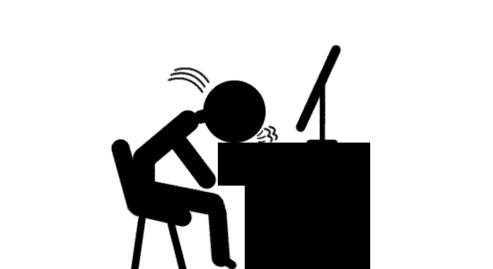
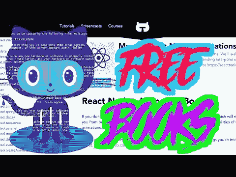

# 开始自由网站开发的残酷事实

> 原文：<https://dev.to/realtoughcandy/the-hard-truth-about-beginning-freelance-web-development-4e0e>

#### 以下是我的书《T2》的摘录，该书有平装版和 Kindle 版本，可在[亚马逊网站上购买。也可用作顶级](https://amzn.to/2KFCYxa)[视频课程！](https://realtoughcandy.teachable.com/p/freelance-newbie-become-a-freelance-web-developer)

### 我建的第一个网页是在 Geocities 上。

记得 Geocities 吗？它是雅虎的免费虚拟主机网站，允许任何有互联网连接的人建立网页。十几岁时，我是一个真正的恶作剧，当我们在计算机实验室上课时，我建了一个讽刺网页供同学们访问。我陶醉在自己与 Geocities 拖放编辑器独处的时光中。

当时我知道一些基本的 HTML，但直到多年后的 2014 年，我才开始萌生成为一名专业 web 开发人员的想法。

### 终于在 2016 年，我接下了第一个自由职业的 web 开发客户端。

但与我的 Geocities 冒险不同，在那里一切都很有趣，轻松，并得到了我的同龄人的喜悦和我的校长的鄙视，这次经历是一次火车失事。

我的客户拥有一家声誉很高的正畸公司，她最近开发了一种清洁牙齿的专利产品。虽然店内销售非常好，但她准备进军电子商务。据她的丈夫说，两人已经经历了多个开发商和顾问，包括一个亲戚，他也是三个州之外的全职汽车销售员。由于这样或那样的原因，这些人中没有一个人能够完成这个项目。

### 我们在当地咖啡店的第一次见面很顺利。

虽然汽车销售员的故事让我心里有点不舒服，但我仍然非常乐观和兴奋——毕竟，这是我的第一个“真正的”自由客户。我问了很多问题，做了很多笔记，我们用微笑和握手结束了会议。我相信我会很快收到这对积极的夫妇的来信。

#### 果然，几天后接到电话，绝对欣喜若狂。

我甚至还没有一个投资组合或价目表，但我已经收到了一个客户现金回电！

这时候事情开始走下坡路。

“嗨，坎蒂，我是吉姆。嘿，蒂娜和我想再次和你见面。你明天能来办公室吗？”

我的胃又感到了那种轻微的疼痛:他们的办公室在另一个城市，有一个多小时的路程，而我没有为这次会议得到报酬。但是，我再次被一个自由客户追求的兴奋压倒了我可能有过的任何怀疑的身体表现。我甚至没有问他们为什么要见面——我很高兴地答应了，因为很明显我们就要完成交易了。

那是一个星期天，他们的办公室关门了，所以吉姆给我开了门，把我带到后面一个黑暗的房间里。蒂娜关着灯，眯着眼，在电脑上喃喃自语。两人讨论了几分钟与工作有关的问题，然后才承认我在场。但是，嘿，他们是忙碌的商务人士，我真的希望他们成为我的客户。

#### 于是我等着。

又过了几分钟，蒂娜从她的电脑前抬起头，向吉姆点了点头，然后他给我简单介绍了一下:他们的汽车销售员侄子已经建了一个网站，但是他被一些事情卡住了，没有时间完成。蒂娜叹了口气，从她的桌子上站起来，快步走向她房间外面的一台巨大的打印机，同时小声地念叨着，“我恨她。我讨厌她。我讨厌她，”扫描仪的灯光照亮了昏暗的走廊。

事情变得越来越奇怪，但我认为这只是做生意的成本。

这场混乱的会议持续了一个多小时。我终于对这种误导失去了耐心，并寻找机会插话。当 Jim 提出地理围栏的话题并对各种可能性表现得近乎狂热时，我查看了我的笔记，确认了他们的开发问题，讨论了我如何解决这些问题，并陈述了开发过程中的后续步骤。

他们似乎接受了我的想法，尤其是在我解释了一个以响应式网页设计(当前网站缺少的一个主要功能)和嵌入视频为特色的网站的重要性之后。

“我们会很快回复你的，”吉姆说。

我上了车，开了一个小时回家。

### 三天后，我接到另一个电话。

“坎蒂，我是吉姆。说，听着。我找到了蒂娜的一个同事，她声称可以免费得到这个东西。”

我不敢相信地呆住了，被沉默惊呆了。

他继续说道，“现在，我不知道她是否在说实话，但我想和你再聚一次。她想跟着她丈夫一起去看看你在网站上做的事情到底是怎么回事。”

此时，我因愤怒、背叛和尴尬而有些颤抖。我决定以后再处理情绪上的影响，非常平静地说:“吉姆，我们可以见面，但现在我要开始向你收费了。

吉姆不同意。

“收费开会？我觉得你不可理喻。我是说，这对你来说是个巨大的商机。我只是从来没有遇到过一个人为会议收费的情况。”

“吉姆，你刚刚告诉我，你有一位女士可以免费做我的工作，她想知道我是如何建立我的网站的。而你要我第三次免费和大家见面？对不起，不行。如果你们都想见面咨询，我是收费的。”

#### 线路安静了几秒钟。

然后他说，“好吧，那我想我们最好找别人。你能不能至少联系一下蒂娜，让她知道你是否还有兴趣改造她的个人网站？”

更新蒂娜的个人网站是我们第一次见面时简单提到的事情。我同意联系她，挂了电话。哪里出了问题？

当我迅速回到现实时，那天下午我给蒂娜发了一封专业邮件，告诉她我们不会再一起做生意了。

我们再也没有说过话。

## 从失败中学习是最重要的教育

在这个客户来自地狱的故事中，你发现了多少问题(或潜在问题)？你相信吗，在我吸取教训之前，我经历了两个类似的故事。

这些失误大部分是初学者常犯的错误，也许你在早期的自由职业中已经经历过了。

### 当一些事情早期出错时，很容易让失败玷污你对职业生涯的看法。

一次负面的经历可以让人们放弃自由职业——不幸的是，许多人*已经*因此放弃了。

然而，在这种情况下，你能做的最重要的事情就是从中吸取教训，继续前进。

#### 你的头会痛，你会有完全筋疲力尽的日子，但不要放弃。

你的梦想比那更有价值。

毫无疑问，与低质量的客户打交道，就像我职业生涯开始时与他们打交道一样，是非常令人沮丧的，但老实说，这是每个企业的一部分。

最重要的部分是要正确看待一切，专注于你的梦想，并意识到消极的人不会亲自帮助你实现目标。

他们从来没有。

尽可能专业地转化消极情绪，并坚持下去，用这种能量来激发伟大。

附言:在 YouTube 上关注我，我在那里谈论了很多很酷的网络开发的东西:

