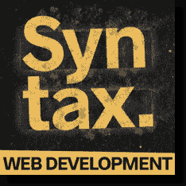
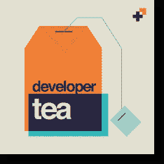
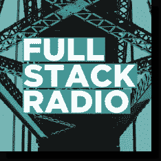
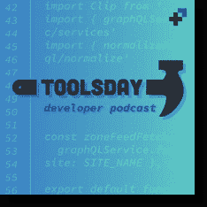
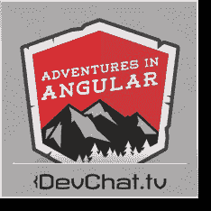
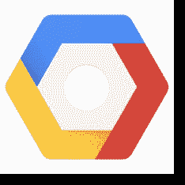
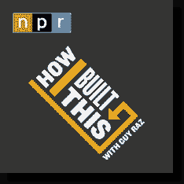

# 前端 Web 开发播客

> 原文：<https://dev.to/codingcatdev/front-end-web-development-podcasts-3hd7>

> 原帖:[https://ajonp.com/blog/front-end-web-development-podcasts/](https://ajonp.com/blog/front-end-web-development-podcasts/)

# 前端 Web 开发播客

我用 [Pocket Casts](https://www.pocketcasts.com/) 听我所有的播客，它让我的生活从手机切换到桌面变得非常容易。我也喜欢[安卓](https://play.google.com/store/apps/details?id=au.com.shiftyjelly.pocketcasts)和 [iOS](https://itunes.apple.com/au/app/pocket-casts/id414834813) 的应用设计。在写这篇博客的时候，我还没有加入 Pocket Casts。这个列表没有特定的顺序。

> 就像所有的事情一样，我总是试图包含社区，所以如果你有你想要分享的播客，请给我一个[拉请求](https://github.com/AJONPLLC/ajonp-content/tree/master/blog/frontend-web-development-podcasts.md)！

## 前端欢乐时光

*   [PocketCasts 链接](https://pca.st/QwjO)
*   [链接](http://frontendhappyhour.com/)
*   [推特](https://twitter.com/FrontEndHH)

### 口袋铸型描述

一个播客，来自[@网飞](https://twitter.com/@Netflix)、 [@Evernote](https://twitter.com/@Evernote) 、[@ Atlassian](https://twitter.com/@Atlassian)&[@ LinkedIn](https://twitter.com/@LinkedIn)的工程师小组成员边喝边聊前端开发的所有事情。

### 亚历克斯的想法

前端欢乐时光已经成为我每周的演员阵容。我喜欢轻松的对话，而技术材料却惊人地相关。当然，当你邀请一些最大的科技公司的顶级专家作为嘉宾时，这很容易做到😺。

## 语法-美味网

*   [PocketCasts 链接](https://pca.st/fmx9)
*   [链接](https://syntax.fm)
*   [推特](https://twitter.com/syntaxfm)

### 口袋铸型描述

全栈开发人员 Wes Bos 和 Scott Tolinski 深入探讨了 web 开发主题，解释了它们是如何工作的，并讲述了他们自己的经历。它们涵盖了从像 React 这样的 JavaScript 框架，到 CSS 中简化 web 工具的最新进展。

### 亚历克斯的想法

语法由[韦斯·博斯](https://twitter.com/@wesbos)和[斯科特·托林斯基](https://twitter.com/@stolinski)主持。两人都是有天赋的老师，并且分别有很棒的基于教程的网站【wesbos.com T4】和【leveluptutorials.com T6】T7。我通常在这段时间补上🏃。

## JS 党

*   [PocketCasts 链接](https://pca.st/ijqf)
*   [链接](https://changelog.com/jsparty)
*   [推特](https://twitter.com/JSPartyFM)

### 口袋铸型描述

JavaScript 和网络的社区庆典。这个节目记录在美国东部时间周四下午 1 点直播。小组成员包括[苏兹·辛顿](https://twitter.com/noopkat)、[费罗斯·阿巴克哈迪贾](https://twitter.com/feross)、[凯文·鲍尔](https://twitter.com/kbal11)、[艾玛·韦德金德](https://twitter.com/@EmmaWedekind)、[杰罗德·桑托](https://twitter.com/jerodsanto)、[尼克·尼斯](https://twitter.com/nicknisi)、[迪维娅·萨西德哈兰](https://twitter.com/shortdiv)、[迈克尔·罗杰斯](https://twitter.com/mikeal)和[克里斯·希勒](https://twitter.com/b0neskull)。讨论的主题包括 web 平台(Chrome、Safari、Edge、Firefox、Brave 等)、前端框架(React、Ember、Angular、Vue 等)、Node.js、web 动画、SVG、机器人、物联网等等。如果 JavaScript 和/或网络触及到你的生活，这个节目就是为你准备的。有些人搜索 JSParty 找不到节目，所以现在字符串 JSParty 也在我们的描述中。

### 亚历克斯的想法

这真的是一个派对，不是说每个人都一直在给气球充气。这更像是一种聚会，所有陌生的东西都围着桌子呆一会儿。我真的很喜欢听完剧集后给你的感觉。

## 瓢虫播客

*   [PocketCasts 链接](https://pca.st/ZD17)
*   [链接](https://ladybug.dev/)
*   [推特](https://twitter.com/LadybugPodcast)

### 口袋铸型描述

我们是[艾玛·韦德金德](https://dev.to@EmmaWedekind)、[凯利·沃恩](https://dev.to@kvlly)、[林赛·科帕奇](https://dev.to@LittleKope)和[阿里·斯皮特尔](https://dev.to@ASpittel)——四位在不同领域工作的经验丰富的软件开发人员。由于现在非常缺乏技术播客，我们决定创办一个。开玩笑，已经有一吨了！但是，我们希望将我们的声音加入到空间中，并分享我们不同的经验和建议。我们将围绕如何开始编码、当前的热门技术、如何获得你的第一份开发人员工作等等展开热烈的讨论！

### 亚历克斯的想法

这些主持人绝对是 [#webdev](https://twitter.com/search?q=webdev) 社区中的摇滚明星！这个播客系列已经开始 9 集了，我等不及要听更多了。

## 显影剂茶

*   [PocketCasts 链接](https://pca.st/devtea)
*   [链接](https://spec.fm/podcasts/developer-tea)
*   [推特](https://twitter.com/@developertea)

### 口袋铸型描述

开发者茶的存在是为了帮助被驱动的开发者连接到他们的最终目标，并在他们的工作中出类拔萃，以便他们能够积极地影响他们所影响的人。迄今为止，下载量已超过 1300 万次,“开发者之茶”是一个由 [Jonathan Cutrell](https://twitter.com/@jcutrell) 主持的简短播客，Jonathan Cutrell 是 Spec 的联合创始人和 [Clearbit](https://twitter.com/@Clearbit) 的开发者。我们希望你能从本期播客中选取话题，继续对话，无论是在线还是面对面与你的同伴交流。

### 亚历克斯的想法

乔纳森的声音如此舒缓，你将无法停止聆听(开车时小心)。这个播客非常适合大多数通勤者，因为它通常看起来大约 15 分钟或更短(少数更长)。这个播客基本上是我耳朵的瑜伽，它让我静下心来，真正欣赏不断在我脑海中滚动的目标。写这篇文章的时候，已经有 720 集了，我不知道怎么会有人能这么快就做出这么多集，但它们都制作得很好，尽管很出彩。

## 网络平台播客

*   [PocketCasts 链接](https://pca.st/QeXX)
*   [链接](https://thewebplatformpodcast.com/)
*   [推特](https://twitter.com/TheWebPlatform)

### 口袋铸型描述

该网络平台播客由 HTML W3C 特邀专家埃里克·伊萨克森于 2014 年创建，他创办该播客的目的是“从整个社区中学习更多知识，并结识更多构建网络的人。”

### 亚历克斯的想法

网络平台播客是我的最爱之一，它是我每周收听的节目。他们现在发布的不那么有规律了，但是仍然有很棒的客人和内容。

## 棱角分明的空气

*   [PocketCasts 链接](https://pca.st/09GX)
*   [链接](https://angularair.podbean.com)
*   [推特](https://twitter.com/AngularAir)

### 口袋铸型描述

AngularAir 是一个关于谷歌 Angular 平台的视频播客，由贾斯汀·施瓦岑伯格主持。

### 亚历克斯的想法

Angular Air 发布播客的方式很奇怪。所以我通常会在 YouTube 上看到他们的视频，因为这往往是互动的，非常棒！

## 全栈电台

*   [PocketCasts 链接](https://pca.st/fullstack)
*   [链接](http://www.fullstackradio.com/)
*   [推特](https://twitter.com/fullstackradio)

### 口袋铸型描述

一个面向对构建优秀软件产品感兴趣的开发者的播客。每一集，Adam Wathan 都有一位嘉宾加入，谈论从产品设计和用户体验到单元测试和系统管理的一切。

### 亚历克斯的想法

作为一名有抱负的前端开发人员，全栈无线电有助于提醒我记住后端。事实上，我偶然发现了这一点，因为亚当·瓦森是《T2》的创作者之一，也是一位伟大的作家。

## 工具日

*   [PocketCasts 链接](https://pca.st/LihQ)
*   [链接](https://spec.fm/podcasts/toolsday)
*   [推特](https://twitter.com/toolsday)

### 口袋铸型描述

“工具日”是一个大约 20 分钟的播客，由乌纳·克拉韦茨和克里斯·达纳拉杰主持。工具日是关于最新的技术工具、技巧和窍门的，时间是每周二下午 2！(我们的头韵游戏好强)。

### 亚历克斯的想法

《工具日》从一开始就吸引了你，Una 演奏了一首很棒的新尤克里里歌曲！因为尤娜·克拉韦茨和 T2·克里斯·达纳拉杰在谷歌和网飞的惊人的 UI/前端经验。

## 棱角分明的奇遇

*   [PocketCasts 链接](https://pca.st/SLpU)
*   [链接](http://www.adventuresinangular.com/)
*   [推特](https://twitter.com/angularpodcast)

### 口袋铸型描述

Adventures 是一个关于 Angular 社区、工具、技术和生态系统发展的每周播客。

### 亚历克斯的想法

《Angular 历险记》对我来说是新的，但是在听了 Hans Larsen 的最新作品和 Angular CLI 上的工作后，我渴望完成积压的工作，目前是第 252 集，所以可能需要一点时间😺

## React 播客

*   [PocketCasts 链接](https://pca.st/bWXP)
*   [链接](https://reactpodcast.com/)
*   [推特](https://twitter.com/ReactPodcast)

### 口袋铸型描述

关于 React 与您最喜欢的开发人员的对话。

### 亚历克斯的想法

React 播客由[陈宸](https://twitter.com/@chantastic)主持，老实说我还没有听过演员表，但这只是一个建议，因为我是 ReactJS 社区的新成员。所以它现在在我的队列中🤞要学很多东西！

## 商店用语

*   [PocketCasts 链接](https://pca.st/P08F)
*   [链接](https://shoptalkshow.com/)
*   [推特](https://twitter.com/shoptalkshow)

### 口袋铸型描述

一个关于前端网页设计和 UX 的直播播客。

### 亚历克斯的想法

我最近发现了商店脱口秀，并且一直很喜欢它。戴夫·鲁伯特是一个听起来很有趣的人，他的[网站](https://daverupert.com/)超级棒！如果你不知道[克里斯·科伊尔](https://twitter.com/chriscoyier)这个名字，我敢肯定你见过他参与创立的一个叫做 [CodePen](https://codepen.io/) 的东西。所以我们只能说他们是非常聪明的人，非常聪明

## 谷歌云平台播客

*   [PocketCasts 链接](https://pca.st/rThD)
*   [链接](https://www.gcppodcast.com/)
*   [推特](https://twitter.com/)

### 口袋铸型描述

谷歌云平台播客，每周为您呈现。讨论谷歌云平台上从 App 引擎到大查询的一切。

### 亚历克斯的想法

我是谷歌云的超级粉丝，所以我尽量赶上所有这些剧集。我承认，如果有什么东西(比如网络)我会经常跳过，直到它更适合发展。

## Y 组合子

*   [PocketCasts 链接](https://pca.st/3Gld)
*   [链接](https://www.ycombinator.com/)
*   [推特](https://twitter.com/ycombinator)

### 口袋铸型描述

我们与塑造未来的人交谈。一个关于商业、研究和艺术中的技术的展览。

### 亚历克斯的想法

Y Combinator 总是让我了解商业技术的最新发展。是的，我有一份日常工作，我需要与我们经济的心跳保持联系！

## 我是如何和盖伊·拉兹一起建造这个的

*   [PocketCasts 链接](https://pca.st/howibuiltthis)
*   [链接](https://www.npr.org/podcasts/510313/how-i-built-this)
*   [推特](https://twitter.com/howibuiltthis)

### 口袋铸型描述

盖伊·拉兹深入探讨了一些世界上最著名的公司背后的故事。《我是如何建立的》编织了一个关于创新者、企业家和理想主义者的叙事之旅——以及他们建立的运动。

### 亚历克斯的想法

这可能更多是为了让一个项目继续下去😺，把任何事情都当作次要的事情需要努力，所以听听别人的故事会有帮助！