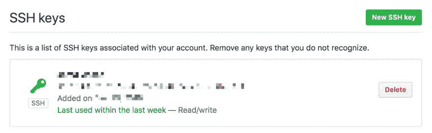
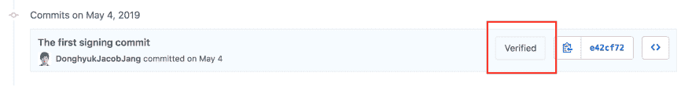
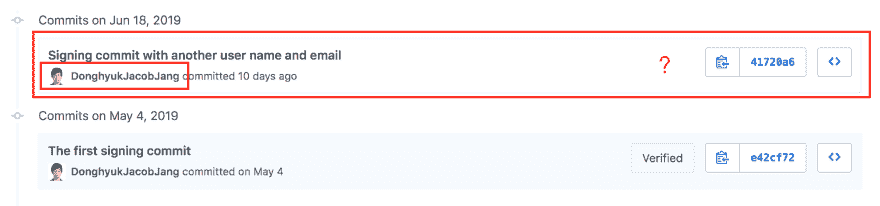
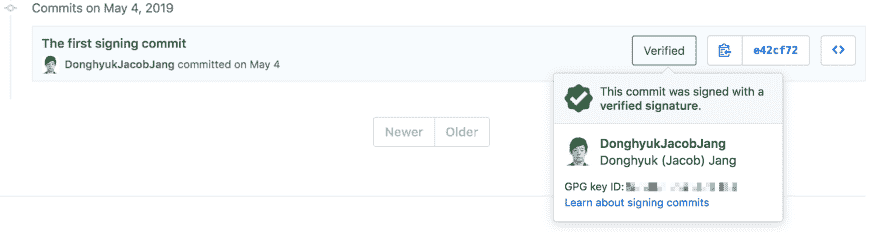

# 加密 git 提交

> 原文：<https://dev.to/jam3/cryptography-git-commits-c3h>

-

Git 是 it 领域使用的行业标准版本控制工具，所以对于开发者来说，它有一个强制工具和一个需要学习的技能。

在开发阶段，开发人员会提交成百上千次。然而，不难发现**未验证的提交**，尽管它会与**的安全漏洞**有关，并潜在地影响项目的**漏洞**。

本文将主要关注**签署(验证)提交**的重要性。此外，还有一个关于如何在 Git 存储库中假装其他人的练习。

-

### **目录**

1.  SSH 密钥简介
2.  GPG 密钥
3.  不使用 GPG 密钥的安全缺陷示例
4.  如何设置 GPG 键
5.  如何创建签名提交
6.  最后的想法

-

### **宋承宪简介**

[](https://res.cloudinary.com/practicaldev/image/fetch/s--BEe15qyO--/c_limit%2Cf_auto%2Cfl_progressive%2Cq_auto%2Cw_880/https://thepracticaldev.s3.amazonaws.com/i/t112w61uke9qty2golnk.png)

<figcaption>SSH-key added in Github</figcaption>

首先，我假设你已经在你的机器上设置了 **SSH-key** 来认证 Github 并注册了你的 Github 账户。如果没有，请阅读[用 SSH 连接 GitHub](https://help.github.com/en/articles/connecting-to-github-with-ssh)并按照步骤操作。

设置 SSH-key 意味着您不必为所有 git 活动提供 Github 用户名或密码。这是设置 SSH-key 的主要原因。用 SSH-key 连接到 Github 是否意味着您的所有提交都变得安全了？我们将深入探讨这一点，并在本文后面更多地讨论只使用 SSH-key 的缺点。

-

### **那么，GPG 的重点是什么呢？**

[](https://res.cloudinary.com/practicaldev/image/fetch/s--MSD83iTQ--/c_limit%2Cf_auto%2Cfl_progressive%2Cq_auto%2Cw_880/https://gnupg.org/share/logo-gnupg-light-purple-bg.png)

<figcaption>GnuPG logo</figcaption>

Gnu Privacy Guard(GPG)是一个工具，它允许用户轻松地将一个附加的安全层与其他应用程序集成在一起。在这种情况下，它将是 Git。

> GnuPG 是由 RFC4880(也称为 PGP)定义的 OpenPGP 标准的完整免费实现。GnuPG 允许你对你的数据和通信进行加密和签名；它具有一个多功能的密钥管理系统，以及各种公钥目录的访问模块。GnuPG，也称为 GPG，是一个命令行工具，具有易于与其他应用程序集成的特性。大量的前端应用程序和库是可用的。GnuPG 还提供对 S/MIME 和安全外壳(ssh)的支持。
> 
> 自 1997 年推出以来，GnuPG 就是自由软件(意味着它尊重你的自由)。它可以根据 GNU 通用公共许可证的条款自由使用、修改和分发。
> 
> GnuPG 的当前版本是 2.2.17。有关其他维护版本，请参见下载页面。
> 
> Gpg4win 是 GnuPG 的 Windows 版本，具有上下文菜单工具、加密管理器和发送和接收标准 PGP/MIME 邮件的 Outlook 插件。Gpg4win 的当前版本是 3.1.10。

<figcaption>The GNU Privacy Guard</figcaption>

-

### **如果不使用 GPG 键会发生什么？**

[](https://res.cloudinary.com/practicaldev/image/fetch/s--OxmU_aju--/c_limit%2Cf_auto%2Cfl_progressive%2Cq_auto%2Cw_880/https://thepracticaldev.s3.amazonaws.com/i/fb91psceqge48rtj287m.jpg)

<figcaption>a costume under surveillance</figcaption>

一个非常常见的严重问题是，有人可以在他们的本地机器上设置其他开发人员的 Github 用户名和电子邮件，并创建在 Git 存储库中显示为“其他人”提交的提交。当然，这个活动需要满足一定的条件。以下命令显示了如何在您的终端中设置不同的 Github 用户名和电子邮件。

-

```
// setup username and email
$ git config --global user.name "No GPG"
$ git config --global user.email no.gpg@email.com

// verity username and email
$ git config --global user.name
> No GPG
$ git config --global user.email
> no.gpg@email.com 
```

在这里，我想与大家分享我在一个测试 Git 存储库中推送的两个不同提交的示例([签名提交](https://github.com/DonghyukJacobJang/signing-commits))。

当我创建这个 git 存储库时，我用一个签名的(验证的)提交进行了初始推送。

[](https://res.cloudinary.com/practicaldev/image/fetch/s--nmk0UNF3--/c_limit%2Cf_auto%2Cfl_progressive%2Cq_auto%2Cw_880/https://thepracticaldev.s3.amazonaws.com/i/xatnsmsl2917tuz76eth.png)

<figcaption>Screenshot of git commit history</figcaption>

然后，我让我的一个朋友( [@alemesa](https://dev.to/alemesa) )按照上面的做法，把我的 Github 用户名和邮箱给了他。(这些登录的凭证，很容易就能找到。)他创建了一个提交，并将其推送到`master`分支。看看下面的结果。

[](https://res.cloudinary.com/practicaldev/image/fetch/s--TYYjJ9o8--/c_limit%2Cf_auto%2Cfl_progressive%2Cq_auto%2Cw_880/https://thepracticaldev.s3.amazonaws.com/i/d404zd1zleurd6eq4j28.png)

<figcaption>Screenshot of git commit history</figcaption>

提交似乎是由我创建的。但是，没有像第一次初始提交那样的“已验证”标志。

如果`master` branch 没有像测试 Git 库一样受到保护，那么贡献者列表中的任何人都可以通过伪装成其他人来推送任何代码。请点击查看如何保护树枝[的详细信息。](https://help.github.com/en/enterprise/2.15/admin/developer-workflow/configuring-protected-branches-and-required-status-checks)

注意:如果你想测试这个活动，请直接给我发送一个包含你的 Github 用户名的消息。我会把你加入合作者名单。

-

### **如何设置 GPG 键**

参考资料将指导你如何在你的工作站上设置 GPG 密钥，以及如何将它们添加到你的 Github 帐户中。

*   [设置 GPG 密钥 Github](https://help.github.com/en/articles/generating-a-new-gpg-key)
*   [和 GPG 一起在 Github 上签名](https://medium.com/@timmywil/sign-your-commits-on-github-with-gpg-566f07762a43)

-

### **如何创建签名提交**

在创建提交之前添加文件:

```
// add a single file
$ git add [path file]

// add all file
$ git add . 
```

下面的 git 命令是如何创建一个有或没有您签名的提交:

```
// create commit with a message without signing
$ git commit -m "commit message"

// add all file that you want to commit
$ git commit -S -m "commit message" 
```

一旦创建了签名提交，下一步就是推送 git repo:

```
// push the commit
$ git push 
```

下面的截图是测试 git 存储库中 git 签名提交的一个例子([签名提交](https://github.com/DonghyukJacobJang/signing-commits))

[](https://res.cloudinary.com/practicaldev/image/fetch/s--x6msJgUw--/c_limit%2Cf_auto%2Cfl_progressive%2Cq_auto%2Cw_880/https://thepracticaldev.s3.amazonaws.com/i/u2xhsjza2qwnstd04mwx.png)

<figcaption>detail of signing commit</figcaption>

-

### **结论**

总结这篇文章，使用 GPG 密钥将通过加密数据和添加个人签名来提高安全性和真实性。如果您或您的组织已经考虑了这些，上面的步骤将带来它的优势，并确保您的提交工作流的信任。

注意:本练习可能不适用于所有情况。请确保将此用于正确的目的。

-

### **参考文献**

*   [Gnu PG](https://gnupg.org/)

*   [告诉 Git 你的签名密钥](https://help.github.com/en/articles/telling-git-about-your-signing-key)

*   [在 Git 中对提交和标签进行加密签名的优缺点是什么？](https://softwareengineering.stackexchange.com/questions/212192/what-are-the-advantages-and-disadvantages-of-cryptographically-signing-commits-a)

*   当我在推送时已经使用 SSH 密钥来验证自己时，为什么还要用 GPG 密钥来签署我的 git 提交？

*   [如何创建签名提交](https://help.github.com/en/articles/signing-commits)

*   [在源代码树内设置 gpg-key](https://confluence.atlassian.com/sourcetreekb/setup-gpg-to-sign-commits-within-sourcetree-765397791.html)

*   [GnuPG manual](https://www.gnupg.org/gph/en/manual.html)

-

### **合作者**

*   亚历杭德罗·梅萨(@ alemesa)-[alejandro.suarez@jam3.com](mailto:alejandro.suarez@jam3.com)
*   丹尼·佩顿-[danny.paton@jam3.com](mailto:danny.paton@jam3.com)