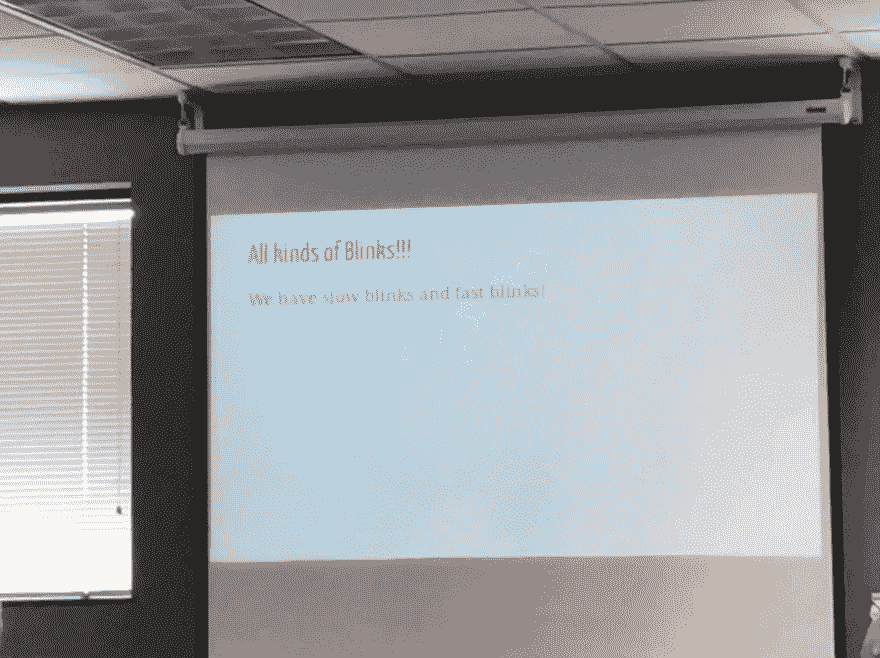

# JS&Friends Conf:用 Vue & Web 组件创建 HTML 标签

> 原文：<https://dev.to/aromig/js-friends-conf-creating-html-tags-with-vue-web-components-joe-erickson-4bg>

## 用 Vue 创建 HTML 标签& Web 组件- [乔·埃里克森](https://twitter.com/firstclown)

[](https://res.cloudinary.com/practicaldev/image/fetch/s--vNtskOa0--/c_limit%2Cf_auto%2Cfl_progressive%2Cq_auto%2Cw_880/https://thepracticaldev.s3.amazonaws.com/i/zqbnque0nqjhjs5e9dab.jpg)

技术电梯的 Joe 做了一个关于创建 web 组件的演讲。类似于之前的演讲；然而，乔的旋转涉及到使用 Vue 创建他们。

乔让我们回到了 1997 年:

*   深蓝击败卡斯帕罗夫
*   微软收购苹果公司的股份，拯救了该公司
*   《哈利·波特与魔法石》出版了
*   **所有主流浏览器都支持`<blink>`标签**

他打算那天把它带回来，至少当时是这样。Joe 完成了用 Vue CLI 构建初始代码并写出组件本身的步骤(使用创建闪烁动画的不同方法)。

### 创建组件

使用 Vue 的模板语法，组件可以在单独的标记、逻辑和样式块中编写。

闪烁。视图

```
<template>
  <span ref="blinkyText"><slot /></span>
</template>

<script>
  export default {
    name: "blink",
    props: {
      interval: {
        type: Number,
        default: 500
      }
    },
    mounted() {
      setInterval(() => {
        this.$refs.blinkyText.classList.toggle("onoff");
      }, this.interval);
    }
  };
</script>

<style>
  .onoff {
    visibility: hidden;
  }
</style> 
```

### 建筑构件

默认情况下，Vue CLI 设置其脚本来构建应用程序。*构建*脚本需要稍微调整一下。

package.json

```
...  "scripts":  {  "serve":  "vue-cli-service serve",  "build":  "vue-cli-service build --target wc --name my-blink 'src/components/Blink.vue'",  "lint":  "vue-cli-service lint"  },  ... 
```

现在可以执行`npm run build`了，它将被创建在 dist 文件夹中。将组件插入页面需要包含 blink.js 文件和 Vue 脚本——不要忘记标签本身！

```
<meta charset="utf-8" />
my-blink demo
<script src="https://unpkg.com/vue"></script>
<script src="./my-blink.js"></script>

<my-blink interval="1000">Blink every second</my-blink> 
```

> <video loop="" controls=""><source src="https://video.twimg.com/ext_tw_video/1157367182592004098/pu/vid/962x720/q_NFDJoxddEmG8-E.mp4?tag=10" type="video/mp4"></video>亚当·罗米格🐧🇵🇭@ Adam _ romig再次学习一些与 web 组件有关的整洁的东西。这次来自⁦的@第一小丑 ⁩.[# jsfriendsconf](https://twitter.com/hashtag/jsfriendsconf)2019 年 8 月 02 日下午 19:07[](https://twitter.com/intent/tweet?in_reply_to=1157367223230640130)[](https://twitter.com/intent/retweet?tweet_id=1157367223230640130)0[](https://twitter.com/intent/like?tweet_id=1157367223230640130)5

Joe 还向我们展示了他制作的真实有用的组件的例子，它们如何相互交互，以及如何一次性构建它们。仅仅因为它们是用 Vue 构建的，并不意味着它们必须在一个完全由 Vue 制作的应用程序中使用。只要调用 Vue 脚本，就可以在普通的 HTML 页面中使用它们。

虽然讨论和概念与 Martine 的相似，但是知道有一种不同的方法可以创建一个可以在非框架站点中自由使用的组件是非常重要的。

[←回主 JS &好友文章](https://dev.to/aromig/my-first-dev-conference-javascript-friends-fh7)