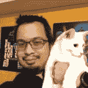
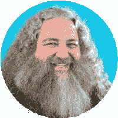

# 我的第一次开发会议:JavaScript &朋友

> 原文：<https://dev.to/aromig/my-first-dev-conference-javascript-friends-fh7>

本月早些时候，8 月 2 日星期五，我参加了我的第一次开发者大会。我一直在寻找更多的学习机会，当我听说将有一个对我来说有点本地的会议时，我想这将是我参加的一次很好的经历。我可以在一天之内从多位演讲者那里了解各种主题。每次演讲只有一个小时，我知道我不会带着对一两项新技能的完全了解离开，但也许我可以带走足够的东西来激励我寻找更多关于其中一些的信息。

所以我决定参加在俄亥俄州哥伦布市举行的第一届 [JavaScript 和朋友](https://www.javascriptandfriends.com/)会议。JS & Friends 是一个非营利性的会议，利用其收益帮助培养教育和包容性方面的本地(和远程)开发者社区。[的日程安排](https://www.javascriptandfriends.com/schedule)充满了许多关于 JavaScript 的有趣讲座——很难选择参加哪些会议。

## 从早晨开始

周五清晨，我踏上了前往位于环路另一端(哥伦布附近的 270 号州际公路)的 Quest 会议中心的道路。到得有点早，组织者让我在他们整理与会者徽章的时候自己吃早餐。顺便说一句，干得好！👍️支持水果选择。不久我就拿到了我的徽章，在去参加我的第一次会议之前，我等待着给每个人的欢迎信息。我在他们给我的会议单上做了一些笔记，作为去哪里的可能计划。我仍然不能 100%确定我要去哪一个，但正在缩小范围。

* * *

以下是我参加的会议的摘要。为了减少这篇文章的总长度，我将把这些部分分成他们自己的开发文章。

 [## JS & Friends Conf:Vue vs React 的利弊-米卢弗朗兹

### 亚当·罗米格·🇵🇭8 月 18 日 193 分钟阅读

#javascript #conference #vue #react](/aromig/js-friends-conf-pros-cons-of-vue-vs-react-milu-franz-4h6) [## JS&Friends Conf:掌握暗影 DOM - Martine Dowden

### 亚当·罗米格·🇵🇭8 月 18 日 192 分钟阅读

#javascript #conference #shadowdom #webcomponents](/aromig/js-friends-conf-mastering-shadow-dom-martine-dowden-dn8) [## JS&Friends Conf:测试他们的 JavaScript-Rob Tarr

### 亚当·罗米格·🇵🇭8 月 18 日 192 分钟阅读

#javascript #conference #testing #mocha](/aromig/js-friends-conf-test-them-javascripts-rob-tarr-4fo1)

* * *

## 午餐主题演讲- [盖伊·罗伊斯](https://twitter.com/guyroyse)

午餐期间，Guy 做了一个简短的非正式的关于代码语言学的演讲，特别是编程如何主要用英语，如果代码例程用另一种语言，比如西班牙语，会是什么样子。

不仅改变了单词，还改变了句子结构。他指出我们的函数调用也遵循英语的结构，即*名词.动词(宾语)*。然后，他向我们详细展示了如何将一个常见的 FizzBuzz 函数翻译成拉丁文

这是一次令人惊奇的旅行。我仍然希望看到用基于 Yoda 的结构( *object(名词))编码的框架。动词*？？).

* * *

 [## JS&Friends Conf:用 SQL 查询 NoSQL

### 亚当·罗米格·🇵🇭8 月 18 日 192 分钟阅读

#javascript #conference #nosql #couchbase](/aromig/js-friends-conf-querying-nosql-with-sql-matthew-groves-25j8) [## JS&Friends Conf:用 Vue & Web 组件创建 HTML 标签

### 亚当·罗米格·🇵🇭8 月 18 日 192 分钟阅读

#javascript #conference #shadowdom #webcomponents](/aromig/js-friends-conf-creating-html-tags-with-vue-web-components-joe-erickson-4bg) [## JS & Friends Conf:devo PS+IoT+Security-Diana Rodriguez

### 亚当·罗米格·🇵🇭8 月 18 日 193 分钟阅读

#conference #devops #iot #security](/aromig/js-friends-conf-devops-iot-security-diana-rodriguez-2g4e)

* * *

## 师徒小组&闭幕

在最后一次会议后，JS&Friends 主持了一个演讲者小组，他们给出了他们对指导的见解和经验，回答了我们其他人的问题。有很多很棒的问题和答案，不幸的是我记不太清楚了——我只知道这是一次很好很有帮助的讨论。我全神贯注地听，没有做任何笔记。

最后，我的第一次开发者大会是一次非常有趣的经历，我很高兴能够参加！我听到了各种各样的话题，建立了一些关系网，学到了一些东西，最重要的是，我走出了内向的舒适区，至少是一点点。我希望能参加明年的 JS&Friends 会议，以及任何和我一起的人。