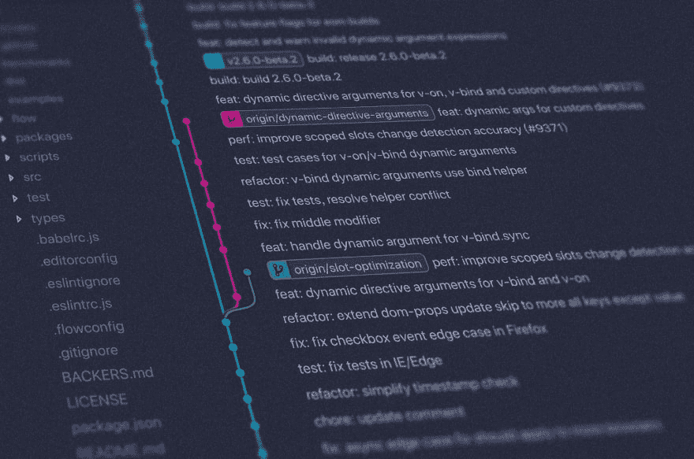
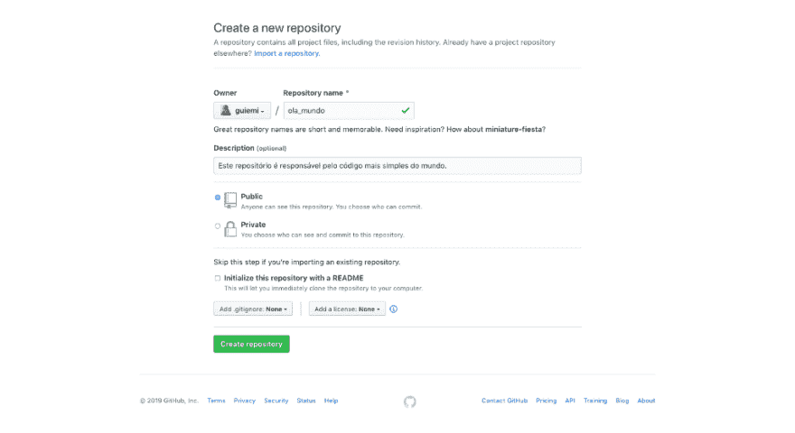
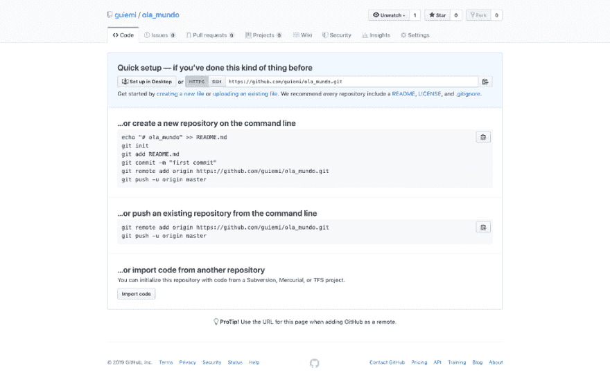
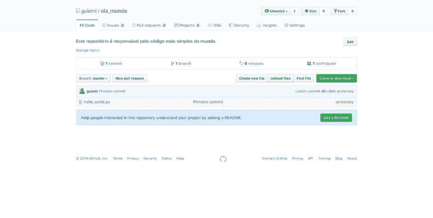
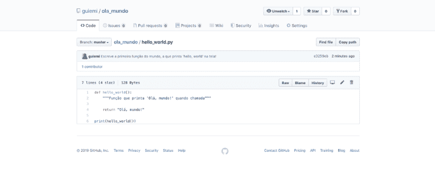
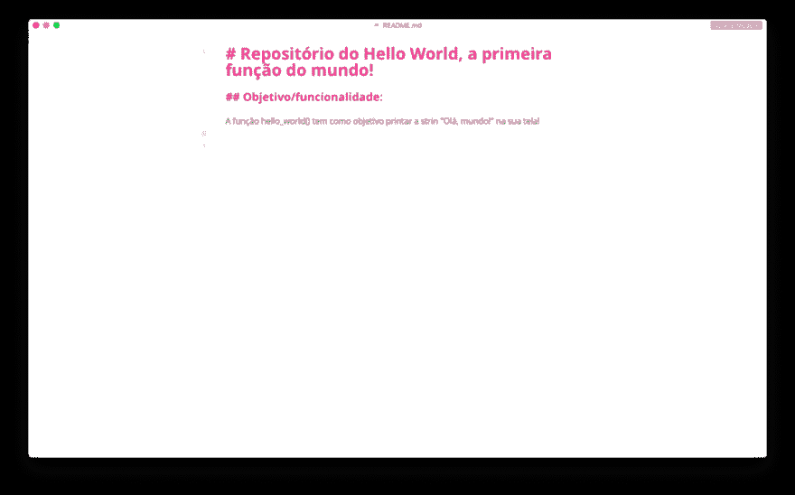
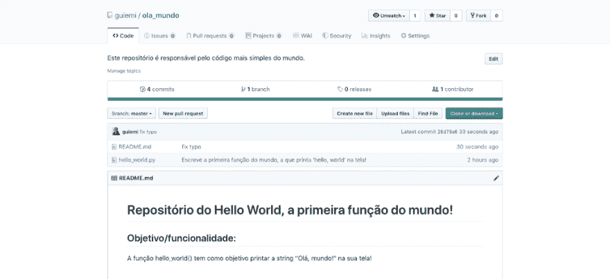

# Git 简介

> [https://dev . to/guiteixeira/introduction Cao-a-introduction Cao-ao-git-49 BP](https://dev.to/guiteixeira/introducao-a-introducao-ao-git-49bp)

学习如何使用 Git 创建本地存储库并将其托管在 GitHub 上

<figure>[](https://res.cloudinary.com/practicaldev/image/fetch/s--6a-UUKat--/c_limit%2Cf_auto%2Cfl_progressive%2Cq_auto%2Cw_880/https://cdn-images-1.medium.com/max/1024/1%2Av6XeL5ZKVBpwwZlqHp-Isw.jpeg) 

<figcaption>照片由[杨西敏](https://unsplash.com/@yancymin?utm_source=unsplash&utm_medium=referral&utm_content=creditCopyText)上[下](https://unsplash.com/search/photos/git?utm_source=unsplash&utm_medium=referral&utm_content=creditCopyText)</figcaption>

</figure>

### 先决条件

要从头到尾完成本教程，需要满足一些先决条件:

*   您计算机上安装和配置的 Git。我建议您使用官方文档安装 git，然后[在其上设置](https://git-scm.com/book/pt-br/v1/Primeiros-passos-Configura%C3%A7%C3%A3o-Inicial-do-Git)用户和电子邮件
*   您计算机上安装的编程语言(我将使用 Python 3)
*   [GitHub](https://github.com/join) 上的账号
*   um editor de textos([Sublime Text](https://www.sublimetext.com/download)， [Atom，](https://atom.io/) [Visual Studio Code，](https://code.visualstudio.com/download) [Vim](https://www.vim.org/download.php) 等。)

### Sobre este texto

在本教程中，您将学习如何在 GitHub 上创建存储库，如何在计算机上创建 Git 存储库，以及如何连接二者，以便您可以对文件进行版本控制。使用 Git 最基本的四个命令(git init、git add、git commit 和 git push)，您将拥有开始使用的基本工具。

### 但为什么一个□到□？

此文本涵盖创建和配置存储库所需的内容，并可通过对文件进行版本控制来发布更改。Git(亦为《T1》)文件所涵盖的知识，已经超出了我们的范畴，因为在这里我们既不会看到*标签，也不会看到*别名*。但是，在 post 结束时，您可以参考资料以了解更多信息。对于这个*的介绍*来说，就没有必要了。*

 *### 为什么 Git 毕竟很重要？

想象一下，在您的计算机上处理一个项目。一切都很顺利，直到您需要进行重大更改，这会影响到它的大部分功能。您可以使用一些工具:您可以制作代码的副本并将其保存到备份文件中，然后对其进行更改，而不必担心丢失以前的工作。如果计算机落入池中，还可以将项目保存到某些云托管服务中。这两种方案都行之有效，但工作非常繁重，似乎并未针对我们要解决的问题进行优化。

现在，假设您需要查看代码在开发的特定时刻的状态。您的云服务可能无法了解您想要回滚的确切时间。例如，对于生命中的 Dropbox，最重要的是以最新状态保存文件。对程序员如此重要的*日志被置于后台，往往被丢弃。*

Git 解决了所有这些问题，因为它是一个版本控制系统，在该系统中，您项目中的任何文件的每个重大更改都会通过我们所说的“T2”commits(想想“T4”commits)如果需要在不损害已经做的事情的情况下进行更改，Git 有一个“T6”分支的工具(分支)，它们有自己的*承诺*的历史，可以合并(或者原谅英语的话，】这样可以保存您的代码，同时保留足够的动态历史记录以支持您可能对代码进行的更改。

Git 的使用基本上有两种方式:通过 *shell* 或某种桌面客户端(例如 GitHub Desktop 或 gitkraken)。我们将使用*shell*——我强烈建议您在尝试具有视觉界面的工具之前先学习使用 Git，仅仅因为逐步学习将使您更好地了解客户端应用程序(如上述应用程序)的工作方式。

### 创建本地存储库

为了开始使用 Git 的基本指令，我们将在您的电脑上建立世界上最简单的专案，称为「T0」【程式-列印-大家好-萤幕上的世界】。我会用 Python，但你可以用你喜欢的语言。

*   要创建本地存储库，请打开您的终端并键入 mkdir hello _ world(“t0”make directory“”)，以创建名为“**hello _ world“**”的文件夹。
*   entre na pasta**hello _ world**usando o comando CD hello _ world(*换目录*)。
*   一旦我们进入新创建的工作目录，我们就可以开始使用 Git

#### 初始化 Git: git init

要初始化 Git，也就是说，要开始监视将要启动的项目中的更改，我们将使用 git init 命令。您的终端机可能传回类似这样的讯息:

```
Initialized empty Git repository in /Users/guiemi/hello_world/.git/ 
```

<svg width="20px" height="20px" viewBox="0 0 24 24" class="highlight-action crayons-icon highlight-action--fullscreen-on"><title>Enter fullscreen mode</title></svg> <svg width="20px" height="20px" viewBox="0 0 24 24" class="highlight-action crayons-icon highlight-action--fullscreen-off"><title>Exit fullscreen mode</title></svg>

git init 命令只是创建了一个名为的隐藏文件夹。git 包含 git 运行所需的全部内容。现在我们准备好追踪我们的档案了。

如果使用 git status，将看到以下消息:

```
On branch master

No commits yet

nothing to commit (create/copy files and use "git add" to track) 
```

<svg width="20px" height="20px" viewBox="0 0 24 24" class="highlight-action crayons-icon highlight-action--fullscreen-on"><title>Enter fullscreen mode</title></svg> <svg width="20px" height="20px" viewBox="0 0 24 24" class="highlight-action crayons-icon highlight-action--fullscreen-off"><title>Exit fullscreen mode</title></svg>

此消息表示一切正常，如果您要创建跟踪文件，Git 已就绪。这就是我们要做的：

*   我创建了一个名为 hello_world.py 的文件。您可以使用任意扩展名。为此，可以使用命令触摸:

```
touch hello_world.py 
```

<svg width="20px" height="20px" viewBox="0 0 24 24" class="highlight-action crayons-icon highlight-action--fullscreen-on"><title>Enter fullscreen mode</title></svg> <svg width="20px" height="20px" viewBox="0 0 24 24" class="highlight-action crayons-icon highlight-action--fullscreen-off"><title>Exit fullscreen mode</title></svg>

创建此新文件后，再次检查 Git 的状态(使用 git 状态)，并查看它显示的内容:

```
On branch master

No commits yet

Untracked files:
  (use "git add <file>..." to include in what will be committed)

hello_world.py

nothing added to commit but untracked files present (use "git add" to track) 
```

<svg width="20px" height="20px" viewBox="0 0 24 24" class="highlight-action crayons-icon highlight-action--fullscreen-on"><title>Enter fullscreen mode</title></svg> <svg width="20px" height="20px" viewBox="0 0 24 24" class="highlight-action crayons-icon highlight-action--fullscreen-off"><title>Exit fullscreen mode</title></svg>

此新消息表示 Git 已检测到文件夹中的新活动。也就是说，他希望我们把 **hello_world.py** 添加到(目前为空)跟踪文件的列表中。那我们就这么做。

### git 中的第一步

#### 去添加

使用 git add hello_world.py 命令，我们将把我们的文件添加到将成为“*commit*的一部分的文件列表中，即将成为“照片堆栈”一部分的“照片”。

你一定猜到了，运建办也对这个命令作出了反应，通过一个新的运建办地位，他会向我们展示发生了什么事:

```
On branch master

No commits yet

Changes to be committed:
  (use "git rm --cached <file>..." to unstage)

new file: hello_world.py 
```

<svg width="20px" height="20px" viewBox="0 0 24 24" class="highlight-action crayons-icon highlight-action--fullscreen-on"><title>Enter fullscreen mode</title></svg> <svg width="20px" height="20px" viewBox="0 0 24 24" class="highlight-action crayons-icon highlight-action--fullscreen-off"><title>Exit fullscreen mode</title></svg>

现在文件已添加，Git 将指示我们在需要时撤消 git add。既然不是我们的情况，我们下一步就是把添加的文件放入我们的照片中(o’t0’commit’t1’)。

#### 去委员会

> DICA:
> 
> 此时，重要的是要设置 **git** (前提条件中有)；否则他就认不出你，问你是谁。

从直觉上来说，你应该想象一下，对于我们的**【hello _ world】**只需键入 git commit 即可。你说得对。但有一个细节:git commit 打开了一个文本编辑器，它存在于您的操作系统中，因为提交过程只是拍摄我们代码的状态，然后命名该状态，这样我们就可以记住自上次“T2”提交“T3”以来所做的一切。就我们而言，这是我们第一次*提交*，所以没有什么比这样称呼更公平的了。由于您和我可能有不同的文字编辑器，所以我们会在 git commit 之后使用*旗标* -m ( *message* ，用于教学目的。这种*标志*告诉运建办，紧接其后用引号括起来的文字将作为名称，从而免除运建办尝试开启文字编辑器的需要。

```
git commit -m "Primeiro commit!" 
```

<svg width="20px" height="20px" viewBox="0 0 24 24" class="highlight-action crayons-icon highlight-action--fullscreen-on"><title>Enter fullscreen mode</title></svg> <svg width="20px" height="20px" viewBox="0 0 24 24" class="highlight-action crayons-icon highlight-action--fullscreen-off"><title>Exit fullscreen mode</title></svg>

太好了！您刚刚创建了您的第一个 *commit* ！现在是在 GitHub 上创建远程存储库的时候了。

### 在 GitHub 上创建和配置资源库

#### 创建资源库

从此处，**您需要在 GitHub，**上有一个帐户，因为我们将在这里创建将与我们本地存储库交互的远程存储库。登录 GitHub 后，下一步就是创建一个存储库。

[](https://res.cloudinary.com/practicaldev/image/fetch/s--5-QOXsa4--/c_limit%2Cf_auto%2Cfl_progressive%2Cq_auto%2Cw_880/https://cdn-images-1.medium.com/max/1024/1%2AM64Oxdo_QpKTpzfg59g3kw.png)

1.  在顶部导航栏中，单击“+，然后单击“**新存储库**，或者只需输入[:https://github . com/new](https://github.com/new)。
2.  命名您的存储库
3.  请编写简短说明，以便其他用户在阅读代码之前了解您的项目
4.  定义什么是公共汽车
5.  取消选中“*”选项以使用自述文件“*”初始化存储库。我们稍后将在本地创建自述文件。
6.  按 **Create repository** 按钮

#### 设置存储库

[](https://res.cloudinary.com/practicaldev/image/fetch/s--kXgTA5Py--/c_limit%2Cf_auto%2Cfl_progressive%2Cq_auto%2Cw_880/https://cdn-images-1.medium.com/max/1024/1%2A9BjA-VnbIVkpUFp7Vijnyg.png)

创建后，将出现一个新屏幕。它向您展示了连接本地存储库和远程存储库的四种方法:

1.  复制 HTTPS 或 SSH 地址(适用于已经知道自己在做什么的用户)
2.  在 shell 中创建新存储库，然后将其连接到远程(如果您还没有本地存储库，则指示)。这不是我们的情况)
3.  对于 GitHub，已经存在的本地存储库(“T0”)就是我们的情况！
4.  导入代码(指示要从另一个版本系统迁移到 Git 的用户)

#### 去推

现在我们已经知道要用哪种方法了，就用它吧。但首先，让我们来了解一下这些代码行的含义。

```
git remote add origin [https://github.com/guiemi/ola\_mundo.git](https://github.com/guiemi/ola_mundo.git)
git push -u origin master 
```

<svg width="20px" height="20px" viewBox="0 0 24 24" class="highlight-action crayons-icon highlight-action--fullscreen-on"><title>Enter fullscreen mode</title></svg> <svg width="20px" height="20px" viewBox="0 0 24 24" class="highlight-action crayons-icon highlight-action--fullscreen-off"><title>Exit fullscreen mode</title></svg>

第一行是指要求 **git** 添加**远程存储库**，并将其命名为**起源**。之后，您提供此远程存储库的地址；剩下的交给 Git。如果要检查您的**原点**是否真的在给定的 URL 上，请使用 git remote -v 命令( *verbose* 。

第二行是魔法发生的地方:

git push 告诉 **git** 你想**推**到你的远程存储库(o *起源*)那堆照片(os *commits* 。还记得他们吗？O -u origin master 是我们将仅在第一个 *push* 中使用的特殊参数。O -u 是 set-up 的缩写，它希望您将一个远程存储库(在本例中为‘T10’origin)和一个‘T12’branch 作为其参数传递。

*分行*应配有专门针对它们的全文，所以只要知道 Git 按惯例称*分行*为 **master** 的标准即可。这就是为什么我们把这个名字作为第二个 u 参数传递。

> *系统会提示您输入您的来源(GitHub)使用者与密码。为避免这种情况发生在今后的承诺中，请查阅文本末尾的“* ***【下一步】*** *！*

```
Enumerating objects: 3, done.
Counting objects: 100% (3/3), done.
Writing objects: 100% (3/3), 222 bytes | 74.00 KiB/s, done.
Total 3 (delta 0), reused 0 (delta 0)
To [https://github.com/guiemi/ola\_mundo.git](https://github.com/guiemi/ola_mundo.git)
 * [new branch] master -> master
Branch 'master' set up to track remote branch 'master' from 'origin'. 
```

<svg width="20px" height="20px" viewBox="0 0 24 24" class="highlight-action crayons-icon highlight-action--fullscreen-on"><title>Enter fullscreen mode</title></svg> <svg width="20px" height="20px" viewBox="0 0 24 24" class="highlight-action crayons-icon highlight-action--fullscreen-off"><title>Exit fullscreen mode</title></svg>

[](https://res.cloudinary.com/practicaldev/image/fetch/s--CNZtZIoN--/c_limit%2Cf_auto%2Cfl_progressive%2Cq_auto%2Cw_880/https://cdn-images-1.medium.com/max/1024/1%2AZhJXDQFuuUiddTOcxhaARw.png)

好了！文件 **hello_world.py** 已从存储库发送到*branch*masterfrom repository**OLA _ world**。

### 结论

本教程的主要目标到此结束，即使用四个基本命令:git status；**git add**；**git commit**e**git push**。我们看到了一些其他的，比如 **git remote** ，或者 **git init** 等。，但它们是配件，在日常生活中不一定会用到。如有必要，您将了解更多有关*分支*、*【merging】*、*标记*的信息，以及我们在这里稍微学习过的这款神奇工具的许多其他功能。

接下来的章节包含另外两个承诺，我们将在我们的***master**分支中进行--一个由事实上的 hello_world()函数组成，另一个由一个小自述文件组成。它们会帮助你练习你学到的东西。*

 *在最后一节中，有关于和**在哪里**学习 Git 的提示。

我特别感谢**【guilherme card oso】**、程序员、语言学家和 brvxo 在空缺时间对本教程进行技术审查。非常感谢大家：你他妈的 d+！

(您可以在这里找到卡多索 GUI:T2、T2[link in]、T4[github]t5、[Twitter](https://twitter.com/guilaolan)。）

### 附录 1:承担世界上最简单的功能

现在，我们的本地存储库和远程存储库正在彼此交谈，我们将编写一些简单的代码。在您喜爱的文字编辑器中开启档案【**【hello _ world】**，然后撰写列印字串的程式码，】在屏幕上。

```
# A primeira função do mundo!

def hello_world():
    """Função que printa 'Olá, mundo!' quando chamada"""

return "Olá, mundo!"

print(hello_world()) 
```

<svg width="20px" height="20px" viewBox="0 0 24 24" class="highlight-action crayons-icon highlight-action--fullscreen-on"><title>Enter fullscreen mode</title></svg> <svg width="20px" height="20px" viewBox="0 0 24 24" class="highlight-action crayons-icon highlight-action--fullscreen-off"><title>Exit fullscreen mode</title></svg>

现在，重复我们之前所做的添加、**、**和**的过程。**

 **> *别忘了:*
> 
> *1 .在有疑问时使用* *git 状态*
> 
> *2 .输入一条确认消息，简要说明代码*中更改/添加的内容
> 
> *3 .现在使用* *git push，而不是* *git push -u origin master，因为 git 已经知道我们的起源地址，也知道我们在哪个分支*

E *就是*！这是代码，在文件 **hello_world** 中

[](https://res.cloudinary.com/practicaldev/image/fetch/s--B4x7cTw3--/c_limit%2Cf_auto%2Cfl_progressive%2Cq_auto%2Cw_880/https://cdn-images-1.medium.com/max/1024/1%2AyRhp0rt5XRj6jsLu0Ic8yA.png)

### 附录 2:提交自述

但还有一件重要的事:自述！这些 Markdown 格式的文件用作我们存放在远程存储库中的文档。他们向访问存储库的人员介绍了我们的代码，并简要介绍了以下主题:

1.  你的代码是做什么的；
2.  它是用来做什么的；
3.  如何下载、安装和使用其功能；
4.  如何为项目做出贡献。

使用 **touch** 命令，创建一个名为☆的文件，打开它，然后写一个小说明。

[](https://res.cloudinary.com/practicaldev/image/fetch/s--p4YkMQFM--/c_limit%2Cf_auto%2Cfl_progressive%2Cq_auto%2Cw_880/https://cdn-images-1.medium.com/max/1024/1%2APOPfK8tfJ_pCwGwXwl6D6g.png)

写完简单的自述文件后，重复上述步骤( **git add** 、 **git commit** 、 **git push** )，看看其存储库是如何变化的:

[](https://res.cloudinary.com/practicaldev/image/fetch/s--uozSVZgC--/c_limit%2Cf_auto%2Cfl_progressive%2Cq_auto%2Cw_880/https://cdn-images-1.medium.com/max/1024/1%2A5xerSbbsi8_inBgqg7lvGw.png)

### 附录 3:下一步行动

*   Git 简史〔t0〕git-SCM〔t1〕
*   分支 e 合并( [git-scm](https://git-scm.com/book/pt-br/v1/Ramifica%C3%A7%C3%A3o-Branching-no-Git-B%C3%A1sico-de-Branch-e-Merge)
*   git fetch 和 git pull([qura](https://pt.quora.com/Qual-a-diferen%C3%A7a-entre-os-comandos-git-pull-e-git-fetch)
*   git —实用指南(“t0”Roger dudler【t1])
*   去克隆(123 t0)去 scm
*   电子书 gratuto Pro Git([Git-SCM](https://git-scm.com/book/pt-br/v2))
*   教程交互 sobre 分支([学习分支](https://learngitbranching.js.org/)
*   [Git+GitHub]避免在每次向 GitHub 推时输入用户和密码(媒体上的 Anderson Gomes)

**如果你喜欢这篇课文，别忘了给 50 鞭。这是一个小小的姿态，帮助这个博客接触更多的人！:)**

### 参考文献

*   最基本的 Git 命令和例子( [RubyGarage](https://rubygarage.org/blog/most-basic-git-commands-with-examples) )
*   Unix 实用程序([维基百科](https://pt.wikipedia.org/wiki/Utilit%C3%A1rios_Unix)
*   Linux Shell 命令([卡迪夫计算机科学学院&信息学](https://docs.cs.cf.ac.uk/notes/linux-shell-commands/)
*   初学者的终端！([中等](https://medium.com/@grace.m.nolan/terminal-for-beginners-e492ba10902a)
*   “git remote add”这个命令做什么，需要传递什么值？( [Quora](https://www.quora.com/What-does-the-command-do-git-remote-add-name_of_your_remote-url-and-what-values-need-to-be-passed) )
*   git 同步([阿特拉斯语](https://www.atlassian.com/git/tutorials/syncing)
*   第一步-git 的初始设置(“t0”git-SCM“”)
*   原产地是哪里？( [GitHowTo](https://githowto.com/pt-BR/what_is_origin) )
*   去推(123 t0 去-单片机)
*   '— set-upstream '是做什么的？( [stackoverflow](https://stackoverflow.com/questions/18031946/what-does-set-upstream-do)
*   文档字符串( [Python 帮助](https://pythonhelp.wordpress.com/2011/02/14/docstrings/))
*   崇高文字下载([崇高文字](https://www.sublimetext.com/download))
*   Atom 下载( [Atom.io](https://atom.io/) )
*   Visual Studio 代码下载( [Visual Studio 代码](https://code.visualstudio.com/download))
*   Vim 下载( [Vim 编辑](https://www.vim.org/download.php))

* * *****