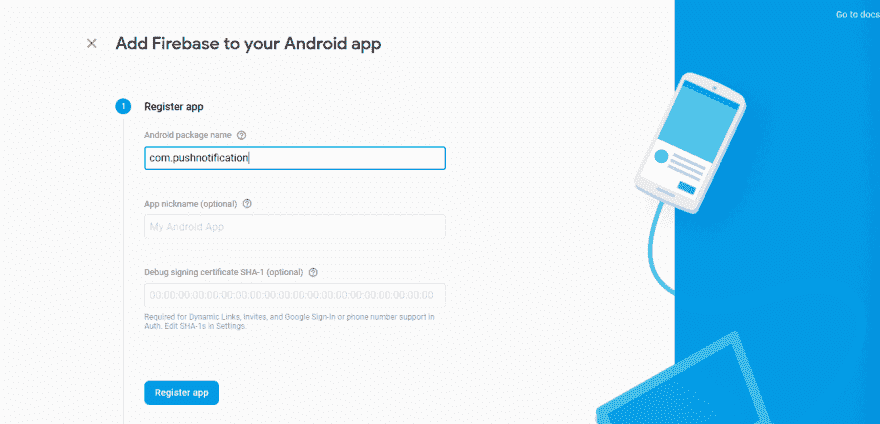
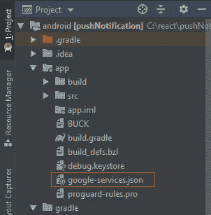
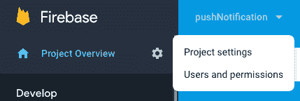

# 如何在 Android 的 React Native 中添加推送通知

> 原文：<https://dev.to/kapilgorve/how-to-add-push-notification-in-react-native-for-android-1a11>

我们将使用`react-native-firebase`在我们的 react-native 应用程序中添加推送通知，希望能节省您实现它的时间。

### 涉及的步骤:-

1.  创建反应原生项目
2.  在 firebase 控制台上创建应用程序
3.  添加 react-native-firebase
4.  添加 Firebase 消息和通知模块
5.  设备上的测试通知
6.  监听通知

让我们开始吧。

## 第一步。创建一个 React 本地项目

让我们创建一个 React 本地项目来开始实现推送通知服务。我用的是 [react-native@0.60.4](mailto:react-native@0.60.4) 这是我写这篇文章时的最新版本。转到终端并运行以下命令。

```
react-native init pushNotification 
```

您可以用您选择的项目名称替换`pushNotification`。

## 第二步。在 firebase 控制台上创建一个应用程序

让我们在 firebase 控制台上创建一个应用程序来使用 Firebase SDK。转到[这里](https://console.firebase.google.com/)并创建一个应用程序。

*   点击添加项目。
*   添加 iOS 和 Android 应用，按照步骤操作。确保**注册应用**部分中的项目名称与您的 react-native 项目匹配(在我们的例子中为`com.pushnotification`)。

## ——下载`google-services.json`粘贴到`/pushnotification/android/app/`里面。确保位置正确。

按照说明添加库并同步项目。这将看起来像这样

项目级 build.gradle

```
dependencies {
classpath("com.android.tools.build:gradle:3.4.1")
classpath 'com.google.gms:google-services:4.3.0' //Add this line
} 
```

应用级 build.gradle

```
dependendies {
implementation fileTree(dir: "libs", include: ["*.jar"])
implementation "com.facebook.react:react-native:+"
implementation 'com.google.firebase:firebase-core:17.0.1' // Add this line
implementation 'com.google.firebase:firebase-messaging:19.0.1' // Add this line

if (enableHermes) {
def hermesPath = "../../node_modules/hermesvm/android/";
debugImplementation files(hermesPath + "hermes-debug.aar")
releaseImplementation files(hermesPath + "hermes-release.aar")
} else {
implementation jscFlavor
}
}
//Add to the bottom of the file
apply plugin: 'com.google.gms.google-services' 
```

> 请使用最新的 firebase 依赖项。您也可以从 Android Studio 添加它，方法是:文件->项目结构->依赖项

## 第三步。添加反应原生火焰基地

转到您的项目根目录并运行此命令。

```
npm install react-native-firebase --save 
```

(可选)如果您的 react-native 版本低于 0.60，请链接该模块。

```
react-native link react-native-firebase 
```

> React 原生版(> 0.60)支持[自动链接](https://facebook.github.io/react-native/blog/2019/07/03/version-60#native-modules-are-now-autolinked)。

如果您在链接`react-native-firebase`时遇到问题，或者您正在使用 React Native 的早期版本，请遵循手动链接指南。

## React Native 的手动链接(<0.60)

查看官方[文档](https://rnfirebase.io/docs/v5.x.x/installation/android)了解更新方法。

### 安卓

将`react-native-firebase`添加到 App 级`build.gradle`

```
dependencies {
// ...
implementation project(':react-native-firebase') // Add this line
} 
```

编辑`settings.gradle`

```
//Add these lines
include ':react-native-firebase'
project(':react-native-firebase').projectDir = new File(rootProject.projectDir, '../node_modules/react-native-firebase/android') 
```

编辑`MainApplication.java`

```
import...
import io.invertase.firebase.RNFirebasePackage; // import core package

@Override
protected List<ReactPackage> getPackages() {
  return Arrays.<ReactPackage>asList(
    new MainReactPackage(),
    new RNFirebasePackage(), // Add this line
  );
} 
```

*   同步项目，我们准备好了。

## 第四步。添加 Firebase 消息和通知模块

我们必须包含其他模块，因为我们之前导入的`RNFirebasePackage`只提供核心特性。

将依赖项添加到`android/app/build.gradle`文件:

```
dependencies {
// ...
implementation 'com.google.firebase:firebase-messaging:19.0.1' 
```

}

```
* Edit `MainApplication.java`: 
```

java
导入...
//导入这两个包
导入 io . invertase . firebase . messaging . rnfirebasemesagingpackage；
导入 io . invertase . firebase . notifications . rnfirebase notifications package

@ Override
protected List get packages(){
return arrays . aslist(
new MainReactPackage()，
new rnfirebasemassegingpackage()，
new rnfirebasemassegingpackage()//添加这一行
new RNFirebaseNotificationsPackage()//添加这一行
)；
}

```
 - Sync Project and we are done.

> Check out [official docs](https://rnfirebase.io/docs/v5.x.x/links/android#Configure-Android-Project) for updated method.

## Step 5\. Test notification on the device[<svg aria-hidden="true" focusable="false" height="16" version="1.1" viewbox="0 0 16 16" width="16"><path fill-rule="evenodd" d="M4 9h1v1H4c-1.5 0-3-1.69-3-3.5S2.55 3 4 3h4c1.45 0 3 1.69 3 3.5 0 1.41-.91 2.72-2 3.25V8.59c.58-.45 1-1.27 1-2.09C10 5.22 8.98 4 8 4H4c-.98 0-2 1.22-2 2.5S3 9 4 9zm9-3h-1v1h1c1 0 2 1.22 2 2.5S13.98 12 13 12H9c-.98 0-2-1.22-2-2.5 0-.83.42-1.64 1-2.09V6.25c-1.09.53-2 1.84-2 3.25C6 11.31 7.55 13 9 13h4c1.45 0 3-1.69 3-3.5S14.5 6 13 6z"></path></svg>](#Step-5-Test-notification-on-the-device)

Now that we have added all the required libraries hence we should be able to receive a notification. Let's test it out but _first make sure your app is in background._

1\. Go to firebase console
2\. Click on **Cloud Messaging** on the left panel.
3\. Click on **Send your first message**.
4\. Enter **Notification text** -> Click **Next** ->Choose **Target** ->Select app in **User Segment**.
5\. Publish notification and check device.

I hope you're able to get a _test notification_ on your device. Let's move on to next section.

## Step 6\. Listening Notifications[<svg aria-hidden="true" focusable="false" height="16" version="1.1" viewbox="0 0 16 16" width="16"><path fill-rule="evenodd" d="M4 9h1v1H4c-1.5 0-3-1.69-3-3.5S2.55 3 4 3h4c1.45 0 3 1.69 3 3.5 0 1.41-.91 2.72-2 3.25V8.59c.58-.45 1-1.27 1-2.09C10 5.22 8.98 4 8 4H4c-.98 0-2 1.22-2 2.5S3 9 4 9zm9-3h-1v1h1c1 0 2 1.22 2 2.5S13.98 12 13 12H9c-.98 0-2-1.22-2-2.5 0-.83.42-1.64 1-2.09V6.25c-1.09.53-2 1.84-2 3.25C6 11.31 7.55 13 9 13h4c1.45 0 3-1.69 3-3.5S14.5 6 13 6z"></path></svg>](#Step-6-Listening-Notifications)

This part involves three steps: -

1\. Check Permissions
2\. Request Permissions
3\. Listen for Notifications

## Check Permissions[<svg aria-hidden="true" focusable="false" height="16" version="1.1" viewbox="0 0 16 16" width="16"><path fill-rule="evenodd" d="M4 9h1v1H4c-1.5 0-3-1.69-3-3.5S2.55 3 4 3h4c1.45 0 3 1.69 3 3.5 0 1.41-.91 2.72-2 3.25V8.59c.58-.45 1-1.27 1-2.09C10 5.22 8.98 4 8 4H4c-.98 0-2 1.22-2 2.5S3 9 4 9zm9-3h-1v1h1c1 0 2 1.22 2 2.5S13.98 12 13 12H9c-.98 0-2-1.22-2-2.5 0-.83.42-1.64 1-2.09V6.25c-1.09.53-2 1.84-2 3.25C6 11.31 7.55 13 9 13h4c1.45 0 3-1.69 3-3.5S14.5 6 13 6z"></path></svg>](#Check-Permissions)

We need to ensure that user has granted required permissions so that we can receive Notifications:

- 

Import firebase module. 
```

从“react-native-firebase”导入 fire base；

```
 - 

Check for permission in `componentDidMount()`. If permission hasn't been granted then ask for permission in `askPermission()` otherwise fetch the `token`. 
```

async componentdimount(){
const granted = await firebase . messaging()。has permission()；
if(granted){
this . fetchtoken()；
} else {
this . ask permission()；
}
}

```
 ## Request Permissions[<svg aria-hidden="true" focusable="false" height="16" version="1.1" viewbox="0 0 16 16" width="16"><path fill-rule="evenodd" d="M4 9h1v1H4c-1.5 0-3-1.69-3-3.5S2.55 3 4 3h4c1.45 0 3 1.69 3 3.5 0 1.41-.91 2.72-2 3.25V8.59c.58-.45 1-1.27 1-2.09C10 5.22 8.98 4 8 4H4c-.98 0-2 1.22-2 2.5S3 9 4 9zm9-3h-1v1h1c1 0 2 1.22 2 2.5S13.98 12 13 12H9c-.98 0-2-1.22-2-2.5 0-.83.42-1.64 1-2.09V6.25c-1.09.53-2 1.84-2 3.25C6 11.31 7.55 13 9 13h4c1.45 0 3-1.69 3-3.5S14.5 6 13 6z"></path></svg>](#Request-Permissions)

Request the permissions if not already granted. This step is very important in case for iOS Plateform.

- 

Ask permission if not already granted. Fetch token once the permission is granted 
```

async ask permission(){
try {
await firebase . messaging()。request permission()；
console.log('允许权限')；
this . fetchtoken()；
} catch(错误){
console.log('权限被拒绝')；
}
}

```
 - 

Check if the token is already saved. If not then `getToken` from `firebase` module and save it in `AsyncStorage`. 
```

async fetchToken(){
let FCM token = await async storage . getitem(' FCM token ')；
如果(！fcmToken){
fcmToken = await fire base . messaging()。getToken()；
if(FCM token){
wait async storage . setitem(' FCM token '，FCM token)；
}
}
}

```
 ## Listen for Notifications[<svg aria-hidden="true" focusable="false" height="16" version="1.1" viewbox="0 0 16 16" width="16"><path fill-rule="evenodd" d="M4 9h1v1H4c-1.5 0-3-1.69-3-3.5S2.55 3 4 3h4c1.45 0 3 1.69 3 3.5 0 1.41-.91 2.72-2 3.25V8.59c.58-.45 1-1.27 1-2.09C10 5.22 8.98 4 8 4H4c-.98 0-2 1.22-2 2.5S3 9 4 9zm9-3h-1v1h1c1 0 2 1.22 2 2.5S13.98 12 13 12H9c-.98 0-2-1.22-2-2.5 0-.83.42-1.64 1-2.09V6.25c-1.09.53-2 1.84-2 3.25C6 11.31 7.55 13 9 13h4c1.45 0 3-1.69 3-3.5S14.5 6 13 6z"></path></svg>](#Listen-for-Notifications)

Firebase Notifications can be of three different types:

- notification-only messages from FCM
- notification + data messages from FCM
- local notifications

A notification will trigger one of these listeners depending on the state of your application:

- onNotificationDisplayed - Triggered when a particular notification has been displayed.
- onNotification - Triggered when a particular notification has been received
- onNotificationOpened - Triggered when your app is in background and opened when a notification is clicked.
- 

getInitialNotification - Triggered when your app is closed and opened when a notification is clicked. 
```

componentdimount(){
this . notificationdisplayedlistener = firebase . notifications()。onNotificationDisplayed((notification)=>{
//根据需要处理您的通知
})；

this . notification listener = firebase . notifications()。on notification((notification)= > {
//根据需要处理您的通知
})；

//应用程序(在后台)由通知打开
this . notificationopenedlistener = firebase . notifications()。onNotificationOpened((notification open)=>{
//获取正在打开的通知所触发的动作
const action = notification open . action；
//获取已打开通知的信息
const notification = notification open . notification；
})；

//应用程序由通知打开
const notification open = await firebase . notifications()。getInitialNotification()；
if (notificationOpen) {
//获取正在打开的通知所触发的动作
const action = notification open . action；
//获取已打开通知的信息
const notification = notification open . notification；
}
}

```
 componentWillUnmount() {this.notificationDisplayedListener();this.notificationListener();this.notificationOpenedListener();} 
```

> *注意:不幸的是，在 Android 上，无法访问打开的远程通知的标题和正文。如果需要，您可以使用远程通知的数据部分来提供这些信息。*

我希望你现在能够成功地收到通知。

# 如何从服务器触发推送通知

我们将使用`fcm-node`节点模块来简化我们的任务。
你需要两件东西来触发通知。

1.  来自 Firebase 控制台的服务器密钥。
2.  来自设备的注册令牌。##按照以下简单步骤从 Firebase 控制台获取服务器密钥:
3.  转到 [Firebase 控制台](https://console.firebase.google.com)。
4.  进入**项目概述**，打开**项目设置**。
5.  转到**云消息**并从*项目凭证*中复制*服务器密钥*# #从设备>中获取注册令牌检查我们之前编写的`fetchToken()`函数

从 AsyncStorage 获取令牌。

```
let fcmToken = await AsyncStorage.getItem('fcmToken'); 
```

现在我们准备好从服务器触发通知。

## 发送推送通知

在根服务器项目中运行此命令，并安装所需的模块。

```
$ npm install fcm-node 
```

发送推送通知需要 3 个简单的步骤:

## 第一步。导入模块并安装服务器密钥。

```
 var FCM = require('fcm-node');
    var serverKey = 'SERVER_KEY'; //put your key here
    var fcm = new FCM(serverKey); //pass it to FCM constructor 
```

## 第二步。定义要发送的消息正文

```
var message = { //based on message type (single recipient, multicast, topic, et cetera)
        to: 'registration_token', // saved in fcmToken variable
        collapse_key: 'your_collapse_key', //if you want the notification to be collapsible

        notification: {
            title: 'Title of your push notification',
            body: 'Body of your push notification'
        },

        data: { //you can send only notification or only data(or include both)
            my_key: 'my value',
            my_another_key: 'my another value'
        }
    }; 
```

**如果你希望通知是可折叠的**意味着通知可能在某种意义上被另一个具有相同 collapse_key 值的类似消息‘覆盖’。让我更详细地解释一下`collapse_key`。

> 如果已经存储了具有相同折叠密钥(和注册令牌)的消息并等待传递，旧消息将被丢弃，新消息将取而代之(也就是说，旧消息将被新消息折叠)。但是，如果没有设置折叠键，新邮件和旧邮件都将被存储，以备将来传递。

请访问此链接，进一步了解消息正文的不同有效负载属性:[https://firebase . Google . com/docs/cloud-messaging/http-server-ref # notification-payload-support](https://firebase.google.com/docs/cloud-messaging/http-server-ref#notification-payload-support)

## 第三步。发通知

```
fcm.send(message, function(err, response){
    if (err) {
        console.log("Something has gone wrong!");
    } else {
        console.log("Successfully sent with response: ", response);
    }
}); 
```

就是这样。我们已成功完成设置我们的服务器触发推送通知。

这篇文章最初发表于[https://www.jskap.com/blog/push-notification-react-native/](https://www.jskap.com/blog/push-notification-react-native/)

👋嗨！我是卡皮尔。我总是喋喋不休地谈论建造东西，分享我的知识，自由职业。来 https://twitter.com/kapilgorve 和我打招呼吧