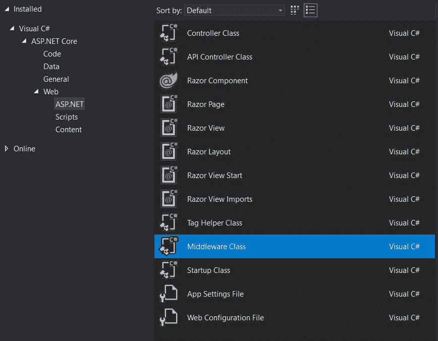

# 采用 ASP.NET 核心 2.2 的多租户应用-入门

> 原文：<https://dev.to/agrothe/multi-tenant-applications-with-asp-net-core-2-2-getting-started-16n3>

随着软件即服务越来越普遍，多租户已经成为大多数 web 应用程序的基本要求。本系列将概述我如何在. NET 核心 Web 应用程序中实现这一点。

虽然这篇文章主要是一个自我文档练习，所以我下次不会忘记，希望它能帮助其他有类似需求的人。我将重点介绍最新的稳定版。NET 核心，目前是 2.2 版，并有望更新。NET Core 3 一旦迁移到 GA。

我已经从 Visual Studio 2019 开始，并使用了配置有 Razor 页面和个人用户帐户的 ASP.NET 核心 Web 应用程序模板。虽然我喜欢 ASP.NET 身份带来的功能，但我不喜欢他们仍然使用`GUID`作为主键。

首先，我将`IdentityUser`改为使用`int`或`long`作为主键。你可以[按照这篇博客文章](https://adrientorris.github.io/aspnet-core/identity/extend-user-model.html)扩展`IdentityUser`，但是添加你喜欢的数据类型。

所以代替

```
public class ApplicationUser : IdentityUser
{
    ...
} 
```

使用此

```
public class ApplicationUser : IdentityUser<long>
{
    ...
} 
```

并且在你覆盖`IdentityUser`的任何地方插入`IdentityUser<long>`来代替。

现在，虽然您可以在应用程序中使用任何您喜欢的方法来标识租户，但我更喜欢使用子域。我们要做的第一件事是将当前子域注入到我们的`HttpContext`中。

通过在解决方案资源管理器中右键单击 Add => New Item 来创建一个新类。找到中间件类条目，并将其命名为 TenantInjector 或您喜欢的名称。

[](https://res.cloudinary.com/practicaldev/image/fetch/s--cOzfU1nh--/c_limit%2Cf_auto%2Cfl_progressive%2Cq_auto%2Cw_880/https://thepracticaldev.s3.amazonaws.com/i/jnfs83leg6j5grssggkm.JPG)

这给了我们一个可以扩展的基本中间件类。注意`Invoke`方法:

```
public Task Invoke(HttpContext httpContext)
{
    return _next(httpContext);
} 
```

我们将在这里做两件事。先把它做成`async`。其次，添加一些逻辑，使当前子域作为`HttpContext`中的`CurrentTenant`属性可用。

```
public async Task Invoke(HttpContext httpContext)
{
    var tenant = string.Empty;

    if (httpContext.Request.Host.Host.Contains("."))
    {
        tenant = httpContext.Request.Host.Host.Split('.')[0].ToLowerInvariant();
        httpContext.Items.Add("CURRENT_TENANT", tenant);
    }
    else
    {
        httpContext.Items.Add("CURRENT_TENANT", httpContext.Request.Host.Host);
    }

    await _next(httpContext);
} 
```

请注意我们是如何使用`async Task`而不仅仅是`Task`，并用`await`替换了`return`。

在其余的逻辑中，如果子域存在，我们就提取子域，如果子域不存在，就使用 TLD。

所以:

```
demo.domain.com    => tenant of "demo".
domain.com         => tenant of "domain".
localhost:4433     => tenant of "localhost". 
```

为了使开发更容易，我在我的主文件中添加了一些条目:

```
127.0.0.1   demo.domain.com
127.0.0.1   demo2.domain.com 
```

现在我们可以转到我们的`Startup.cs`并将下面一行添加到`Configure`方法中:

```
app.UseTenantInjector(); 
```

所以现在我们可以通过使用`HttpContext.Items["CURRENT_TENANT"].ToString()`在我们的任何控制器中访问当前的租户。

我自己确实喜欢依赖注入，所以让我们继续并重构它以使用服务。

让我们添加一个新接口`ITenantResolver`和类`TenantResolver`。他们应该看起来像这样:

```
public interface ITenantResolver
{
    string CurrentTenant();
}

public class TenantResolver : ITenantResolver
{
    private readonly IHttpContextAccessor _httpContextAccessor;

    public TenantResolver(IHttpContextAccessor httpContextAccessor)
    {
        _httpContextAccessor = httpContextAccessor;
    }

    private string Current_Tenant { get; set; }

    public void SetTenant()
    {
        _httpContextAccessor.HttpContext.Items.TryGetValue(Const.CURRENT_TENANT, out object currentTenant);
        if (currentTenant != null)
        {
            Current_Tenant = currentTenant.ToString();
        }
    }

    public string CurrentTenant()
    {
        if (string.IsNullOrEmpty(Current_Tenant))
        {
            SetTenant();
        }
        return Current_Tenant;
    }
} 
```

将其连接到去离子容器:

```
services.AddScoped<ITenantResolver, TenantResolver>(); 
```

现在我们可以简单地在任何需要的地方注射我们的`TenantResolver`。

```
@inject  ITenantResolver tenantResolver
<p>Current Tenant = @tenantResolver.CurrentTenant()</p> 
```

在下一篇文章中，我们将修改我们的`Login`方法，以确保当前用户可以使用`Claims`访问当前域。