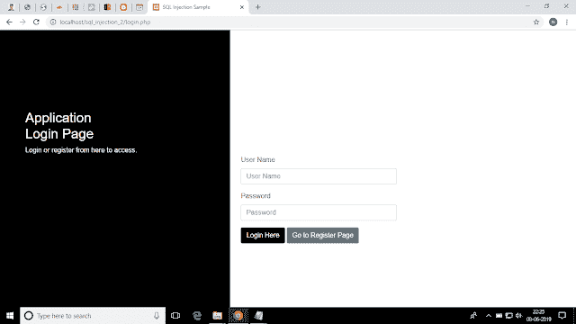
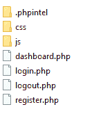
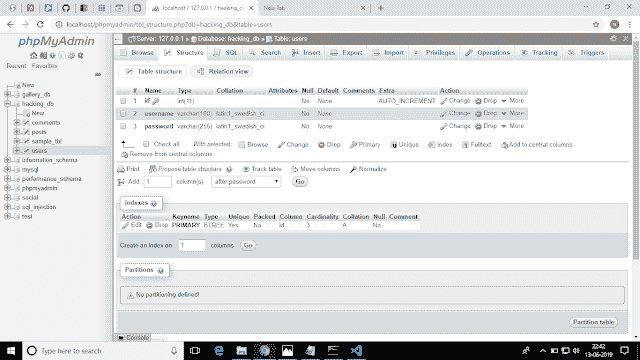
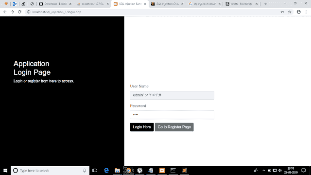

# SQL 逐步注入第 1 部分

> 原文：<https://dev.to/nileshsanyal/sql-injection-step-by-step-part-1-14o>

这是我个人博客的一篇文章，位于[这里](https://www.devhelperworld.in/2019/06/sql-injection-part-1.html)

如果你想一步一步地学习 SQL 注入，那么读完这篇文章将帮助你通过例子一步一步地理解 SQL 注入。

为了一步一步地理解 SQL 注入，本文提供了一组实用的例子，这样你就不会觉得用例子一步一步地理解 SQL 注入很难了。

SQL 注入是 web 应用程序的一个常见漏洞。如果 web 开发人员没有注意到这个漏洞，那么它会导致系统所有数据的完全泄露，并且这个列表还会增长！

在我之前的帖子中，我写了什么是 SQL 注入，它是如何运作的，以及可以对 SQL 注入做些什么。如果你还没有浏览那篇文章，请在这里阅读它，然后回到这篇文章。

**重要提示**

请注意，本文中提供的所有信息仅用于教育目的。

让我们看看如何对应用程序使用 **sql 注入**，但是在此之前，我们需要从头开始创建应用程序。

**我们将创造什么**

我们将用 PHP 为一个 web 应用程序建立一个注册和登录页面。

[](https://res.cloudinary.com/practicaldev/image/fetch/s--gYIQyliR--/c_limit%2Cf_auto%2Cfl_progressive%2Cq_auto%2Cw_880/https://1.bp.blogspot.com/-A2LGEHyaqj4/XPvo1X3scEI/AAAAAAAAAxI/T98WH8vW9BQU_JmpKpBnsTy_5i-mnVSVQCPcBGAYYCw/s640/app_login.png)

**所需技能**

以下技术的基本知识是必要的。

*   超文本标记语言
*   半铸钢ˌ钢性铸铁(Cast Semi-Steel)
*   Jquery / Javascript
*   引导程序
*   服务器端编程语言（Professional Hypertext Preprocessor 的缩写）
*   结构化查询语言

**所需工具/软件**

**本地网络服务器**

这是必需的，因为 PHP 是一种服务器端脚本技术，所以为了运行 PHP 脚本，我们需要一个本地 web 服务器，因为它非常容易使用，而且完全免费。我将使用 XAMPP 作为本地网络服务器。

**文本编辑器/ IDE(集成开发环境)**

用于编写代码的文本编辑器/ IDE。我个人在很长一段时间内更喜欢崇高的文本。但是，现在，我开始使用 Visual Studio 代码，我非常喜欢它的一切。

**项目总体结构**

[](https://res.cloudinary.com/practicaldev/image/fetch/s--0KO0v_Ns--/c_limit%2Cf_auto%2Cfl_progressive%2Cq_auto%2Cw_880/https://1.bp.blogspot.com/-wWqrJHWaYiA/XPfbpKF5dYI/AAAAAAAAAww/hFzldj9lOrgc7B-hujXxaUFxHuJWeGTEQCPcBGAYYCw/s400/project_structure.png)

**关于项目结构的讨论**

*。phpintel* :如果我们使用 phpintel 插件来升华文本，这个文件是自动生成的。
所有其他文件。php 扩展是自解释的。例如，register.php 包含 HTML 标记以及注册所需的 PHP 脚本等。

这个文件夹包含了这个项目所需的所有 css(层叠样式表)文件。

*js* :包含了本项目使用的所有 javascript 文件。

所有其他文件。php 扩展是自解释的。例如，register.php 包含 HTML 标记以及注册所需的 PHP 脚本等。

**创建数据库和用户表**

打开浏览器，在 url 中键入“[http://localhost/phpmyadmin](http://localhost/phpmyadmin)”，然后创建一个数据库为“hacking_db”，创建一个表为“users”。

用户表结构的屏幕截图如下。

[](https://res.cloudinary.com/practicaldev/image/fetch/s--x2qugT8u--/c_limit%2Cf_auto%2Cfl_progressive%2Cq_auto%2Cw_880/https://1.bp.blogspot.com/-f1IpilQS_fs/XQKE7sTVSfI/AAAAAAAAA0Y/36pzd_9tzUI7RDLgCxByntseA_8h014gwCPcBGAYYCw/s640/table_setup.png)

register.php 的代码如下所示。

```
<!DOCTYPE html>
<html lang="en">
   <head>
      <meta charset="UTF-8">
      <title>SQL Injection Sample</title>
      <link href="css/bootstrap.min.css" rel="stylesheet" id="bootstrap-css">
      <link href="css/custom.css" rel="stylesheet">
   </head>
   <body>

      <div class="sidenav">
         <div class="login-main-text">
            <h2>Application<br> Registration Page</h2>
            <p>Login or register from here to access.</p>
         </div>
      </div>
      <div class="main">
         <div class="col-md-6 col-sm-12">
            <div class="login-form">
               <form method="post" action="register.php">
                  <?php 
                     $error_message = '';
                     if($error_message != ''){ 
                  ?>
                  <div class="alert alert-warning alert-dismissible fade show" role="alert">
                    <!-- <strong>Error!</strong>  -->
                    <?php

                        echo $error_message != '' ? $error_message : ''; 
                     ?>
                    <button type="button" class="close" data-dismiss="alert" aria-label="Close">
                      <span aria-hidden="true">&times;</span>
                    </button>
                  </div>
                  <?php } ?>

                  <?php
                        $success_message = '';
                        if($success_message != '') {
                  ?>

                  <div class="alert alert-success alert-dismissible fade show" role="alert">
                    <!-- <strong>Error!</strong>  -->
                    <?php

                        echo $success_message != '' ? $success_message : ''; 
                     ?>
                    <button type="button" class="close" data-dismiss="alert" aria-label="Close">
                      <span aria-hidden="true">&times;</span>
                    </button>
                  </div>

                  <?php 
                        }
                   ?>

                  <div class="form-group">
                     <label>User Name</label>
                     <input type="text" class="form-control" placeholder="User Name" name="username">
                  </div>
                  <div class="form-group">
                     <label>Password</label>
                     <input type="password" class="form-control" placeholder="Password" name="password">
                  </div>
                  <div class="form-group">
                     <label>Confirm Password</label>
                     <input type="password" class="form-control" placeholder="Password" name="confirm_password">
                  </div>
                  <!-- <button type="submit" class="btn btn-secondary">Go to Login Page</button> -->
                  <a class="btn btn-secondary" href="login.php">Go to Login Page</a>
                  <button type="submit" name="submitBtn" class="btn btn-black">Register Here</button>
               </form>
               <?php
                  $conn = mysqli_connect("localhost", "root", "", "hacking_db");
                  if(!$conn){
                     die("connection error");
                  }

                  if(isset($_POST['submitBtn'])) {
                     $username = $_POST['username'];
                     $password = $_POST['password'];

                     $confirm_password = $_POST['confirm_password']; 
                     if(trim($username) == '') {
                        $error_message = "Username can not be left empty!<br>";
                     }
                     else if(trim($password) == '') {
                        $error_message .= "Password can not be left empty!<br>";
                     }
                     else if(trim($confirm_password) == '') {
                        $error_message .= "Confirm password can not be left empty!<br>";
                     }
                     else if($password != $confirm_password) {
                        $error_message .= "Password and confirm password must be same!<br>";
                     } else {
                        // $password = password_hash($_POST['password'], PASSWORD_BCRYPT) ;
                        $insert_sql = "insert into `users`(username,password) values('$username','$password')";
                        mysqli_query($conn,$insert_sql);
                        if(mysqli_affected_rows($conn) > 0){
                           $success_message = "User registered successfully!<br>";
                        }
                        else{
                           $error_message .= "Error registering user, please try again later<br>";
                        }
                     } 
                  }
               ?>
            </div>
         </div>
      </div>

      <script src="js/jquery.min.js"></script>
      <script src="js/bootstrap.min.js"></script>

   </body>
</html> 
```

<svg viewBox="0 0 448 512" class="highlight-action highlight-action--fullscreen-on"><title>Enter fullscreen mode</title></svg> <svg viewBox="0 0 448 512" class="highlight-action highlight-action--fullscreen-off"><title>Exit fullscreen mode</title></svg>

**register.php 的解释**

在 register.php，用户被要求输入他或她的用户名、密码和确认密码。然后，我们只需检查用户名、密码和确认密码字段不能为空，如果任何字段为空，则通知用户填写该特定详细信息。

用户还需要确保密码和确认密码字段具有相同的值。如果正确填写了每个字段并提交了表单，“用户注册成功！”向用户显示消息。

login.php 的代码如下所示。

```
<?php session_start(); ?>
<!DOCTYPE html>
<html lang="en">
   <head>
      <meta charset="UTF-8">
      <title>SQL Injection Sample</title>
   </head>
   <body>
      <link href="css/bootstrap.min.css" rel="stylesheet" id="bootstrap-css">
      <link href="css/custom.css" rel="stylesheet">
      <script src="js/bootstrap.min.js"></script>
      <script src="//code.jquery.com/jquery-1.11.1.min.js"></script>
      <div class="sidenav">
         <div class="login-main-text">
            <h2>Application<br> Login Page</h2>
            <p>Login or register from here to access.</p>
         </div>
      </div>
      <div class="main">
         <div class="col-md-6 col-sm-12">
            <div class="login-form">
               <form method="post" action="login.php">
                  <div class="form-group">
                     <label>User Name</label>
                     <input type="text" class="form-control" placeholder="User Name" name="username">
                  </div>
                  <div class="form-group">
                     <label>Password</label>
                     <input type="password" class="form-control" placeholder="Password" name="password">
                  </div>
                  <button type="submit" class="btn btn-black" name="loginBtn">Login Here</button>
                  <a class="btn btn-secondary" href="register.php">Go to Register Page</a>

                  <a href="forgot_password.php?message=Email" class="btn btn-link">Forgot Your Password?</a>
               </form>
               <?php
                  if(isset($_POST['loginBtn'])) {
                     $conn = mysqli_connect("localhost", "root", "", "hacking_db");
                     if(!$conn){
                        die("connection error");
                     }
                     $username = mysqli_real_escape_string($conn, $_POST['username']);
                     $password = mysqli_real_escape_string($conn, $_POST['password']);

                     if(trim($username) == '') {
                        echo "Username can not be left empty!";
                     }
                     else if(trim($password) == '') {
                        echo "Password can not be left empty!";
                     }

                     else{
                        // $hashed_password = password_hash($_POST['password'], PASSWORD_BCRYPT) ;
                        $verify_sql = "select * from `users` where username='$username' and password='$password'";
                        $result = mysqli_query($conn,$verify_sql);

                        $row = mysqli_fetch_array($result);

                        if(mysqli_num_rows($result) > 0){

                           // if (password_verify($password, $row['password'])) {
                              $_SESSION['session_username'] = $username;
                              header('Location: dashboard.php');
                           // }
                           /*else {
                              echo 'Incorrect password, please try again!';
                           }*/
                        }
                        else{
                           echo "No user exists, please register to continue!";
                        }
                        mysqli_close($conn);

                     }
                  }
               ?>
            </div>
         </div>
      </div>
   </body>
</html> 
```

<svg viewBox="0 0 448 512" class="highlight-action highlight-action--fullscreen-on"><title>Enter fullscreen mode</title></svg> <svg viewBox="0 0 448 512" class="highlight-action highlight-action--fullscreen-off"><title>Exit fullscreen mode</title></svg>

**login.php 的解释**

在 login.php，用户被要求输入他或她的用户名和密码。然后，使用 MySQL 数据库中预先存在的凭据检查该凭据。如果找到匹配项，用户名将存储在会话中，用户将被重定向到仪表板页面。如果没有找到匹配，则通知用户注册。

dashboard.php 的代码如下所示。

```
<?php session_start(); ?>
<?php
    if($_SESSION['session_username'] !='' && !empty($_SESSION['session_username'])){
?>
<!DOCTYPE html>
<html lang="en">
    <head>
        <meta charset="UTF-8">
        <title>Dashboard Page</title>
        <link href="css/bootstrap.min.css" rel="stylesheet" id="bootstrap-css">
        <link href="css/dashboard.css" rel="stylesheet">
    </head>
    <body>
        <nav class="navbar navbar-expand-lg navbar-dark fixed-top" id="mainNav">
            <button class="navbar-toggler navbar-toggler" type="button" data-toggle="collapse" data-target="#navbarResponsive" aria-controls="navbarResponsive" aria-expanded="false" aria-label="Toggle navigation"><span class="navbar-toggler-icon"></span></button>
            <div class="collapse navbar-collapse" id="navbarResponsive">
                <ul class="navbar-nav navbar-sidenav">
                    <a class="nav-link navlogo text-center" href="dashboard.php">
                        
                    </a>
                    <li class="nav-item">
                        <a class="nav-link sidefrst active-nav-item" href="dashboard.php">
                            <span class="textside">  Dashboard</span>
                        </a>
                    </li>
                    <li class="nav-item">
                        <a class="nav-link sidesecnd" href="posts.php">
                            <span class="textside">  Posts</span>
                        </a>
                    </li>
                    <li class="nav-item">
                        <a class="nav-link sidesthrd" href="add_comment.php">
                            <span class="textside">  Comments</span>
                        </a>
                    </li>
                </ul>

                <ul class="navbar-nav2 ml-auto">
                    <li class="dropdown">
                        <a href="#" class="dropdown-toggle" data-toggle="dropdown">Welcome <?php echo $_SESSION['session_username']; ?></a>
                        <ul class="dropdown-menu">
                            <li class="resflset"><a href="logout.php"><i class="fa fa-fw fa-power-off"></i> Logout</a></li>
                        </ul>
                    </li>
                </ul>

            </div>
        </nav>
        <div class="content-wrapper">
            <div class="container-fluid">
                <div class="row">
                    <!-- Icon Cards-->
                    <div class="col-lg-4 col-md-4 col-sm-6 col-12 mb-2 mt-4">
                        <div class="inforide">
                            <div class="row">
                                <div class="col-lg-3 col-md-4 col-sm-4 col-4 rideone">
                                    
                                </div>
                                <div class="col-lg-9 col-md-8 col-sm-8 col-8 fontsty">
                                    <h4>Posts</h4>
                                        <?php 
                                            $conn = mysqli_connect("localhost", "root", "", "hacking_db");
                                            if(!$conn){
                                                die("connection error");
                                            }
                                            $posts_count_sql = "SELECT * FROM `posts`";

                                           if ($posts = mysqli_query($conn,$posts_count_sql)){
                                              $postsCount = mysqli_num_rows($posts);
                                         ?>
                                    <h2>

                                        <?php   
                                                echo $postsCount;
                                            }

                                            mysqli_close($conn);

                                         ?>
                                    </h2>
                                </div>
                            </div>
                        </div>
                    </div>
                    <div class="col-lg-4 col-md-4 col-sm-6 col-12 mb-2 mt-4">
                        <div class="inforide">
                            <div class="row">
                                <div class="col-lg-3 col-md-4 col-sm-4 col-4 ridetwo">
                                    
                                </div>
                                <div class="col-lg-9 col-md-8 col-sm-8 col-8 fontsty">
                                    <h4>Comments</h4>
                                        <?php 
                                            $conn = mysqli_connect("localhost", "root", "", "hacking_db");
                                            if(!$conn){
                                                die("connection error");
                                            }
                                            $comments_count_sql = "SELECT * FROM `comments`";

                                           if ($comments = mysqli_query($conn,$comments_count_sql)){
                                              $commentsCount = mysqli_num_rows($comments);
                                         ?>
                                    <h2>

                                        <?php   
                                                echo $commentsCount;
                                            }

                                            mysqli_close($conn);

                                         ?>
                                    </h2>
                                </div>
                            </div>
                        </div>
                    </div>
                </div>
            </div>
        </div>
        <script src="js/jquery.min.js"></script>
        <script src="js/bootstrap.min.js"></script>

    </body>
</html>
<?php } else {
    header('Location: login.php');
} ?> 
```

<svg viewBox="0 0 448 512" class="highlight-action highlight-action--fullscreen-on"><title>Enter fullscreen mode</title></svg> <svg viewBox="0 0 448 512" class="highlight-action highlight-action--fullscreen-off"><title>Exit fullscreen mode</title></svg>

**dashboard.php 的解释**

在 dashboard.php，检查用户是否已经登录。这是通过检查会话是否为空来完成的。但是，如果发现用户没有登录，那么用户将被重定向回登录页面。

现在，剩下的功能是注销功能。**注销**的代码如下。

```
<?php 

 session_start();
 session_unset();
 session_destroy();
 header('location: login.php');

 ?> 
```

<svg viewBox="0 0 448 512" class="highlight-action highlight-action--fullscreen-on"><title>Enter fullscreen mode</title></svg> <svg viewBox="0 0 448 512" class="highlight-action highlight-action--fullscreen-off"><title>Exit fullscreen mode</title></svg>

**logout.php 的解释**

要实现注销功能，我们需要启动会话，就像我们已经在注册和仪表板页面中完成的那样。接下来，我们需要销毁用于存储会话数据的会话变量，最后我们通过调用 destroy 函数销毁整个会话。最后但同样重要的是，我们将用户重定向回登录页面。

**绕过登录页面**

我们已经完成了应用程序的创建。现在，让我们看看如何通过绕过登录页面并访问仪表板页面来利用这个应用程序。

[](https://res.cloudinary.com/practicaldev/image/fetch/s--PD9JnqH1--/c_limit%2Cf_auto%2Cfl_progressive%2Cq_auto%2Cw_880/https://1.bp.blogspot.com/-kUi4Vfy7A9c/XPv6fRp0QjI/AAAAAAAAAxg/sK18s9LSZFMEGMOrzbrhL_d0AaLliUeKACPcBGAYYCw/s640/sql_inject_1.png)

如上图所示，如果我们键入，**“admin”或‘1’=‘1’；#"** (不带双引号)作为用户名和密码字段中的任何文本，我们可以轻松绕过登录屏幕。

**解释登录旁路的工作原理**

在用户名字段中，我们所写的内容以下面的格式直接进入数据库引擎。

```
select * from users where username='admin' or '1'='1';# and password='1234' LIMIT 1; 
```

<svg viewBox="0 0 448 512" class="highlight-action highlight-action--fullscreen-on"><title>Enter fullscreen mode</title></svg> <svg viewBox="0 0 448 512" class="highlight-action highlight-action--fullscreen-off"><title>Exit fullscreen mode</title></svg>

这里，我们编写了一个始终为真(即 1=1)的表达式，然后使用“or”运算符来编写该表达式，其中用户名为 admin 或 1=1。因为总是 1=1 为真，所以如果 admin 不是用户名，数据库引擎也不会在意。

在条件之后，使用分号(；)和检查密码匹配的语句的其余部分被忽略，因为使用了散列符号(#)。

**结论**

如果你喜欢这个帖子，请评论你的想法并与他人分享。