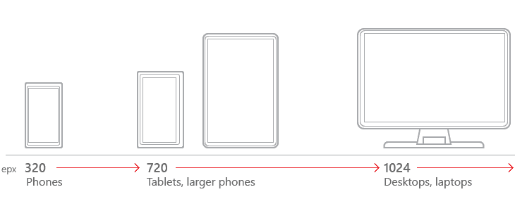

# 用 HTML 和 CSS Flexbox: Pt 编写一个响应式 Navbar。2

> 原文：<https://dev.to/ceeoreo/code-a-responsive-navbar-with-html-and-css-flexbox-pt-2-13p7>

*这篇文章最初刊登在[debugacademy.com](https://debugacademy.com/)上。*

响应式设计是现在的热门话题。这是我们经常听到的，无论是在 Twitter 上，在招聘启事中，还是在文章中。但是什么是响应式设计呢？为什么它如此重要？我将在这篇文章中回答这些问题。我们还将使用我们所学的知识来构建导航栏，这个导航栏是在我上一篇文章的帮助下创建的。如果你还没看过，一定要去看看。

## **响应式设计:什么和为什么？？**

根据[维基百科](https://en.wikipedia.org/wiki/Responsive_web_design)的说法，响应式设计是“一种使网页在各种设备和窗口或屏幕尺寸上呈现良好的网页设计方法。”基本上，响应式设计是 web 开发人员和设计人员为了让他们的网站在所有设备上都好看而实现的；平板电脑、手机、笔记本电脑和台式电脑。

响应式设计不仅仅是一个时髦的词。其实很重要。由于如此多的人主要通过手机访问互联网，它变得更加重要。作为一名 web 开发人员，了解响应式设计的基本原理以及如何在代码中实现它们是绝对必要的。所以让我们从谈论断点开始。

## **断点**

断点到底是什么？嗯，它们就像它们听起来的那样:当你的网站元素开始看起来破碎时，你的设计中的点。你可以通过改变你的屏幕尺寸，注意你的设计中开始出现扭曲的地方来找到它们。实际断点是以像素为单位的值。你可以通过使用 Chrome 中的开发者工具来确定这些值。如果您没有时间或耐心来计算独特的断点值，也可以使用通用的屏幕大小值。或者，你可以只看它。每种方法都有其优点。你可能最终会使用这三者的组合。这里快速浏览一下我之前提到的一些通用屏幕尺寸。

[](https://res.cloudinary.com/practicaldev/image/fetch/s--aR9OzkWZ--/c_limit%2Cf_auto%2Cfl_progressive%2Cq_auto%2Cw_880/https://thepracticaldev.s3.amazonaws.com/i/2fqkuh04lpvttp4l6qob.png) 
如果你看下面的[码笔](https://codepen.io/)，你会看到一个断点的清晰例子。

[https://codepen.io/ceeoreo/embed/wVPbNV?height=600&default-tab=css,result&embed-version=2](https://codepen.io/ceeoreo/embed/wVPbNV?height=600&default-tab=css,result&embed-version=2)
正如你所看到的，我们的标题“导航条教程”并不像我们希望的那样在一行上。我们的设计看起来不再整洁统一。我们需要改变这种情况。我已经确定了我们的断点大约是 450px。但是我们实际上用这个断点做什么呢？这就是媒体提问的地方。

## **媒体查询**

媒体查询属性非常有用。你可能会经常用到它。老实说，直到我们在我的 [Debug Academy](https://debugacademy.com/) web 开发课程中讨论媒体查询，我才真正开始理解应该如何使用它们。如果满足某些条件，媒体查询允许我们对网页的某些属性或部分进行样式化。它们有很多应用，你可以在 Christopher Kade 的这篇文章中了解更多。

[](/christopherkade) [## 深入研究@media 查询

### 克里斯托弗·卡德 7 月 2 日 193 分钟阅读

#css #webdev #tutorial #beginners](/christopherkade/deep-dive-into-media-queries-36pe)

今天，我们将重点讨论如何在断点处使用媒体查询。语法如下。

```
@media (max-width: 450px) {

} 
```

<svg width="20px" height="20px" viewBox="0 0 24 24" class="highlight-action crayons-icon highlight-action--fullscreen-on"><title>Enter fullscreen mode</title></svg> <svg width="20px" height="20px" viewBox="0 0 24 24" class="highlight-action crayons-icon highlight-action--fullscreen-off"><title>Exit fullscreen mode</title></svg>

我们使用`@media`元素启动我们的媒体查询。我们将断点放在括号内。你也可以看到关键字`max-width`。这将挑选出 450 像素或更小的屏幕宽度。如果满足这些条件，将实现下面的代码。

通常，在 CSS 中需要不止一个媒体查询。因为我们只使用一个简单的导航栏，所以我们只有一个。如果将来您需要包括几个媒体查询，流程将类似于我们到目前为止所讨论的。现在让我们继续讨论使导航条具有响应性所需的 CSS。

## 第一步:`ul` CSS

[https://codepen.io/ceeoreo/embed/vYBGrMX?height=600&default-tab=css,result&embed-version=2](https://codepen.io/ceeoreo/embed/vYBGrMX?height=600&default-tab=css,result&embed-version=2)
我们需要添加一些东西来使我们的导航条反应灵敏。让我们首先添加`flex-wrap`属性。顾名思义，这是一个特殊的 Flexbox 属性。它允许 flex 容器中的内容换行，如果容器变得太小而无法在一行中容纳所有内容的话。在这种情况下，`ul`是我们的 flex 容器，每个`li`是其中的一个项目。这就是为什么我们看到“Tab”元素移到了新的一行。

我们还需要添加`justify-content`，这是我们之前在 CSS 中定义的。这一次，我们将其设置为等于`center`。这将使导航栏菜单项居中。出于某种原因，我们的导航栏项目有一些默认填充。为了移除这个并确保我们所有的项目都居中，我们可以将`padding`设置为 0。我们还需要重置`background-color`，因为我们的背景颜色被限制在上次给`header`的 70px 高度。

## 第二步:`#title` CSS

[https://codepen.io/ceeoreo/embed/EqLOKV?height=600&default-tab=css,result&embed-version=2](https://codepen.io/ceeoreo/embed/EqLOKV?height=600&default-tab=css,result&embed-version=2)
我们的导航栏在技术上是有求必应的。它根据我们屏幕的大小而变化。但是它看起来并不吸引人。我们只需要多一点 CSS 就可以得到我们想要的效果。我们将特别针对`#title`又名“导航条教程”。因为这是我们的标题，我们希望它能够脱颖而出，自成一行。我们可以通过使用另一个名为`flex-basis`的 Flexbox 属性来做到这一点。这个属性允许我们决定希望一个子元素或容器项在它的容器中占据多少空间。我们将设置`flex-basis`为 100%。现在“导航条教程”将会单独存在。

我们仍然希望`#title`像其他菜单项一样居中。我们可以简单的定义`text-align`为中心。如果你仔细看，你会注意到“导航条教程”仍然不在我们标题的中心。这是因为我们之前添加的`margin-right: auto`将我们的`#title`移到了左边。为了抵消这一点，我们将添加`margin-left: 0`。现在“导航条教程”正处于我们想要的中心位置！

* * *

## 结论

恭喜你！！您已经完成了响应式导航栏！这些概念非常重要，所以不要仅仅停留在这里。尝试创建一个新的网页，并使用您到目前为止所学的概念使其完全响应。我将包括一些额外的资源，以帮助您了解更多关于 Flexbox 和响应式设计的信息。

一如既往，请随时给我一些建设性的反馈。我一直在寻求进步。如果你想让我介绍什么话题，请告诉我！非常感谢您的阅读！

### 附加资源

1.  [瓢虫播客 Flexbox 备忘单](https://dev.to/ladybug/flexbox-cheat-sheets-5h55)
2.  [用这 9 个很酷的资源爱上 CSS](https://dev.to/ceeoreo/fall-in-love-with-css-with-these-9-cool-resources-djh)
3.  [谷歌手机友好测试](https://search.google.com/test/mobile-friendly)
4.  [用 Flexbox 创建的最流行的导航栏](https://medium.com/flexbox-and-grids/the-most-popular-navigation-bars-created-with-flexbox-6c0f59f55686)