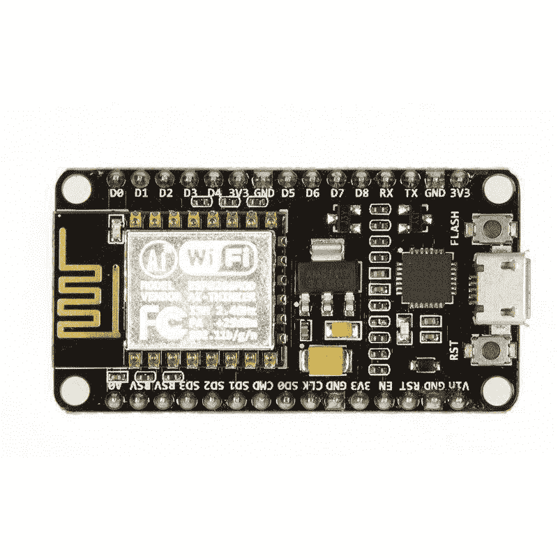
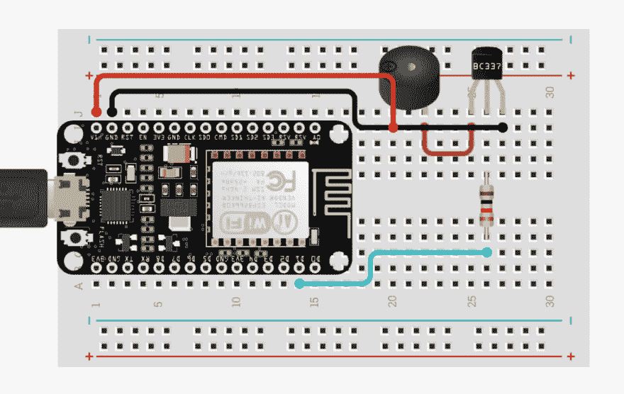

# 如何制作物联网网络正常运行时间警报

> 原文：<https://dev.to/nickproud/how-to-make-an-iot-network-uptime-alarm-65m>

对于那些管理多个网络连接设备、网站或服务器的人来说，尽快知道它们何时停机很重要。

无论您是负责维护网站、平稳运行文件服务器，还是只想知道您的家用路由器是否出现故障，微控制器都能让人们更轻松地构建监控解决方案。

最近，我进入了物联网的世界，开发了一个简单的警报设备，它每 5 秒钟检查一次预定义的 IP 地址/ DNS 名称，如果主机没有回复 ping，就会发出警报。

这种项目可以很容易地与一个神奇、廉价的微控制器 ESP8266 结合在一起，我将向您展示如何自己构建一个这样的微控制器来监控您的服务器、网站甚至智能冰箱。

## 我需要什么？

### 一个 ESP8266

[](https://res.cloudinary.com/practicaldev/image/fetch/s--DolGchhJ--/c_limit%2Cf_auto%2Cfl_progressive%2Cq_auto%2Cw_880/https://www.automationmission.com/wp-content/uploads/2019/08/ESP8266.jpg)

这是 EDP8266 的 NodeMCU 版本，也是我用来构建该器件的版本。

ESP8266 是一件令人惊叹的(而且非常便宜，大约 6 美元)设备。

这是一个 WiFi 微芯片，能够利用完整的 TCP/IP 堆栈。此外，它是一个微控制器，所以你可以像对 Arduino Uno 或 Arduino Mega 控制器板一样对它进行编程。

这意味着，只需这块板、一块试验板、几根跳线和一个活动蜂鸣器，我们就拥有了构建警报所需的硬件。

我将快速回顾一下我们如何将它连接到硬件的其余部分，这样我们就可以得到代码。

### 电路板、电线和蜂鸣器啊呀！

本指南主要讲述我们为开发网络监控功能而编写的代码，因此假设您对电路有基本的了解。不过，下图应该足以说明如何为 ESP8266 和试验板上的蜂鸣器构建电路。

[ ](https://res.cloudinary.com/practicaldev/image/fetch/s--19mPD4An--/c_limit%2Cf_auto%2Cfl_progressive%2Cq_auto%2Cw_880/https://www.automationmission.com/wp-content/uploads/2019/08/Circuit-2-1024x647.png) *从左往顺时针方向:1。通过 USB 连接的 ESP8266 板，2。从 ESP8266 上的 VIn\
引脚连接到蜂鸣器，3。从蜂鸣器到 EDP8266 上 GND 引脚的接地连接，4 .从蜂鸣器到 NPN BC337 晶体管的连接\
，5。从晶体管到 1k 欧姆电阻的连接，6。从电阻到 ESP8266 上 D1 引脚的连接。*

你也可以在 circuito.io [点击](https://www.circuito.io/static/reply/index.html?solutionId=5d56a46438405c0030eb9a74&solutionPath=storage.circuito.io)找到更深入的电路指南。这将向您展示如何更详细地将它们组合在一起。有一个来自 circuito.io 的代码示例，它使用 buzzer.h 库向蜂鸣器发送信号。我不是为了这个设备而使用它。取而代之的是，我将向与蜂鸣器相连的 D1 数字引脚发送信号。

## 代码

我将介绍我是如何为这个设备编写代码的，所以请随意跟随。然而，如果你想构建电路并把代码直接闪存到上面，或者甚至为自己改编我的代码，你可以在 [Github 上找到 repo。](https://github.com/nickproud/IoTNetworkAlarm)

### 先决条件

在进入下面的主设备草图之前，请确保您已经安装了 [Arduino IDE](https://www.arduino.cc/en/Main/Software) ，然后在 IDE 中安装[ESP8266-ping Arduino IDE 库。](https://www.arduino.cc/en/guide/libraries)

### 添加头文件

我们将用 C 语言编写这个程序，所以熟悉这种语言肯定是有帮助的，但是就复杂性而言，这是一个相当简单的程序。

我们需要两个库来使这个设备工作。将需要 ESP8266Wifi 库，以便我们可以使用您的本地 Wifi 网络来联系我们的远程主机。其次，在开始编写代码之前，我们在 IDE 中安装了 Pinger 库。

在 C 语言中，我们以头文件的形式添加这些依赖项，在我们代码的顶部引用如下:

```
#include <ESP8266WiFi.h>
#include <Pinger.h> 
```

然后是时候声明我们的变量了

```
const char* ssid = "your_ssid";
const char* password = "your_password";
const char* hostIP = "ip_of_host_you_are_monitoring";
#define D5 14
int SpeakerPin = 14;
Pinger pinger;
bool success = false; 
```

如上所示，我们声明了三个常量来保存我们的 WiFi 网络的 SSID、WiFi 密码和我们希望监控的主机的 IP。这可能是一个网站或设备的 IP 地址，如果该网站或设备出现故障，您希望收到警报。您还可以提供 DNS 名称，因为 Pinger 库能够通过名称而不是 IP 来定位主机。

在定义了我们的 char 常量之后，我们使用#define 关键字将 ESP8266 的引脚 14 转换为 D5，这是我们用来向蜂鸣器发送信号的数字引脚。这意味着当我们将 SpeakerPin 变量设置为整数 14 时，我们实际上是指向 D5。这可能会令人困惑，但我们实际上只是考虑了 ESP8266 上引脚分配的不匹配。查看[此处](https://techtutorialsx.com/2017/04/02/esp8266-nodemcu-pin-mappings/)了解更多关于引脚在 ESP8266 上如何映射的信息

最后，我们设置了一个 Pinger 对象，它是从 Pinger.h 库中创建的一个实例，负责将 ping 发送到我们监控的主机，以及一个用于跟踪成功 ping 的布尔值。我们将使用这个布尔值来确定警报是否应该响起。

接下来，我们将创建一个名为 ConnectToWiFi()的方法来连接我们的 WiFi 网络，这个方法本身可以在 Setup()方法
中调用

```
void connectToWiFi()
{
  Serial.print("\n\nConnecting...");

  WiFi.begin(ssid, password);
  while (WiFi.status() != WL_CONNECTED)
  {
    delay(500);
    Serial.print(".");
  }

  Serial.print("Connected to router on IP address: ");
  Serial.println(WiFi.localIP());
} 
```

接下来，我们正在为警报声编写一个基本的方法。below Alarm()方法只需向 D5 引脚写入一个信号，向蜂鸣器提供电流(使其发声)，等待半秒钟，然后停止电流以停止蜂鸣器，然后重复相同的过程几次，每次信号变化之间有半秒钟的延迟。这允许我们在调用 Alarm()
时发出蜂鸣声

```
void Alarm()
{

//digitalWrite() is a method that sends current to a pin which is either   HIGH (on) or LOW(off). We are sending the current to the SpeakerPin which we defined at the top of our program. (Pin D5 on the board)

  digitalWrite(SpeakerPin, HIGH);
  delay(100);
  digitalWrite(SpeakerPin, LOW);
  delay(100);
  digitalWrite(SpeakerPin, HIGH);
  delay(100);
  digitalWrite(SpeakerPin, LOW);
  delay(100);
  digitalWrite(SpeakerPin, HIGH);
  delay(100);
  digitalWrite(SpeakerPin, LOW);
  delay(100);
  digitalWrite(SpeakerPin, HIGH);
  delay(100);
  digitalWrite(SpeakerPin, LOW);

} 
```

接下来，我们在 Setup()方法中定义逻辑。这是在程序循环之前调用的。在这个方法中，我们使用 pinmode()将 D5 引脚定义为蜂鸣器电流的输出。然后我们调用 ConnectToWifi()方法，然后我们向 Pinger 对象添加一个事件来处理 ping 请求完成时发生的事情。

```
void setup() {
  // put your setup code here, to run once:
  Serial.begin(115200);
  pinMode(SpeakerPin, OUTPUT);
  connectToWiFi();

  pinger.OnEnd(
  {
    if(response.TotalReceivedResponses > 0)
    {
      Serial.print("Host online\n");
      success = true;
      return true;
    }
    else
    {
      Serial.print("ERROR: Unable to reach host. Sounding alarm\n");
      success = false;
      return false;
    }

  });
} 
```

平儿。OnEnd event 检查来自远程主机的 ping 响应，并决定是否需要发出警报。如果响应大于 0，则一切正常，我们在程序顶部设置的 success 布尔值被设置为 true，否则，我们在串行端口记录一个错误，并将 success 设置为 false。然后，我们可以通过定义在 Setup()完成后继续运行的方法来完成程序，Loop():

```
void loop() {
  // put your main code here, to run repeatedly:
  Serial.print("pinging....\n");
  pinger.Ping(hostIP);
  if(!success)
  {
    Alarm();
  }
  delay(5000);
} 
```

Loop()既漂亮又简单。我们只是每 5 秒钟 pinging 一次我们的远程主机。如果 success 变量被设置为 true，我们什么也不做，否则，我们调用 Alarm()方法来发出蜂鸣声。

如果电路连接正确，代码没有错误，我们就有了真正的网络正常运行时间警报！为了在生产中使用，您可以将它放在一个小外壳中，并在其上连接一个电池，这样它就可以为您监控您的网络，并在出现问题时向您发出警报。

看看我在这个视频中内置的闹钟。我将其配置为监控我的主开发机器。当我关掉机器上的 WiFi 适配器，把它从网络上拿掉时，警报开始响起。直到机器回到网络上，它才停止。