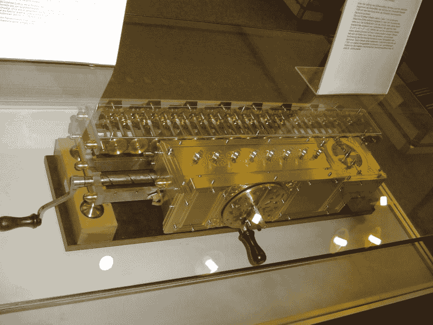
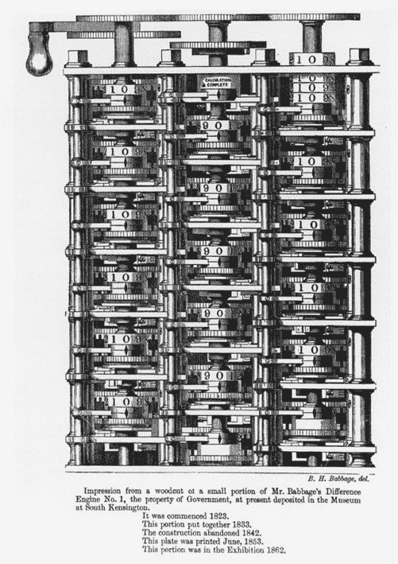
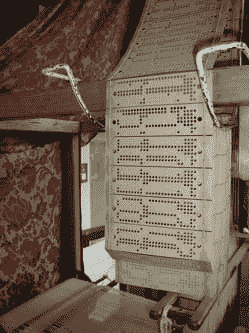
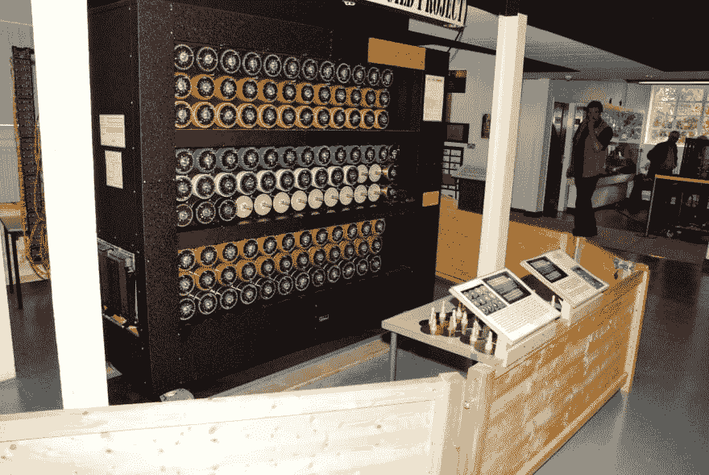
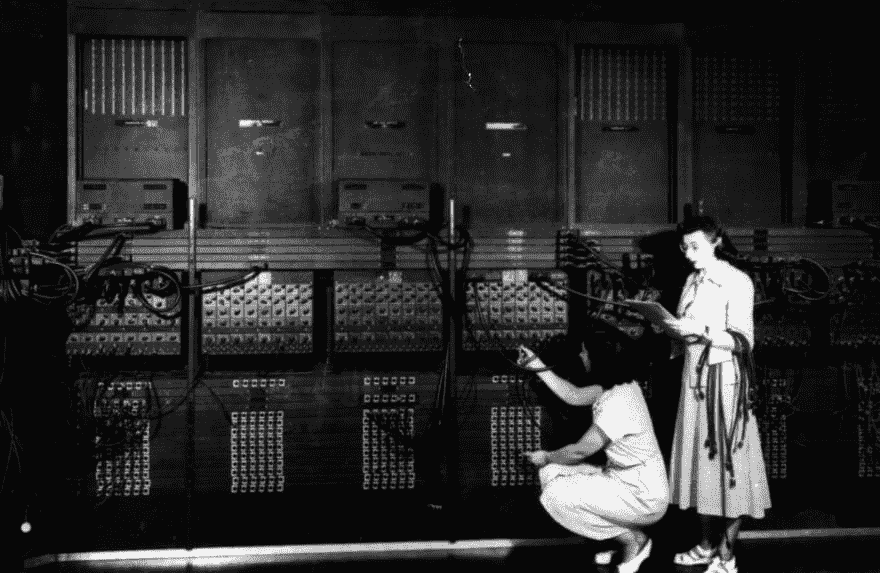
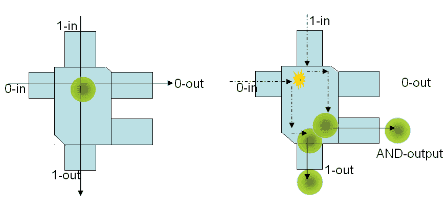
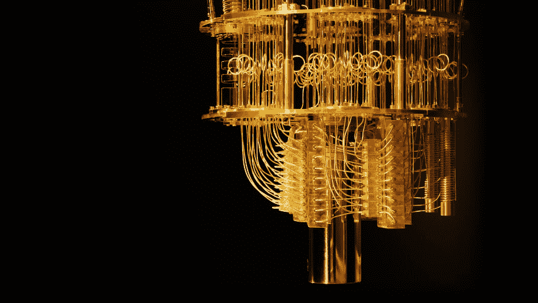
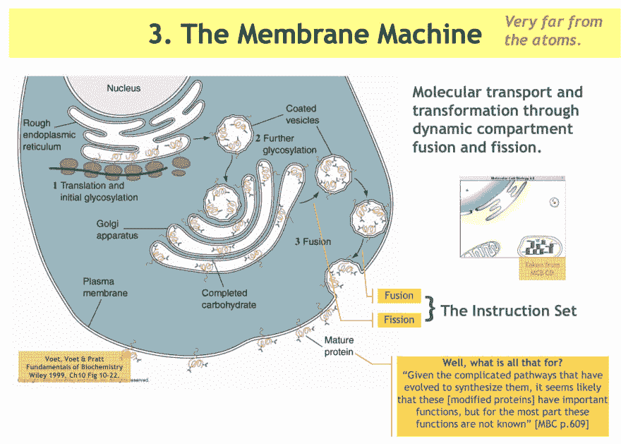

# 什么是电脑？

> 原文：<https://dev.to/stereobooster/what-is-a-computer-3ag4>

如果说计算机科学是研究“计算机”的一个知识分支。在这种情况下，“计算机”是什么意思？

## 定义

计算机是一种可以进行计算(见下文)的设备(软件或硬件)，它可以进行某种机械推理(见下文)。

重要的是要理解，如果我们谈论硬件或软件，没有主要的区别(对于我们上下文中的计算机的定义),因为我们可以直接在硬件上或在虚拟机内运行程序。这个想法是由图灵提出的——你可以在另一个机器中创建一个机器，因为机器的这个性质，证明停机问题在一般情况下是不可判定的就相对容易了。

### 主要零件

如果你采用最流行的计算模型(见下文)，你会发现它们有以下几个部分:处理器(完成工作的某个单元)、内存(某种信息存储)、输入、输出。

举个例子，

|  | 个人电脑 | 车床 | 冯·诺依曼计算机 | 程序设计语言 |
| --- | --- | --- | --- | --- |
| 处理器 | CPU，GPU | 机器，oracle | 计算机 | evaluate 评价 |
| 记忆 | 内存，硬盘 | 磁带 | 记忆 | 环境，变量 |
| 投入 | 键盘、鼠标 | 磁带，选择设备 | 直接写入内存 | 阅读 |
| 输出 | 屏幕，打印机 | 磁带 | 输出寄存器 | 打印 |

## 这是关于计算的

> 对这个行业来说，计算机科学是一个可怕的名字。首先，它不是一门科学。它可能是工程，也可能是艺术，但我们实际上会看到，计算机所谓的科学实际上与魔法有很多共同点……所以它不是一门科学。它也不是真的非常关于计算机。它与计算机无关，就像物理学与粒子加速器无关，生物学与显微镜和培养皿无关。它与计算机无关，就像几何学与使用测量仪器无关一样。
> 
> ——[哈尔·阿伯尔森](https://www.youtube.com/watch?v=2Op3QLzMgSY)

解决这个问题的一种方法是说，计算机科学不是关于计算机的，而是关于计算的(而计算机是可以执行计算的设备)。

## 什么是计算？

> 有几种方法来定义计算。现在，我举一个最简单的例子:**计算是一系列的步骤，我称之为行为**。一个步骤有三种常见的选择，导致**三种不同的行为**:
> 
> *   **动作行为**。步骤是一个动作，它只是一组动作中的一个元素。动作行为是一系列动作。
> *   **状态行为**。一个步骤是一对`(s, t)`状态，其中一个状态是某组状态的一个元素。状态行为是状态的序列`s1 → s2 → s3 → · · ·`。步骤`(si, si+1)`代表从状态`si`到状态`si+1`的转换。
> *   **状态-动作行为**。一个步骤是一个三元组`(s, α, ti)`，其中`s`和`t`是状态，`α`是动作。国家行为是一个序列`s1 -α1→ s2 -α2→ s3 -α3→ · · ·`。步骤`(si, αi, si+1)`表示由动作`αi`执行的从状态`si`到状态`si+1`的转变。
> 
> - [计算和状态机](https://lamport.azurewebsites.net/pubs/state-machine.pdf)。莱斯利·兰波特，2008 年 4 月 19 日

最近我问了一个问题:[“软件的组成部分是什么？”](https://dev.to/stereobooster/what-are-the-building-blocks-of-the-software-17cn)。我认为“计算”是这个问题的答案。计算机能做的一切都可以用这种方式描述(至少现在是这样，也许以后他们会提出更好的想法)。

## 机械化的推理

推理机械化的思想至少在中世纪就出现了(如果不是更早的话)。人们开始思考思考(推理本身)，以及这个过程是否可以在机器的帮助下自动化。

> 莱布尼茨(1646-1716)将宇宙(包括人类的思维)比作一个精致的时钟，没有钟表匠的持续干预就在滴答作响(与莱布尼茨同时代的艾萨克·牛顿拒绝了这一观点，认为上帝在他的创造中的作用被边缘化了)...莱布尼茨写道，他受到了他的前任托马斯·霍布斯(1588-1679)的启发，甚至认为人类的思维是一台自动机器...莱布尼茨认为，人造机器和自然创造物，包括思维，并没有本质上的不同，而仅仅是复杂程度上的不同，因为自然生物是“彻头彻尾”的机器...
> 因此，我们看到，莱布尼茨在 17 世纪认为，心灵是一种“自然自动机”,推理是一种“计算”,并且看到亚里士多德的逻辑(用半符号语言描述正确的推理)和代数(符号组合的科学)之间的相似性，试图发明一种类似代数的演算，为推理提供一种“确定的程序”。
> 
> - [感觉的有限和思想的无限:计算、逻辑和代数的历史，第一部分](https://pron.github.io/posts/computation-logic-algebra-pt1)，2018 年 1 月 5 日

这就是计算机从一开始的作用——我们试图回答这样一个问题，如果我们能自动化推理过程(如果我们假设它是符号操作)？

图灵采取了类似的方法(1936 年)，他提出了代替人类工作的机器，它可以在纸上书写(擦除)符号，就像数学家在计算时一样。

> 我们可以把正在计算实数的人比作机器...

他的第一部作品致力于某些特定的问题(Entscheidungsproblem，德语为“决策问题”，是戴维·希尔伯特提出的一个挑战)。后来他想知道我们是否能够超越这一点？我们能用机器复制人类的整个思维过程(包括创造力和猜测)吗？而人工智能领域就是这样出现的。图灵提出了原始机器的几个扩展(例如，甲骨文)，并制定了图灵测试(1950)。

1960 年，约翰·麦卡锡在麻省理工学院研究人工智能问题时发明了 LISP(参见[符号表达式的递归函数及其机器计算，第一部分](https://aiplaybook.a16z.com/reference-material/mccarthy-1960.pdf))，被认为是符号处理语言。

## 实践中的计算机

计算设备的一些例子。

莱布尼茨的阶梯式计算器(德国博物馆的复制品)。1879 年，工人们在哥廷根大学的一个阁楼上修理屋顶漏洞时发现了这个装置。图片来源:[维基百科](https://en.wikipedia.org/wiki/Stepped_reckoner#/media/File:Leibnitzrechenmaschine.jpg)。

**巴贝奇的差分机**1 号，木刻，1853 年。这幅木刻描绘了 1833 年建造并由伦敦科学博物馆保存的“差异引擎 1 号”的试验品。图片来源:[明尼苏达大学](http://www.cbi.umn.edu/about/babbage.html)。

**提花织机**(带打孔卡)。图片来源:[维基百科](https://en.wikipedia.org/wiki/Jacquard_loom#/media/File:Jacquard.loom.cards.jpg)。

BOMBE - **机电机器**，由艾伦·图灵和戈登·韦尔奇曼在二战期间研发，当时他们在布莱奇利公园担任破译员。图片来源:[密码博物馆](https://www.cryptomuseum.com/crypto/bombe/)。

ENIAC 是第一台真空管通用计算机。它的第一个项目是研究热核武器的可行性——曼哈顿计划，约翰·冯·诺依曼也参与其中。图片来源:[哥大计算史](http://www.columbia.edu/cu/computinghistory/eniac.html)

Edward Fredkin 和 Tommaso Toffoli 在他们的论文[中提出的计算的台球模型保守逻辑](http://fab.cba.mit.edu/classes/862.16/notes/computation/Fredkin-2002.pdf)。图片来源:[维基百科](https://en.wikipedia.org/wiki/Billiard-ball_computer#/media/File:Toffoli_BilliardBall.gif)。

IBM 的**量子计算机**。图片来源: [Quantamagazine](https://www.quantamagazine.org/quantum-supremacy-is-coming-heres-what-you-should-know-20190718/) 。

**生物计算机。细胞计算。比如寻找食物，躲避捕食者。图片来源: [lucacardelli.name](http://lucacardelli.name/Talks/2009-03-12%20Abstract%20Machines%20of%20Systems%20Biology%20(Warsaw).pdf) 。**

 **

这是我的随机选择，只是为了说明除了基于晶体管的计算机之外还有其他计算机。你可以在这里找到更多的例子[计算机历史](https://www.computerhistory.org/timeline/)，[维基百科](https://en.wikipedia.org/wiki/List_of_pioneers_in_computer_science)。

## 理论上的计算机

在上一节中，我们谈到了“硬件”。在这一部分，我们来谈谈理论——计算模型。

### 图灵机

> 我们说过，可计算的数字是那些小数可以用有限的方法计算的数字...我只能说，理由在于人类的记忆必然是有限的。
> 我们可以将一个正在计算实数的人比作一台只能处理有限条件的机器`q1: q2\. .... qI`，这将被称为“m-配置”。这台机器配有一条“带子”(类似于纸)，它被分成多个部分(称为“方块”)，每个部分都可以承载一个“符号”...然而，通过改变它的 m 构型，机器可以有效地记住一些它以前“看过”(扫描过)的符号。
> 机器在任何时候的可能行为由 a 配置和扫描的符号决定...
> 机器也可以改变正在扫描的方块，但只能向左或向右移动一个位置。除了这些操作之外，还可以改变 m 配置。写下来的一些符号将形成数字序列，它是被计算的实数的小数。其他的只是“辅助记忆”的粗略笔记。只有这些粗略的笔记才容易被擦掉。
> 
> - [关于可计算的数字，并应用于 Entscheidungsproblem](https://www.cs.virginia.edu/~robins/Turing_Paper_1936.pdf) 。1936 年 5 月 28 日上午图灵

Lamport 关于 TM:

> 图灵机是一种状态机，其状态描述了磁带的内容、内部状态和读/写磁头的位置。

有些人会认为计算机是图灵机。图灵机反过来对应于 lambda 演算，由此我们可以得出结论，所有可计算的问题都是基于函数的。这不太正确。

> 一些计算机科学家认为算法是从输入到输出的函数。如果这是真的，那么冒泡排序和堆排序将是相同的算法，因为它们计算相同的函数

现代计算机能做的比传统的 TM 更多。经典的 TM 是确定性的——例如，它的行为完全由初始程序决定。它预先获得所有配置，在执行过程中不读取用户输入。图灵本人知道这种局限性，这就是为什么他也引入了“选择机器”(TM 具有读取用户输入的能力，这使其具有不确定性)和“oracle 机器”(TM 机器带有 oracle -“神奇”设备，可以回答一些问题)。

> TMs 不能计算所有问题，也不能做真正的计算机能做的一切。
> 
> ——[图灵论题的起源](https://pdfs.semanticscholar.org/9a9d/3d5393dd90a37ef9a0b8420fe4c41fc5d8f9.pdf)。迪娜·戈尔丁，彼得·韦格纳，2004 年 6 月 25 日

他们甚至开始了一个新的领域，讨论可以计算比 TM - hypercomputation 更多的模型。

> 长期以来，人们一直认为图灵机可以计算所有合理意义上的可计算函数。因此，它被认为是一个充分的可计算性模型。那么，对于那些讨论比图灵机计算能力更强的模型的论文，我们该如何理解呢？对于纯数学中更富想象力的领域来说，这种理论化可能很容易被视为无聊的猜测，在这些领域中，模型和抽象是为了它们自己而研究的，很少考虑任何现实世界的影响。
> 
> - [超计算:比图灵机](https://arxiv.org/abs/math/0209332)计算得更多。托比 Toby，2002 年 9 月 25 日

### 冯·诺依曼计算机

> 自动计算系统是一种(通常是高度复合的)设备，它可以执行指令来执行相当复杂的计算，例如，用数值方法求解 2 或 3 个独立变量的非线性偏微分方程。
> 
> -[ed vac 报告初稿](https://web.archive.org/web/20010615054532/http://qss.stanford.edu/~godfrey/vonNeumann/vnedvac.pdf)。约翰·冯·诺依曼，1945 年 6 月 30 日

关于冯·诺依曼计算机的兰波特:

> 冯·诺依曼计算机的状态规定了存储器和所有寄存器的内容，包括含有下一条要执行的指令地址的程序计数器(`pc`)。下一个状态关系包含状态对`(s, t)`当在状态`s`执行下一条指令(由`pc`指定的指令)时，产生状态`t`。输出可以用输出寄存器来表示；输入可以用 read 指令表示，该指令不确定地将内存位置设置为任意值。

### 算法

> 算法是一个处方、一组指令或做某事的过程的规范。某样东西通常能解决某种问题。
> 
> -计算机科学:问题、算法、语言、信息和计算机。J. K .赖斯 J. N .赖斯。, 1969.

这基本上是“生成行为的处方”(来自 Lamport 定义)。

### BNF 文法

想了解更多关于 BNF 的信息，请观看盖伊·斯蒂尔的演讲。他称之为“计算机科学中最流行的编程语言”。

关于 BNF 的 Lamport:

> BNF 文法可以被描述为一个状态机，它的状态是终端和/或非终端的序列。初始状态集仅包含由单个起始非末端组成的序列。下一状态关系被定义为包含`(s, t)`当且仅当 s 可以通过应用产生式规则来扩展单个非终结符而被转换为 t。**