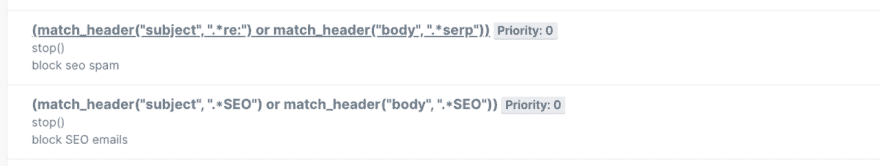
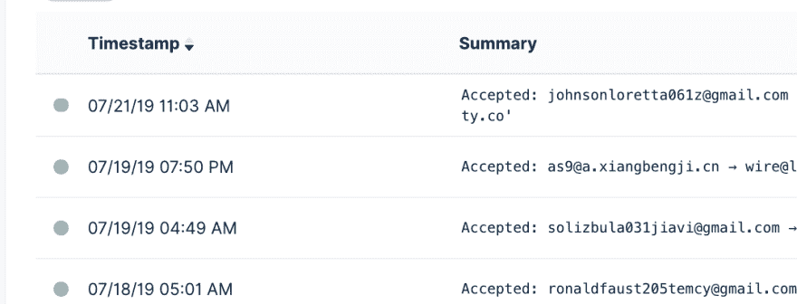

# 使用 Mailgun 进行智能邮件过滤

> 原文：<https://dev.to/nicklafferty/intelligent-email-filtering-with-mailgun-7ac>

我从大学开始就有了个人网站。当我从学生生活过渡到全职工作时，它经历了许多反复。作为一名申请工作的营销人员，我认为拥有一个网站让我从其他申请者中脱颖而出。我有一张穿着西装坐在树林中央的可笑的大头照，这也很有帮助。

我总是在网站上有一个我的电子邮件的链接。我感觉这只是很好的练习，是互联网人和我接触的最好方式。问题是，机器人从网站上抓取我的电子邮件，并发送关于提高搜索引擎优化排名或其他垃圾信息的垃圾邮件。我保持垃圾邮件文件夹整洁，甚至退订我收到的垃圾邮件(当他们实际上给我选择的时候)。但有时他们不给你退订的选择，或者他们让它变得很迟钝，或者他们让你回复他们退订，这是最糟糕的。

这就是 Mailgun 的用武之地。Mailgun 具有入站邮件的路由功能，允许您将邮件从您拥有的域转发到任何地址。我将电子邮件从我的自定义域转发到我的 gmail，这样我就不必将我的主要电子邮件地址公之于众。

但我不想转发该地址收到的每一封邮件。我想在电子邮件到达我的收件箱之前，根据它的内容阻止它，就像那些垃圾 SEO 提供的一样。

这是我如何使用 Mailgun 做到这一点。

首先，[将你的域名添加到 Mailgun](https://help.mailgun.com/hc/en-us/articles/203637190-How-Do-I-Add-a-Domain-) 。他们已经写了一些关于如何做到这一点的很好的指南，所以我不会在这里重复。您还需要通过添加一些 DNS 记录来验证您的域的所有权 Mailgun 需要添加 MX 记录来处理入站邮件。我在这里写了一个[的分步指南。](https://help.mailgun.com/hc/en-us/articles/360026833053-Domain-Verification-Walkthrough)

我还建议在你的账户上设置双重认证，以确保尽可能的安全。

接下来，您需要转到界面中的接收页面。您可以在这里设置转发电子邮件和阻止垃圾邮件的规则。我把我的规则分为两组:

匹配收件人
这是您将邮件从您添加到 Mailgun 的域转发到您拥有的任何其他电子邮件地址的方式。你可以选择只转发特定的地址(比如 nick@domain.com T2)，或者你可以创建一个“一网打尽”的功能来转发发送到任何地址的邮件。在我的例子中，我将我的自定义域中的一封电子邮件转发到我的 gmail 地址。我建议不要将所有邮件转发到你的域名，因为垃圾邮件发送者会将垃圾邮件发送到常用名@你的域名。

我将这条规则设置为优先级 1。从 0 开始，以升序处理邮件枪路线。因此，我希望我的过滤规则首先处理，阻止任何垃圾邮件，然后如果电子邮件通过我的过滤器，它将转发到我的真实电子邮件。

1.  匹配标题我为此设置了 2 条规则。第一条规则查找主题中带有“re:”或正文中带有“serp”的电子邮件。我不断收到看起来像转发邮件的垃圾邮件，它们都以“re:”开头。

第二个规则寻找主题或正文中带有“SEO”的电子邮件。

我是这样设置的。

您可以根据标题本身中的主题行、正文或任何其他数据进行筛选。我设置了过滤器来拦截我想拦截的常见垃圾邮件..一旦你设置了过滤器，你需要决定采取什么行动。这里的正确操作是停止，这不会对电子邮件产生任何影响，只要优先级低于您的转发过滤器。

一旦你的过滤器设置好了，你就可以进入日志页面查看你收到了哪些邮件。任何通过你的过滤器的电子邮件将显示为“已发送”，没有通过的电子邮件将停留在“已接受”。

你有没有想到任何创造性的方法来使用 Mailgun 的路线功能？让我知道！

*披露*:我目前在 Mailgun 工作。在我开始在那里工作之前，我已经用了他们的产品很多年了。这不是广告。