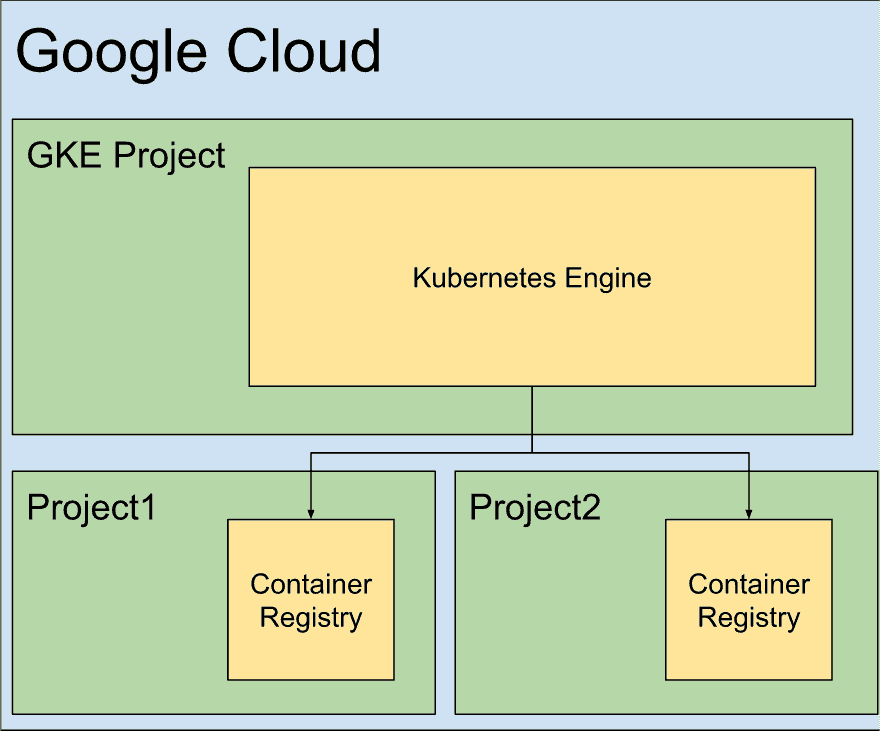

# 辅助项目的 Kubernetes:硬件已死

> 原文：<https://dev.to/rhanarion/kubernetes-for-sideprojects-hardware-is-dead-3m7m>

# 为什么要投资个人云

主持你的个人副业从未如此简单。像 surge.sh 或 Heroku 这样的工具可以让你轻松运行代码。如果所有其他方法都失败了，老的可靠的“拖放文件到 ftp”仍然存在——那么为什么要投资时间用 kubernetes 建立你自己的个人云呢？

我对技术的目标通常是找到一个令人厌烦的设置，因为我很了解它，可以专注于交付新功能。为此，设置需要经得起未来的考验(因此它可以持续工作很长时间)，通用(因此我可以将其用于广泛的应用程序，而不需要为每个项目切换)，并且不局限于任何公司或产品。

# 码头&库

Docker 和 Kubernetes 检查了这些箱子中的大部分。Kubernetes 事实上已经赢得了容器化应用程序的编排战，并管理来自所有主要云提供商的 kubernetes 产品，这意味着没有提供商锁定。作为一个开放源码项目，它不局限于某个公司或机构，您可以保持灵活性。最后，学习更多关于它的知识在任何情况下都是有用的——如果你停止开发你的副业项目，你获得的 devops 知识在简历上看起来仍然不错。

kubernetes 与类似产品的另一个重要区别是，你可以 100%忘记硬件，同时仍然可以自由使用标准技术。这意味着，如果您使用托管的 kubernetes 产品(就像您使用 docker swarm 时需要的那样)，您不需要维护一组服务器，但您仍然没有被任何提供商锁定(就像您使用 AWS Beanstalk、Firebase 或 Heroku 时一样)。

# 为什么不...？

我自己的个人经历让我按照这里写下的顺序尝试了下面的选择，我已经全部放弃了。

1.  拥有服务器
    *   您需要维护和更新自己的服务器。如果没有自动化，你会忘记你做了什么。
    *   无论如何，复杂性和学习曲线接近 kubernetes。您需要了解进程或包管理器，而不是了解部署和有状态集。
    *   缩放更难。
2.  服务(例如 Firebase)
    *   非常容易设置和使用，如果您从事一个或几个项目，这可能是明智的
    *   使用供应商特定的工具(如 firebase 实时数据库)将您和您的应用程序逻辑锁定在该供应商。如果他们改变他们的产品(价格？功能性？)
    *   服务是把锤子，让所有问题看起来像钉子。你不是为一项工作挑选最好的技术，而是开始试图用现有的技术来解决你的问题。
3.  码头工人群
    *   我真的很喜欢它，非常接近 kubernetes，但容易得多
    *   遗憾的是，仍然迫使你管理自己的服务器来设置 swarm 集群，我找不到一个“托管 docker swarm”解决方案(如果你知道的话，[请告诉我](mailto:pheltweg@gmail.com)！)

# 基础设施的价值作为代码

通过选择 kubernetes，您也承诺将您的基础设施保持在代码中，这有很多好处:

*   它通过读取 git 日志自动并正确地记录您的基础设施和您所做的任何更改
*   您可以轻松地在新的提供者上重新部署它，或者在本地进行开发
*   您的所有基础架构都在一个地方，因此您不需要考虑每个项目是如何解决问题的

# 组织你的项目

对于我的个人云，我选择:

*   一个 Google Cloud Kubernetes 引擎集群作为云
    *   Traefik 作为入口路由器将请求转发到我的项目
    *   trafik 节点间共享状态的 zookeeper
    *   让我们加密以自动设置 HTTPS
*   每个项目都有自己的 Google Cloud 容器注册中心，作为私有的 docker 存储库
*   服务帐户允许 GKE 云从各自的存储库中提取单个项目的 docker 映像
*   通用 GKE 设置和服务的基础设施描述在一个地方，单个项目的基础设施描述在它们各自的代码中
*   部署由 gitlab 处理

# 进一步阅读

*   阅读我关于这个云的实际设置的博文:[https://rhazn . com/posts/run-a-personal-cloud-with-traefik-lets-encrypt-and-zookeeper](https://rhazn.com/posts/run-a-personal-cloud-with-traefik-lets-encrypt-and-zookeeper)。
*   也请阅读这篇有用的文章:[Traefik on a Google Kubernetes Engine Cluster，由 Manuel Zapf 管理](https://medium.com/google-cloud/traefik-on-a-google-kubernetes-engine-cluster-managed-by-terraform-ad871be8ee26)

# 关于我

我是一个全栈开发者和数字产品爱好者，我可以自由工作，并总是在寻找下一个令人兴奋的项目:)。

你可以通过电子邮件(pheltweg@gmail.com 或者推特 https://twitter.com/rhanarion T2 联系我。