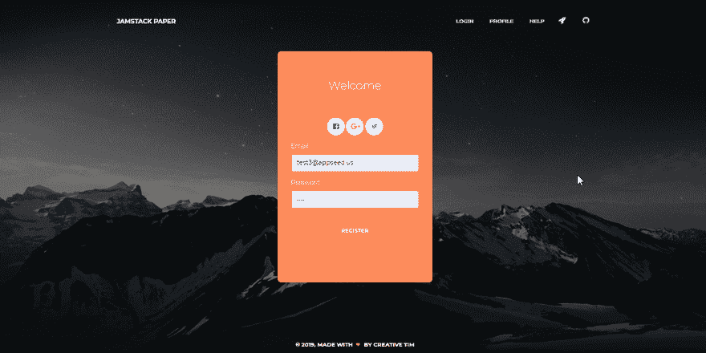
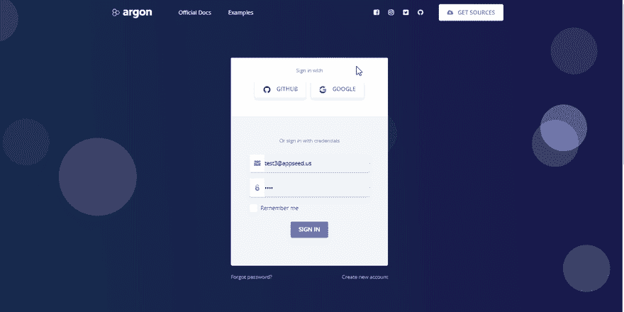
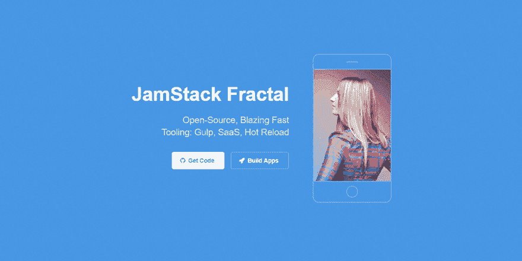
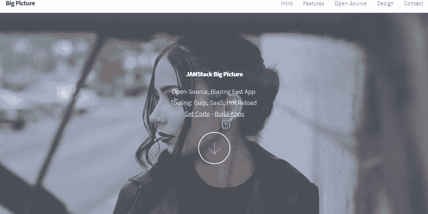
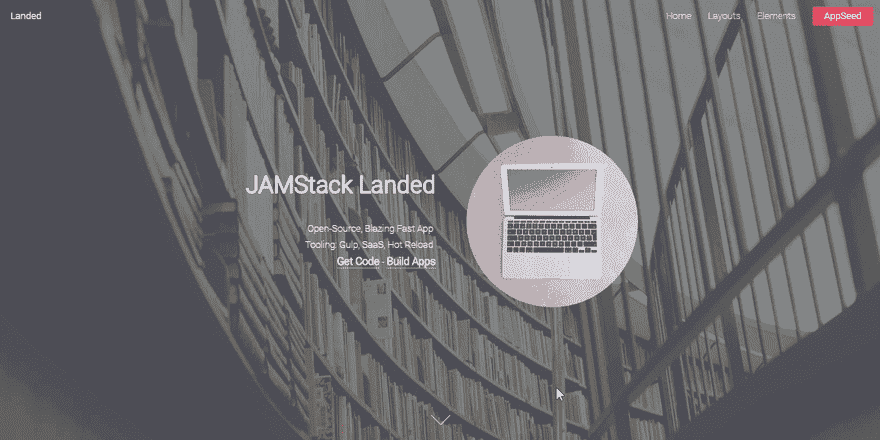
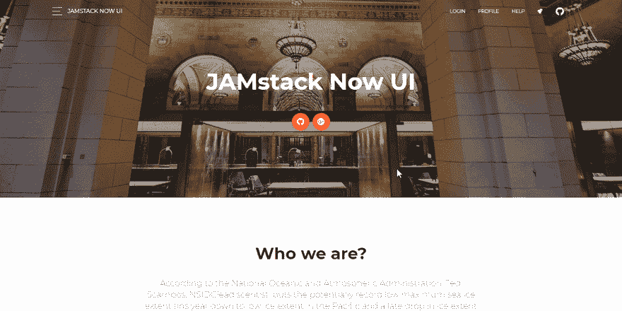
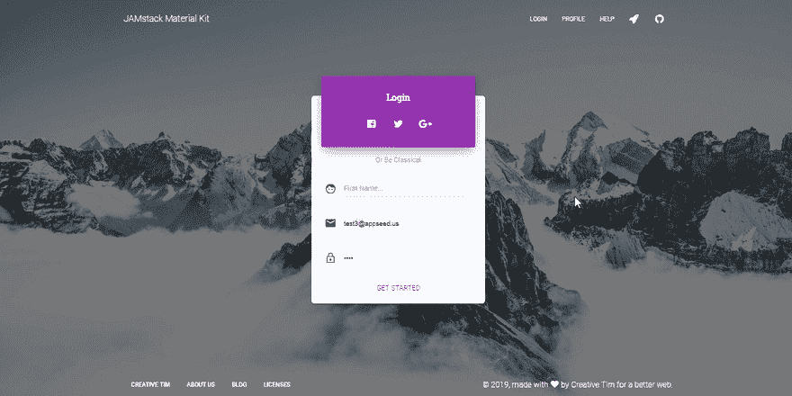

# JAMstack 应用程序——开源，用自动化工具构建

> 原文：<https://dev.to/sm0ke/jamstack-apps-open-source-built-with-appseed-app-generator-4k66>

各位编码员好，

在本文中，我将展示一个精选列表，其中包含使用自动化工具构建的开源 [JAMStack](https://jamstack.org/) 应用，这些应用基于 HTML5Up 和 Creative-Tim 机构提供的一些知名设计。

> *感谢阅读！* -内容由 **[App 生成器](https://appseed.us/)** 提供。

* * *

自动化过程分几步循环执行，如下所示:

*   对平面 HTML 设计进行解析和规范化，使其与现有的 JAMstack 样板文件兼容(这一阶段将在另一篇文章- [HTML 解析器](https://dev.to/sm0ke/html-parser-developer-tools-5d85)中详细介绍)
*   将经过处理的设计注入到已经配备了脚本和构建器的 JAMstack 样板文件中(gulp，sass processing..等等)
*   启动应用程序，如果有问题(错误的路径，丢失的图像)，循环重复前面的步骤

使用这个简单的工作流程，当我使用客户要求的新设计开始一个新项目时，我能够跳过手工工作。

* * *

## 为什么 **JAMstack**

在使用了多年的 Php 和 Python 框架后，我决定为简单的应用程序和基于事实的单页网站切换到 JAMstack 模式:

*   大多数时候，我不需要数据库
*   速度很重要
*   任何设计都可以很容易地集成到一个 [JAMstack](https://jamstack.org/) [样板代码](https://appseed.us/boilerplate-code)中
*   部署是自动化的
*   这些应用程序是 100%安全的，因为它是用纯 HTML 格式生成的

* * *

## [JAMStack 纸包](https://appseed.us/apps/jamstack/jamstack-paper-kit)

这个应用程序建立在 Creative-Tim 提供的漂亮的 UI 工具包之上。样板文件带有示例页面(登陆、登录和注册),许可证是 MIT。

### App 链接

*   [JAMstack 纸张演示](https://jamstack-paper-kit.appseed.us/)
*   [JAMstack 纸张来源](https://github.com/app-generator/jamstack-paper-kit)

[](https://res.cloudinary.com/practicaldev/image/fetch/s--fadP6Muc--/c_limit%2Cf_auto%2Cfl_progressive%2Cq_66%2Cw_880/https://github.com/app-generator/static/blob/master/products/jamstack-paper-kit-intro.gif%3Fraw%3Dtrue)

### 从源代码构建

```
$ git clone https://github.com/app-generator/jamstack-paper-kit.git
$ cd jamstack-paper-kit
$ yarn
$ yarn start
$ yarn build 
```

<svg width="20px" height="20px" viewBox="0 0 24 24" class="highlight-action crayons-icon highlight-action--fullscreen-on"><title>Enter fullscreen mode</title></svg> <svg width="20px" height="20px" viewBox="0 0 24 24" class="highlight-action crayons-icon highlight-action--fullscreen-off"><title>Exit fullscreen mode</title></svg>

* * *

## [JAMStack 氩气设计](https://appseed.us/apps/jamstack/jamstack-argon-design)

Argon Design design 是 Creative-Tim 在 MIT 许可下发布的另一个免费 UI 工具包。

### App 链接

*   [JAMstack 纸张演示](https://jamstack-argon-design.appseed.us/)
*   [JAMstack 纸张来源](https://github.com/app-generator/jamstack-argon-design-system)

[](https://res.cloudinary.com/practicaldev/image/fetch/s--wLfh8lrh--/c_limit%2Cf_auto%2Cfl_progressive%2Cq_66%2Cw_880/https://github.com/app-generator/static/blob/master/products/jamstack-argon-design-intro.gif%3Fraw%3Dtrue)

### 从源代码构建

```
$ git clone https://github.com/app-generator/jamstack-argon-design-system.git
$ cd jamstack-argon-design-system
$ yarn
$ yarn start
$ yarn build 
```

<svg width="20px" height="20px" viewBox="0 0 24 24" class="highlight-action crayons-icon highlight-action--fullscreen-on"><title>Enter fullscreen mode</title></svg> <svg width="20px" height="20px" viewBox="0 0 24 24" class="highlight-action crayons-icon highlight-action--fullscreen-off"><title>Exit fullscreen mode</title></svg>

* * *

## [JAMStack 分形](https://appseed.us/apps/jamstack/html5up-fractal)

带有 [HTML5Up 分形](https://html5up.net/fractal)设计- [CCA 3.0](https://html5up.net/license) 许可的开源 app(继承自 HTML5Up)

### App 链接

*   [JAMstack 分形演示](https://jamstack-fractal.appseed.us/)
*   [JAMstack 分形源](https://github.com/app-generator/jamstack-fractal)

[](https://res.cloudinary.com/practicaldev/image/fetch/s--PigGoJtS--/c_limit%2Cf_auto%2Cfl_progressive%2Cq_66%2Cw_880/https://github.com/app-generator/static/blob/master/products/jamstack-html5up-fractal-intro.gif%3Fraw%3Dtrue)

### 从源代码构建

```
$ git clone https://github.com/app-generator/jamstack-fractal.git
$ cd jamstack-fractal
$ yarn
$ yarn start
$ yarn build 
```

<svg width="20px" height="20px" viewBox="0 0 24 24" class="highlight-action crayons-icon highlight-action--fullscreen-on"><title>Enter fullscreen mode</title></svg> <svg width="20px" height="20px" viewBox="0 0 24 24" class="highlight-action crayons-icon highlight-action--fullscreen-off"><title>Exit fullscreen mode</title></svg>

* * *

## [JAMStack 大图](https://appseed.us/apps/jamstack/html5up-big-picture)

带有[HTML5Up big picture](https://html5up.net/big-picture)design-CCA 3.0 许可证的开源 app(继承自 html 5 up)。

### App 链接

*   [JAMstack 大图演示](https://jamstack-big-picture.appseed.us/)
*   [jam stack big picture sources](https://github.com/app-generator/jamstack-big-picture)

[](https://res.cloudinary.com/practicaldev/image/fetch/s--Vm4BxUNO--/c_limit%2Cf_auto%2Cfl_progressive%2Cq_66%2Cw_880/https://github.com/app-generator/static/blob/master/products/jamstack-html5up-bigpicture-intro.gif%3Fraw%3Dtrue)

### 从源代码构建

```
$ git clone https://github.com/app-generator/jamstack-big-picture.git
$ cd jamstack-big-picture
$ yarn
$ yarn start
$ yarn build 
```

<svg width="20px" height="20px" viewBox="0 0 24 24" class="highlight-action crayons-icon highlight-action--fullscreen-on"><title>Enter fullscreen mode</title></svg> <svg width="20px" height="20px" viewBox="0 0 24 24" class="highlight-action crayons-icon highlight-action--fullscreen-off"><title>Exit fullscreen mode</title></svg>

* * *

## [詹斯塔克登陆](https://appseed.us/apps/jamstack/html5up-landed)

带有 HTML5Up 落地设计的开源 app-CCA 3.0 许可。

### App 链接

*   [JAMstack 登陆演示](https://jamstack-landed.appseed.us/)
*   [JAMstack 着陆源](https://github.com/app-generator/jamstack-landed)

[](https://res.cloudinary.com/practicaldev/image/fetch/s--Xc2qeYPd--/c_limit%2Cf_auto%2Cfl_progressive%2Cq_66%2Cw_880/https://github.com/app-generator/static/blob/master/products/jamstack-html5up-landed-intro.gif%3Fraw%3Dtrue)

### 从源代码构建

```
$ git clone https://github.com/app-generator/jamstack-landed.git
$ cd jamstack-landed
$ yarn
$ yarn start
$ yarn build 
```

<svg width="20px" height="20px" viewBox="0 0 24 24" class="highlight-action crayons-icon highlight-action--fullscreen-on"><title>Enter fullscreen mode</title></svg> <svg width="20px" height="20px" viewBox="0 0 24 24" class="highlight-action crayons-icon highlight-action--fullscreen-off"><title>Exit fullscreen mode</title></svg>

* * *

## [JAMStack Now UI 套件](https://appseed.us/apps/jamstack/jamstack-now-ui-kit)

以 JAMstack 模式编码的超快的应用程序，基于现在的 UI 设计- MIT 许可。

### App 链接

*   [JAMstack Now UI 演示](https://jamstack-now-ui-kit.appseed.us/)
*   [JAMstack Now UI sources](https://github.com/app-generator/jamstack-now-ui-kit)

[](https://res.cloudinary.com/practicaldev/image/fetch/s--Ke7uY2Vz--/c_limit%2Cf_auto%2Cfl_progressive%2Cq_66%2Cw_880/https://github.com/app-generator/static/blob/master/products/jamstack-now-ui-intro.gif%3Fraw%3Dtrue)

### 从源代码构建

```
$ git clone https://github.com/app-generator/jamstack-now-ui-kit.git
$ cd jamstack-now-ui-kit
$ yarn
$ yarn start
$ yarn build 
```

<svg width="20px" height="20px" viewBox="0 0 24 24" class="highlight-action crayons-icon highlight-action--fullscreen-on"><title>Enter fullscreen mode</title></svg> <svg width="20px" height="20px" viewBox="0 0 24 24" class="highlight-action crayons-icon highlight-action--fullscreen-off"><title>Exit fullscreen mode</title></svg>

* * *

## [JAMStack 材料套件](https://appseed.us/apps/jamstack/jamstack-material-kit)

以 JAMstack 模式编码的极速应用程序位于材料套件设计的顶部-麻省理工学院许可证。

### App 链接

*   [JAMstack 材料套件演示](https://jamstack-material-kit.appseed.us/)
*   [JAMstack 材料工具包来源](https://github.com/app-generator/jamstack-material-kit)

[](https://res.cloudinary.com/practicaldev/image/fetch/s--QwTe3K_l--/c_limit%2Cf_auto%2Cfl_progressive%2Cq_66%2Cw_880/https://github.com/app-generator/static/blob/master/products/jamstack-material-kit-intro.gif%3Fraw%3Dtrue)

### 从源代码构建

```
$ git clone git clone https://github.com/app-generator/jamstack-material-kit.git
$ cd jamstack-material-kit
$ yarn
$ yarn start
$ yarn build 
```

<svg width="20px" height="20px" viewBox="0 0 24 24" class="highlight-action crayons-icon highlight-action--fullscreen-on"><title>Enter fullscreen mode</title></svg> <svg width="20px" height="20px" viewBox="0 0 24 24" class="highlight-action crayons-icon highlight-action--fullscreen-off"><title>Exit fullscreen mode</title></svg>

* * *

## 更多 [JAMstack 应用](https://appseed.us/apps/jamstack)

*   [BulmaLanding](https://github.com/app-generator/bulmalanding) -麻省理工学院许可证
*   [BulmaPlay](https://github.com/app-generator/bulmaplay) -麻省理工学院许可证

* * *

## 其他 JAMstack 资源

*   官方网站
*   [WTF 是 JAMstack](https://jamstack.org/) - JAMstack 相关网站
*   [JAMstack 应用](https://appseed.us/apps/jamstack)—**应用种子**提供的索引

* * *

> 谢谢大家！