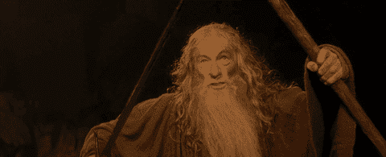

# 为什么要用“noopener”？当心安全漏洞。

> 原文：<https://dev.to/dhilipkmr/why-should-you-use-noopener-beware-of-security-flaws-3i57>

[](https://res.cloudinary.com/practicaldev/image/fetch/s--cNTVKN-m--/c_limit%2Cf_auto%2Cfl_progressive%2Cq_auto%2Cw_880/https://thepracticaldev.s3.amazonaws.com/i/1fkzkrddc5scbqsban29.jpg)

TLDR:
结帐实现示例这里:
[现场演示](https://my-dummy-domain.netlify.com/)

## 让我们在我们网站的新标签中打开一个 url

### HTML 方式

```
 <a href="https://malicious-domain.netlify.com" target="_blank">Visit Malicious Website!</a> 
```

<svg width="20px" height="20px" viewBox="0 0 24 24" class="highlight-action crayons-icon highlight-action--fullscreen-on"><title>Enter fullscreen mode</title></svg> <svg width="20px" height="20px" viewBox="0 0 24 24" class="highlight-action crayons-icon highlight-action--fullscreen-off"><title>Exit fullscreen mode</title></svg>

好了，这里我们有一个恶意网站的`href`属性和一个作为`_blank`属性的`target`属性，让它在一个新标签中打开。

比方说，用户点击“访问恶意网站！”从上面的代码来看。他在一个新标签中被重定向到恶意网站。

流程看起来如此简单明了，用户在这里可能有什么安全风险呢？

*   用户从您的页面被重定向到一个域。
*   此时，浏览器会将你当前网站的所有`window`变量的内容附加到恶意网站的`window.opener`变量中。
    *   这是由拥有最大用户群的 Chrome 和 Firefox 浏览器完成的。
    *   所以现在恶意网站可以访问你网站的窗口，这显然在这种方法的重定向中打开了一个**安全漏洞**。
    *   现在，一旦恶意网站通过`window.opener`访问了您网站的`window`变量，它就可以将您以前的网站重定向到一个新的**钓鱼网站**，该网站可能看起来与您打开的实际网站相似，甚至可能会要求您重新登录。
    *   只需编写以下代码，就可以在恶意网站中完成上述更改

```
 if (window.opener) {
    window.opener.location = 'https://www.dhilipkmr.dev';
  } 
```

<svg width="20px" height="20px" viewBox="0 0 24 24" class="highlight-action crayons-icon highlight-action--fullscreen-on"><title>Enter fullscreen mode</title></svg> <svg width="20px" height="20px" viewBox="0 0 24 24" class="highlight-action crayons-icon highlight-action--fullscreen-off"><title>Exit fullscreen mode</title></svg>

*   因此，无辜的用户会陷入这个陷阱，并提供可能暴露给攻击者的登录详细信息。

[](https://i.giphy.com/media/UuIpr1iwXkRgY/giphy.gif)

## 我们如何避免这种情况？

一个简单的方法是给`<a>`标签添加一个带有`noopener`的`rel`属性。

```
<a href="https://malicious-domain.netlify.com" rel="noopener" target="_blank">Visit Malicious Website!</a> 
```

<svg width="20px" height="20px" viewBox="0 0 24 24" class="highlight-action crayons-icon highlight-action--fullscreen-on"><title>Enter fullscreen mode</title></svg> <svg width="20px" height="20px" viewBox="0 0 24 24" class="highlight-action crayons-icon highlight-action--fullscreen-off"><title>Exit fullscreen mode</title></svg>

### 它有什么作用？

*   `rel="noopener"`指示浏览器不要将当前网站的`window`变量附加到新打开的恶意网站。
*   这使得恶意网站的`window.opener`以`null`为其值。

所以当你把你的用户导航到一个不是由你维护的新的域时要小心。

我们并不总是用`a`标签打开一个新标签，有些情况下你必须通过执行 javascript 的`window.open()`来打开它，比如下面的

```
 function openInNewTab() {
  // Some code
  window.open('https://malicious-domain.netlify.com');
} 
```

<svg width="20px" height="20px" viewBox="0 0 24 24" class="highlight-action crayons-icon highlight-action--fullscreen-on"><title>Enter fullscreen mode</title></svg> <svg width="20px" height="20px" viewBox="0 0 24 24" class="highlight-action crayons-icon highlight-action--fullscreen-off"><title>Exit fullscreen mode</title></svg>

```
<span class="link" onclick="openInNewTab()">Visit Malicious Website!</span> 
```

<svg width="20px" height="20px" viewBox="0 0 24 24" class="highlight-action crayons-icon highlight-action--fullscreen-on"><title>Enter fullscreen mode</title></svg> <svg width="20px" height="20px" viewBox="0 0 24 24" class="highlight-action crayons-icon highlight-action--fullscreen-off"><title>Exit fullscreen mode</title></svg>

这里没有提到`noopener`，所以这导致将当前网站的`window`传递给恶意网站。

## JavaScript 之道！

### 通过 js 打开新页签时如何处理这种情况？

```
 function openInNewTabWithoutOpener() {
   var newTab = window.open();
   newTab.opener = null;
   newTab.location='https://malicious-domain.netlify.com';
 } 
```

<svg width="20px" height="20px" viewBox="0 0 24 24" class="highlight-action crayons-icon highlight-action--fullscreen-on"><title>Enter fullscreen mode</title></svg> <svg width="20px" height="20px" viewBox="0 0 24 24" class="highlight-action crayons-icon highlight-action--fullscreen-off"><title>Exit fullscreen mode</title></svg>

```
<span class="link" onclick="openInNewTabWithoutOpener()">Visit Malicious Website!</span> 
```

<svg width="20px" height="20px" viewBox="0 0 24 24" class="highlight-action crayons-icon highlight-action--fullscreen-on"><title>Enter fullscreen mode</title></svg> <svg width="20px" height="20px" viewBox="0 0 24 24" class="highlight-action crayons-icon highlight-action--fullscreen-off"><title>Exit fullscreen mode</title></svg>

这里，

*   我们已经通过打开`about:blank`的`window.open()`打开了一个伪标签，所以这意味着它还没有重定向到恶意网站。
*   然后我们将新选项卡的`opener`值修改为`null`
*   发帖说我们将新标签页的网址修改为恶意网站的网址。
*   这一次，`opener`将再次为空，因此它无法访问第一个网站的`window`变量。

问题解决了。

但是这种方法在 Safari 的旧版本中是不可能的，所以我们又有一个问题。

### 如何修复 Safari 的问题？

```
function openInNewTabWithNoopener() {
  const aTag = document.createElement('a');
  aTag.rel = 'noopener';
  aTag.target = "_blank";
  aTag.href = 'https://malicious-domain.netlify.com';
  aTag.click();
} 
```

<svg width="20px" height="20px" viewBox="0 0 24 24" class="highlight-action crayons-icon highlight-action--fullscreen-on"><title>Enter fullscreen mode</title></svg> <svg width="20px" height="20px" viewBox="0 0 24 24" class="highlight-action crayons-icon highlight-action--fullscreen-off"><title>Exit fullscreen mode</title></svg>

```
<span class="link" onclick="openInNewTabWithNoopener()">Visit Malicious Website!</span> 
```

<svg width="20px" height="20px" viewBox="0 0 24 24" class="highlight-action crayons-icon highlight-action--fullscreen-on"><title>Enter fullscreen mode</title></svg> <svg width="20px" height="20px" viewBox="0 0 24 24" class="highlight-action crayons-icon highlight-action--fullscreen-off"><title>Exit fullscreen mode</title></svg>

这里我们模拟点击一个锚标签。

*   我们创建`<a>`标签并分配所需的属性，然后对其执行`click()`,这与单击链接的方式相同。
*   不要忘记在这里给标签添加`rel`属性。

其他事实:

*   当你点击锚标签上的`CMD + LINK`时，chrome、firefox 和 Safari 会将恶意网站的`window.opener`视为`null`
*   然而，在通过 javascript 处理新标签打开的元素的`CMD + LINK`上，浏览器附加`window`变量并将其发送到新标签。
*   默认情况下，新版本的 Safari 在所有情况下使用锚标签时会删除`window.opener`，要将`window`信息传递给新标签，您必须显式指定`rel='opener'`

点击此处查看现场实施示例:
[现场演示](https://my-dummy-domain.netlify.com/)

没有人能绕过你的安全。
[T3】](https://i.giphy.com/media/5SAPlGAS1YnLN9jHua/giphy-downsized-large.gif)

关注我可能是:P

我的[网站](https://www.dhilipkmr.dev)、[博客](https://dev.to/dhilipkmr)和[推特](https://twitter.com/dhilipkmr_)

这就是所有的人！！！