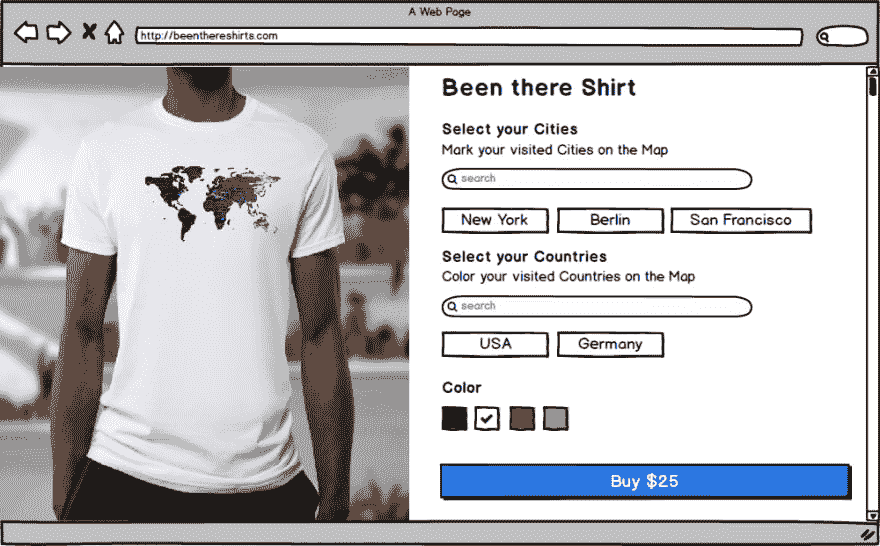

# 辅助项目想法#1 -去过那里的 t 恤

> 原文：<https://dev.to/binconsole/half-baked-ideas-0-0-1-1h4>

## 嘿！

我想开始一个习惯，与你分享我的想法。我专注于小型副业项目/初创公司。

我有许多想法，我想建立，但没有时间全部。所以希望有人能提出一个想法并付诸实施。如果你赚了几百万，让我知道:p。

有些想法是好的，有些是坏的，但我希望它能帮助人们选择一个去做。对一些人来说，这可能只是一个灵感。

我希望每周发布 1-3 个新想法，其中包括:

*   实体模型图像
*   说明
*   将想法货币化的建议
*   如果需要模型下载改变项目到你自己的(Balsamiq)

所以现在第一个想法是:

# 身边项目创意#1 去过的衬衫

根据你所在的城市和国家定制衬衫。按需打印的可打印 API。

[打印 API](https://www.printful.com/api)

### 样机

