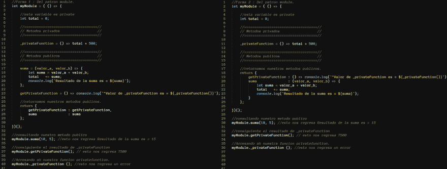

# JavaScript 中的设计模式

> [https://dev . to/konami 12/JavaScript-4jh4 中的设计模式](https://dev.to/konami12/patrones-de-diseno-en-javascript-4jh4)

本文将展示一些 JavaScript 实现，并解释其一些设计模式(对于所做的所有示例，将使用“**ECMA 2016**或 262]。

今天，作为一个开发人员，我们通常会问自己，使用 JavaScript 实现工作流的最佳方法之一是什么，实际上并没有对此问题的具体答案，因为每个应用程序都有自己的独特需求，所以当我们认为一个模式可以为我们提供一个理想的解决方案时，我们需要考虑以下几点

## 是设计模式吗？

> 它是解决应用程序开发和其他交互或接口设计领域中常见问题的基础。(维基百科资料来源)。

可以更简单地概括为“解决问题的方法”，设计模式必须至少达到以下目标。

1.  标准化开发者之间的语言。
2.  避免在解决已解决或已知问题上浪费时间。
3.  建立可重复使用的程式码。

* * *

## 动手吧

一段时间的理论之后，让我们从有趣开始，让我们来谈谈代码这种情况下有几种设计模式，我们只谈 3 种模式。

## Patrón 对象文字量

正如其名称所说，这个图案符合创建一个实际上是‘t0’JSON’t1’的物体。这种模式的优点之一是，它使我们能够有组织地编写代码，而不会以不必要的名称破坏全局的**范围** ( **范围**，这是非常好的做法，特别是对于非常大的项目。

正如开始时所评论的那样，此模式的表示法与构建“**JSON**”非常相似，因为它具有允许访问每个模式内容的标识符。

```
// Se inicia la declaracion del patron ObjectLiteral
var MyObjectLiteral = {
    suma: function(valor_a, valor_b) {
        let resultado = valor_a + valor_b;
        console.log("EL resultado de "+ valor_a +"+"+ valor_b +" = "+ resultado);
    },
    resta: function(valor_a, valor_b) {
        let resultado = valor_a - valor_b;
        console.log("EL resultado de"+ valor_a +"-"+ valor_b +" = "+ resultado);
    },
};

// invocando a la funcion suma
MyObjectLiteral.suma(10, 90);
// invocando a la funcion resta
MyObjectLiteral.resta(90, 30); 
```

如上例所示，我们有模式的基本示例，∞片刻假定这些示例将使用“*ecmascript*”提供的新增强功能编写，考虑到反馈，我们将进行增强，以便我们的代码如下所示。

```
// Se inicia la declaracion del patron ObjectLiteral
let MyObjectLiteral = {
    suma(valor_a, valor_b) {
        let resultado = valor_a + valor_b;
        console.log(`EL resultado de ${valor_a} + ${valor_b} = ${resultado}`);
    },
    resta(valor_a, valor_b) {
        let resultado = valor_a - valor_b;
        console.log(`EL resultado de ${valor_a} - ${valor_b} = ${resultado}`);
    },
};

// Destructuración
const { suma, resta } = MyObjectLiteral;
// invocando a la funcion suma
suma(10, 90);
// invocando a la funcion resta
resta(90, 30); 
```

∞我们的代码已经有许多它提供的增强功能 *JavaScript* 我们发现的增强功能包括:

*   **[【字符串(文本字符串模板)](https://developer.mozilla.org/es/docs/Web/JavaScript/Referencia/template_strings)**
*   **[【分配销毁】](https://developer.mozilla.org/es/docs/Web/JavaScript/Referencia/Operadores/Destructuring_assignment)**

考虑到以上情况，下面的例子采用了新的增强功能 *JavaScript* *，重要的是要提及模式 _ object literal*是下一模式的基础，因为我们将使用它来处理逻辑。

* * *

## Patrón 模块

要了解此模式，必须了解此功能的以下概念。

```
// Módulo anónimo
(() => console.log("Me ejecuto de manera inmediata . . . . 😬"))(); 
```

这种说法被称为***【iife】【立即调用-函数-表达式】*** ，正如其名称所说，是一种立即执行的函数。此函数创建一个新范围并生成“隐私”，但 JavaScript 不处理“隐私”的概念，但通过生成一个新范围，我们可以模拟它，这是通过将整个应用程序逻辑封装在一个容器中来实现的。我们的想法只是返回我们需要的部分，把代码的其他部分排除在全球范围之外。

创建新范围后，我们需要一个命名空间来访问匿名模块返回的代码。

> 命名空间-用于生成对匿名模块的引用的变量。

```
// Modulo anónimo
const MyModule = (() => "Me ejecuto de manera inmediata . . . . 😬")();
// Ejecutamos el módulo anónimo
console.log(MyModule); 
```

到目前为止，我们可以访问匿名模块返回的内容。

此前曾在此模式内讨论过*【隐私】*，为了能够展示这一概念，我们将分析下例。

```
// Modulo anónimo
const MyModule = (() => {
    // generamos el objeto que tendra todas las funciones publicas
    let publicFunction = {};
    // esta variable es privada
    let total = 0;

    //=========================================//
    // Metodos Privados                        //
    //=========================================//

    privateFunction = () => total * 1000;

    //=========================================//
    // Metodos Publicos                        //
    //=========================================//

    publicFunction.suma = (valor_a, valor_b) => {
        const SUMA = valor_a + valor_b;
        total += SUMA;
        console.log(`El resultado de la suma es = ${SUMA}`);
    };

    // Retornamos nuestras funciones publicas
    return publicFunction;
})();

// Ejecutando nuestro metodo publico
MyModule.suma(100, 400); // el resultado es 500

// Intentando acceder a nuestra funcion privada
MyModule.privateFunction(); // esto nos manda un error 
```

如本例所示，我们生成了一个模块，使我们能够进行求和，但我们可以看到一个通用的常见代码，有趣的是“*隐私”T1”的概念已经被处理，我们无法访问方法 *privateFunction**

这是因为我们只返回包含变量 public function 的所有内容，而其中不包含的内容将是私有的，因此只能在我们的模块范围内进行访问

到目前为止你可能一直在问的问题是*∞我咨询一下私人函数的答案好吗？*为此，我们需要生成一个获得“privateFunction”返回结果的公共函数，如下所示。

```
// Modulo anónimo
const MyModule = (() => {
    // generamos el objeto que tendra todas las funciones publicas
    let publicFunction = {};
    // esta variable es privada
    let total = 0;

    //=========================================//
    // Metodos Privados                        //
    //=========================================//

    privateFunction = () => total * 1000;

    //=========================================//
    // Metodos Publicos                        //
    //=========================================//

    publicFunction.suma = (valor_a, valor_b) => {
        const SUMA = valor_a + valor_b;
        total += SUMA;
        console.log(`El resultado de la suma es = ${SUMA}`);
    };

    publicFunction.getPrivateFunction = () => console.log(`Valor de privateFunction => ${privateFunction()}`);

    // Retornamos nuestras funciones publicas
    return publicFunction;
})();

// Ejecutando nuestro metodo publico
MyModule.suma(100, 400); // el resultado es 500

// Consiguiendo el valor de private function
MyModule.getPrivateFunction(); // esto nos regresa 500000

// Intentando acceder a nuestra funcion privada
MyModule.privateFunction(); // esto nos manda un error 
```

我们可以看到，这种模式使我们能够操纵*【隐私】T1】的概念，当我们不想让应用程序的所有功能都暴露出来时，这是非常有用的。*

有多种方法可以编写 module 模式代码，其中一些方法如下例所示。

[](https://res.cloudinary.com/practicaldev/image/fetch/s--5klVYyg4--/c_limit%2Cf_auto%2Cfl_progressive%2Cq_auto%2Cw_880/https://miro.medium.com/max/2000/1%2AC_K4wLReFYhfT-AiaOpZrQ.png)

> 注:在此模式中，通常会看到所有私有方法都有前缀 **_** 。考虑到上述建议，我们的范例程式码如下。

```
// Modulo anónimo
const MyModule = (() => {
    // generamos el objeto que tendra todas las funciones publicas
    let publicFunction = {};
    // esta variable es privada
    let _total = 0;

    //=========================================//
    // Metodos Privados                        //
    //=========================================//

    _privateFunction = () => _total * 1000;

    //=========================================//
    // Metodos Publicos                        //
    //=========================================//

    publicFunction.suma = (valor_a, valor_b) => {
        const SUMA = valor_a + valor_b;
        _total += SUMA;
        console.log(`El resultado de la suma es = ${SUMA}`);
    };

    publicFunction.getPrivateFunction = () => console.log(`Valor de privateFunction => ${_privateFunction()}`);

    // Retornamos nuestras funciones publicas
    return publicFunction;
})();

// Ejecutando nuestro metodo publico
MyModule.suma(100, 400); // el resultado es 500

// Consiguiendo el valor de private function
MyModule.getPrivateFunction(); // esto nos regresa 500000

// Intentando acceder a nuestra funcion privada
MyModule.privateFunction(); // esto nos manda un error 
```

## Patrón 原型

此设计模式旨在通过复制以前创建的实例来创建新对象，简而言之，使用此模式最接近于“*poo”(面向对象的编程)t1]，具有“*ecmascript]t”的新功能**

另一个特点是 JavaScript 中的所有对象都具有属性 *proto* ，这使得为现有类创建新函数变得容易，这种模式实际上就是 jeje 波。

为了更好地了解此模式，我们将使用 prototype 创建一个示例，使用 ecmascript 的新功能创建另一个示例。

### 帕索 1:

使用`prototype`和`Class`
创建人员类

```
// Creamos la clase usando prototype

/**
 * Constructor
*/
function Persona(nombre, apellido) {
    this.apellido = apellido;
    this.nombre = nombre;
}

/**
 * Permite obtener el apellido
 *
 * @return void.
 */
Persona.prototype.getApellido = function() {
    console.log(`Mi appelido es ${this.apellido}`);
}; 

/**
 * Permite obtener el Nombre
 *
 * @return void.
 */
Persona.prototype.getNombre = function() {
    console.log(`Mi Nombre es ${this.nombre}`);
};

// Generamos la instancia de la clase
const persona = new Persona("Clark", "Kent");
// invocamos los metodos
persona.getNombre(); // Mi nombre es Kent
persona.getApellido(); // Mi apellido es Clarck

// ========================================================================= //

// Creando la clase usando la palabra reservada class

class Persona {
    /**
     * Constructor
    */
    constructor(){}

    /**
     * Permite obtener el apellido
     *
     * @return void.
     */
    getApellido() {
        console.log(`Mi appelido es ${this.apellido}`);
    }
    /**
     * Permite obtener el Nombre
     *
     * @return void.
     */
    getNombre() {
        console.log(`Mi Nombre es ${this.nombre}`);
    }
}

// Generamos la instancia de la clase
const persona = new Persona("Clark", "Kent");
// invocamos los metodos
persona.getNombre(); // Mi nombre es Kent
persona.getApellido(); // Mi apellido es Clarck 
```

### 帕索 2:

对于 emacscript 2016 中的继承处理，extends 现已可用，在以前的版本中，继承的处理方式更为复杂。

```
// Creamos la clase y una herencia usando prototype 

/**
 * Constructor
*/
function PersonaUsandoPrototype(nombre, apellido) {
    this.apellido = apellido;
    this.nombre = nombre;
}

/**
 * Permite obtener el apellido
 *
 * @return void.
 */
PersonaUsandoPrototype.prototype.getApellido = function() {
    console.log(`Mi appelido es ${this.apellido}`);
}; 

/**
 * Permite obtener el Nombre
 *
 * @return void.
 */
PersonaUsandoPrototype.prototype.getNombre = function() {
    console.log(`Mi Nombre es ${this.nombre}`);
};

// Generando herencia

/**
 * Constructor
*/
function SuperHeroUsandoPrototype(nombre, apellido, powers) {
    // Se genera el llamado al constructor de la clase persona
    PersonaUsandoPrototype.call(this, nombre, apellido);
    this.powers = powers;
}

// generamos la herencia
SuperHeroUsandoPrototype.prototype = Object.create(PersonaUsandoPrototype.prototype);
/** 
 * Permite comnseguir los datos de nuestro heroe
 *
 * return void.
 */
SuperHeroUsandoPrototype.prototype.getSuperHero = function() {
    // invocamos los metodos de las clase person
    this.getNombre();
    this.getApellido();
    console.log(`Mi super poder es ${this.powers}`);
};

// Generamos la instancia de la clase
const HERO_PROTO = new SuperHeroUsandoPrototype("Jorge", "Mendez", "Programar como Loco 🤪");
// invocamos los métodos
HERO_PROTO.getSuperHero();
// Mi nombre es Jorge
// Mi apellido es Mendez
// Mi super poder es Programar como Loco 🤪

// ========================================================================= //

// Creando la clase y herencias utilizando las class y extends

class Persona {
    /**
     * Constructor
    */
    constructor(nombre, apellido) {
        this.nombre = nombre;
        this.apellido = apellido;
    }

    /**
     * Permite obtener el apellido
     *
     * @return void.
     */
    getApellido() {
        console.log(`Mi appelido es ${this.apellido}`);
    }
    /**
     * Permite obtener el Nombre
     *
     * @return void.
     */
    getNombre() {
        console.log(`Mi Nombre es ${this.nombre}`);
    }
}

// Generando la herencia

class SuperHero extends Persona {
    /**
     * Constructor
    */  
    constructor(nombre, apellido, powers) {
        // llamando al constructor de la clase persona
        super(nombre, apellido);
        this.powers  = powers;
    }
    /** 
     * Permite comnseguir los datos de nuestro heroe
     *
     * return void.
     */
    getSuperHero() {
        // invocamos los metodos de las clase person
        this.getNombre();
        this.getApellido();
        console.log(`Mi super poder es ${this.powers}`);
    };
}

// Generamos la instancia de la clase
const heroe = new SuperHero("Jorge", "Mendez", "Programar como Loco 🤪");

heroe.getSuperHero(); 
// Mi nombre es Jorge
// Mi apellido es Mendez
// Mi super poder es Programar como Loco 🤪 
```

模式处理*原型*最接近*poo】*目前已有`JavaScript`的改进，我们已经有了更强大的 *POO* 但如果你还记得，我们曾经评论过所有的物体

```
String.prototype.cleanString = function() {
    const STRING = this.toLowerCase().split("");
    const SPECIAL = {
        "á" : "a", "é" : "e", "í" : "i",
        "ó" : "o", "ú" : "u", "ñ" : "n",
    };
    let request = STRING.reduce((newString, item) => {
        let char = SPECIAL[item] || item;
        const ASCII = char.charCodeAt();
        let request = (ASCII === 32 || (ASCII >= 48 && ASCII <= 57) || (ASCII >= 97 && ASCII <= 122)) ? char : "";
        return `${newString}${request}`;
    }, "");
    request = request.split("  ")
        .filter(Boolean)
        .join("-")
    return request;
};

const CLEAN = "Jorge Méndez Ortega ^$#%#$%^#%$&*%&^&".cleanString();
console.log(CLEAN); // jorge-mendez-ortega 
```

## 结论

设计模式是一种以不同方式解决问题的方法，但我们始终会得到一种可以适应我们应用程序的解决方案。可以说，构建我们的应用程序没有正确的方法，但有一种模式可以帮助我们更接近我们想要的方法。