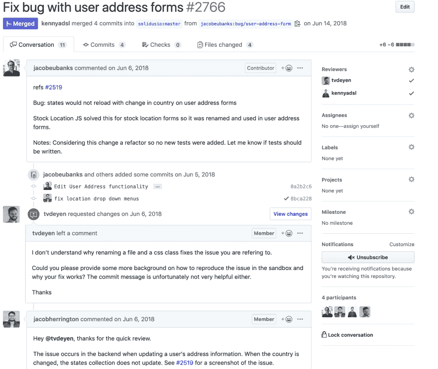
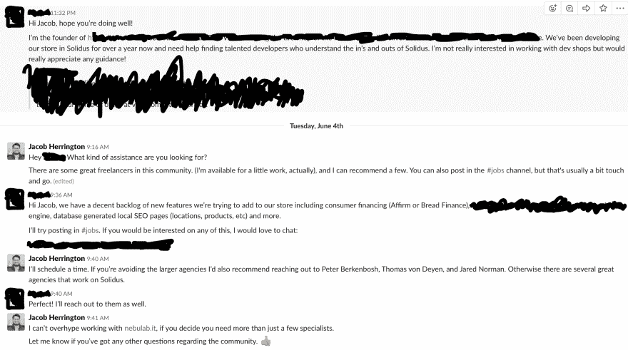

# 开源让我$10K 兼职工作了 30 天

> 原文：<https://dev.to/jacobherrington/open-source-made-me-10k-working-part-time-for-30-days-4lh>

封面图片:[笔记本电脑前的眼镜](https://www.pexels.com/photo/eyeglasses-in-front-of-laptop-computer-1181253/)作者[克里斯蒂娜·莫里洛](https://www.pexels.com/@divinetechygirl)
我给了很多[职业建议](https://jh.codes)。我在网上指导实习生、大三学生和随机的人，通常利用我自己的经验或在 [devpath.fm](https://www.devpath.fm) 上分享的故事。

这一套特别的建议来自我自己的经验，我不建议每个人都走我走过的路(因为它是不可持续的)，但我目前有证据表明，如果我愿意，我可以建立一个 25 万到 50 万美元的咨询业务，这是非常好的消息。

故事要追溯到 2018 年 6 月，GitHub 上的一个 Pull 请求改变了几行标记:

我和@jacobeubanks 向 [Solidus](https://www.github.com/solidusio/solidus) 提出了这个拉请求。

这很普通，但对我们来说，这就像是一项成就。我们都是开源的新手，我们都没有真正为像 Solidus 这样被积极使用的项目做出过贡献。

合并公关真的引起了我的共鸣，所以我开始寻找其他方法来帮助完成这个项目(这对一个 10 年的代码库来说很难)。

不久，我有了一些提交，主要是关于文档和小的 UI 错误。我还参与了项目的 Slack 频道，并询问维护人员我如何能提供最大的帮助。

我有一些很好的参与机会，因为我被邀请加入 Solidus 利益相关者委员会，还参加了孟菲斯的一个社区会议。

在项目核心团队成员之一 [Alberto Vena](https://twitter.com/AlbertoVena) 给我的指导和我自己发现的错误之间，我能够让我的名字在这个小社区中相当有名。

一件事接着一件事，最终，阿尔贝托向 Solidus 核心团队发出了邀请。

顺便说一句，当你害怕被拒绝或不确定自己的贡献能力时，以下是我对贡献开源项目的建议:

*做无聊的任务。它们必须完成，没有人会拒绝修复测试、文档、UI 错误或改进 CI 配置的 pull 请求。*

这让我可以做出更多的贡献。我可以审查 PRs，解决问题并进行分类，在社区中更有效地分享我的想法，并合并新的改进。

我会说，这是一个六到八个月的时间投资。但是仅仅是体验就值得投资。我受益于对 Rails 的更多了解，结交新朋友和新关系，并构建了一个小型开源组合。

快进到 2019 年 6 月。我收到了 Solidus 的一位创始人主动发来的 DM:

在零营销的情况下，我能够签下一个客户，这个客户每月支付我 10，000 美元，每周工作不到 20 小时，主要是因为我是这个项目的核心团队成员。

这种曝光率非常有价值。我会第一个告诉你，我不是 Solidus 社区中最有经验或最有资格的开发人员(那是我推荐的其他人)，但这位创始人在 Solidus.io 上看到了我的名字，所以他们联系了我。

以下是重现这类事情的一些建议:

### 1。为开源做贡献

除了对你的技术技能、人际技能和开发者社区有好处之外，它对建立你的专业网络和品牌也有好处。成为少数项目的开源贡献者是显而易见的。

### 2。直言不讳，有用

把你的名字写在你关心的东西上(就像我对 Solidus 做的那样)。寻找帮助他人的机会，这对开发者社区来说是正确的事情，也有助于你扩展你的职业网络。这非常重要。

### 3。寻找与有偿工作直接相关的项目

如果你想将开源专业知识转化为收入，这是一个非常好的主意。对于 Solidus，这是显而易见的；人们使用 Solidus 建立业务。很多很多开源项目都有业务联系，尤其是如果你想走咨询这条路的话。对几乎任何框架或基础设施工具做出贡献，对于用这些工具建立业务的人来说都是非常受欢迎的。

### 4。对机会保持开放

我真的从来不会忽视一封电子邮件、一封短信或一个电话。是的，我看到许多令人讨厌的垃圾邮件，但我也看到类似的东西，因为人们知道我是当你有问题时可以联系的人。这是有不同程度的，我所做的事情在达到一定的临界质量后是不可持续的，所以找到一个适合你的系统。只要确定你没有给联系你制造困难。

### 5。找到健康的平衡

我选择在一个月后结束这项工作，因为我在做咨询的同时也在帮助建立一家初创公司。这是不可持续的，所以我放弃了这个机会。如果你不能平衡你的工作量，你就不可能有这样的机会。

不管你是否能效仿我的道路，或者你是否有同样的特权或运气让我有机会利用这样的机会，这篇文章中有一条建议我会至死不渝:

> 在互联网上有用。

我很确定本·奥伦斯坦在我们为我的播客录音的时候告诉我的(仍在为那一集工作)，但它听起来是真的，包含了我刚刚给出的所有 5 条建议。

理想情况下，这会让你对开源工作如何变成一份工作或一笔生意有所了解。

我很乐意在评论中听到关于这类事情的其他经验或进入开源的建议👇