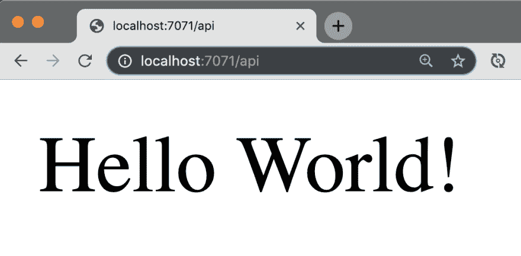
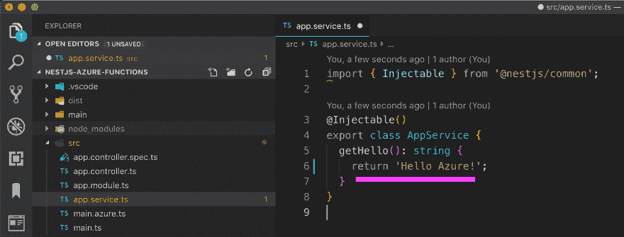
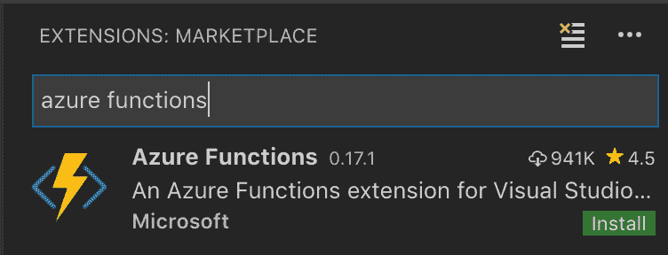
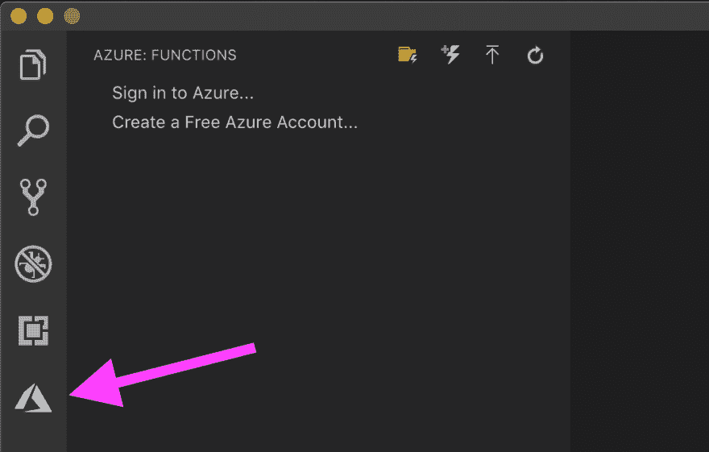
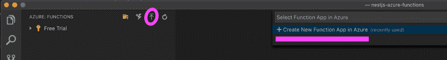
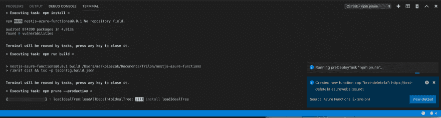
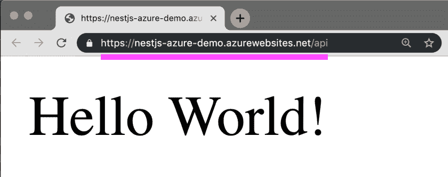

# 了解如何将 NestJS 无服务器应用部署到 Azure 函数

> 原文：<https://dev.to/trilon/learn-how-to-deploy-nestjs-serverless-apps-to-azure-functions-df8>

> **最初发表于 [Trilon 博客](https://trilon.io/blog/deploy-nestjs-azure-functions)由[Kamil Mysliwiec](https://twitter.com/kammysliwiec)T5】**

## 将 NestJS 部署到生产系列:

*   [第 1 部分:将 NestJS 部署到 Zeit Now.sh](https://trilon.io/blog/deploying-nestjs-to-zeit-now)
*   [**第二部分:将 NestJS 部署到 Azure 功能**](https://trilon.io/blog/deploy-nestjs-azure-functions) *(本文)*
*   ...还会有更多...

* * *

# 微软 Azure 无服务器 NestJS

在本文中，我们将了解如何在几分钟内将*无服务器* **[NestJS](https://nestjs.com)** 应用部署到云平台 **[Azure 功能](https://code.visualstudio.com/tutorials/functions-extension/getting-started)** ！

如果您不熟悉 **[NestJS](https://nestjs.com)** ，它是一个 TypeScript Node.js 框架，可以帮助您构建企业级高效且可伸缩的 Node.js 应用程序。

* * *

> 如果你错过了公告，NestJS&Azure*和*的整合在几周前被取笑了！

液体错误:内部

在我们进一步深入之前，让我们后退一步，以确保我们对 Azure 函数以及它们如何在处理我们的无服务器 NestJS 应用程序中发挥作用有了很好的理解。

## 什么是 Azure 功能？

Azure Functions 是一种无服务器的计算执行服务，它使您能够按需运行代码*而不必管理机器资源、服务器等的分配。编写您的 NestJS 代码，部署它——让 Azure 函数处理剩下的事情！*

Azure functions 可以让你创建基于事件执行**的函数，点击阅读官方 Azure Functions 文档[。](https://docs.microsoft.com/azure/azure-functions/)**

* * *

Azure 让你部署无数不同的框架/语言，从 C#到 JavaScript/TypeScript。

NestJS 毕竟是一个基于 TypeScript 的 Node.js 框架——所以让我们看看如何利用奇妙的 Azure 平台来部署我们的无服务器应用程序！

## 获取 NestJS 设置

> **注意:**在本次演示中，我们将展示一个由 CLI 生成的新的 NestJS 应用程序，但如果您喜欢使用现有的 NestJS 应用程序，请随意，并跳到下一节关于 Schematics。

```
☁ npm i -g @nestjs/cli
☁ nest new PROJECT_NAME 
```

<svg viewBox="0 0 448 512" class="highlight-action highlight-action--fullscreen-on"><title>Enter fullscreen mode</title></svg> <svg viewBox="0 0 448 512" class="highlight-action highlight-action--fullscreen-off"><title>Exit fullscreen mode</title></svg>

现在让我们进入新创建的目录并打开我们的 IDE。至此，我们已经生成了一个简单的 NestJS 应用程序。

* * *

# 📯NestJS Azure 功能示意图简介

在 **[Trilon](https://trilon.io)** 的时候，我们一直在和微软 Azure 团队中的一些了不起的人一起工作，以创建 NestJS + Azure 功能之间的无缝集成。允许您毫不费力地将新的/现有的服务部署到云中！

这些 NestJS 示意图允许您使用一个简单的命令，立即为您的应用程序设置集成所需的所有框架。稍后将详细介绍这一点！

# 安装 NestJS Azure 功能示意图

在您的终端中，确保您位于项目的根目录，并键入:

```
nest add @nestjs/azure-func-http 
```

<svg viewBox="0 0 448 512" class="highlight-action highlight-action--fullscreen-on"><title>Enter fullscreen mode</title></svg> <svg viewBox="0 0 448 512" class="highlight-action highlight-action--fullscreen-off"><title>Exit fullscreen mode</title></svg>

示例输出:

```
✔ Installation in progress... ☕
CREATE /.funcignore (66 bytes)
CREATE /host.json (23 bytes)
CREATE /local.settings.json (116 bytes)
CREATE /proxies.json (72 bytes)
CREATE /main/function.json (294 bytes)
CREATE /main/index.ts (287 bytes)
CREATE /main/sample.dat (23 bytes)
CREATE /src/main.azure.ts (321 bytes)
UPDATE /package.json (1827 bytes) 
```

<svg viewBox="0 0 448 512" class="highlight-action highlight-action--fullscreen-on"><title>Enter fullscreen mode</title></svg> <svg viewBox="0 0 448 512" class="highlight-action highlight-action--fullscreen-off"><title>Exit fullscreen mode</title></svg>

**优秀！**现在，您已经为 Azure 函数完全设置好了 NestJS 应用程序！下一步是什么？

* * *

## 本地 Azure 功能开发

接下来，我们将利用 Azure-CLI 在本地测试我们的 Azure 功能！

如果您的计算机上还没有安装它，请确保:

1.  安装 [Azure 功能核心工具](https://docs.microsoft.com/azure/azure-functions/functions-run-local#v2)
2.  安装 [Azure CLI](https://docs.microsoft.com/cli/azure/install-azure-cli?view=azure-cli-latest)

一旦你安装好了所有的东西，通过在你的终端输入`func --version`来确保它设置正确。

* * *

有了 Azure-CLI 的所有设置，让我们启动我们的 *Local* Azure Functions 环境，看看一切都在运行！

> **重要:**先构建 NestJS。因为它是用 TypeScript 编写的，我们需要确保我们的应用程序在让 Azure 做剩下的事情之前编译成 JavaScript！

```
npm run build && func host start 
```

<svg viewBox="0 0 448 512" class="highlight-action highlight-action--fullscreen-on"><title>Enter fullscreen mode</title></svg> <svg viewBox="0 0 448 512" class="highlight-action highlight-action--fullscreen-off"><title>Exit fullscreen mode</title></svg>

这应该输出类似于:
的内容

```
Hosting environment: Production
Content root path: /Users/yourname/Documents/Trilon/nestjs-azure-functions
Now listening on: http://0.0.0.0:7071
Application started. Press Ctrl+C to shut down.

Http Functions:

    main:  http://localhost:7071/api/{*segments} 
```

<svg viewBox="0 0 448 512" class="highlight-action highlight-action--fullscreen-on"><title>Enter fullscreen mode</title></svg> <svg viewBox="0 0 448 512" class="highlight-action highlight-action--fullscreen-off"><title>Exit fullscreen mode</title></svg>

* * *

#### 在浏览器中打开网址`http://localhost:7071/api/`，你会看到:

<figure>[](https://res.cloudinary.com/practicaldev/image/fetch/s--piAC5fTx--/c_limit%2Cf_auto%2Cfl_progressive%2Cq_auto%2Cw_880/https://thepracticaldev.s3.amazonaws.com/i/m1equa78t9lgr7w4oi3m.png)

<figcaption>NestJS&Azure 函数局部开发</figcaption>

</figure>

### 就这么简单！

如果您想知道为什么 URL 前面有`/api/`，那么看看 NestJS 项目中的`main.azure.ts`文件。你可以把它更新成你想要的，添加 API 版本控制(`/api/v1/`)等等！

[](https://res.cloudinary.com/practicaldev/image/fetch/s--1QTldL92--/c_limit%2Cf_auto%2Cfl_progressive%2Cq_auto%2Cw_880/https://thepracticaldev.s3.amazonaws.com/i/f3g0w6o8eaknaz5xvllo.png)

最终，现实世界中的应用程序将在这个 globalPrefix 下拥有所有可用的 URL。

```
# ie:
GET /api/products/
GET /api/products/123
POST /api/products 
```

<svg viewBox="0 0 448 512" class="highlight-action highlight-action--fullscreen-on"><title>Enter fullscreen mode</title></svg> <svg viewBox="0 0 448 512" class="highlight-action highlight-action--fullscreen-off"><title>Exit fullscreen mode</title></svg>

* * *

# 将 NestJS 部署到 Azure 函数

敬请关注未来的公告，因为我们将推出`nest deploy azure`和其他伟大的集成，将进一步简化这一过程！

> **注意**:要部署 Azure 功能，你需要一个 [Azure 账户](https://azure.microsoft.com/free/)(新账户获得 12 个月的免费服务)。

当涉及到将你的 NestJS 应用部署到 Azure 功能时，有几种不同的途径可以选择，这完全取决于你是喜欢在`terminal`还是在 **IDE** 中做所有的事情(即:VSCode)。

在本文中，我们将展示通过 VSCode 进行部署，因为它更简单一些！从官方 Azure 文档[这里](https://docs.microsoft.com/azure/azure-functions/functions-create-first-azure-function-azure-cli#create-a-resource-group)阅读更多关于通过`terminal`部署的信息。

## 安装 Azure 功能 VSCode 扩展

前往 VSCode 的扩展市场，搜索`"Azure Functions"`或在这里下载[。](https://marketplace.visualstudio.com/items?itemName=ms-azuretools.vscode-azurefunctions)

> 更多关于扩展安装和先决条件的信息[在这里](https://code.visualstudio.com/tutorials/functions-extension/getting-started)。

[](https://res.cloudinary.com/practicaldev/image/fetch/s--rXlsJDMQ--/c_limit%2Cf_auto%2Cfl_progressive%2Cq_auto%2Cw_880/https://thepracticaldev.s3.amazonaws.com/i/q3150mqwek6eafmq2gpc.png)

一旦安装完毕，你会注意到在*左侧*工具条上有一个新的**图标**，选择它打开 Azure 功能选项。

**1。登录或注册(到 Azure)**

[](https://res.cloudinary.com/practicaldev/image/fetch/s--F9Ze2U7W--/c_limit%2Cf_auto%2Cfl_progressive%2Cq_auto%2Cw_880/https://thepracticaldev.s3.amazonaws.com/i/5894y83ebngo6lsdfux5.png)

**2。点击“部署到功能应用”* *箭头**图标，选择“在 Azure 中创建新的功能应用”。**

[](https://res.cloudinary.com/practicaldev/image/fetch/s--catVDM9---/c_limit%2Cf_auto%2Cfl_progressive%2Cq_auto%2Cw_880/https://thepracticaldev.s3.amazonaws.com/i/rbieelzu71n5oisosusl.png)

**3。为您的 Azure 函数选择一个唯一的名称，然后按 Enter。**

> **注意**:这一步可能需要一些时间，因为它将创建存储组和您的新功能应用。未来的部署会快得多，不用担心！:)

[](https://res.cloudinary.com/practicaldev/image/fetch/s--F1dvkzSH--/c_limit%2Cf_auto%2Cfl_progressive%2Cq_auto%2Cw_880/https://thepracticaldev.s3.amazonaws.com/i/q0ddxsu6xr29clehb34c.png)

#### 部署完毕！

当一切完成后，在`Output`选项卡(如上所示)中检查您的部署已经完成！

```
# --- output similar to ---
# ... etc etc ...
1:54:52 PM nestjs-azure-demo: Deployment successful.
1:55:08 PM nestjs-azure-demo: Waiting for long running command to finish...
Deployment to "nestjs-azure-demo" completed.

HTTP Trigger Urls:
  main: https://nestjs-azure-demo.azurewebsites.net/api/%7B*segments%7D 
```

<svg viewBox="0 0 448 512" class="highlight-action highlight-action--fullscreen-on"><title>Enter fullscreen mode</title></svg> <svg viewBox="0 0 448 512" class="highlight-action highlight-action--fullscreen-off"><title>Exit fullscreen mode</title></svg>

# 无服务器 NestJS 部署到☁！

如果您一直在跟进，您应该能够在您的输出选项卡中访问该 URL，只需确保删除 URL 的最后一个`%7B*segments%7D`部分。

🐱导航到该 URL，查看您的无服务器“Hello World”API 的所有永恒荣耀！🐱

<figure>

[](https://res.cloudinary.com/practicaldev/image/fetch/s--n1WDOz17--/c_limit%2Cf_auto%2Cfl_progressive%2Cq_auto%2Cw_880/https://thepracticaldev.s3.amazonaws.com/i/6ckwu3xbu4j12ulk3cw9.png)

<figcaption>Magical ✨</figcaption>

</figure>

> **参见《Hello World》NestJS+Azure 函数现场演示:** 
> 
> 你可以在这里找到 Github 代码示例

## 有了！

在短短几分钟内，我们在本地启动了 azure 函数，并了解了如何使用新的 VSCode Azure 函数扩展进行部署，从而立即将我们的无服务器 NestJS 应用程序部署到云中！

## 鸟巢的未来计划&蔚蓝✨

我们的使命是在未来让整个过程变得更加简单！

> **敬请关注即将到来的`nest deploy azure`的更多文章和更新，以及其他令人惊叹的 Azure 集成！✨**
> 
> Azure 存储，改进的无服务器支持，等等！

* * *

# 总之

*   Azure 函数让您可以轻松地将 NestJS 应用程序部署到云中，让您可以在应用程序中使用所有其他您喜欢的 Azure 工具。
*   在部署之前，确保您的脚本正在构建您的嵌套。
*   通过命令行或 IDE 扩展进行部署
*   更多 NestJS 和 Azure 集成即将推出！
*   负责任地享受☁！

* * *

查看 Trilon 博客获取更多关于 Angular、NestJS 等的文章！

* * *