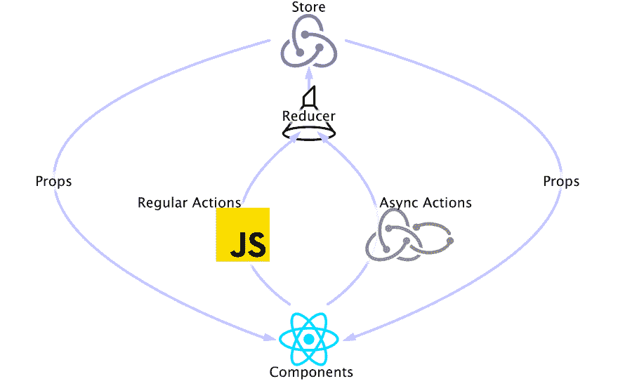

# 与 Redux Sagas 异步

> 原文：<https://dev.to/irmerk/asynchronous-with-redux-sagas-44dm>

### 复杂的副作用流管理和测试

当数据在组件之间共享时，使用 React 构建应用程序可能会有点混乱，不同的状态会导致太多的复杂性和困难。Redux 是一个轻量级的状态管理工具，可以与任何 JavaScript 框架或库一起使用，以维护一个一致的和可预测的状态容器。通过将应用程序的状态保存在单个全局存储中，而不是保存在组件级别，每个单独的组件都可以在任何时候访问它需要的任何状态，而不管组件树的形状如何，只要它通过 Redux 连接到存储。

Redux 的可预测性来自从不改变的不可变状态，以及纯函数 reducers。因为 reducers 是功能性的，所以处理副作用逻辑和异步调用的一个常用中间件是 [redux-thunk](https://github.com/reduxjs/redux-thunk) 。Thunk 允许动作创建者返回一个函数而不是一个动作。

虽然我假设您对 React 和 Redux 有基本的了解，但这将是一个关于处理副作用的 Redux 中间件的指南: **Redux Sagas**

→ *此处* 跳转到示例代码[的演练](#walk)

### 为什么要 Redux Saga？

只要相同的动作被传递给 reducer，我们就可以确保每次都以相同的方式更新存储。Sagas 类似于普通的 reducer，是监听分派的动作，执行副作用，并将它们自己的动作返回给普通 reducer 的函数。因为 Sagas 拦截有副作用的动作并处理它们，Redux reducers 保持纯净。

Redux Saga 为此利用了 ES6 [发生器](https://developer.mozilla.org/en-US/docs/Web/JavaScript/Reference/Statements/function*#Description)功能。生成器允许同步编写异步代码。生成器会在每次异步调用时自动暂停——或放弃——直到调用完成后再继续。这种范式通过为更易管理和更复杂的异步流集中异步逻辑，允许更简单和更可读的代码。

佐贺发生器功能让我想起了一点`async/await`，有一些小的变化，如`yield`和`put()`。一些差异提供了强大的好处，比如`takeLatest()`确保尽管已经调度了多个同时的获取动作，但是只有最近的获取调用运行完成。然而，在 thunk 中通常直接位于动作创建器内部的异步调用在 Redux Sagas 中会有一个清晰的分离。

除了代码组织和属性，测试变得更加容易。一个传奇仅仅产生了一个关于调用什么的描述，因此省去了每次测试模拟数据的需要。

Redux Saga 在 API 或其他异步调用使用复杂的流程(调用依赖于下一个流程)时最有用。

**优点**:

`+`更可读的代码
`+`适合处理复杂场景
`+`测试用例变得简单，无需模仿异步行为

**缺点**:

`-`给代码带来了更多的复杂性
`-`额外的依赖
`-`很多概念需要学习

**结论**:

→适用于需要复杂单元测试用例的应用程序的复杂异步部分

### 关于 Thunks 的一个快速注释:

鉴于 Redux Saga 试图用 Redux 编排复杂的异步操作，它是 Thunks 的一个替代方案。然而，传奇提供了更多的功能。Thunks 适用于简单的用例，但对于更复杂的场景可能不是最佳选择。

Thunks 添加了一个间接层以获得更大的灵活性，并将分派函数传递给动作创建者返回的函数。这允许组件不知道请求同步还是异步操作。

**优点**:

`+`简单代码维护

**缺点**:

`-`努力处理复杂场景
`-`异步行为需要对测试用例进行模拟

**结论**:

→适合应用的小型、直接异步器件

### 发电机

用`*`表示，生成器利用`yield`关键字来暂停函数。虽然`async/await`可以转化成发电机，但反过来就不行了。而且 Sagas 的`takeLatest()`行为和生成器功能取消更多是 Redux Saga 提供的属性。

当调用生成器函数时，它返回一个迭代器对象。每个后续的`next()`方法调用将执行生成器，直到下一个 yield 语句并暂停。

```
function* testGenerator() {
  const first = yield 'first yield value';
  const second = yield 'second yield value';
  return 'third returned value';
}

const test = testGenerator();

console.log(test.next()); // { value: 'first yield value', done: false }
console.log(test.next()); // { value: 'second yield value', done: false }
console.log(test.next()); // { value: 'third returned value', done: true }
console.log(test.next()); // { value: undefined, done: true } 
```

Enter fullscreen mode Exit fullscreen mode

* * *

### 预排:

为了引导这个概念，我将引用我参与的一个开源软件项目所使用的 web 应用程序的代码库:

[雅阁项目](https://www.accordproject.org/)(AP)
[AP Github](https://github.com/accordproject)
[模板工作室资源库](https://github.com/accordproject/template-studio-v2)

目前正在构建的项目是对*模板工作室*的重新设计。细节大多不重要，只要说我将要经历的部分调用 API 来收集模板数组，并在组件中显示它们就足够了。这一重新设计将由许多互锁的 React 组件组成，所有组件都位于一个应用程序中，并由 Redux 商店控制。因为这开始很复杂，而且只会继续变得更复杂，所以我们选择了 Redux Saga 来处理这种复杂性。

不幸的是，正如您可能也经历过的那样，似乎没有什么参考资料。当涉及到任何复杂的事情时，尤其如此。

这将是在 *Template Studio* for Accord 项目中遵循 Redux Saga 背后的逻辑的指南。希望这将证明是一个对你有用的资源。

设置
常用 Redux Saga 方法(*称为特效*):

**`fork`** →对传递的函数执行非阻塞操作。

**`take`** →暂停直到收到动作。

**`race`** →同时运行效果，然后在一个效果结束后取消所有效果。

**`call`** →运行功能。如果它返回一个承诺，暂停事件直到解决。

**`put`** →派遣一个行动。

**`select`** →运行选择器函数从状态中获取数据。

**`takeLatest`** →执行操作，只返回最后一次调用的结果。

**`takeEvery`** →将返回所有已触发呼叫的结果。

* * *

应用程序数据流的整体结构如下所示:

[](https://res.cloudinary.com/practicaldev/image/fetch/s--zEKLzQuC--/c_limit%2Cf_auto%2Cfl_progressive%2Cq_auto%2Cw_880/https://github.com/irmerk/outreach/blob/mastimg/sagaDiagram.png%3Fraw%3Dtrue)

首先，我们设置应用程序的主渲染，并将商店应用到由 [react-redux](https://redux.js.org/) :
给出的`Provider`

```
import React from 'react';
import { render } from 'react-dom';
import { Provider } from 'react-redux';

import MainApp from './containers/App';
import store from './store';

render(
  <Provider store={store}>
    <MainApp />
  </Provider>,
  document.querySelector('#root')
); 
```

Enter fullscreen mode Exit fullscreen mode

#### 商店

从 Redux Saga 引入`createSagaMiddleware`方法，我们创建`sagaMiddleware`并在我们的 rootSaga 上运行它，我们将在下面看到。此外，我们将所有的减速器组合在一起，并在创建时将其包含在商店中。

类似于减少者，传奇将被注册到一个根传奇。让中间件使用 rootSaga 允许被调度的动作成功。

```
import { combineReducers, createStore, applyMiddleware } from 'redux';
import createSagaMiddleware from 'redux-saga';
import logger from 'redux-logger';

import templatesReducer from './reducers/templatesReducer';
...
import contractReducer from './reducers/contractReducer';
import rootSaga from './sagas/rootSaga';

const sagaMiddleware = createSagaMiddleware();
const middlewares = [sagaMiddleware];

if (process.env.NODE_ENV === 'development') {
  middlewares.push(logger);
}

const rootReducer = combineReducers({
  templatesState: templatesReducer,
  ...
  contractState: contractReducer,
});

const store = createStore(
  rootReducer,
  applyMiddleware(...middlewares),
);
sagaMiddleware.run(rootSaga);

export default store; 
```

Enter fullscreen mode Exit fullscreen mode

#### 传奇故事

传奇在后台工作，并由`sagaMiddleware`控制它们。作为生成器函数，Sagas 可以控制函数的每一步。我们将对象让给`sagaMiddleware`,告诉它如何处理给定的参数，它将执行这些参数并在完成后恢复，因此看起来是同步操作。

传奇被分解到根源、观察者和工作者。你写的所有其他传奇都被合并到 root 中。

##### →根

所有的传奇都将被注册一个根传奇。组合在一个`all()`函数中，它们每次都被允许同时启动。

```
import { all } from 'redux-saga/effects';
import { templatesSaga } from './templatesSaga';
import { modelSaga } from './modelSaga';
import { logicSaga } from './logicSaga';
import { sampleSaga } from './sampleSaga';

/**
 * saga to yield all others
 */
export default function* rootSaga() {
  yield all([...templatesSaga, ...modelSaga, ...logicSaga, ...sampleSaga]);
} 
```

Enter fullscreen mode Exit fullscreen mode

##### →观察者

允许 Saga 知道什么时候开始，这个生成器函数监视动作(*类似于减速器*)并调用 worker Sagas 进行 API 调用。此功能在`Line 62`下面:

```
import { TemplateLibrary, Template } from '@accordproject/cicero-core';
import { version as ciceroVersion } from '@accordproject/cicero-core/package.json';
import { takeLatest, put, select, takeEvery } from 'redux-saga/effects';

import * as actions from '../actions/templatesActions';
import * as selectors from '../selectors/templatesSelectors';

/**
 * worker saga
 * saga to populate store with templates
 */
export function* pushTemplatesToStore() {
  try {
    const templateLibrary = new TemplateLibrary();
    const templateIndex = yield templateLibrary.getTemplateIndex({
      latestVersion: false,
      ciceroVersion,
    });
    const templateIndexArray = Object.values(templateIndex);
    yield put(actions.getTemplatesSuccess(templateIndexArray));
  } catch (err) {
    yield put(actions.getTemplatesError(err));
  }
}

/**
 * worker saga
 * saga which puts a mock template onto the array
 * of templates in the store
 */
export function* addNewTemplateToStore() {
  const newTemplate = {
    uri: `${Date.now()}`,
    name: 'Temporary New Template',
    version: '1.0.0',
    description:
      'This is mock data to showcase an action to add a new template.',
  };
  yield put(actions.addNewTemplateSuccess(newTemplate));
}

/**
 * worker saga
 * saga which checks if template is in the store
 * and loads the template if it is not
 */
export function* addTemplateObjectToStore(action) {
  const templateObjects = yield select(selectors.templateObjects);

  if (!templateObjects || !templateObjects[action.uri]) {
    try {
      const templateObj = yield Template.fromUrl(action.uri);
      yield put(actions.loadTemplateObjectSuccess(action.uri, templateObj));
    } catch (err) {
      yield put(actions.loadTemplateObjectError(err));
    }
  }
}

/**
 * watcher saga
 */
export const templatesSaga = [
  takeLatest('GET_AP_TEMPLATES', pushTemplatesToStore),
  takeLatest('ADD_NEW_TEMPLATE', addNewTemplateToStore),
  takeEvery('LOAD_TEMPLATE_OBJECT', addTemplateObjectToStore),
]; 
```

Enter fullscreen mode Exit fullscreen mode

类似于`takeLatest()`，`takeEvery()`允许多个传奇实例同时运行。这两者都建立在`take()`之上，是同步的。

##### →工人

这个佐贺(`Lines 14`、`31`和`46`以上)会执行一个副作用。一旦数据加载完毕，使用`put()`方法来分派另一个动作。这不是直接调度，而是创建一个效果描述，告诉 Redux Saga 调度它。因为`put()`期望一个参数的动作，所以它充当动作创建者。但是，正如您将在下面看到的，我们将这些操作模块化了。

#### 减速器

和动作类似，Redux Saga 的还原器也是一样的。这只是一个以状态和动作作为参数的函数，并返回应用程序的下一个状态。一个动作只描述发生了什么，一个缩减器描述了*应用程序的状态如何改变*。

```
const initialState = {
  templatesAP: [],
  templateObjs: {},
  error: null,
};

const GET_AP_TEMPLATES_SUCEEDED = 'GET_AP_TEMPLATES_SUCEEDED';
const AP_TEMPLATES_ERROR = 'AP_TEMPLATES_ERROR';
const ADD_NEW_TEMPLATE_SUCCEEDED = 'ADD_NEW_TEMPLATE_SUCCEEDED';
const LOAD_TEMPLATE_OBJECT_SUCCEEDED = 'LOAD_TEMPLATE_OBJECT_SUCCEEDED';
const LOAD_TEMPLATE_OBJECT_ERROR = 'LOAD_TEMPLATE_OBJECT_ERROR';

const reducer = (state = initialState, action) => {
  switch (action.type) {
    case GET_AP_TEMPLATES_SUCEEDED:
      return { ...state, templatesAP: action.templates };
    case ADD_NEW_TEMPLATE_SUCCEEDED:
      return { ...state, templatesAP: [...state.templatesAP, action.template] };
    case AP_TEMPLATES_ERROR:
      return { ...state, error: action.error };
    case LOAD_TEMPLATE_OBJECT_SUCCEEDED:
      return {
        ...state,
        templateObjs: {
          ...state.templateObjs,
          [action.uri]: action.templateObj,
        },
      };
    case LOAD_TEMPLATE_OBJECT_ERROR:
      return { ...state, error: action.error };
    default:
      return state;
  }
};

export default reducer; 
```

Enter fullscreen mode Exit fullscreen mode

#### 组件

转到组件，我们有一个简单的方法来设置状态和分派，以产生更干净的代码。

```
import React from 'react';
import PropTypes from 'prop-types';
import styled from 'styled-components';
import { connect } from 'react-redux';
import { TemplateLibrary } from '@accordproject/cicero-ui';

import {
  getTemplatesAction,
  addNewTemplateAction,
} from '../../actions/templatesActions';

const TLWrapper = styled.div`
  ...;
`;
const mockAddToCont = input => {
  console.log('addToCont: ', input);
};
const mockImport = () => {
  console.log('import');
};
const mockUpload = () => {
  console.log('upload');
};

export class LibraryComponent extends React.PureComponent {
  componentDidMount() {
    this.props.fetchAPTemplates();
  }

  render() {
    return (
      <TLWrapper>
        <TemplateLibrary
          templates={this.props.templates}
          upload={mockUpload}
          import={mockImport}
          addTemp={this.props.addNewTemplate}
          addToCont={mockAddToCont}
        />
      </TLWrapper>
    );
  }
}

LibraryComponent.propTypes = {
  templates: PropTypes.array.isRequired,
  addNewTemplate: PropTypes.func.isRequired,
  fetchAPTemplates: PropTypes.func.isRequired,
};

const mapStateToProps = state => ({
  templates: state.templatesState.templatesAP,
});

const mapDispatchToProps = dispatch => ({
  fetchAPTemplates: () => dispatch(getTemplatesAction()),
  addNewTemplate: () => dispatch(addNewTemplateAction()),
});

export default connect(
  mapStateToProps,
  mapDispatchToProps
)(LibraryComponent); 
```

Enter fullscreen mode Exit fullscreen mode

#### 动作创建者

被分派到存储区进行处理的动作是包含事件描述的对象。因为动作是由动作创建者函数产生的，所以分派动作的函数不需要知道确切的结构。

对于传奇故事，行动略有不同。每个 API 调用都会发生三个动作。开始动作、成功响应和错误响应。虽然这种模式不会改变，但每次通话的地点可能会改变。

开始一个动作从组件内部开始，这可能会为进行调用添加必要的信息。工人传奇将调度成功和错误的行动。

```
export const getTemplatesAction = () => ({
  type: 'GET_AP_TEMPLATES',
});

export const getTemplatesSuccess = templateIndexArray => ({
  type: 'GET_AP_TEMPLATES_SUCEEDED',
  templates: templateIndexArray,
});

export const getTemplatesError = error => ({
  type: 'AP_TEMPLATES_ERROR',
  error,
});

export const addNewTemplateAction = () => ({
  type: 'ADD_NEW_TEMPLATE',
});

export const addNewTemplateSuccess = template => ({
  type: 'ADD_NEW_TEMPLATE_SUCCEEDED',
  template,
});

export const loadTemplateObjectAction = uri => ({
  type: 'LOAD_TEMPLATE_OBJECT',
  uri,
});

export const loadTemplateObjectSuccess = (uri, templateObj) => ({
  type: 'LOAD_TEMPLATE_OBJECT_SUCCEEDED',
  uri,
  templateObj,
});

export const loadTemplateObjectError = error => ({
  type: 'LOAD_TEMPLATE_OBJECT_ERROR',
  error,
}); 
```

Enter fullscreen mode Exit fullscreen mode

#### 重述

1.  (`TemplateLibrary.js`)当`LibraryComponent`挂载时，一个动作(`getTemplatesAction`)被调度
2.  (`templatesActions.js`)我们可以看到，`getTemplatesAction`调度一个类型:`‘GET_AP_TEMPLATES’`的对象。
3.  (`templatesSaga.js`)观察者将获得类型`‘GET_AP_TEMPLATES’`的动作并调用`pushTemplatesToStore`。
4.  (`templatesSaga.js`)当调用 pushTemplatesToStore 时，会发生一些事情。我们产生一个由从`@accordproject/cicero-core`导入的`TemplateLibrary`发出的 API 调用，并把它放在一个数组中。从那里，`getTemplatesSuccess`被调用，使用模板数组作为参数。
5.  (`templatesReducer.js`)这个动作(`GET_AP_TEMPLATES_SUCEEDED`)在 reducer 中结束，用附加到该动作的模板数组更新状态。
6.  (`TemplateLibrary.js`)因为这个组件订阅了 store，并且有 props * prop *与之关联，所以模板数组现在通过 props 应用于这个组件。

### 测试

Redux Saga 的测试可能会令人生畏。Redux Sagas 中提高效率的一般规则是确保 Sagas 尽可能少地执行，并将任何复杂的逻辑移出到一个单独的常规函数中。我建议采用以下几种方法:

#### 单元测试

这种方法通过`next()`方法逐个处理产量效应。测试可以检查产生的效果，并用`next().value`将其与预期效果进行比较。虽然这很简单，但它会导致脆弱的测试。这是因为测试与效果的实现和顺序紧密耦合。重构代码可能会破坏测试。

一个名为`recordSaga`的助手函数用于通过一个动作在中间件外部启动一个给定的传奇。选项对象(`dispatch`和`getState`)用于定义副作用的行为。`dispatch`完成 put 效果，`dispatched`将所有动作累积在一个列表中，并在传奇结束后返回。

```
import { runSaga } from 'redux-saga';

/**
 * saga to test independently
 */
export async function recordSaga(saga, initialAction, state) {
  const dispatched = [];
  await runSaga(
    {
      dispatch: action => dispatched.push(action),
      getState: () => state,
    },
    saga,
    initialAction
  ).toPromise();

  return dispatched;
} 
```

Enter fullscreen mode Exit fullscreen mode

利用`recordSaga`允许我们在给定的测试用例中查看分派动作的类型。

```
import { TemplateLibrary } from '@accordproject/cicero-core';
import { addNewTemplateToStore, pushTemplatesToStore } from '../templatesSaga';
import { recordSaga } from '../../utilities/test/sagaTest';

const mockedTemplateIndex = [
  {
    ciceroVersion: '^0.12.0',
    description:
      'This clause allows the receiver of goods to inspect them for a given time period after delivery.',
    name: 'acceptance-of-delivery',
    type: 1,
    uri:
      'ap://acceptance-of-delivery@0.11.0#311de48109cce10e6b2e33ef183ccce121886d0b76754d649d5054d1084f93cd',
    url:
      'https://templates.accordproject.org/archives/acceptance-of-delivery@0.11.0.cta',
    version: '0.11.0',
  },
];

jest.mock('@accordproject/cicero-core', () => ({
  TemplateLibrary: jest.fn(),
}));

beforeEach(() => {
  jest.resetModules();
});

describe('pushTemplatesToStore', () => {
  it('should dispatch the action getTemplatesSuccess', async () => {
    TemplateLibrary.mockImplementation(() => ({
      getTemplateIndex: () => Promise.resolve(mockedTemplateIndex),
    }));
    const dispatched = await recordSaga(pushTemplatesToStore);
    expect(dispatched[0].type).toEqual('GET_AP_TEMPLATES_SUCEEDED');
  });

  it('should dispatch an error if templates fetch fails', async () => {
    TemplateLibrary.mockImplementation(() => ({
      getTemplateIndex: () =>
        Promise.reject(new Error('Unable to recieve templates')),
    }));
    const dispatched = await recordSaga(pushTemplatesToStore);
    expect(dispatched[0].type).toContain('AP_TEMPLATES_ERROR');
  });
});

describe('addNewTemplateToStore', () => {
  it('should dispatch the action addNewTemplateSuccess', async () => {
    const dispatched = await recordSaga(addNewTemplateToStore);
    expect(dispatched[0].type).toEqual('ADD_NEW_TEMPLATE_SUCCEEDED');
  });
}); 
```

Enter fullscreen mode Exit fullscreen mode

#### 集成测试

这种方法测试你感兴趣的效果。在这个游戏中，你将执行这个传奇直到结束，并在过程中模仿效果。因为这不是孤立运行的，所以结果更安全。现在，重构不应该那么容易破坏测试。为了使这一过程更容易，我们利用了由[杰瑞米·费尔班克](https://medium.com/u/be7a06b10aa3)-[redux-saga-test-plan](https://redux-saga-test-plan.jeremyfairbank.com/)开发的模块，这有助于在 Sagas 生成的效果中做出断言。

这个模块包含`expectSaga`，它返回一个 API 来断言一个传奇产生了某些效果。它将生成器函数作为一个参数，以及传递给生成器的其他参数。当`expectSaga`在`runSaga`上运行时，我们在`sagaTest`中使用了它，它提供了更简单的用法。这也意味着`expectSaga`是异步的。

用断言调用`expectSaga`后，用`run()`开始传奇。这将返回一个`Promise`,然后可以用于测试框架。我们用笑话。如果所有断言都通过了，`Promise`将会解析。

```
import { select } from 'redux-saga/effects';
import { expectSaga } from 'redux-saga-test-plan';
import { ModelManager } from 'composer-concerto';
import { updateModelManagerSuccess } from '../../actions/modelActions';
import { updateModelFileOnStore, validateModelFiles } from '../modelSaga';

describe('validateModelFiles', () => {
  it('should complete successful update to model manager', async () => {
    const modelFiles = {
      'test.cto': `
                /**
                 * This is a comment
                 */

                namespace test

                asset Vehicle identified by vin {
                  o String vin default="unknown"
                }

                // this is another comment
                participant Person identified by ssn {
                  o String name
                  o String ssn
                  o DateTime dob
                  --> Vehicle vehicle
                }`,
    };
    const state = {
      modelState: {
        modelFiles,
      },
    };
    const modelManager = new ModelManager();
    Object.keys(modelFiles).forEach(fileName => {
      modelManager.addModelFile(modelFiles[fileName], fileName, true);
    });
    modelManager.updateExternalModels();
    modelManager.validateModelFiles();

    return expectSaga(validateModelFiles)
      .withState(state)
      .put(updateModelManagerSuccess(modelManager))
      .run();
  });
}); 
```

Enter fullscreen mode Exit fullscreen mode

* * *

### 结论

Redux Saga 太神奇了。它们提供了一种在 Redux 中执行异步调用的非常干净的方式，并鼓励清晰、模块化的代码。虽然没有它也可能完成同样的壮举，但这将被证明是相当困难的，我觉得值得花时间去学习。

如有任何问题或反馈，请随时联系我。