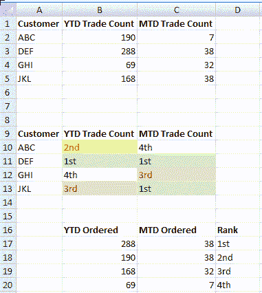

# MSExcel 中的排名数据

> 原文：<https://dev.to/shaolang/ranking-data-in-msexcel-4l2g>

MSExcel 尽管在[数据分析](https://en.wikipedia.org/wiki/Data_analysis)方面有着[的坏名声](https://www.google.com/search?hl=en&q=excel%20bad%20for%20data%20analysis)，但对于一次性分析工作来说，它仍然是一个非常好的工具，尤其是当输出需要交互时。毕竟，没有什么能与反应性相提并论——就像在[反应性编程](https://en.wikipedia.org/wiki/Reactive_programming)中一样——简单的 MSExcel 公式提供了不需要核心开发技能的东西。 [1](#fn1)

## 弄脏我们的手

假设需求是对客户的 *YTD 交易计数*和 *MTD 交易计数*进行排序。一种方法是手工操作:

|   | A | B | C |
| --- | --- | --- | --- |
| **1** | **客户** | **本年迄今交易计数** | **MTD 交易计数** |
| **2** | 字母表 | One hundred and ninety | seven |
| **3** | 极好的 | Two hundred and eighty-eight | Thirty-eight |
| **4** | GHI | sixty-nine | Thirty-two |
| **5** | JKL | One hundred and sixty-eight | Thirty-eight |
| **6** |  |  |  |
| **7** |  |  |  |
| **8** |  |  |  |
| **9** | **客户** | **年初至今排名** | **MTD 排名** |
| **10** | 字母表 | 第二 | 第四 |
| **10** | 极好的 | 第一 | 第一 |
| **11** | GHI | 第四 | 第三 |
| **12** | JKL | 第三 | 第一 |

是啊，它的工作！但是如果客户数量是数百个，手工操作是对时间的巨大浪费。我们可以做得更好。

MSExcel 有一个很好用的函数`LARGE`[2](#fn2)[官方文档](https://support.office.com/en-us/article/LARGE-function-3AF0AF19-1190-42BB-BB8B-01672EC00A64)说:

> 返回数据集中第 k 个最大的值。您可以使用此函数根据其相对位置选择一个值。例如，可以使用 LARGE 返回最高、第二或第三名的分数。

及其语法:

> 大型(数组，k)
> 
> 大型函数语法具有以下参数:
> 
> *   需要数组。要确定第 k 个最大值的数组或数据区域。
> *   需要 k。要返回的数组或单元格区域中的位置(从最大值算起)。

太好了！键入公式`=LARGE(B$2:B$5,ROW()-9)`，复制并粘贴到整个范围`B10:C13`，我们将得到:

|   | A | B | C |
| --- | --- | --- | --- |
| **1** | **客户** | **本年迄今交易计数** | **MTD 交易计数** |
| **2** | 字母表 | One hundred and ninety | seven |
| **3** | 极好的 | Two hundred and eighty-eight | Thirty-eight |
| **4** | GHI | sixty-nine | Thirty-two |
| **5** | JKL | One hundred and sixty-eight | Thirty-eight |
| **6** |  |  |  |
| **7** |  |  |  |
| **8** |  |  |  |
| **9** | **客户** | **年初至今排名** | **MTD 排名** |
| **10** | 字母表 | 第二 | 第四 |
| **10** | 极好的 | 第一 | 第一 |
| **11** | GHI | 第四 | 第三 |
| **12** | JKL | 第三 | 第一 |
| **13** |  |  |  |
| **14** |  |  |  |
| **15** |  |  |  |
| **16** |  | **年初至今已订购** | **MTD 已订购** |
| **17** |  | =LARGE(B$2:B$5，ROW()-16) | =LARGE(加元 2:加元 5，ROW()-16) |
| **18** |  | =LARGE(B$2:B$5，ROW()-16) | =LARGE(加元 2:加元 5，ROW()-16) |
| **19** |  | =LARGE(B$2:B$5，ROW()-16) | =LARGE(加元 2:加元 5，ROW()-16) |
| **20** |  | =LARGE(B$2:B$5，ROW()-16) | =LARGE(加元 2:加元 5，ROW()-16) |

这就产生了以下结果:

|   | A | B | C |
| --- | --- | --- | --- |
| **1** | **客户** | **本年迄今交易计数** | **MTD 交易计数** |
| **2** | 字母表 | One hundred and ninety | seven |
| **3** | 极好的 | Two hundred and eighty-eight | Thirty-eight |
| **4** | GHI | sixty-nine | Thirty-two |
| **5** | JKL | One hundred and sixty-eight | Thirty-eight |
|   |  |  |  |
|   | ... | ... | ... |
|   |  |  |  |
| **16** |  | **年初至今已订购** | **MTD 已订购** |
| **17** |  | Two hundred and eighty-eight | Thirty-eight |
| **18** |  | One hundred and ninety | Thirty-eight |
| **19** |  | One hundred and sixty-eight | Thirty-two |
| **20** |  | sixty-nine | seven |

`ROW()`返回函数所应用的单元格的行号，因此`B17`处的`ROW()-16`发信号给`LARGE`返回第一个最大值；在`B18`返回第二大...

虽然这只是按降序对两列进行排序，但它在以下方面胜过了手动步骤:

1.  键入公式、复制和粘贴只需 2 个步骤，而手动排序需要 4 个步骤:
    1.  从`B2:B5`复制数值并粘贴到`B17:B20`
    2.  对`B17:B20`中的值进行排序
    3.  从`C2:C5`复制数值并粘贴到`C17:C20`
    4.  对`C17:C20`中的值进行排序
2.  当`B2:C5`中的任何值改变时，MSExcel 自动应用排序

在 D 列输入等级(实际上，对于等级 4 和更高的等级，使用公式`=ROW()-15&"th"`可以节省一些输入和一些复制&粘贴懒惰):

|   | A | B | C | D |
| --- | --- | --- | --- | --- |
| **16** |  | **年初至今已订购** | **MTD 已订购** | **排名** |
| **17** |  | Two hundred and eighty-eight | Thirty-eight | 第一 |
| **18** |  | One hundred and ninety | Thirty-eight | 第二 |
| **19** |  | One hundred and sixty-eight | Thirty-two | 第三 |
| **20** |  | sixty-nine | seven | 第四 |

用公式`=VLOOKUP(B2,B$17:$D$17,5-COLUMN(),FALSE)`替换单元格`B10`中手工编码的等级，然后将单元格复制并粘贴到`B10:C12`中，得到与手工版本相同的结果，但有一个重要的优点:对`B2:C5`中值的任何更改都会自动刷新等级。

`COLUMN`返回应用该函数的列号。`VLOOKUP`公式中的`5-COLUMN()`片段用于自动确定查找索引。例如，在单元格`B10`，`5-COLUMN()`解析为 3，在单元格 C10 解析为 2。

## 包装完毕

不需要编码，创造性地使用 MSExcel 函数，以及大量的复制和粘贴，MSExcel 的效率是无与伦比的。没错，使用[熊猫](https://pandas.pydata.org)或者 [R](https://www.r-project.org) 让作品具有可复制性，但有时候并不是所有东西都是钉子。MSExcel 在数据分析中有其一席之地；知道适当地使用什么工具要重要得多，并且要锻炼脚本肌肉。

*本帖[ms excel](https://shaolang.github.io/posts/2019-08-16-ranking-data-in-msexcel/)中的排名数据首先一点一点地出现在*

* * *

1.  有多少数据分析师了解反应式编程？我不科学的调查说“不多。” [↩](#fnref1)

2.  与`LARGE`相对应的是 [`SMALL`](https://support.office.com/en-us/article/SMALL-function-17DA8222-7C82-42B2-961B-14C45384DF07) [↩](#fnref2)